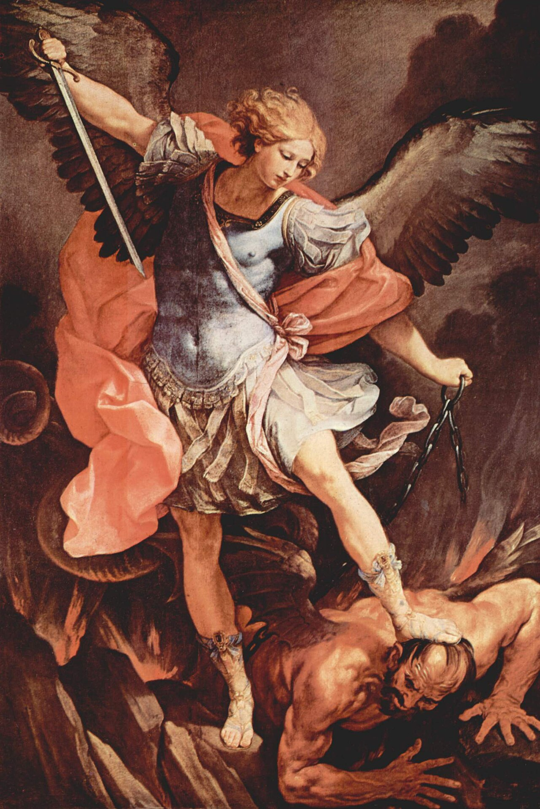

# Sessão 09 — Os anjos e os demônios

*Guido Reni, St. Michael Archangel (1635). Public Domain via Wikimedia Commons.*

> *O arcanjo de Reni põe o pé sobre o dragão, quase tranquilo. O inferno é real e os anjos que você não vê também o são. Um deles lhe foi dado no dia do seu batismo — silencioso, paciente, ainda aqui.*

## São Pio X pergunta

**53.** Deus criou somente o que é material no Mundo?

*Deus não criou somente o que é material no Mundo, mas também os puros espíritos; e cria a alma de cada homem.*

**54.** Quem são os puros espíritos?

*Os puros espíritos são seres inteligentes sem corpo.*

**55.** Como sabemos que existem puros espíritos criados?

*É pela Fé que sabemos que existem puros espíritos criados.*

**56.** Quais puros espíritos criados a Fé nos faz conhecer?

*A Fé nos faz conhecer os puros espíritos bons, ou seja, os Anjos, e os maus, ou seja, os demônios.*

**57.** Quem são os Anjos?

*Os Anjos são os ministros invisíveis de Deus e também nossos Guardiões, tendo Deus confiado cada homem a um deles.*

**58.** Temos deveres para com os Anjos?

*Para com os Anjos temos o dever de veneração; e para com o Anjo da Guarda temos também o de ser gratos, de escutar-lhe as inspirações e de não ofender-lhe nunca a presença com o pecado.*

**59.** Quem são os demônios?

*Os demônios são anjos rebelados contra Deus por soberba e precipitados no inferno que, por ódio a Deus, tentam o homem ao mal.*

## O Catecismo Romano ensina

## Criador do céu e da terra

[15] O que agora vamos dizer da Criação de todas as coisas, mostrará claramente como era necessário explicar antes aos fiéis a noção da onipotência divina. Com maior facilidade acreditarão o milagre que se manifesta em obra tão grandiosa, se nenhuma dúvida tiverem a respeito do imenso poder do Criador.

Pois Deus não formou o mundo de uma matéria preexistente, mas criou-o do nada, sem a tanto ser obrigado por violência estranha ou necessidade natural; mas por Sua livre e espontânea vontade.

Nenhum outro motivo O impeliu a criar o mundo, senão a Sua própria bondade. Queria comunicá-la a todas as coisas que criasse. Possuindo por Sua natureza toda a felicidade, Deus não tem falta de coisa nenhuma, como o exprime o rei David: "Disse eu ao Senhor: Vós sois o meu Deus, e não tendes precisão dos meus bens".[^145]

Assim como não obedeceu senão à própria bondade, para "fazer tudo o que era do Seu agrado"[^146], assim também não seguiu na criação nenhum modelo que estivesse fora de Sua própria natureza.

Sua inteligência infinita possui, dentro de Si mesma, a idéia exemplar de todas as coisas. Contemplando, pois, em Si mesmo essa idéia exemplar; e reproduzindo-a, por assim dizer, com a suma sabedoria e o infinito poder, que Lhe são próprios, o Supremo Artífice[^147] criou no princípio todas as coisas do Universo. "Ele disse, e tudo foi feito; Ele mandou, e tudo foi criado".[^148]

[16] Pelos termos "céu e terra", deve tomar-se tudo o que o céu e a terra compreendem. Além dos céus, que o Profeta considerava como "obra de Suas mãos"[^149], Deus criou também a claridade do sol e o encanto da lua e dos outros corpos celestes, para que "servissem de sinais para os tempos, os dias e os anos".[^150] Aos astros marcou uma órbita inalterável, de sorte que não pode haver coisa mais rápida que suas contínuas rotações, nem coisa mais regular que sua velocidade.

[17] A par do firmamento, Deus criou do nada seres de natureza espiritual, os inúmeros Anjos, cujo ministério era servir-Lhe, e assistir diante de Seu trono. Conferiu-lhes depois o admirável dom de Sua graça e poder.

Se na Bíblia está escrito: "O demônio não persistiu na verdade"[^151], não padece dúvida que ele e os outros anjos rebeldes haviam [também] recebido a graça, desde o primeiro instante de sua existência.

Santo Agostinho diz a respeito: "Criou os Anjos e dotou-os de boa vontade, quer dizer, com o casto amor que os unia a Deus. Em formando a natureza [angélica], infundiu-lhes ao mesmo tempo a graça. Daí devemos concluir que os Anjos bons nunca se viram destituídos de boa vontade, isto é, de amor a Deus".[^152]

Quanto ao grau da ciência [angélica], há um testemunho das Sagradas Letras: "Vós, Senhor meu Rei, sois sábio, como a sabedoria que tem um Anjo de Deus, para entendermos tudo o que se passa sobre a terra".[^153]

Indicam enfim o poder dos Anjos as palavras que lhes aplica o rei David: "Sois poderosos e fortes, e executais a Sua vontade".[^154] Por esse motivo, a Sagrada Escritura lhes dá, muitas vezes, o nome de "virtudes e exércitos do Senhor".[^155]

Dotados que eram, todos, de prendas celestiais, muitos deles abandonaram todavia a Deus, seu Pai e Criador. Foram, por conseguinte, derrubados de seus altos tronos, e detidos numa prisão muito escura da terra, onde agora sofrem o eterno castigo de sua soberba.

Deles escreve o Príncipe dos Apóstolos: "Deus não poupou os Anjos que pecaram, mas acorrentados os precipitou nos abismos do inferno, para serem cruciados, e tidos em reserva até o dia do juízo".[^156]

[18] Com o poder de Sua palavra, Deus também firmou a terra em bases sólidas[^157], e deu-lhe um lugar no meio do Universo. Fez que os morros se erguessem, e os campos baixassem ao nível que lhes tinha marcado. E para que as massas de água não inundassem a terra, "assentou-lhes limites dos quais não passarão, e não tornarão a cobri-la".

Em seguida, revestiu a terra de árvores e de toda a sorte de flores; encheu-a também de inúmeras espécies de animais, como antes já o tinha feito com as águas e os ares.

[19] Por último, Deus formou do limo da terra o corpo do homem, de maneira que fosse imortal e impassível, não por exigência da própria natureza, mas por mero efeito da bondade divina.

A alma, porém, Deus a criou à Sua imagem e semelhança, e dotou-a de livre arbítrio. Além de tudo, regulou os movimentos e apetites da alma, de sorte que sempre obedecessem ao império da razão. Finalmente, deu-lhe ainda o admirável dom da justiça original, e quis que tivesse o governo de todos os outros seres animados.

Estas verdades, os párocos podem fàcilmente examinar [mais a fundo] na santa história do Gênesis, quando fizerem a instrução dos fiéis.[^158]

[20] Com as noções "do céu e da terra", compreende-se, pois, a criação de todas as coisas. O Profeta David resumiu tudo em poucas palavras: "Vossos são os céus, e vossa é a terra. Vós criastes o orbe da terra, e tudo o que nele se contém".[^159]

Com maior concisão ainda, souberam exprimir-se os Padres do Concílio de Nicéia, ao acrescentarem ao Símbolo só duas palavras: "das coisas visíveis e invisíveis".[^160] Tudo o que o mundo abrange, e que reconhecemos como criado por Deus, — ou entra pelos sentidos, e chama-se "visível", — ou só pode ser percebido pela inteligência, e chama-se então "invisível".

[21] Não devemos, porém, crer que Deus é Criador e Autor de todas as coisas, de molde que, consumada a obra da Criação, os seres por Ele criados pudessem, em nossa opinião, continuar a subsistir sem o auxílio de Sua potência infinita.

Como tudo só existe, graças à onipotência, sabedoria e bondade do Criador, todas as criaturas recairiam logo em seu nada, se Deus lhes não assistisse continuamente pela Sua Providência, e não as conservasse pelo mesmo poder que, desde o princípio, empregou para as criar. A Escritura no-lo declara em termos formais: "Como poderia subsistir alguma coisa, se Vós o não quisésseis? Como poderia conservar-se o que Vós não tivésseis chamado?"[^161]

[22] Sobre conservar e governar, pela sua Providência, tudo o que existe, Deus comunica, por um impulso interior, ação e movimento a todas as coisas, conforme a propriedade que tem cada qual, de mover-se e operar.

Sem as impedir, Deus antecipa-Se à influência das causas segundas, como uma virtude oculta que se estende a todas as coisas, e, no dizer do Sábio, "atinge fortemente de um extremo a outro, e dispõe todas as coisas com suavidade".[^162]

Por esse motivo, ao anunciar aos atenienses o Deus que eles adoravam, sem O conhecerem, o Apóstolo disse-lhes: "Não está longe de cada um de nós, pois n'Ele vivemos, n'Ele nos movemos, e n'Ele subsistimos".[^163]

[23] O que foi dito até agora, bastará para a explicação do primeiro Artigo. Resta-nos, ainda, advertir que a Criação é obra comum de todas as três Pessoas da Santa e Indivisível Trindade.

Neste lugar, confessamos pela doutrina dos Apóstolos, que o Padre é o Criador do céu e da terra. Nas Escrituras, porém, lemos com relação ao Filho que "por Ele foram feitas todas as coisas".[^164] Acerca do Espírito Santo: "O Espírito de Deus movia-Se por sobre as águas".[^165] Noutro lugar: "Pela palavra do Senhor foram assentes os céus, e do hálito de Sua boca procede toda a pujança [de vida]".[^166]

[^72]: Em latim: articulis. Articulus quer dizer junta ou articulação.
[^74]: 2 Cor 4, 6.
[^75]: 2 Cor 4, 3.
[^76]: Rom 3, 4.
[^78]: Isto não é uma negação do axioma "fides quaerens intellectum". O CRO só não quer que o ato de fé, como tal, dependa de uma prévia demonstração. DU 1637 1812 1813 1706.
[^79]: Ps 115, 10.
[^80]: Act 4, 20.
[^81]: Rom 1, 16.
[^82]: Rom 10, 10.
[^83]: Rom 1, 20; DU 1796-1800.
[^84]: 1 Petr 2, 9.
[^85]: 1 Petr 1, 8.
[^86]: Ier 32, 19.
[^87]: 1 Tim 6, 16.
[^88]: Exod 33, 20.
[^89]: Act 14, 16.
[^90]: Io 4, 24.
[^91]: Mt 5, 48.
[^92]: Hebr 4, 13.
[^93]: Rom 11, 33.
[^94]: Rom 3, 4.
[^95]: Io 14, 6.
[^96]: Ps 47, 11.
[^97]: Ps 144, 16.
[^98]: Ps 138, 7-8.
[^99]: Ier 23, 24.
[^100]: Hebr 11, 6.
[^101]: Is 64, 4; cfr. 1 Cor 2, 9.
[^102]: Aqui falta, ao que parece, uma pequena transição como por exemplo: "A perfeição suma e absoluta é exclusiva por natureza. Se a vários coubesse simultâneamente, só poderia ser gradual e relativa. Ora, se..."
[^103]: Deut 6, 4.
[^104]: Exod 20, 3.
[^105]: Is 41, 4; 44, 6; 48, 12; cfr. Apoc 1, 17; 22, 13.
[^106]: Eph 4, 5; DU 1782 1801.
[^107]: Exod 7, 1; 22, 28; Ps 81, 1-6; 94, 3.
[^108]: SQ.
[^109]: Designação antiga de "Pai", conservada nas versões oficiais do Credo e do Padre-Nosso. Não convém substituí-la por "Pai", e dizer "Pai nosso que estais nos céus", ou ainda "Nosso Pai que estais, etc.". Mudanças que tais representam, a nosso ver, uma mal avisada adaptação às fórmulas protestantes. Além disso, destroem a uniformidade de nossas versões oficiais.
[^110]: Deut 32, 6.
[^111]: Mal 2, 10.
[^112]: Rom 8, 15.
[^113]: 1 Io 3, 1.
[^114]: Rom 8, 17.
[^115]: Rom 8, 29.
[^116]: Hebr 2, 11.
[^117]: 1 Tim 6, 16.
[^118]: Prefácio da SS. Trindade.
[^119]: Pref. da SS. Trindade.
[^120]: SQ — Pref. da SS. Trindade.
[^121]: Prov 25, 27.
[^122]: Mt 28, 19.
[^123]: 1 Io 5, 7. Esta passagem é o célebre "Comma Ioanneum", cuja autenticidade é contestada pela maior parte dos exegetas, sem exclusão dos católicos.
[^124]: Sap 8, 1.
[^125]: Io 1, 12.
[^126]: 1 Th 5, 17.
[^127]: Lc 16, 9.
[^128]: Gen 17, 1.
[^129]: Gen 43, 14.
[^130]: Apoc 1, 8.
[^131]: Apoc 16, 14.
[^132]: Lc 1, 37.
[^133]: Num 11, 23.
[^134]: Sap 12, 18.
[^135]: Lc 1, 37.
[^136]: Mt 17, 20.
[^137]: Iac 1, 6-7.
[^138]: 1 Petr 5, 6.
[^139]: Ps 52, 6.
[^140]: Ps 32, 8.
[^141]: Sap 7, 16.
[^142]: Lc 12, 5.
[^143]: Lc 1, 49.
[^144]: SQ — DU 420 704.
[^145]: Ps 15, 1 (texto da Vulgata); DU 706 1783 1805.
[^146]: Ps 113, 3.
[^147]: Linda expressão que hoje teria ressaibo, por causa do vocabulário deísta ou maçônico.
[^148]: Ps 148, 5; DU 1805 428 574.
[^149]: Ps 8, 4.
[^150]: Gen 1, 14.
[^151]: Io 8, 44; DU 217.
[^152]: Aug. De civit. Dei XI 9; DU 1783.
[^153]: 2 Reg 14, 20.
[^154]: Ps 102, 20.
[^155]: Ps 102, 21; 23, 10; 45, 8; 58, 6; 79, 5; 83, 2; Rom 8, 38.
[^156]: 2 Petr 2, 4.
[^157]: Ps 103, 5; 8, 9.
[^158]: Gen 1, 1 ss.; 2, 1-7; DU 717 e 1021 1023 1026 2123 1701.
[^159]: Ps 88, 12.
[^160]: Em latim são de fato duas palavras: visibilium et invisibilium.
[^161]: Sap 11, 26; DU 1784.
[^162]: Sap 8, 1; DU 24.
[^163]: Act 17, 27-28.
[^164]: Io 1, 3.
[^165]: Gen 1, 2.
[^166]: Ps 32, 6.

> **Escritura.** *Porque Ele deu ordens a seus anjos a teu respeito, para que te guardem em todos os teus caminhos.* — Salmo 90, 11

> *Santo anjo da guarda, caminhai mais perto hoje. Tornai-me grato, atento, menos só do que penso.*
