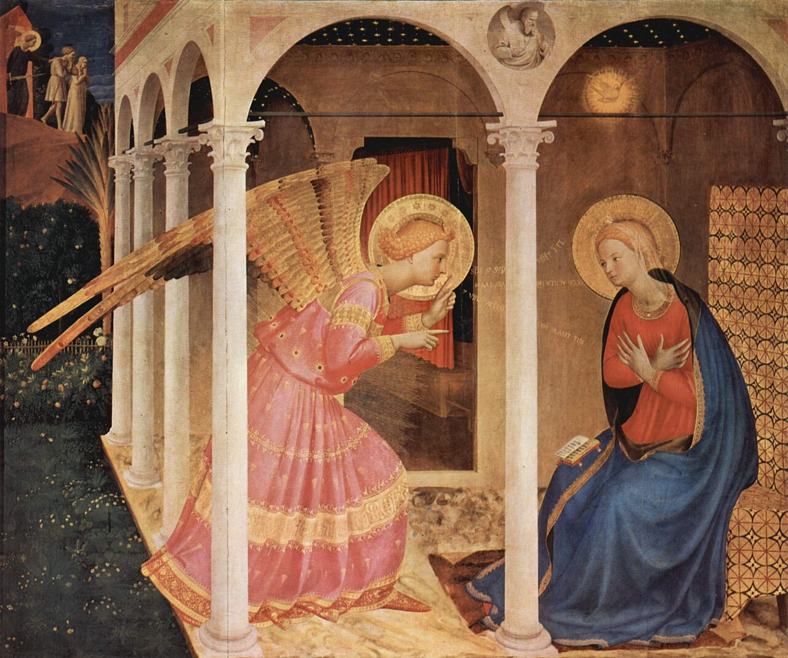

# Sessão 13 — O Redentor prometido e enviado

*Fra Angelico, The Annunciation (c. 1426). Public Domain via Wikimedia Commons.*

> *A Anunciação de Fra Angelico: Gabriel ajoelha-se, Maria escuta, o mundo para. A Promessa começa a cumprir-se. O Céu pergunta a uma jovem, e ela responde sim, e um corpo se forma nela como o amanhecer se formando na neblina.*

## São Pio X pergunta

**75.** Por causa do pecado original, o homem deveria permanecer excluído para sempre do Paraíso?

*Por causa do pecado original, o homem deveria permanecer excluído para sempre do Paraíso, se Deus para salvá-lo não houvesse prometido e mandado do Céu Seu próprio Filho, isto é, Jesus Cristo.*

**76.** De que modo o Filho de Deus fez-se homem?

*O Filho de Deus fez-se homem, assumindo corpo e alma assim como nós, no seio puríssimo de Maria Virgem por obra do Espírito Santo.*

**77.** Fazendo-se homem, o Filho de Deus deixou de ser Deus?

*Fazendo-se homem, o Filho de Deus não deixou de ser Deus, mas, permanecendo verdadeiro Deus, começou a ser também verdadeiro homem.*

## São Tomás ensina

Não basta aos cristãos crer num só Deus que é o Criador do Céu e da Terra e de todas as coisas; é necessário também crer que Deus é Pai e que Cristo é o verdadeiro Filho de Deus. Isto, como diz São Pedro, não é mera fábula, mas é certo e provado pela palavra de Deus no monte da Transfiguração: «Pois nós não vos demos a conhecer o poder e a presença de Nosso Senhor Jesus Cristo seguindo fábulas engenhosas, mas tendo sido testemunhas oculares da sua grandeza. Pois recebeu Ele de Deus Pai honra e glória, vindo até Ele esta voz da glória magnífica: ‹Este é o meu Filho amado, no qual pus toda a minha complacência. Ouvi-O›. E nós ouvimos esta voz vinda do Céu, quando estávamos com Ele no monte santo».[^1] O próprio Cristo Jesus, em muitos lugares, chamou Deus seu Pai, e a si mesmo Filho de Deus. Tanto os Apóstolos como os Padres puseram nos artigos da fé que Cristo é o Filho de Deus, dizendo: «E (creio) em Jesus Cristo, Seu (isto é, de Deus) único Filho».[^2]

> **Escritura.** *O Espírito Santo descerá sobre ti, e a virtude do Altíssimo te cobrirá com a sua sombra. E por isso o Santo que de ti nascerá será chamado Filho de Deus.* — Lucas 1, 35

> *Maria, vós dissestes sim por todos nós. Hoje, quando me for pedido algo difícil, dai-me a vossa coragem e a vossa quietude.*

---

#### Aprofundamento — *Catecismo de Trento*

> E em Jesus Cristo, um só seu Filho, Nosso Senhor.

## O nome de Jesus

[5] Jesus é o nome próprio d'Aquele que é Deus e homem ao mesmo tempo. Significa "Salvador". Não Lhe foi posto casualmente, por escolha e vontade dos homens, mas por ordem e intenção de Deus.

Assim o declarou o Anjo Gabriel a Maria, Sua Mãe: "Eis que conceberás em teu seio, e darás à luz um filho, a quem porás o nome de Jesus".[^180] E depois ordenou a José, esposo da Virgem, desse tal nome ao menino, e indicou-lhe ao mesmo tempo as razões por que devia chamar-Se assim: "José, filho de David, não tenhas receio de levar para tua casa Maria, tua esposa; pois o que nela foi concebido, obra é do Espírito Santo. Portanto, ela há de dar à luz um filho, a quem porás o nome de Jesus, porque Ele há de remir Seu povo de seus pecados".[^181]

[6] Verdade é que, nas Escrituras, no Antigo Testamento, nos deparam muitas pessoas com esse mesmo nome. Assim se chamava o filho de Navé[^182] que sucedeu a Moisés; teve o privilégio, negado a seu antecessor, de levar à Terra de Promissão o povo que o mesmo Moisés havia arrancado do cativeiro do Egito. Assim se chamava também o filho de Josedec, sumo-sacerdote.[^183]

A nosso ver, com quanto mais acerto não se deve atribuir esse nome a Nosso Salvador! A Ele que deu luzes, liberdade e salvação, já não a um povo singular, mas a todos os homens de todas as épocas. A Ele que os livrou, não diremos da fome ou da opressão do Egito e da Babilônia, mas das sombras da morte em que estavam sentados[^184], presos com os duríssimos grilhões do pecado e do demônio. A Ele que lhes adquiriu o direito à herança do Reino dos céus, e os reconciliou com o Padre Eterno.

Naquelas pessoas[^185] não vemos senão uma figura de Cristo Nosso Senhor, que de tantos benefícios cumulou o gênero humano, como acabamos de explicar.

Além do mais, todos os outros nomes que, segundo as profecias, deviam ser dados ao Filho de Deus, estão já incluídos nesse único nome de "Jesus". Cada um deles exprime aspectos parciais da salvação que nos devia trazer; ao passo que o nome de Jesus abrange, por si só, o resgate do gênero humano, em toda a sua extensão e eficácia.[^186]
