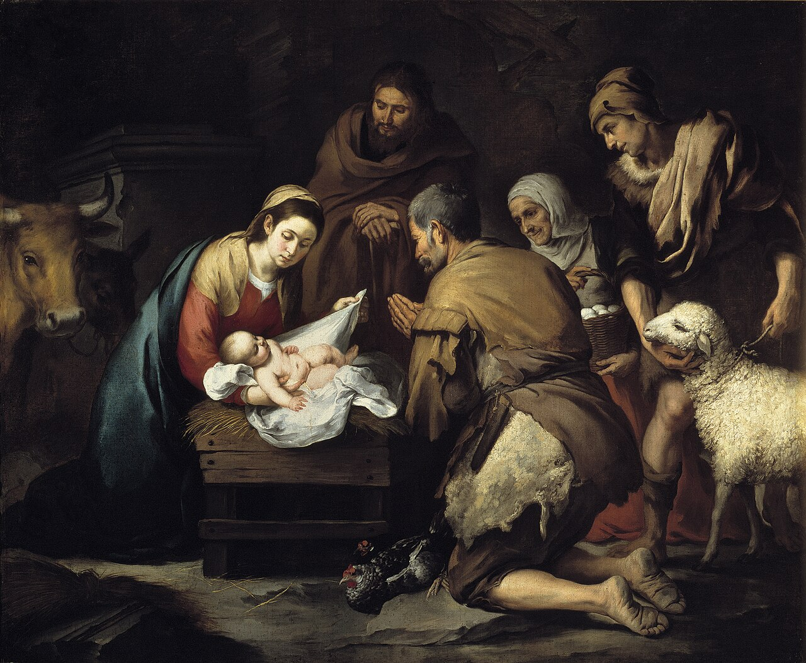

# Sessão 15 — Nascido da Virgem Maria em Belém

*Bartolomé Esteban Murillo, The Adoration of the Shepherds (c. 1650). Public Domain via Wikimedia Commons.*

> *Palha, hálito de boi, uma jovem segurando o Onipotente como uma criança adormecida. O Altíssimo escolheu entrar no tempo como um dos sem poder, onde qualquer um de nós poderia encontrá-Lo. Incline-se um pouco. Ele se fez pequeno o bastante para ser alcançado.*

## São Pio X pergunta

**82.** De quem nasceu Jesus Cristo?

*Jesus Cristo nasceu de Maria sempre Virgem, que por isso se chama e é verdadeiramente Mãe de Deus.*

**83.** São José não foi pai de Jesus Cristo?

*São José não foi verdadeiramente pai de Jesus Cristo, mas pai putativo, isto é, como esposo de Maria e guardião dele foi reputado Seu pai sem sê-lo.*

**84.** Onde nasceu Jesus Cristo?

*Jesus Cristo nasceu em Belém, em um estábulo, e foi posto em uma manjedoura.*

**85.** Por que Jesus Cristo quis ser pobre?

*Jesus Cristo quis ser pobre para ensinar-nos a ser humildes e a não pôr a felicidade nas riquezas, nas honras e nos prazeres do mundo.*

## São Tomás ensina

O cristão deve crer não apenas no Filho de Deus, como vimos, mas também na sua Encarnação. São João, depois de ter escrito sobre coisas subtis e difíceis de entender,[^1] aponta-nos a Encarnação ao dizer: «E o Verbo se fez carne».[^2] Para que entendamos algo deste mistério, dou de início duas ilustrações.

É manifesto que nada se assemelha mais ao Verbo de Deus do que a palavra concebida em nossa mente, mas não pronunciada. Ora, ninguém conhece esta palavra interior senão aquele que a concebe; e somente é conhecida dos outros quando é pronunciada.[^3] Assim também, enquanto o Verbo de Deus permanecia no coração do Pai, não era conhecido senão pelo próprio Pai; mas, quando o Verbo assumiu a carne — como uma palavra se torna audível —, então pela primeira vez se manifestou e se tornou conhecido. «Depois foi visto sobre a Terra, e conviveu com os homens».[^4] Outro exemplo: embora a palavra falada se conheça pela audição, todavia não é vista nem tocada, a menos que seja escrita no papel. Assim também o Verbo de Deus tornou-se ao mesmo tempo visível e tangível quando se fez carne. E como o papel sobre o qual a palavra do rei está escrita é chamado palavra do rei, assim o Homem ao qual o Verbo de Deus se uniu numa só «hipóstase»[^5] é chamado Filho de Deus. «Toma um livro grande, e escreve nele com pena de homem».[^6] Por isso afirmaram os santos Apóstolos: «Que foi concebido pelo Espírito Santo, nasceu da Virgem Maria».

## Erros relativos ao Terceiro Artigo

Sobre este ponto surgiram muitos erros; e os santos Padres no Concílio de Niceia acrescentaram naquele outro Símbolo várias coisas que suprimem todos esses erros.

Orígenes dizia que Cristo nasceu e veio ao mundo para salvar até os demônios e que, por isso, no fim do mundo, todos os demônios serão salvos. Mas isto é contrário à Sagrada Escritura: «Apartai-vos de mim, malditos, para o fogo eterno, que foi preparado para o demônio e para os seus anjos».[^7] Por consequência, para remover esse erro, acrescentaram no Símbolo: «Que por nós, homens (não pelos demônios) e para nossa salvação, desceu dos Céus». Aí se torna mais manifesto o amor de Deus por nós.

Fotino admitia que Cristo tivesse nascido da Santíssima Virgem, mas acrescentava que era um simples homem que, por uma vida boa em fazer a vontade de Deus, mereceu tornar-se filho de Deus, como outros homens santos. Isto também se nega por estas palavras de João: «Desci do Céu, não para fazer a minha vontade, mas a vontade Daquele que me enviou».[^8] Ora, se Cristo não estivesse no Céu, não teria descido do Céu; e se fosse mero homem, não teria estado no Céu. Por isso se diz no Símbolo Niceno: «Desceu dos Céus».

Manes, porém, dizia que Cristo era sempre o Filho de Deus e que descera do Céu, mas que não se revestira de carne verdadeira, e sim apenas em aparência. Isto, contudo, é falso, porque não é digno do Mestre da Verdade ter algo a ver com o que é falso; e, assim como mostrou seu Corpo físico, este era realmente Seu: «Apalpai e vede; pois um espírito não tem carne nem ossos, como vedes que eu tenho».[^9] Para remover este erro, pois, acrescentaram: «E encarnou».

Ebião, que era judeu, dizia que Cristo nasceu da Santíssima Virgem segundo o modo humano comum.[^10] Mas isto é falso, pois o Anjo disse a Maria: «O que nela foi concebido é do Espírito Santo».[^11] E os santos Padres, para destruir esse erro, acrescentaram: «Pelo Espírito Santo».

Valentino cria que Cristo fora concebido pelo Espírito Santo, mas pretendia que o Espírito Santo houvesse depositado um corpo celeste na Santíssima Virgem, de tal modo que ela em nada teria contribuído para o nascimento de Cristo, senão fornecendo o lugar para Ele. Assim, dizia, este Corpo apareceu por meio da Santíssima Virgem como por um canal. Isto é grande erro, pois o Anjo disse: «Por isso também o que nascer de ti, sendo Santo, será chamado Filho de Deus».[^12] E o Apóstolo acrescenta: «Mas, ao chegar a plenitude dos tempos, enviou Deus o seu Filho, feito de uma mulher».[^13] Por isso o Símbolo diz: «Nasceu da Virgem Maria».

Ário e Apolinário sustentavam que, embora Cristo fosse o Verbo de Deus e nascido da Virgem Maria, não tinha alma, sendo o lugar dela ocupado pela sua divindade. Isto é contrário à Escritura, pois Cristo diz: «Agora a minha alma está turbada»,[^14] e ainda: «A minha alma está triste até à morte».[^15] Por essa razão acrescentaram os Padres: «E se fez homem». Ora, o homem é composto de corpo e alma. Cristo possuía tudo o que pertence ao verdadeiro homem, exceto o pecado. Todos os erros acima mencionados, e outros que se possam apresentar, são destruídos por isto: que Ele se fez homem. De maneira particular, com isso é destruído o erro de Êutiques, que sustentava que, pela mistura da natureza divina de Cristo com a humana, Ele não era nem puramente divino nem puramente humano. Isto não é verdade, porque, então, Cristo não seria homem. E por isso se diz: «Fez-se homem». Com isso se destrói também o erro de Nestório, que dizia ser o Filho de Deus unido ao homem somente por inabitação. Isto também é falso, pois assim Cristo não seria homem, mas estaria apenas num homem; e que Ele se fez homem é claro por estas palavras: «No seu modo de ser foi achado como homem».[^16] «Mas agora vós procurais matar-me, a mim, homem que vos disse a verdade que ouvi de Deus».[^17]

## Bons efeitos destas considerações

Podemos aprender algo de tudo isto. (1) Nossa fé é fortalecida. Se, por exemplo, alguém nos falasse de uma certa terra estrangeira que ele próprio nunca houvesse visto, não lhe daríamos tanto crédito quanto se lá tivesse estado. Ora, antes que Cristo viesse ao mundo, os Patriarcas, os Profetas e João Batista falaram algo a respeito de Deus, mas os homens não lhes deram crédito como deram a Cristo, que esteve com Deus, e mais ainda: que era um com Deus. Por isso, é bem mais firme a nossa fé naquilo que nos é entregue pelo próprio Cristo. «Ninguém jamais viu a Deus; o Filho unigênito, que está no seio do Pai, esse mesmo o deu a conhecer».[^18] Assim, muitos mistérios da nossa fé que antes da vinda de Cristo nos eram ocultos, agora se tornaram claros.

(2) Nossa esperança se eleva. É certo que o Filho do Homem não veio até nós, assumindo a nossa carne, por causa trivial, mas para nossa imensa vantagem. Pois realizou conosco como que um intercâmbio, tomando um corpo vivo e dignando-Se nascer da Virgem, a fim de que a nós fosse outorgada participação na sua divindade.[^19] E assim Ele Se fez homem para tornar divino o homem.[^20]

(3) Nossa caridade é inflamada. Não há prova da caridade divina tão clara como esta: que Deus, Criador de todas as coisas, se faça criatura; que Nosso Senhor se torne nosso irmão; e que o Filho de Deus se faça Filho do Homem: «De tal modo Deus amou o mundo, que lhe deu o seu Filho unigênito».[^21] Por consequência, à consideração disto, nosso amor a Deus deve reacender-se e tornar-se chama.

(4) Isto nos induz a manter as nossas almas puras. Nossa natureza foi exaltada e enobrecida pela sua união com Deus, ao ponto de ser assumida em união com uma Pessoa divina.[^22]

Ainda mais: depois da Encarnação, o Anjo não permitiu que São João o adorasse, embora antes admitisse que assim o fizessem mesmo os maiores patriarcas.[^23] Aquele, portanto, que reflete sobre esta exaltação da sua natureza e dela está sempre consciente, deve abominar rebaixar-se e aviltar a si mesmo e à sua natureza pelo pecado. Assim diz São Pedro: «Pelo qual nos foram dadas as muito grandes e preciosas promessas, para que por elas vos torneis participantes da natureza divina, fugindo da corrupção da concupiscência que há no mundo».[^24]

Por fim, mediante a consideração de tudo isto, intensifica-se o nosso desejo de ir a Cristo. Se um rei tivesse um irmão muito longe dele, esse irmão desejaria ir ao rei para vê-lo, estar com ele e permanecer com ele. Assim também Cristo é nosso irmão, e devemos desejar estar com Ele e a Ele unirmo-nos. «Onde quer que esteja o corpo, ali se reunirão também as águias».[^25] O Apóstolo desejava «ser desfeito e estar com Cristo».[^26] E é este o desejo que cresce em nós à medida que meditamos na Encarnação de Cristo.

[^1]: Jo 1, 1-13.
[^2]: *Ibid.*, 1, 14.
[^3]: Ver acima, p. 17.
[^4]: Br 3, 38.
[^5]: Hipóstase é a pessoa distinta da natureza, como na única hipóstase de Cristo distinta de Suas duas naturezas, humana e divina; também distinta de substância, como nas três hipóstases da Divindade, que são uma só em substância.
[^6]: Is 8, 1. *(Nota do tradutor: Collins traz «Isa., vii. 1», versículo histórico sobre o reinado de Acaz que não corresponde à citação. O texto «Toma um livro grande, e escreve nele com pena de homem» é Is 8, 1 da Vulgata.)*
[^7]: Mt 25, 41.
[^8]: Jo 6, 38.
[^9]: Lc 24, 39.
[^10]: «Cremos e confessamos que o mesmo Jesus Cristo, nosso único Senhor, Filho de Deus, ao assumir por nós a carne humana no seio da Virgem, não foi concebido como os outros homens, da semente de varão, mas de modo superior à ordem da natureza, isto é, pelo poder do Espírito Santo, de tal sorte que a mesma Pessoa, permanecendo Deus como era desde toda a eternidade, fez-se homem, o que antes não era» (*Catecismo Romano*, Terceiro Artigo, 1).
[^11]: Mt 1, 20.
[^12]: Lc 1.
[^13]: Gl 4, 4.
[^14]: Jo 12, 27.
[^15]: Mt 26, 38.
[^16]: Fl 2, 7.
[^17]: Jo 8, 40.
[^18]: *Ibid.*, 1, 18.
[^19]: Assim, na Missa, ao colocar o sacerdote o vinho e a água no cálice, diz: «[…] Concedei que pelo mistério desta água e deste vinho participemos da divindade Daquele que Se dignou tornar-Se participante da nossa humanidade, Jesus Cristo, vosso Filho, Nosso Senhor».
[^20]: «*Et sic factus est homo, ut hominem faceret Deum*» («E assim se fez homem, para tornar Deus o homem»).
[^21]: Jo 3, 16.
[^22]: «O Verbo, que é uma Pessoa da natureza divina, assumiu a natureza humana de tal modo que houvesse uma e a mesma Pessoa em ambas as naturezas, divina e humana» (*Catecismo Romano*, *loc. cit.*, 2).
[^23]: «E, depois que ouvi e vi, prostrei-me para adorar diante dos pés do Anjo que me mostrava estas coisas. E disse-me ele: ‹Não o faças›» (Ap 22, 8).
[^24]: 2 Pd 1, 4. «Deus dignou-Se assumir a humildade e a fragilidade de nossa carne para elevar o homem ao mais alto grau de dignidade. […] Podemos agora gloriar-nos de que o Filho de Deus é osso de nossos ossos e carne de nossa carne — privilégio que não foi concedido aos Anjos» (*Catecismo Romano*, *loc. cit.*, 11).
[^25]: Mt 24, 28.
[^26]: Fl 1, 23.

> **Escritura.** *E deu à luz o seu Filho primogênito, e envolveu-o em panos, e deitou-o numa manjedoura, porque não havia lugar para eles na hospedaria.* — Lucas 2, 7

> *Senhor, Vós viestes pequeno. Hoje, naquilo que é pequeno na minha vida, deixai-me encontrar-Vos.*

---

#### Aprofundamento — *Catecismo de Trento*

> O qual foi concebido do Espírito Santo, nasceu de Maria Virgem.

## Importância e sentido do Artigo

[1] Das explicações dadas no Artigo anterior, podem os fiéis deduzir como é grande e singular o benefício que Deus fez ao gênero humano, por nos livrar da escravidão do mais cruel dos tiranos, por nos restituir [assim] a liberdade. Mas, atentando no plano e nos meios que Deus quis empregar para a nossa libertação, nada podemos conceber de mais grandioso, nem de mais brilhante, do que a bondade e munificência de Deus para conosco.

É, pois, na explanação do terceiro Artigo que o pároco irá mostrando a grandeza deste mistério. A Sagrada Escritura no-lo propõe, frequentes vezes, como fator fundamental de nossa salvação.

Ensinará como seu sentido se resume em crermos e confessarmos que o mesmo Jesus Cristo, nosso único Senhor e Filho de Deus, assumindo carne humana no seio da Virgem pela nossa salvação, não foi concebido de germe masculino[^210], como os outros homens, mas por obra do Espírito Santo[^211], acima de todas as leis da natureza, de sorte que a mesma Pessoa permaneceu Deus, qual era desde toda a eternidade, e tornou-Se então Homem, o que antes nunca tinha sido.[^212]

O que prova, claramente, ser este o sentido destas palavras, é a profissão de fé do Sagrado Concílio de Constantinopla: "O qual desceu dos céus, por amor de nós homens, e por causa de nossa salvação; e encarnou de Maria Virgem por obra do Espírito Santo, e Se fez homem".

Assim também o explicou São João Evangelista que, do peito do próprio Senhor e Salvador, havia haurido o conhecimento deste profundo mistério. Depois de ter explicado a natureza do Verbo Divino com as palavras: "No princípio era o Verbo, e o Verbo estava com Deus, e o Verbo era Deus"[^213]; — conclui por fim: "E o Verbo Se fez carne, e habitou entre nós".[^214]

[2] O Verbo, que é uma Pessoa[^215] da natureza divina, assumiu de tal forma a natureza humana que uma e a mesma Pessoa é o "suporte"[^216] das naturezas divina e humana.

Daí resultou que, nessa admirável união, se conservaram as operações e propriedades de uma e outra natureza. E na frase do célebre Pontífice São Leão Magno, "nem a glória da natureza superior destruiu a inferior, nem a elevação da natureza inferior diminuiu a dignidade da superior".[^217]

## A conceição de Cristo

[3] Sendo essencial explicar bem as noções, o pároco ensinará as seguintes particularidades. Quando dizemos que o Filho de Deus foi concebido por obra do Espírito Santo, não afirmamos que esta Pessoa da Santíssima Trindade consumou sòzinha o mistério da Encarnação. Ainda que só o Filho assumiu a natureza humana, nem por isso deixaram de ser autoras deste mistério todas as três Pessoas da Santíssima Trindade, o Padre, o Filho, e o Espírito Santo.

Em geral, devemos ter como norma de fé cristã: Tudo o que Deus opera fora de si nas coisas criadas, é obra comum das três Pessoas. Uma não opera mais do que as outras, nem uma sem as outras. A única coisa que não pode ser comum a todas as Pessoas, é o modo de proceder uma da outra. Com efeito, só o Filho é gerado pelo Padre, o Espírito Santo procede do Padre e do Filho.

Tudo, porém, o que operam para fora, é obra comum das três Pessoas, sem diferença alguma. A esta espécie de operação pertence a Encarnação do Filho de Deus.

Apesar disso, a Sagrada Escritura costuma, das coisas que são comuns às três Pessoas, atribuir umas a esta Pessoa, outras àquela, como por exemplo ao Padre o supremo poder sobre todas as coisas, ao Filho a sabedoria, e o amor ao Espírito Santo.

Como o mistério da Encarnação de Deus nos revela a singular e imensa benignidade de Deus para conosco, é por esse motivo que, de modo particular, atribuímos essa operação ao Espírito Santo.

[4] Verifica-se, neste mistério, que alguns elementos superam a ordem da natureza, e que outros lhe são conformes.

Cremos que o Corpo de Cristo se formou do sangue da Virgem Sua Mãe, e nisso reconhecemos uma operação da natureza humana. É lei natural que todo corpo humano se forme do sangue materno.

Mas, o que ultrapassa a ordem natural das coisas, e supera a força de nossa inteligência é o fato de que, no instante de consentir a bem-aventurada Virgem às palavras do Anjo, declarando: "Eis aqui a escrava do Senhor, cumpra-se em mim a Vossa palavra"[^218], — logo começou a formar-se [nela] o santíssimo Corpo de Cristo, ao qual se uniu uma alma dotada de inteligência, de sorte que, no mesmo instante, o Deus perfeito se tornou perfeito homem.[^219]

Ninguém pode duvidar que esta foi uma nova e admirável obra do Espírito Santo, pois segundo a ordem da natureza a alma humana não pode informar nenhum corpo, senão em certo lapso de tempo.

Acresce ainda outro fato, digno de maior admiração. Tanto que a alma se uniu ao corpo, a própria Divindade se uniu também ao corpo e à alma. Por conseguinte, logo que o corpo foi formado, e simultâneamente animado, a Divindade ficou ligada tanto ao corpo como à alma.

Daí se segue que, no mesmo instante, Deus perfeito veio a ser perfeito homem; e que a Santíssima Virgem pode, verdadeira e propriamente, ser chamada Mãe de Deus, porque no mesmo instante concebia a Deus e ao Homem.

É o que também lhe foi significado, quando o Anjo lhe dissera: "Eis que conceberás no teu seio, e darás à luz um Filho, a quem poreis o nome de Jesus. Este será grande, e chamar-Lhe-ão Filho do Altíssimo".[^220] E por este fato se realizou a profecia de Isaías: "Eis que uma Virgem conceberá, e dará à luz um Filho".[^221]

Assim também reconheceu Isabel a conceição do Filho de Deus, quando toda cheia do Espírito Santo prorrompeu nas palavras: "Donde me vem esta graça de chegar a mim a Mãe do meu Senhor?"[^222]

Mas, como acabamos de dizer, o Corpo de Cristo se formou do puríssimo sangue da Virgem toda Imaculada, sem nenhuma interferência de varão, mas ùnicamente pela virtude do Espírito Santo.

Assim também a Sua Alma recebeu, desde o primeiro instante da conceição, a mais rica abundância do Espírito Santo e toda a plenitude de [Seus] dons e carismas. Segundo o testemunho de São João[^223], Deus "não Lhe dá o Espírito por medida", como aos outros homens, aos quais reveste de graça e santidade, mas infundiu-Lhe na alma todas as graças com tanta profusão, que "de Sua plenitude todos nós recebemos".[^224]

[5] No entanto, Cristo não pode ser chamado Filho adotivo de Deus, ainda que teve aquele Espírito, pelo qual os homens justificados conseguem a adoção de filhos de Deus.[^225] Sendo Ele Filho de Deus por natureza, deve crer-se que de modo algum Lhe cabe a graça de adoção, nem o título de Filho adotivo.

## Frutos deste mistério

[6] São estas as explicações que, em nosso sentir, devíamos dar a propósito do admirável mistério da Encarnação.

Para tirar delas frutos salutares, devem os fiéis antes de tudo recordar, e muitas vezes meditar, de coração, os pontos seguintes:

É Deus Aquele que assumiu carne humana. Fez-Se Homem por uma via que nossa razão não alcança, que nossa linguagem não pode muito menos exprimir. Fez-Se Homem, enfim, porque queria que nós homens renascêssemos como filhos de Deus.

Após atenta consideração destas verdades, os fiéis devem crer e adorar, com espírito crente e humilde, todos os mistérios contidos no presente Artigo. Mas não se ponham a inquiri-los e esquadrinhá-los por mera curiosidade. Tal pretensão nunca deixa de ter os seus perigos.

## Nasceu de Maria Virgem

[7] Esta é a segunda parte do presente Artigo. O pároco fará todo o empenho de explicá-la acuradamente, porque impõe aos fiéis a obrigação de crerem que Jesus Nosso Senhor não só foi concebido por obra do Espírito Santo, mas também nasceu de Maria Virgem, e por ela foi posto neste mundo.

O Anjo foi o primeiro a anunciar ao mundo esta mensagem de felicidade, e suas palavras nos dão a entender, com quanta alegria e elevação de espírito não devemos meditar este mistério da fé: "Eis que venho anunciar-vos uma grande alegria para todo o povo".[^226] E também os cantares da milícia celeste: "Glória a Deus nas alturas, e paz na terra aos homens de boa vontade!"

Desde aquele instante, começou realmente a cumprir-se a grandiosa promessa de Deus a Abraão, quando lhe dissera que, um dia, "todos os povos seriam abençoados em sua descendência".[^227] Maria, a quem proclamamos e veneramos como verdadeira Mãe de Deus, — por ter dado à luz aquela Pessoa que era ao mesmo tempo Deus e Homem, — [Maria] descendia da estirpe real de David.[^228]

[8] Se a conceição de Cristo já excede toda a ordem da natureza, em Seu nascimento nada podemos contemplar que não seja de caráter divino.

O que há de mais admirável, o que sobrepuja a tudo quanto o homem possa dizer ou imaginar, é o fato de nascer Ele de Sua Mãe, sem que daí resultasse a menor lesão da virgindade materna.

Assim como mais tarde saiu do sepulcro fechado e selado; assim como "entrou para junto de Seus Discípulos, apesar das portas fechadas"[^229]; assim como, na observação diária da natureza, vemos os raios solares atravessarem um vidro compacto, sem o quebrar, e sem lhe fazer o menor estrago; — assim também, e de maneira mais sublime, nasceu Jesus Cristo do seio de Sua Mãe, sem nenhum dano para a integridade materna.

É, pois, com os mais justos louvores que, em Maria, enaltecemos uma virgindade perpétua e intemerata.[^230] Operado foi este milagre pela virtude do Espírito Santo. De tal modo assistiu a Mãe na conceição e no nascimento do Filho que, dando-lhe fecundidade, lhe conservou todavia a virgindade.

[9] De vez em quando, costuma o Apóstolo designar a Cristo como o "segundo Adão"[^231], e confrontá-l'O com o primeiro Adão. Realmente, assim como pelo primeiro Adão todos os homens sofrem a morte, assim pelo segundo são todos novamente chamados à vida. Assim como Adão foi pai do gênero humano segundo as leis da natureza, assim também Cristo é [para todos] o autor da graça e bem-aventurança.

Por analogia, podemos igualmente comparar com Eva a Virgem Mãe [de Deus]. À primeira Eva corresponde a segunda, que é Maria; assim como acabamos de mostrar que o segundo Adão — Cristo — corresponde ao primeiro Adão.

Por ter dado crédito à serpente[^232], Eva acarretou maldição e morte ao gênero humano. Maria acreditou nas palavras do Anjo[^233] e obteve que aos homens viesse [novamente] bênção e vida.[^234] Por culpa de Eva, nascemos filhos da ira[^235]; por Maria recebemos Jesus Cristo, que nos faz renascer como filhos da graça.[^236] A Eva foi dito: "Em dores darás à luz [teus] filhos".[^237] Maria ficou isenta desta lei. Conservando a integridade de sua virginal pureza, como dizíamos há pouco, Maria deu à luz a Jesus, Filho de Deus, sem sofrer dor de espécie alguma.

[10] Visto serem tão grandes e tão numerosos os mistérios desta admirável conceição e nascimento, convinha que a Divina Providência os fizesse anunciar, por meio de muitas figuras e profecias.

Esta é a razão por que os Santos Doutores aplicaram a este mistério muitos trechos, que lemos em vários lugares da Sagrada Escritura. Entre os quais se fala principalmente daquela porta do Santuário, que Ezequiel viu fechada[^238], daquela pedra que se desprendeu do monte, "sem a intervenção de mãos humanas", como diz Daniel, "a qual se avolumou em grande montanha, e encheu toda a superfície da terra"[^239]; da "vara de Aarão, a única que deitou rebentos, entre as varas dos príncipes de Israel"[^240]; da "sarça, que Moisés viu arder sem se consumir".[^241]

A história do natal de Cristo foi amplamente descrita pelo santo Evangelista.[^242] Não julgamos, pois, necessário entrar aqui em outros pormenores, porque o pároco os encontrará fàcilmente na leitura do Evangelho.

## Frutos deste mistério

[11] Como estes mistérios "foram escritos para nosso ensinamento"[^243], faça o pároco por inculá-los profundamente no espírito e no coração dos fiéis. Antes de tudo, para que a recordação de tão grande benefício os leve a render graças a Deus, que é o Seu autor. Depois, para que tenham diante dos olhos, e tratem de imitar este egrégio e singular exemplo de humildade.

Realmente, que pode haver de mais útil e mais próprio, para sofrear nosso orgulho e arrogância espiritual, do que considerar muitas vezes como Deus Se humilha, a ponto de tomar sobre Si a fraqueza e fragilidade humana; como Deus Se fez homem, e põe a serviço do homem Sua soberana e infinita majestade, a cujo aceno — no dizer da Escritura — as colunas do céu vacilam e tremem de pavor[^244]; como veio afinal nascer na terra Aquele, a quem os Anjos adoram nos céus.[^245]

Ora, se Deus faz tanto por nós, que nos incumbe fazer de nossa parte, para realizar a Sua vontade? Com quanta alegria e prontidão de espírito não devemos, pois, amar, abraçar, e cumprir todos os deveres que nos impõe a humildade!

Devem os fiéis tomar a peito as salutares lições que Cristo nos dá, desde o seu nascimento, antes até de ter proferido a menor palavra. Nasce na indigência. Nasce, como [nasceria] um estranho na estalagem. Nasce em tosca manjedoura. Nasce no rigor do inverno.

Eis o que relata São Lucas: "E quando ali estavam, aconteceu completar-se o tempo em que devia dar à luz. E deu à luz o seu Filho Primogênito, envolveu-O em faixas, e reclinou-O numa manjedoura; pois não havia lugar para eles na estalagem".[^246]

Poderia o Evangelista exprimir, em termos mais lhanos, toda a majestade e glória do céu e da terra? Não escreve, apenas, que não havia lugar na estalagem, mas que o não havia para Aquele, que de Si declarou: "Minha é a redondeza da terra, e Minhas são todas as coisas de que se acha repleta".[^247] Outro Evangelista dá o mesmo testemunho: "Veio para o que era Seu, e os seus não O receberam".[^248]

Levando em conta estes fatos, os fiéis devem ainda lembrar-se que, se Deus quis assumir a baixeza e fragilidade de nossa carne, foi para elevar o gênero humano ao mais alto grau de honra e dignidade. Com efeito, como prova da eminente posição e dignidade, a que a bondade divina exaltou o homem, basta existir realmente um Homem que, ao mesmo tempo, é perfeito e verdadeiro Deus.

Por conseguinte, podemos gloriar-nos de que o Filho de Deus é "nossa carne e osso".[^249] É uma regalia que não se aplica nem aos próprios espíritos bem-aventurados, porquanto diz o Apóstolo: "Não assumiu a natureza dos Anjos, mas a linhagem de Abraão".[^250]

Sem embargo, devemos cuidar não nos aconteça, para nossa maior desgraça, o que sucedeu na estalagem de Belém, onde faltava lugar para Jesus nascer; que, já não nascendo corporalmente, não possa Ele descobrir em nossos corações um lugar, para nascer espiritualmente. Nascer dentro de nossas almas é o que Jesus quer, com toda a veemência, pois a nossa salvação é o objeto de Sua maior solicitude.

Assim como Ele Se fez homem por obra do Espírito Santo, e nasceu de uma maneira que supera as leis da natureza; assim como Ele é santo, e representa [em pessoa] a própria santidade; — assim também devemos nós nascer "não do sangue, nem do desejo da carne, mas de Deus"[^251]; e depois "levar uma vida nova"[^252], como "novas criaturas"[^253], para conservarmos aquela santidade e pureza de espírito, que é o maior apanágio dos homens regenerados pelo Espírito de Deus.

Desta arte, reproduziremos em nós uma certa imagem e semelhança da santa conceição e do santo nascimento do Filho de Deus. Esta possibilidade constitui para nós o objeto de uma fé inabalável. E na posse desta fé, contemplamos enlevados, e adoramos a "sabedoria de Deus no Mistério[^256], a qual se acha encoberta".[^257]

[^210]: Mt 1, 20.
[^211]: Lc 1, 24.
[^212]: DU 256 422 429 993.
[^213]: Io 1, 1.
[^214]: Io 1, 14.
[^215]: Em latim: Hypostasis.
[^216]: ... hipóstase.
[^217]: Leo M. sermo 21, 2; DU 288 344.
[^218]: Lc 1, 38; DU 144 422.
[^219]: O CRO alude à doutrina de S. Tomás (SG 2 89 ad obiect. secundam) que no embrião admite três almas sucessivas, primeiro a vegetativa, depois a animal, por último a racional.
[^220]: Lc 1, 31.
[^221]: Is 7, 14.
[^222]: Lc 1, 43.
[^223]: Aqui se fala de João Batista.
[^224]: Io 1, 16.
[^225]: Rom 8, 15; DU 299 309 314a 344 462.
[^226]: Lc 2, 10-14.
[^227]: Gen 22, 18.
[^228]: Mt 1, 1-17.
[^229]: Io 20, 19.
[^230]: O vulgo entre nós confunde "intemerata" com "intrépido". DU 113 201 ss. 214 256 282 1314.
[^231]: 1 Cor 15, 21-32; Rom 5, 14.
[^232]: Gen 3, 6; Eccli 25, 33.
[^233]: Lc 1, 38.
[^234]: Eph 1, 3.
[^235]: Eph 2, 3.
[^236]: Gal 4, 4-7.
[^237]: Gen 3, 16.
[^238]: Ez 44, 2.
[^239]: Dan 2, 34-35 circa finem.
[^240]: Num 17, 8.
[^241]: Exod 3, 2 ss.
[^242]: S. Lucas.
[^243]: Rom 15, 4.
[^244]: Iob 26, 11.
[^245]: Apoc 7, 1; Ps 96, 7.
[^246]: Lc 2, 6-7.
[^247]: Ps 49, 12.
[^248]: Io 1, 11.
[^249]: Gen 29, 14; DU 20 344 710 1463.
[^250]: Hebr 2, 16.
[^251]: Io 1, 13.
[^252]: Rom 6, 4.
[^253]: 2 Cor 5, 17.
[^256]: 1 Cor 2, 7.
[^257]: 1 Cor 2, 7.
