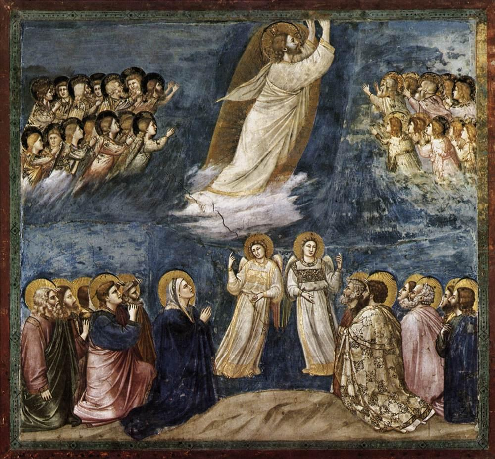

# Sessão 19 — Subiu aos Céus

*Giotto di Bondone, The Ascension (c. 1305). Public Domain via Wikimedia Commons.*

> *Mãos erguidas, pés deixando o chão, os apóstolos olhando para cima. Ele não desapareceu — voltou, no Seu corpo, ao lugar de onde tinha vindo. O homem Jesus está agora onde Deus está, com Suas chagas.*

## São Pio X pergunta

**94.** Jesus Cristo está agora somente no Céu?

*Jesus Cristo não está agora somente no Céu, mas como Deus está em todo lugar e como Deus e homem está no Céu e no Santíssimo Sacramento do altar.*

## São Tomás ensina

Além da ressurreição de Cristo, devemos também crer na sua ascensão; pois subiu ao Céu no quadragésimo dia. Por isso o Símbolo diz: «Subiu aos Céus». A respeito disto, devemos observar três coisas, a saber, que ela foi sublime, razoável e benéfica.

## A sublimidade da Ascensão

Foi por certo sublime que Cristo subisse ao Céu. Isto se exprime de três modos. Em primeiro lugar, subiu acima do céu físico: «Ele […] subiu acima de todos os céus».[^1] Em segundo lugar, subiu acima de todos os céus espirituais, isto é, das naturezas espirituais: «Ressuscitando [a Jesus] dos mortos e colocando-O à sua direita nos lugares celestiais. Acima de todo principado, e potestade, e virtude, e dominação, e de todo nome que se nomeia, não só neste século, mas também no que há de vir. E sujeitou todas as coisas debaixo dos seus pés».[^2] Em terceiro lugar, subiu até ao próprio trono do Pai: «Eis que vinha alguém semelhante ao Filho do Homem com as nuvens do Céu. E chegou até ao Ancião dos dias».[^3] «E o Senhor Jesus, depois de lhes haver falado, foi recebido no Céu, e está sentado à direita de Deus».[^4] Ora, não em sentido literal, mas figurado, é que Cristo está à direita de Deus. Enquanto Cristo é Deus, diz-se que está sentado à direita do Pai, ou seja, em igualdade com o Pai; e enquanto é homem, está sentado à direita do Pai, isto é, num lugar mais excelente.[^5] O demônio outrora simulou querer fazê-lo: «Subirei acima da altura das nuvens; serei semelhante ao Altíssimo».[^6] Mas só Cristo conseguiu, e por isso se diz: «Subiu ao Céu e está sentado à direita do Pai». «Disse o Senhor ao meu Senhor: Senta-te à minha direita».[^7]

## A razoabilidade da Ascensão

A Ascensão de Cristo ao Céu é conforme à razão: (1) porque o Céu era devido a Cristo pela sua própria natureza. É natural que se volte ao lugar de onde se procede. O princípio de Cristo vem de Deus, que está acima de todas as coisas: «Saí do Pai e vim ao mundo; agora, deixo o mundo e vou para o Pai».[^8] «Ninguém subiu ao Céu, senão o que desceu do Céu, o Filho do Homem, que está no Céu».[^9] Os justos sobem ao Céu, mas não da mesma forma que Cristo subiu, isto é, por seu próprio poder; pois eles são levados por Cristo:[^10] «Atrai-me; correremos atrás de ti».[^11] Ou, na verdade, podemos dizer que ninguém, senão Cristo, subiu ao Céu, pois os justos só sobem enquanto são membros de Cristo, que é a Cabeça da Igreja: «Onde quer que esteja o corpo, ali se reunirão também as águias».[^12]

(2) O Céu é devido a Cristo por causa de sua vitória. Pois foi enviado ao mundo para combater o demônio, e venceu-o. Por isso, mereceu Cristo ser exaltado acima de todas as coisas: «Eu também venci, e sentei-me com o meu Pai no seu trono».[^13]

(3) A Ascensão é razoável por causa da humildade de Cristo. Nunca houve humildade tão grande como a de Cristo, que, sendo Deus, quis fazer-Se homem; e, sendo o Senhor, quis tomar a forma de servo; e, como diz São Paulo, «fez-Se obediente até à morte»,[^14] e desceu até aos infernos. Por isso mereceu ser exaltado até ao Céu e até ao trono de Deus, pois a humildade leva à exaltação: «Quem se humilha será exaltado».[^15] «O que desceu é também o que subiu acima de todos os céus».[^16]

## Os benefícios da Ascensão

A Ascensão de Cristo foi muito proveitosa para nós. Isto se vê de três modos. Em primeiro lugar, como nosso Guia, porque subiu para nos guiar; pois havíamos perdido o caminho, mas Ele no-lo mostrou: «Pois subirá adiante deles, abrindo-lhes o caminho»,[^17] e assim podemos ter certeza da posse do reino dos Céus: «Vou preparar-vos um lugar».[^18] Em segundo lugar, para atrair os nossos corações a Si: «Onde está o teu tesouro, ali estará também o teu coração».[^19] Em terceiro lugar, para nos retirar das coisas terrenas: «Por isso, se ressuscitastes com Cristo, buscai as coisas do alto, onde Cristo está sentado à direita de Deus. Ponde a vossa afeição nas coisas do alto, não nas da terra».[^20]

[^1]: Ef 4, 10.
[^2]: *Ibid.*, 1, 20ss.
[^3]: Dn 7, 13.
[^4]: Mc 16, 19.
[^5]: «Nestas palavras observamos uma figura de linguagem, isto é, a transposição de um termo do seu sentido literal para o figurado, coisa não rara nas Escrituras: pois, acomodando a sua linguagem às ideias humanas, atribui afetos e membros humanos a Deus, que é puro espírito e nada de corpóreo pode admitir. Pois, assim como entre os homens aquele que se senta à direita é considerado como ocupando o lugar mais honroso, assim, transferindo a ideia para as coisas celestes, para exprimir a glória que Cristo, como Homem, goza acima de todos os outros, dizemos que se senta à direita de seu Eterno Pai. Ora, isto não significa posição material e figura corpórea, mas declara a posse fixa e permanente do poder e da glória régios e supremos, que Cristo recebeu do Pai» (*Catecismo Romano*, Sexto Artigo, 3).
[^6]: Is 14, 13-14.
[^7]: Sl 109, 1.
[^8]: Jo 16, 28.
[^9]: *Ibid.*, 3, 13.
[^10]: «Subiu por seu próprio poder, não por poder alheio, como Elias, que foi arrebatado ao Céu num carro de fogo (4 Rs 2, 1); ou como o profeta Habacuc (Dn 14, 35); ou como Filipe, o diácono, que foi transportado pelos ares pelo poder divino e percorreu regiões distantes da terra (At 8, 39). Tampouco subiu ao Céu somente pelo exercício de seu supremo poder enquanto Deus, mas também pela virtude do poder que possuía enquanto Homem; embora o poder humano por si só fosse insuficiente para levantá-Lo dos mortos, todavia a virtude com que estava dotada a alma bem-aventurada de Cristo era capaz de mover o corpo segundo seu beneplácito, e seu corpo, agora glorificado, obedecia prontamente à alma que o movia» (*Catecismo Romano*, *loc. cit.*, 2).
[^11]: Ct 1, 3.
[^12]: Mt 24, 28.
[^13]: Ap 3, 21.
[^14]: Fl 2, 8.
[^15]: Lc 14, 11.
[^16]: Ef 4, 10.
[^17]: Mq 2, 13.
[^18]: Jo 14, 2.
[^19]: Mt 6, 21.
[^20]: Cl 3, 1.

> **Escritura.** *Este Jesus, que dentre vós foi assunto ao céu, virá da mesma maneira como o vistes ir para o céu.* — Atos 1, 11

> *Cristo agora na glória, não Vos sintais distante. Levastes a minha carne para o alto; que o meu coração siga.*

---

#### Aprofundamento — *Catecismo de Trento*

## I. Importância do Artigo

[1] Ao contemplar, cheio do Espírito de Deus, a bem-aventurada Ascensão de Nosso Senhor, o profeta David exorta o mundo inteiro a celebrar o Seu triunfo, em transportes de alegria e satisfação. "Nações todas, diz ele, batei palmas, louvai a Deus em cantos de alegria! Subiu Deus no meio de aclamações"[^367].

Desta passagem, o pároco verá com quanto zelo não deve expor este Mistério, e tomar a peito que os fiéis não só o creiam e conheçam, mas que procurem com a graça de Deus traduzi-lo o mais possível em todos os seus atos e sentimentos.

## II. Sentido literal e explicação

### 1. Cristo subiu aos céus

A explicação do sexto Artigo, cujo objeto versa principalmente este divino Mistério, deve pois começar pela primeira parte, e descortinar toda a sua significação.

Os fiéis devem crer, sem a menor dúvida, que Jesus Cristo, depois de consumar o mistério de nossa Redenção, subiu aos céus enquanto Homem, com corpo e alma; enquanto Deus, nunca de lá se ausentou, pois que enche todos os lugares com Sua Divindade.

### 2. por própria virtude...

[2] Ensinará, todavia, que subiu por virtude própria. Não foi arrebatado por uma força estranha, como Elias que fora levado ao céu num carro de fogo, nem como Habacuc ou o diácono Filipe[^368] que, transportados através dos ares por uma virtude divina, venceram as distâncias de terras longínquas.

### como Deus e como homem

Entretanto, não subiu aos céus só pela virtude de Sua onipotência, mas também em Sua condição de homem. Isto não podia acontecer por força da natureza; mas, pela virtude de que estava munida, podia a gloriosa Alma de Cristo mover o corpo a seu grado. Tendo já a posse da glória, o corpo obedecia, sem dificuldade, à direção que a alma lhe dava, em seus movimentos. Desta maneira é que acreditamos ter Cristo subido aos céus, por virtude própria, como Deus e como Homem.

## III. Está sentado à direita de Deus Pai

### 1. Necessidade da figura

[3] Na segunda parte do Artigo estão as palavras: "Está sentado à direita de [Deus] Pai". Esta expressão encerra uma figura de linguagem, muito usada nas Escrituras. Para maior facilidade de compreensão, atribuímos a Deus afetos e membros humanos, apesar de não podermos imaginar nada de corpóreo em Deus, porque é [puro] espírito.

Mas, como nas relações sociais julgamos dar maior honra a quem colocamos à nossa direita, assim aplicamos também o mesmo princípio às coisas do céu. Confessamos que Cristo está à direita do Pai, para exprimir a glória que, como Homem, alcançou acima de todas as criaturas.

### 2. Significação

O "estar sentado" não exprime aqui uma postura de corpo, mas põe em evidência a posse segura e inabalável do régio poder e da glória infinita, que [Cristo] recebeu de Seu Pai.[^370]

Disso fala o Apóstolo: "Ressuscitou-O da morte, e colocou-O à Sua direita no céu, acima de todos os principados e potestades, virtudes e dominações, e de todas as dignidades que possa haver não só neste mundo, mas também no mundo futuro. Pôs-Lhe aos pés todas as coisas"[^370].

Destas palavras inferimos que tal glória é tão própria e particular de Nosso Senhor, que não pode convir a nenhuma outra natureza criada. Eis por que o Apóstolo declara em outro lugar: "A qual dos Anjos disse jamais: Senta-te à Minha direita?"[^371]

## IV. Avisos práticos

### 1. Expor o histórico...

[4] Para mostrar mais amplamente o conteúdo deste Artigo, o pároco seguirá a história da Ascensão, conforme a descreveu com admirável precisão o Evangelista São Lucas, nos Atos dos Apóstolos.[^372]

### a) em suas relações com os outros mistérios...

Na explicação, será preciso antes de tudo observar que todos os outros mistérios se referem à Ascensão como a um ponto final, que resume a perfeição e consumação de todos.

Com efeito, assim como pela Encarnação do Senhor começam todos os mistérios de nossa Religião, assim também pela Ascensão é que termina a peregrinação [de Cristo] neste mundo.

Os demais Artigos do Credo, relativos a Cristo Nosso Senhor, dão a conhecer Sua extrema humildade; pois nada se pode conceber de mais baixo e aviltante que o Filho de Deus Se revista, por nosso amor, da natureza humana e de sua fragilidade, e queira sujeitar-Se ao sofrimento e à morte.

### b) e sua sublimidade

Ora, como no Artigo anterior confessamos que [Cristo] ressuscitou dos mortos; e no presente, que subiu aos céus, e está sentado à direita de Deus Pai, não existe expressão mais sublime e grandiosa, para nos dar uma idéia de Sua glória suprema e divina majestade.

## V. Enumerar os motivos

### a) dar ao corpo uma morada gloriosa

[5] Depois desta exposição, é preciso ainda explicar bem as razões por que Cristo subiu aos céus. Antes de tudo, subiu aos céus, porque a Seu Corpo, dotado de glória imortal desde a Ressurreição, já não lhe convinha esta obscura morada da terra, mas antes a elevada e esplendorosa mansão dos céus.

### b) diligenciar nossa glorificação

E não foi só para tomar posse do trono de glória e poder, merecido pelo [Seu próprio] Sangue; mas também para diligenciar tudo o que diz respeito à nossa salvação.

### c) mostrar que Seu reino não é deste mundo

Além disso, foi para provar realmente que "Seu Reino não é deste mundo"[^373]. Os reinos do mundo são terrenos e passageiros, apoiam-se em grandes cabedais e na força proveniente da carne. Ora, o Reino de Cristo não era terrestre, como os judeus esperavam, mas espiritual e eterno. Colocando Seu trono nos céus, o próprio Cristo demonstrou que as forças e riquezas de Seu reino eram de natureza espiritual.

Neste Reino, os mais ricos e os mais providos com a abundância de todos os bens são aqueles que [na terra] procuram com maior ardor as coisas de Deus. Santiago, com efeito, declara que Deus escolheu "os pobres neste mundo, para serem ricos na fé, e herdeiros do Reino que Deus prometeu àqueles que O amam"[^374].

### d) elevar ao céu nosso pensamento

Pela Ascensão, Nosso Senhor queria que, subindo Ele aos céus, continuássemos nós a segui-Lo com saudosos pensamentos. Com efeito, pela Sua Morte e Ressurreição, deixou-nos um exemplo que nos mostra como devemos morrer e ressurgir espiritualmente. Pela Sua Ascensão também nos ensina e educa a erguermos nossa mente ao céu, enquanto vivemos ainda aqui na terra; a reconhecermos que, na terra, somos hóspedes e peregrinos à procura da [verdadeira] pátria[^375], concidadãos dos Santos e membros da família de Deus[^376], pois como diz o mesmo Apóstolo: "Nosso viver é no céu"[^377].

### e) enviar-nos o Espírito Santo

[6] A eficácia e a grandeza dos inefáveis benefícios que a bondade de Deus derramou sobre nós [por meio deste Mistério], desde muito as havia vaticinado o santo profeta David: "Subindo ao alto, arrebatou consigo os escravos, e distribuiu Seus dons aos homens"[^378]. Neste sentido é que o Apóstolo interpreta esta passagem.[^379]

Efetivamente, ao cabo de dez dias, enviou [Cristo] o Espírito Santo, de cuja virtude e exuberância encheu a multidão de fiéis ali presentes. Então é que cumpriu verdadeiramente aquela grandiosa promessa: "Para vós convém que Eu me vá. Se Eu não for, não virá a vós o Consolador; mas, se for, Eu vo-Lo enviarei"[^380].

### f) ser nosso advogado

Pela doutrina do Apóstolo, [Cristo] também subiu aos céus "para Se apresentar agora ante a face de Deus em favor nosso"[^381], e exercer perante o Pai o ofício de advogado. "Filhinhos meus, diz São João, eu vos escrevo para que não venhais a pecar. No entanto, se alguém pecar, por advogado junto ao Pai temos a Jesus Cristo, o Justo. Ele próprio é propiciação pelos nossos pecados"[^382].

Nada pode inspirar aos fiéis maior alegria e felicidade, do que verem a Jesus Cristo feito patrono de nossa causa, e intercessor pela nossa salvação, Ele que goza junto ao Eterno Pai de suma influência e autoridade.

### g) preparar-nos um lugar

Afinal, preparou-nos um lugar, conforme o havia prometido.[^383] Foi em nome de todos nós que Jesus Cristo, como nosso Chefe, entrou na posse da glória celeste.

Com Sua ida para o céu, abriu as portas que se tinham fechado, em consequência do pecado de Adão. Franqueou-nos um caminho para chegarmos à celestial bem-aventurança, conforme predissera aos Discípulos na última Ceia. Para confirmar Sua promessa com a realidade dos fatos, levou consigo, para a mansão da eterna bem-aventurança, as almas dos justos que tinha arrancado dos infernos.

## VI. Indicar os frutos imediatos

### a) cresce o mérito da fé

[7] Esta admirável abundância de dons celestes vem acompanhada de uma valiosa série de frutos e vantagens.

Primeiramente, o mérito de nossa fé cresce até o último grau; porquanto a fé se refere a coisas que são inacessíveis à nossa vista, e que ficam fora de alcance para nossa razão e inteligência. Portanto, se o Senhor Se não apartara de nós, diminuir-se-ia o mérito de nossa fé; pois Ele próprio exalta como bem-aventurados "os que não viram, mas creram"[^384].

### b) confirma-nos a esperança

Ademais, a subida de Cristo aos céus tem a grande força de confirmar a esperança que se aninha em nossos corações. Crendo que Cristo subiu aos céus, enquanto Homem, e colocou [Sua] natureza humana à direita de Deus Pai, grande é a nossa esperança de que também nós para lá havemos de subir, como membros Seus, e de unir-nos [a Ele] como nossa cabeça.[^385] Foi o que Nosso Senhor asseverou pessoalmente: "Pai, quero que, onde Eu estou, estejam comigo também aqueles, que Vós me destes"[^386].

### c) espiritualiza o nosso amor

Além disso, um dos maiores benefícios que auferimos [da Ascensão], foi o de Cristo arrebatar consigo para o céu o nosso amor, e de abrasá-lo no Espírito de Deus. É uma grande verdade o que se disse: "Nosso coração está onde estiver o nosso tesouro"[^387].

### transforma o caráter desse amor

[8] Realmente, permanecesse Jesus Cristo conosco na terra, todas as nossas considerações se concentrariam em Seu porte e trato humano. Nele veríamos apenas um Homem, que nos cumulou de assinalados benefícios, e por Ele teríamos certa afeição natural e terrena.

No entanto, pelo fato de ter subido aos céus, [Cristo] espiritualizou nosso amor; fez-nos amar e venerar, como Deus, Aquele que sabemos estar ausente [com Sua humanidade].

Nós o verificamos no exemplo dos Apóstolos. Enquanto o Senhor estava no meio deles, parecia que O consideravam por um prisma muito humano. De outro lado, o próprio Senhor no-lo afirma com Sua palavra: "Para vós é bom que Eu vá"[^388]. Aquele amor imperfeito com que [os Apóstolos] amavam a Jesus Cristo humanamente presente, devia ser aperfeiçoado pelo amor divino, e por sinal à vinda do Espírito Santo. Razão por que Cristo logo acrescentou: "Se Eu não me ausentar, não virá a vós o Consolador".

### d) dilata a sua Igreja

[9] Acresce que assim Nosso Senhor dilatou Sua casa na terra, que é a Igreja, cujo governo devia ser dirigido pela virtude e assistência do Espírito Santo. Como pastor e chefe supremo de toda a Igreja deixou entre os homens a Pedro, o Príncipe dos Apóstolos.

Além disso, "a uns constituiu Apóstolos, a outros profetas, a outros evangelistas, a outros pastores e mestres"[^389]. E sentado que está à direita do Pai, não cessa de distribuir, a uns e a outros, os dons que lhes convém a eles, como diz o Apóstolo: "A cada um de nós foi dada a graça, segundo a medida com que Cristo a distribuiu"[^390].

## VII. Aplicação prática

Ao fato da Ascensão devem os fiéis aplicar os mesmos princípios que expusemos, anteriormente, a propósito do mistério da Morte e Ressurreição.

Nossa perfeita salvação, nós a devemos aos sofrimentos de Cristo; e Seus méritos patentearam aos justos a entrada para o céu.

Isto não obstante, a Ascensão de Cristo se nos apresenta como um modelo, que nos ensina a olhar para o alto, e transportar-nos ao céu em espírito. [Dizemos mais], ela também nos dá uma força divina, que nos põe em condições de fazê-lo.

[^367]: Ps 46, 2-6.
[^368]: Act 8, 39.
[^370]: Eph 1, 20 ss.
[^371]: Hebr 1, 13; Ps 109, 1.
[^372]: Act 1, 1-11.
[^373]: Io 18, 36.
[^374]: Iac 2, 5.
[^375]: Hebr 11, 13.
[^376]: Eph 2, 19.
[^377]: Ph 3, 20.
[^378]: Ps 67, 19.
[^379]: Eph 4, 8.
[^380]: Io 16, 7; Act 1, 4-5; DU 344.
[^381]: Hebr 9, 24.
[^382]: 1 Io 2, 1 ss.
[^383]: Io 14, 2; DU 160 410.
[^384]: Io 20, 29.
[^385]: Eph 4, 15; Col 1, 18.
[^386]: Io 17, 24.
[^387]: Mt 6, 21.
[^388]: Io 16, 7.
[^389]: Eph 4, 11; 1 Cor 12, 28 ss.
[^390]: Eph 4, 7.
