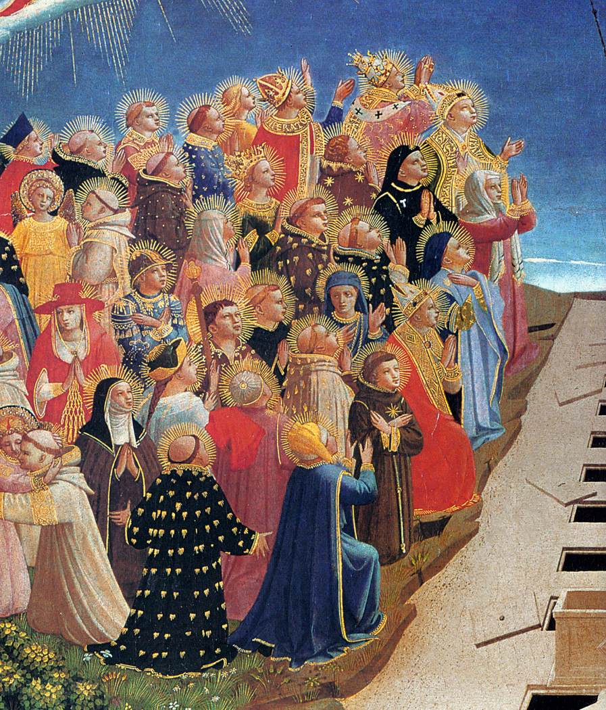

# Sessão 20 — Voltará para julgar os vivos e os mortos

*Fra Angelico, The Last Judgment (detail) (c. 1431). Public Domain via Wikimedia Commons.*

> *O Cristo glorioso de Fra Angelico levanta a mão e os mortos se erguem. Há um dia em que isto não será uma pintura. Ele voltará — visível, régio, justo. O mundo não está improvisando para sempre.*

## São Pio X pergunta

**95.** Jesus Cristo jamais retornará visivelmente sobre esta Terra?

*Jesus Cristo retornará visivelmente sobre esta Terra no fim do mundo para julgar os vivos e os mortos, ou seja, todos os homens, bons e maus.*

**96.** Jesus Cristo esperará até o fim do mundo para nos julgar?

*Jesus Cristo não esperará até o fim do mundo para nos julgar, mas julgará cada um logo após a morte.*

**97.** Existem dois juízos?

*Existem dois juízos: um particular, de cada alma, logo após a morte; outro universal, de todos os homens, no fim do mundo.*

## São Tomás ensina

É próprio do ofício do Rei e do Senhor pronunciar juízo: «O rei que se assenta no trono de juízo, com o seu olhar afasta todo o mal».[^1] Ora, como Cristo subiu ao Céu e está sentado à direita de Deus como Senhor de todas as coisas, é claro que Lhe pertence o ofício de Juiz. Por isso dizemos na regra da fé católica que «virá a julgar os vivos e os mortos». Na verdade, os Anjos disseram: «Este Jesus, que do meio de vós foi assunto ao Céu, virá assim como O vistes ir para o Céu».[^2]

Vamos considerar três fatos sobre o juízo: (1) a forma do juízo; (2) o temor do juízo; (3) a nossa preparação para o juízo.

## A forma do juízo

Quanto à forma do juízo há uma tríplice questão. Quem é o Juiz, quem serão julgados, e sobre o quê serão julgados. Cristo é o Juiz: «É Ele o que foi por Deus constituído Juiz dos vivos e dos mortos».[^3] Aqui podemos interpretar «os mortos» como os pecadores, e «os vivos» como os justos; ou «os vivos» como aqueles que naquele tempo estiverem vivos, e «os mortos» como aqueles que tiverem morrido. Cristo certamente é Juiz não só por ser Deus, mas também por ser homem. A primeira razão para isto é que é necessário que aqueles que serão julgados possam ver o Juiz. Mas a Divindade é tão totalmente deleitável, que ninguém poderia contemplá-la sem grande gozo; e por isso aos condenados não é permitido ver o Juiz, nem, em consequência, gozar de coisa alguma. Cristo, pois, há de aparecer necessariamente em forma humana, para que possa ser visto por todos: «E deu-Lhe poder de fazer juízo, porque é Filho do Homem».[^4] Cristo mereceu ainda este ofício como Homem, pois como Homem foi injustamente julgado, e por isso Deus O constitui Juiz do mundo inteiro: «A tua causa foi julgada como a do ímpio. Recobrarás a causa e o juízo».[^5] E, finalmente, se Deus apenas julgasse os homens, eles, aterrorizados, desesperar-se-iam; mas esse desespero desaparece quando hão de ser julgados por um Homem: «E então verão o Filho do Homem vir sobre uma nuvem».[^6]

## Quem serão julgados?

Todos serão julgados — os que são, os que foram e os que virão a ser: «Todos nós devemos ser manifestados ante o tribunal de Cristo, para que cada um receba o que é próprio do corpo, conforme o que tiver feito, ou bem, ou mal».[^7] Há, diz São Gregório, quatro classes diferentes de pessoas a serem julgadas. A diferença principal está entre os bons e os ímpios.

Dos ímpios, alguns serão condenados, mas não serão julgados. São os infiéis, cujas obras não serão discutidas, porque, como diz São João, «quem não crê já está julgado».[^8] Outros serão condenados e julgados. São aqueles que, possuindo a fé, partiram desta vida em pecado mortal: «Pois o salário do pecado é a morte».[^9] Não serão excluídos do juízo por causa da fé que possuíam.

Dos bons também, alguns serão salvos sem ser julgados. São os pobres em espírito por causa de Deus, que antes hão de julgar os outros: «Em verdade vos digo que vós, que me seguistes, na regeneração, quando o Filho do Homem se assentar no trono da sua majestade, também vós vos sentareis em doze tronos, julgando as doze tribos de Israel».[^10] Ora, isto não se há de entender apenas dos discípulos, mas de todos os pobres em espírito; do contrário, Paulo, que mais trabalhou do que os outros, não estaria entre eles. Estas palavras devem, pois, referir-se também a todos os seguidores dos Apóstolos e a todos os homens apostólicos: «Não sabeis que havemos de julgar os Anjos?»[^11] «O Senhor entrará em juízo com os anciãos do seu povo e com os seus príncipes».[^12]

Outros serão salvos e também julgados, isto é, os que morrem em estado de retidão. Pois, embora partam desta vida na justiça, todavia falharam em alguma coisa nos negócios das coisas temporais, e por isso serão julgados, mas salvos. O juízo recairá sobre todas as suas obras, boas e más: «Anda nos caminhos do teu coração, […] e sabe que por todas estas coisas Deus te chamará a juízo».[^13] «E todas as coisas que se fazem, Deus chamará a juízo, por todo o engano, seja bom ou mau».[^14] Mesmo as palavras ociosas hão de ser julgadas: «Mas Eu vos digo que toda palavra ociosa que os homens disserem, dela hão de prestar conta no dia do juízo».[^15] E também os pensamentos: «Pois inquérito se fará sobre os pensamentos do ímpio».[^16] Assim se vê clara a forma do juízo.

> **Escritura.** *Quando vier o Filho do homem na sua majestade, e todos os anjos com Ele, então se sentará sobre o trono da sua glória.* — Mateus 25, 31

> *Justo Juiz, Vós vereis tudo. Hoje, fazei-me viver de modo que eu não me envergonhe quando o virdes.*

---

#### Aprofundamento — *Catecismo de Trento*

## I. Importância do Artigo

### 1. Tríplice ministério à Igreja

[1] Jesus Cristo honra e engrandece Sua Igreja com três importantes ministérios: de Redentor, de Protetor, e de Juiz.

Pelos Artigos anteriores, já sabemos que Ele remiu o gênero humano pela Sua Paixão e Morte, e que pela Ascensão Se tornou o perpétuo advogado e defensor de nossa causa. No presente Artigo, só resta explicar a Sua função de juiz. O Artigo quer dizer que Cristo Nosso Senhor, naquele dia supremo, há de julgar todo o gênero humano.

### 2. O "Dia do Senhor"

[2] As Sagradas Escrituras atestam que são duas as vindas do Filho de Deus. A primeira foi quando assumiu carne, para nos salvar, e Se fez homem no seio da Virgem; a segunda será, quando vier para julgar todos os homens, na consumação dos séculos.

Nas Escrituras, esta segunda vinda se chama "Dia do Senhor"[^391], do qual diz o Apóstolo: "O dia do Senhor há de vir como o ladrão de noite"[^392]. "Aquele dia, porém, e aquela hora, ninguém os conhece" — declara o próprio Salvador.[^393]

### a) sua realidade

Em prova do Juízo Final, basta citar esta passagem do Apóstolo: "Todos nós teremos de comparecer perante o tribunal de Cristo, para que cada um receba retribuição do bem ou do mal, que tiver praticado em sua vida terrena"[^394].

A Escritura está cheia de textos, que os párocos descobrirão em cada página, quando quiserem explicar este mistério e torná-lo mais acessível à inteligência dos fiéis.[^395]

### b) objeto de nossa esperança

Se desde o início do mundo, todos ansiavam por aquele primeiro dia em que o Senhor Se revestiu de nossa carne, porquanto nesse mistério havia a esperança de seu resgate, também agora devemos — depois da Morte e Ascensão do Filho de Deus — suspirar ardentemente pelo segundo Dia do Senhor, "aguardando a ditosa esperança e o aparecimento da glória do grande Deus"[^396].

## II. Explicação

### 1. Dois Juízos

[3] Na explicação desta matéria, os párocos terão de atender às duas ocasiões, em que todo homem deve comparecer na presença do Senhor, para dar contas de todos os seus pensamentos, ações e palavras, e para aceitar finalmente a sentença imediata do Juiz.[^397]

### a) o particular

A primeira ocasião é o momento, em que cada um de nós deixa este mundo; a alma é levada incontinenti ao tribunal de Deus, onde se examina com a máxima justeza, tudo o que o homem jamais fez, disse, e pensou em sua vida.

É o que chamamos Juízo Particular.

### b) o universal

A segunda ocasião, porém, há de ser quando todos os homens terão de comparecer juntos, no mesmo dia e no mesmo lugar, perante o tribunal do juiz, para que, na presença de todos os homens de todos os séculos, cada um venha a saber a sentença, que a seu respeito foi lavrada.

Para os ímpios e malvados, esta declaração de sentença não constituirá a menor parte de suas penas e castigos; ao passo que os virtuosos e justos nela terão uma boa parte de sua alegria e galardão. Naquele instante, será pois revelado o que foi cada indivíduo, durante a sua vida mortal.

Este Juízo se chama universal.

## III. Motivos para o juízo universal

### a) ler todas as consciências

[4] Será então necessário mostrar por que, além do Juízo Particular para cada um, se fará ainda outro geral para todos os homens.

Ora, os mortos deixam às vezes filhos que imitam os pais; parentes[^398] e discípulos que seguem e propagam seus exemplos em palavras e obras. Esta circunstância deve aumentar os prêmios ou castigos dos próprios mortos.[^399]

Tal influência, que a muitos empolga, em seu caráter benéfico ou maligno, não acabará senão quando romper o último dia do mundo. Convinha, pois, fazer-se então uma perfeita averiguação de todas essas obras e palavras, quer sejam boas, quer sejam más.[^400] O que, porém, não seria possível sem um julgamento geral de todos os homens.

### b) reabilitar os justos

Outro motivo ainda. Muitas vezes, os justos são lesados em sua reputação, porquanto os ímpios passam por grandes virtuosos. Pede a divina justiça que, numa convocação para o público julgamento de todos os homens, possam os justos recuperar a boa fama, que lhes fora iniquamente roubada aos olhos do mundo.

### c) responsabilizar também o corpo

Além disso, em tudo o que façam durante a vida, os bons e os maus não prescindem da cooperação de seus corpos. Daí decorre, necessariamente, que as boas ou más ações [praticadas] devem atribuir-se também aos corpos, que delas foram instrumentos.

Era, pois, de suma conveniência que os corpos partilhassem, com as almas, dos prêmios da eterna glória ou dos suplícios, conforme houvessem merecido. Isto, porém, não poderia efetuar-se, sem a ressurreição de todos os homens, e sem um julgamento universal.[^401]

### d) Justificar a Providência de Deus

Como também a fortuna e a desgraça não fazem escolha entre bons e maus, era necessário provar que tudo é dirigido e governado pela infinita sabedoria e justiça de Deus. Convinha, pois, não só reservar prêmios aos bons e castigos aos maus, na vida futura, mas também decretá-los num juízo público e universal, que os tornasse mais claros e evidentes a todos os homens.

Desta forma, todos renderão louvor a Deus pela sua justiça e providência, em desagravo daquela injusta queixa com que às vezes os próprios Santos, por fraqueza humana, se lastimavam, ao verem os maus na posse de grandes cabedais e dignidades.

O Profeta dizia: "Meus pés estiveram a ponto de vacilar. Por pouco se não transviaram os meus passos, porque me enchi de zelo contra os maus, quando observava a vida bonançosa dos pecadores"[^402]. E mais adiante: "Eis que, sendo pecadores, e favorecidos pelo mundo, eles conseguiram riquezas. E eu disse: Então não me adiantou guardar puro o meu coração, e lavar em inocência as minhas mãos; em ser torturado o dia inteiro, e padecer aflição desde o romper da madrugada"[^403].

Por conseguinte, era preciso haver um Juízo Universal, a fim de que os homens se não pusessem a comentar que Deus passeia pelos quadrantes do céu, e que pouco se Lhe dá a sorte das coisas terrenas.[^404] Com toda a razão foi incluída a fórmula desta verdade nos doze Artigos do Credo, para apoiar, com a força de sua doutrina, os ânimos que duvidem da providência e justiça de Deus.

### e) alentar os bons e aterrar os maus

Sobretudo, era mister que a lembrança do Juízo alentasse os bons, e aterrasse os maus. Conhecendo a justiça de Deus, aqueles não viriam a desfalecer; estes seriam arredados do mal, graças ao temor e à expectação dos eternos castigos.

Por isso, falando do Último Dia, Nosso Senhor e Salvador declarou que haveria um Juízo Universal. Descreveu os sinais do tempo em que há de chegar, para que, ao vê-los, reconhecêssemos estar perto o fim do mundo. Depois, no momento de subir aos céus, enviou Anjos que consolassem os Apóstolos, tristes com Sua ausência, [e lhes dissessem] as seguintes palavras: "Este Jesus que de vosso meio foi arrebatado ao céu, há de vir assim como O vistes subir ao céu"[^405].
