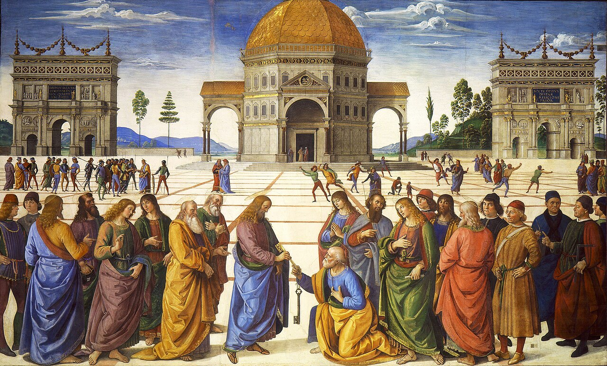

# Sessão 24 — A Igreja, sociedade de Cristo

*Pietro Perugino, Christ Giving the Keys to St. Peter (1481-1482). Public Domain via Wikimedia Commons.*

> *Cristo estende duas chaves a um pescador de joelhos. A Igreja não é o humor de uma geração, nem a preferência pessoal de clérigos — é uma sociedade que Cristo fundou com as próprias mãos e nunca abandonou. Você pertence a um corpo mais antigo do que os impérios.*

## São Pio X pergunta

**105.** O que é a Igreja?

*A Igreja é a sociedade dos verdadeiros cristãos, isto é, dos batizados que professam a Fé e a doutrina de Jesus Cristo, participam de seus sacramentos e obedecem aos Pastores estabelecidos por Ele.*

**106.** Por quem a Igreja foi fundada?

*A Igreja foi fundada por Jesus Cristo, que reuniu seus fiéis numa sociedade, sujeitou-a aos Apóstolos com São Pedro à cabeça, e deu-lhe o sacrifício, os sacramentos e o Espírito Santo que a vivifica.*

**107.** Qual é a Igreja de Jesus Cristo?

*A Igreja de Jesus Cristo é a Igreja Católica Romana, pois só Ela é Una, Santa, Católica e Apostólica como Ele a quis.*

**108.** Por que a Igreja é Una?

*A Igreja é Una porque todos os seus membros tiveram, têm e sempre terão a mesma Fé, sacrifício, sacramentos e cabeça visível, o Romano Pontífice, sucessor de São Pedro, formando todos assim um só corpo, o Corpo Místico de Jesus Cristo.*

## São Tomás ensina

Vemos que num homem há uma só alma e um só corpo, e que do seu corpo há muitos membros. Assim também a Igreja Católica é um só corpo e tem diferentes membros. A alma que anima este corpo é o Espírito Santo.[^1] Por isso, depois de confessarmos a fé no Espírito Santo, somos exortados a crer na Santa Igreja Católica. Por isso, no Símbolo se diz: «a Santa Igreja Católica».

Há que saber que «igreja» é o mesmo que assembleia.[^2] Assim, a Santa Igreja é o mesmo que a assembleia dos fiéis, e cada cristão é membro desta Igreja, da qual está escrito: «Aproximai-vos de mim, vós os ignorantes, e congregai-vos na casa da disciplina».[^3]

A Igreja tem quatro condições essenciais, na medida em que é una, santa, católica e firme e estável.[^4]

> **Escritura.** *Também eu te digo que tu és Pedro, e sobre esta pedra edificarei a minha Igreja, e as portas do inferno não prevalecerão contra ela.* — Mateus 16, 18

> *Senhor, edificastes uma só Igreja. Quando eu for tentado a partir, lembrai-me de que não há outro lugar onde dissestes que estaríeis.*

---

#### Aprofundamento — *Catecismo de Trento*

> Creio a Santa Igreja Católica
