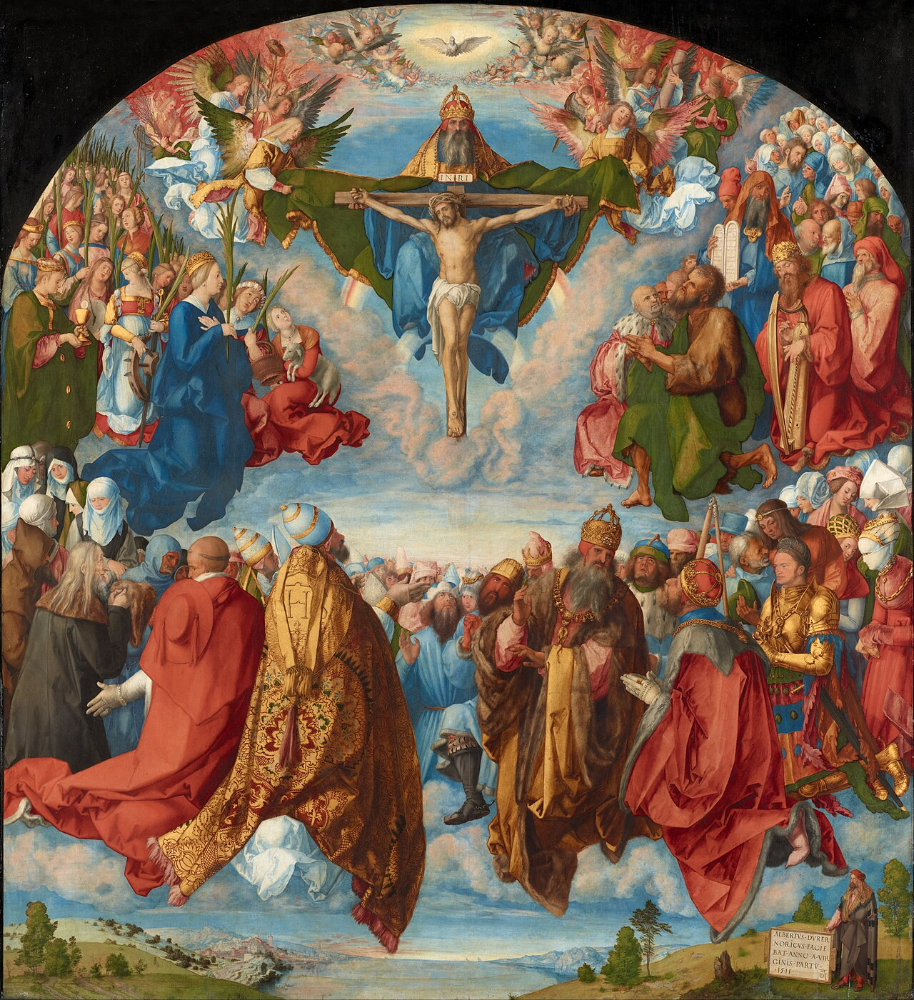

# Sessão 27 — Os meios de santidade e a comunhão dos santos

*Albrecht Dürer, Adoration of the Trinity (Landauer Altar) (1511). Public Domain via Wikimedia Commons.*

> *Todos os santos juntos — conhecidos e esquecidos, reis e mendigos, os canonizados e os cristãos esquecidos pela história das pequenas cidades. A Igreja na terra, a Igreja que sofre, a Igreja glorificada. Você está ligado a cada um deles por algo mais espesso do que o sangue.*

## São Pio X pergunta

**118.** Por que Jesus Cristo instituiu a Igreja?

*Jesus Cristo instituiu a Igreja para que os homens encontrassem nela a guia segura e os meios de santidade e de salvação eterna.*

**119.** Quais são os meios de santidade e de salvação eterna que se encontram na Igreja?

*Os meios de santidade e de salvação eterna que se encontram na Igreja são a verdadeira Fé, o sacrifício e os sacramentos, e os mútuos auxílios espirituais, como a oração, o conselho, o exemplo.*

**120.** Os meios de santidade e de salvação eterna são comuns a todos os homens?

*Os meios de santidade e de salvação eterna são comuns a todos os homens que pertencem à Igreja, isto é, aos fiéis, que nos escritos apostólicos são chamados Santos; por isso sua união e participação naqueles meios é comunhão dos Santos em coisas santas.*

**121.** Por que os fiéis que se encontram na Igreja são chamados Santos?

*Os fiéis que se encontram na Igreja são chamados Santos porque são consagrados a Deus, justificados ou santificados pelos sacramentos e obrigados a viver santamente.*

**122.** O que significa "comunhão dos Santos"?

*Comunhão dos Santos significa que todos os fiéis, formando um só Corpo em Jesus Cristo, aproveitam-se de todo o bem que existe e se faz no próprio Corpo, ou seja, na Igreja universal, contanto que não estejam impedidos pelo afeto ao pecado.*

## São Tomás ensina

Assim como, em nosso corpo natural, a operação de um membro coopera para o bem de todo o corpo, assim sucede também com um corpo espiritual, como é a Igreja. Por serem todos os fiéis um só corpo, o bem de um membro se comunica a outro: «E todos somos membros uns dos outros».[^1] Assim, entre os pontos da fé que os Apóstolos nos transmitiram, está o de que há uma partilha comum de bens na Igreja. Isto se exprime nas palavras «a Comunhão dos Santos».[^2] Entre os vários membros da Igreja, o membro principal é Cristo, porque é a Cabeça: «Constituiu-O Cabeça sobre toda a Igreja, que é o seu Corpo».[^3] Cristo comunica os seus bens, assim como o poder da cabeça é comunicado a todos os membros.

> **Escritura.** *Vós sois o corpo de Cristo e seus membros, cada um por sua parte.* — 1 Coríntios 12, 27

> *Comunhão dos santos — orai por mim. Sou um de vós, fragilmente, mas realmente. Sustentai-me.*
