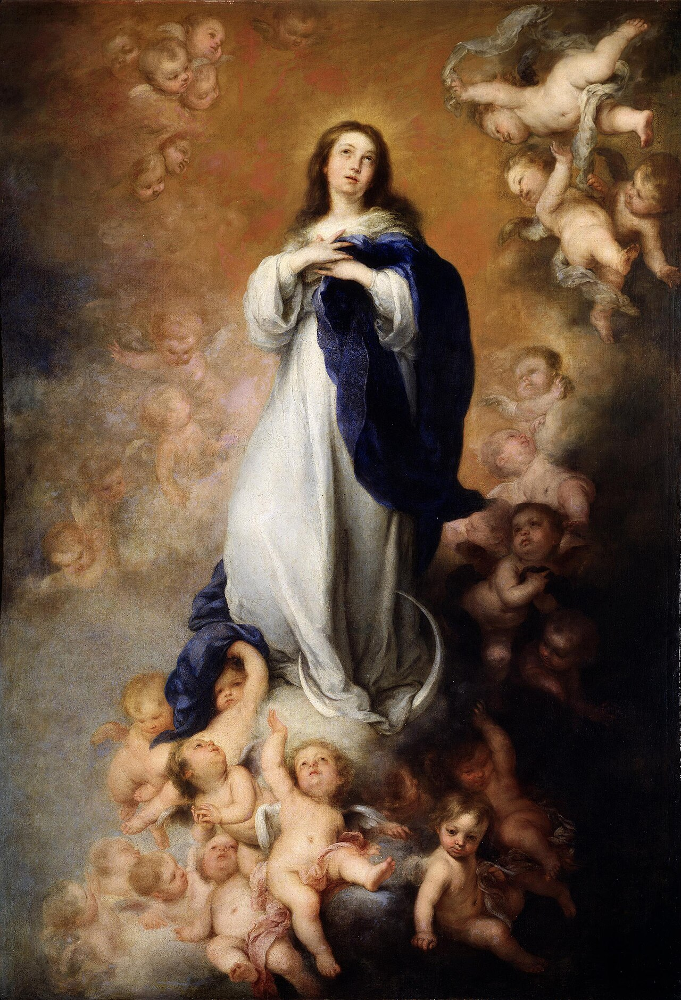

# Sessão 28 — Os santos, vivos e falecidos

*Bartolomé Esteban Murillo, Immaculate Conception of the Venerables (c. 1678). Public Domain via Wikimedia Commons.*

> *O céu de Murillo se inclina — santos e Maria intercedendo, mãos abertas. A amizade dos santos é real e atuante. Eles oram por você quando você não ora por si. Esperaram que você notasse.*

## São Pio X pergunta

**123.** Os Bem-Aventurados do Paraíso e as almas do Purgatório participam da comunhão dos Santos?

*Os Bem-Aventurados do Paraíso e as almas do Purgatório também eles participam da comunhão dos Santos porque estão unidos entre si e conosco pela caridade, recebem uns as nossas orações e as outras os nossos sufrágios, e todos nos retribuem com a sua intercessão junto a Deus.*

**124.** Quem está fora da comunhão dos Santos?

*Está fora da comunhão dos Santos quem está fora da Igreja, ou seja, os condenados, os infiéis, os judeus, os hereges, os apóstatas, os cismáticos e os excomungados.*

**125.** Quem são os infiéis?

*Os infiéis são os não batizados que não creem de nenhum modo no Salvador prometido, isto é, no Messias ou Cristo, como os idólatras ou os muçulmanos.*

**126.** Quem são os judeus?

*Os judeus são os não batizados que professam a lei de Moisés e não creem que Jesus é o Messias ou Cristo prometido.*

**127.** Quem são os hereges?

*Os hereges são os batizados que se obstinam em não crer em alguma verdade revelada por Deus e ensinada pela Igreja; por exemplo, os protestantes.*

> **Escritura.** *Por isso, também nós, cercados de tão grande nuvem de testemunhas, depondo todo o peso e o pecado que nos cerca, corramos com perseverança na luta que nos é proposta.* — Hebreus 12, 1

> *Santos — conhecidos e desconhecidos — corram comigo hoje. Não me deixem esquecer que a corrida já foi corrida antes.*
