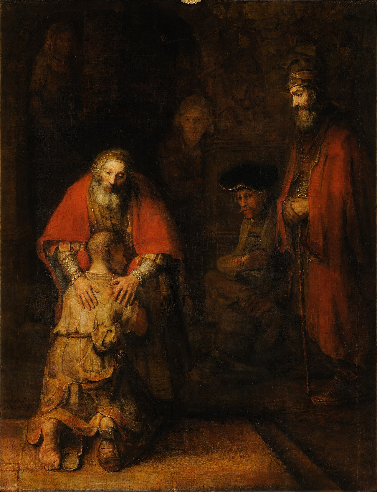

# Sessão 30 — A remissão dos pecados

*Rembrandt van Rijn, The Return of the Prodigal Son (c. 1668). Public Domain via Wikimedia Commons.*

> *O filho pródigo de Rembrandt — magro, arruinado, ajoelhado — e as mãos do pai pousadas sobre ele. Uma mão materna, uma paterna, ambas puro carinho. A Igreja tem o poder de perdoar pecados porque Cristo o tem. Coloque-se dentro da pintura hoje.*

## São Pio X pergunta

**133.** O que significa "remissão dos pecados"?

*Remissão dos pecados significa que Jesus Cristo deu aos Apóstolos e a seus sucessores o poder de remitir na Igreja todo pecado.*

**134.** Como se remitem os pecados na Igreja?

*Remitem-se os pecados na Igreja principalmente com os sacramentos do Batismo e da Penitência, instituídos por Jesus Cristo para esse fim.*

**135.** O que é o pecado?

*O pecado é uma ofensa feita a Deus desobedecendo a sua lei.*

**136.** Existem quantas espécies de pecado?

*Existem duas espécies de pecado: original e atual.*

**137.** Qual é o pecado original?

*O pecado original é o pecado que a humanidade cometeu em Adão, sua cabeça, e que de Adão todo homem contrai por natural descendência.*

**138.** Dentre os filhos de Adão nenhum jamais foi preservado do pecado original?

*Dentre os filhos de Adão foi preservada do pecado original só Maria Santíssima, que, porque eleita Mãe de Deus, era "cheia de graça" (São Lucas I, 28) e, portanto, sem pecado desde o primeiro instante; por isso a Igreja a celebra como a Imaculada Conceição.*

**139.** Como se apaga o pecado original?

*O pecado original se apaga com o Santo Batismo.*

**140.** Qual é o pecado atual?

*O pecado atual é o que se comete voluntariamente por quem tem o uso da razão.*

**141.** De quantos modos se comete o pecado atual?

*O pecado atual se comete de quatro modos, isto é, por pensamentos, palavras, obras e omissões.*

> **Escritura.** *E, levantando-se, foi ter com seu pai. Quando ainda estava longe, seu pai o viu e moveu-se de compaixão, e, correndo, lançou-se ao seu pescoço e o beijou.* — Lucas 15, 20

> *Pai, eu sou o pródigo. Impedi-me de ser o irmão mais velho. Deixai-me voltar para casa, mais uma vez, hoje.*
