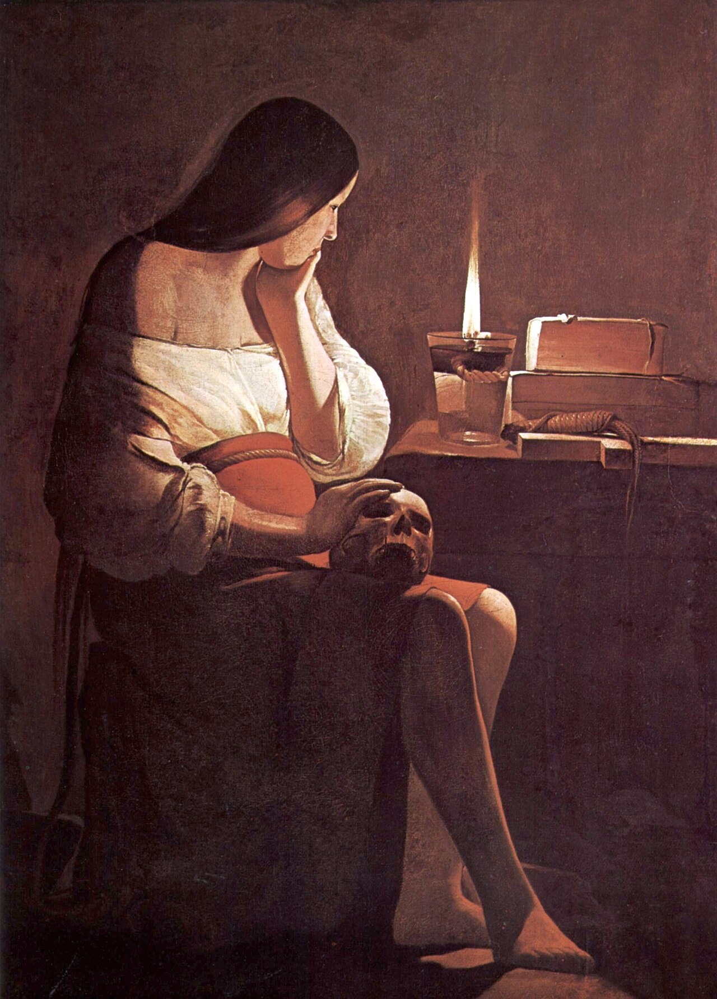

# Sessão 31 — Pecado mortal e a recuperação da graça

*Georges de La Tour, The Penitent Magdalene (c. 1640). Public Domain via Wikimedia Commons.*

> *La Tour pintou Madalena à luz de uma vela — uma caveira sobre a mesa, a mão no rosto, a chama firme. O pecado mortal é a porta batida contra a graça. Mas a porta tem maçaneta. Pode ser aberta por dentro, pela dor, com a santa que já o fez antes.*

## São Pio X pergunta

**142.** Existem quantas espécies de pecado atual?

*Existem duas espécies de pecado atual: mortal e venial.*

**143.** O que é o pecado mortal?

*O pecado mortal é uma desobediência à lei de Deus em coisa grave, feita com plena advertência e deliberado consentimento.*

**144.** Por que o pecado grave se chama mortal?

*O pecado grave se chama mortal porque priva a alma da graça divina que é a sua vida, retira-lhe os méritos e a capacidade de adquirir outros novos, e torna-a digna de pena ou morte eterna no Inferno.*

**145.** É, pois, inútil que o pecador faça boas obras, se o pecado mortal torna o homem incapaz de merecer?

*Não é inútil que o pecador faça boas obras, ao invés, deve fazê-las seja para não tornar-se pior omitindo-as e caindo em novos pecados, seja para dispor-se com elas de alguma maneira à conversão e requisição da graça de Deus.*

**146.** Como se readquire a graça de Deus perdida pelo pecado mortal?

*A graça de Deus, perdida pelo pecado mortal, readquire-se com uma boa confissão sacramental ou com a contrição perfeita que livra dos pecados, embora permaneça a obrigação de confessá-los.*

**147.** Juntamente com a graça, readquirem-se também os méritos perdidos pelo pecado mortal?

*Juntamente com a graça, por suma misericórdia de Deus, readquirem-se também os méritos perdidos pelo pecado mortal.*

**148.** O que é o pecado venial?

*O pecado venial é desobediência à lei de Deus em coisa leve ou mesmo em coisa de si grave, mas sem plena advertência e consentimento.*

> **Escritura.** *Por isso te digo: muitos pecados lhe são perdoados, porque muito amou.* — Lucas 7, 47

> *Senhor, já fechei portas contra Vós. Hoje, dai-me a coragem da Madalena para abrir uma.*
