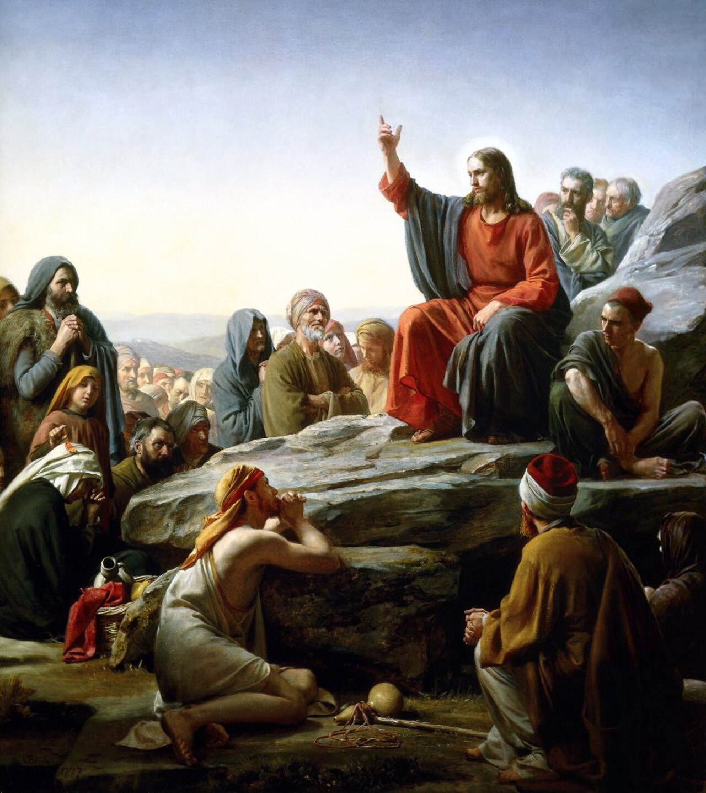

# Sessão 36 — Por que somos obrigados a guardar os mandamentos

*Carl Heinrich Bloch, Sermon on the Mount (c. 1865-1879). Public Domain via Wikimedia Commons.*

> *Cristo numa encosta, mãos abertas: "Bem-aventurados…" Os mandamentos são cumpríveis — Ele o diz. Com a graça não são impossíveis. Sem a graça são esmagadores. De um modo ou de outro, são reais.*

## São Pio X pergunta

**166.** Somos obrigados a observar os Mandamentos de Deus?

*Somos obrigados a observar os Mandamentos de Deus porque são impostos por Ele, Nosso supremo Senhor, e ditados pela natureza e pela reta razão.*

**167.** Quem viola os Mandamentos de Deus peca gravemente?

*Quem deliberadamente viola mesmo que um só Mandamento de Deus em matéria grave peca gravemente contra Deus e por isso merece o Inferno.*

**168.** O que se deve notar nos Mandamentos?

*Nos Mandamentos deve-se notar o que é ordenado e o que é proibido.*

## O Catecismo Romano ensina

## II. Motivos para sua observância

[3] Dentre as razões que movem o coração do homem a cumprir os preceitos do Decálogo, sobressai, como a mais eficiente, o fato de ser Deus o autor dessa mesma Lei.

### a) O Legislador é Deus

Diga-se, muito embora, que a Lei "foi promulgada pelos Anjos"[^13]; contudo, ninguém pode contestar que seu autor é o próprio Deus. Atestam-no à saciedade, não só as palavras do Legislador, que logo mais serão explicadas, mas também os textos sem conta da Sagrada Escritura, que fàcilmente hão de acudir à lembrança dos pastores.

Ademais, ninguém há que não sinta, em seu coração, uma lei gravada por Deus, mercê da qual lhe é dado distinguir o bem do mal, o honesto do torpe, o justo do injusto. Ora, sendo provado que a força e a natureza desta Lei não difere da Lei escrita, quem se atreverá a negar que Deus seja o autor da Lei escrita, assim como é o autor da Lei inata em nossos corações?

Estava essa luz divina quase ofuscada por maus costumes e por vícios inveterados entre os homens. Todavia, pela promulgação da Lei a Moisés, Deus não trouxe uma luz nova, mas deu antes maior fulgor à primitiva. É preciso explicar assim, para que o povo não se julgue livre do Decálogo, quando ouve dizer que a Lei de Moisés está ab-rogada.

Ainda mais. É absolutamente certo que não devemos cumprir esses preceitos, por ser Moisés que os promulgou, mas por serem inatos em todos os corações, e por terem sido explicados e confirmados por Cristo Nosso Senhor.

### b) o Todo-Poderoso

[4] Grande apoio e poder de persuasão temos no pensamento de que a Lei foi promulgada por Deus; pois não podemos duvidar de Sua sabedoria e equidade, nem tampouco esquivar-nos de Seu infinito poder e majestade. Por isso, quando Deus mandava, pela boca dos Profetas, que se observasse a Lei, dizia ser Ele o Senhor Deus, como está escrito no próprio início do Decálogo: "Eu sou o Senhor teu Deus"[^14]; e noutra parte: "Se Eu sou o Senhor, onde está o temor que Me é devido?"[^15]

### c) que quer a nossa salvação

[5] Tal pensamento, porém, moverá os corações dos fiéis não só à observância dos preceitos divinos, mas também à ação de graças, por ter Deus manifestado tão claramente a Sua vontade, na qual se encerra a nossa salvação.

Por esse motivo, as Sagradas Escrituras, em mais de um lugar, enaltecem esse máximo benefício, e exortam o povo a reconhecer a sua própria dignidade e a munificência de Deus. Assim diz o Deuteronômio: "Tal é a vossa sabedoria e inteligência em face dos povos, que todos os que ouvirem estes preceitos, se põem a dizer: Eis aqui um povo sábio e entendido, uma grande nação".[^16] Nos Salmos se lê igualmente: "Não procedeu assim com todas as nações, nem lhes manifestou os Seus juízos".[^17]

### Corolário: A promulgação da Lei no Monte

[6] Se então o pároco mostrar, pelos dizeres da Escritura, de que maneira foi a Lei promulgada, os fiéis compreenderão, facilmente, com quanto amor e humildade devem guardar a Lei que de Deus receberam.

Três dias antes da promulgação da Lei, por ordem de Deus foi dito a todos lavassem seus vestidos, e não se aproximassem de suas mulheres, a fim de receberem a Lei com mais pureza e docilidade; e estivessem de prontidão para o terceiro dia.

Quando em seguida foram levados à montanha, onde o Senhor havia de dar-lhes a Lei por intermédio de Moisés, só a Moisés foi dada a ordem de subir a montanha. Sobre ela veio Deus com suma majestade. Cercou o lugar com trovões, relâmpagos, fogo e nuvens espessas. Começou a falar com Moisés, e deu-lhe as Leis.[^18]

Se a Divina Sabedoria assim procedeu, não foi por outro motivo, senão para nos ensinar que devemos receber a Lei do Senhor com o coração puro e humilde, e que sobre nós cairão as penas previstas pela justiça divina, se desprezarmos os Seus Mandamentos.

### 2. Facilidade dos Mandamentos

[7] O pároco terá ainda de mostrar que os preceitos da Lei não são difíceis de cumprir. Para tanto, poderá expor uma única razão, tirada de Santo Agostinho: "Quero que me digam, será impossível ao homem amar, repito, amar o bondoso Criador, o Pai amantíssimo? ainda mais, amar a sua própria carne na pessoa de seus irmãos? Ora, 'quem ama... cumpre a Lei'".[^19]

Pelo mesmo motivo, o Apóstolo São João diz, abertamente, que os preceitos de Deus não são pesados.[^20] No sentir de São Bernardo, Deus não podia exigir do homem nada que fosse mais justo, mais elevado, e mais proveitoso.[^21]

Arrebatado, pois, pela imensa bondade de Deus, Santo Agostinho se volve a Deus mesmo, com as palavras: "Que é o homem, para quererdes ser amado por ele? E quando o homem não o faz, por que ameaçais enormes castigos? Não seria para mim castigo bastante, se eu não Vos amasse?"[^22]

### Graça do Espírito Santo

Entanto, se alguém der por escusa que a fragilidade de sua natureza o impede de amar a Deus, é preciso dizer-lhe que Deus, exigindo amor, infunde nos corações a força de amar pelo Seu Espírito Santo.[^23] O Pai Celestial dá esse bom Espírito a quem Lh'O pede[^24], assim como Santo Agostinho teve toda a razão de pedir: "Dai o que mandais, e mandai o que é de Vossa vontade".[^25]

Estando, pois, o auxílio de Deus à nossa disposição, mormente após a Morte de Cristo Nosso Senhor, pela qual o príncipe deste mundo foi lançado fora[^26], já não há motivo para alguém esmorecer com as dificuldades dos Mandamentos. Nada é difícil a quem ama.

### 3. Necessidade dos Mandamentos

[8] De outro lado, muito contribuirá para despertar idênticas disposições, se falarmos claramente da necessidade de se obedecer à Lei; tanto mais que, em nossa época, não faltam pessoas que, para sua grande desgraça, se atrevem a declarar, impiamente, que a Lei, quer seja fácil, quer seja difícil, não é de modo algum necessária para a salvação.

Essa opinião ímpia e abominável, deve o pároco refutá-la com os testemunhos da Sagrada Escritura, principalmente do mesmo Apóstolo, em cuja doutrina querem estribar a sua impiedade.

Mas que diz o Apóstolo? "O que importa não é ser incircunciso ou circunciso, mas o que vale é observar os Mandamentos de Deus".[^27] Quando, noutro lugar, repete a mesma doutrina, dizendo que só tem valor a "nova criatura em Cristo"[^28], para nós é evidente que, por nova criatura em Cristo, quer designar aquele que observa os Mandamentos de Deus.

De fato, quem tem os Mandamentos de Deus, e os põe em prática, esse ama a Deus[^29], conforme o que diz o próprio Nosso Senhor no Evangelho de São João: "Quem Me ama, guarda a Minha palavra".[^30] Pode o homem justificar-se, e de ímpio que era, tornar-se justo, antes de haver cumprido, por atos externos, cada um dos preceitos da Lei; mas, tendo já a idade da razão, não é possível que, de ímpio, se torne justo, sem estar intimamente disposto a guardar todos os Mandamentos de Deus.

### 4. Utilidade de se observar os Mandamentos

[9] Para não se omitir nada do que possa induzir o povo cristão à observância da Lei, o pároco mostrará, finalmente, quão abundantes e consoladores são os frutos que dela se colhem.

Isso lhe será fácil provar pelas palavras do Salmo XVIII, no qual se proclamam os louvores da Lei de Deus. O maior de todos está em se dizer que a Lei engrandece a glória e majestade de Deus, muito mais do que o fazem os próprios astros celestes em sua beleza e harmonia; os quais atraem a si a admiração de todos os povos, até dos mais bárbaros, e fazem com que reconheçam a glória, sabedoria, e grandeza do Artífice e Criador de todas as coisas.[^31] Por sua vez, a Lei do Senhor converte as almas para Deus.[^32] Logo que pela Lei reconhecemos os caminhos de Deus e Sua santíssima vontade, dirigimos nossos passos para os caminhos do Senhor. E, como sòmente os que temem a Deus são verdadeiramente sábios, atribui-se à Lei também a virtude de "dar sabedoria aos pequeninos".[^33]

Por isso, quem observa a Lei de Deus, terá como galardão, nesta e na outra vida, verdadeiras alegrias, conhecimento dos mistérios divinos, além de incalculáveis gozos e prêmios.[^34]

### 5. Espírito de sua observância

#### a) por atenção a Deus

[10] Sem embargo, devemos cumprir a Lei, não tanto por nosso interesse, quanto por atenção a Deus, que na Lei manifestou Sua vontade ao gênero humano. Ora, se as outras criaturas se submetem à Sua vontade, com muito mais razão a deve também cumprir o próprio homem.

Não se deve também passar em silêncio que Deus mostrou Sua clemência para conosco e as riquezas de Sua infinita bondade, porquanto quis conciliar Sua glória com o nosso interesse, de sorte que o que fosse de vantagem para o homem, servisse também para a glorificação de Deus. Na verdade, poderia obrigar-nos a servir à Sua glória sem nenhuma recompensa.

#### b) nossa própria felicidade

Em se tratando, afinal, do maior e mais assinalado benefício, o pároco ensinará o que o Profeta diz por último: "Na guarda dos preceitos, há uma grande recompensa".[^35] Pois não nos foram prometidas só aquelas bênçãos, que mais se referem à prosperidade temporal, para sermos abençoados na cidade, abençoados no campo[^36]; mas temos também em vista "uma larga recompensa no céu"[^37], e "uma boa medida, bem cheia, bem calcada, bem cogulada"[^38], que merecemos por obras boas e justas, com os auxílios da divina misericórdia.

> "Eu sou o Senhor teu Deus, que te tirei da terra do Egito, da casa de servidão. Não terás deuses estranhos diante de Mim. Não farás para ti imagem esculpida, etc."[^39]

> **Escritura.** *Se me amais, guardareis os meus mandamentos.* — João 14, 15

> *Senhor, hoje, em alguma coisa pequena, fazei-me obedecer porque Vos amo — e não porque seria castigado de outro modo.*
