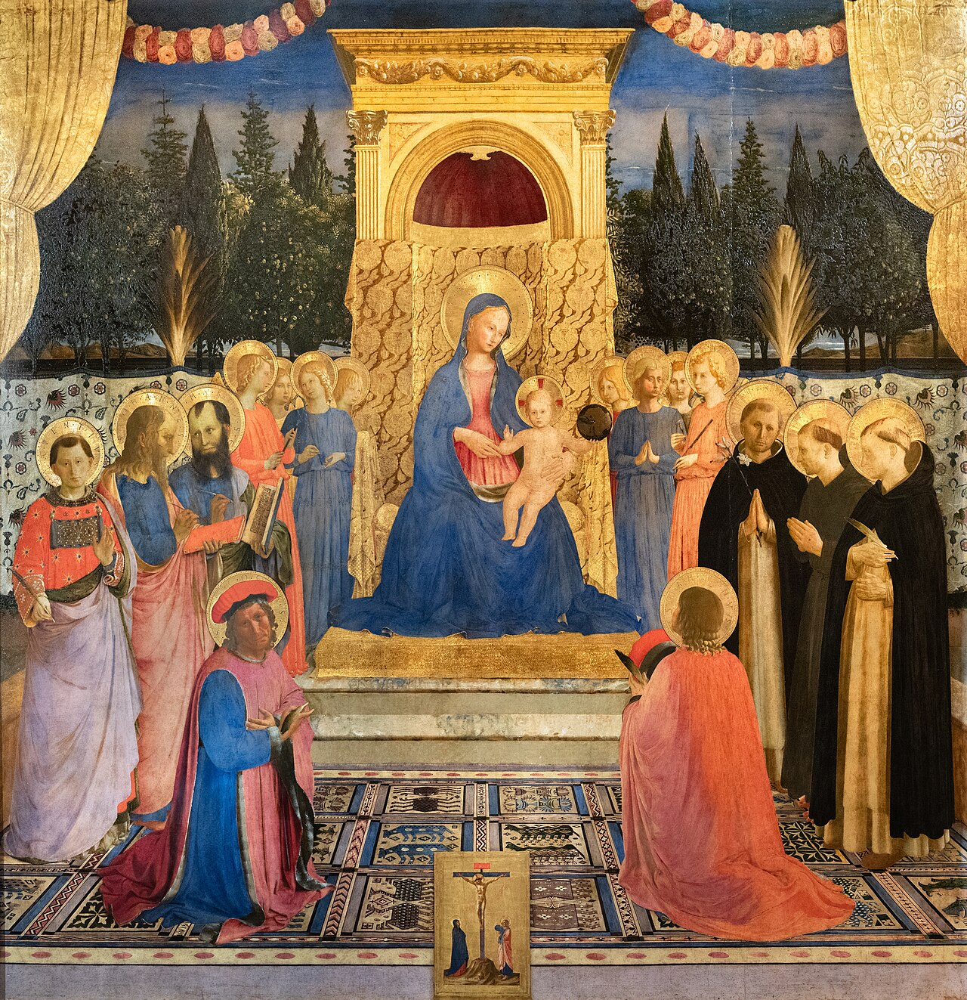

# Sessão 38 — Primeiro mandamento — veneração dos santos e da Mãe de Deus

*Fra Angelico, San Marco Altarpiece (c. 1438-1443). Public Domain via Wikimedia Commons.*

> *Maria segura o seu Filho; santos a rodeiam como uma corte que sempre a conheceu. O católico não os adora — só a Deus se adora. Mas honrar um amigo de Deus é honrar a Deus. Honre-os hoje.*

## São Pio X pergunta

**173.** O que é irreligiosidade?

*Irreligiosidade é a irreverência para com Deus e as coisas divinas, como o tentar a Deus, o sacrilégio ou profanação de pessoa ou coisa sagradas, a simonia ou compra e venda de coisas espirituais ou conexas com as espirituais.*

**174.** Se o culto das criaturas é superstição, como não é superstição o culto católico dos Anjos e dos Santos?

*O culto católico dos Anjos e dos Santos não é superstição porque não é culto divino ou de adoração devida só a Deus: não os adoramos como Deus, mas os veneramos como amigos de Deus e pelos dons que dele possuem: honramos, portanto, o próprio Deus que, nos Anjos e nos Santos, opera maravilhas.*

**175.** Quem são os Santos?

*Os Santos são aqueles que, praticando heroicamente as virtudes segundo os ensinamentos e os exemplos de Jesus Cristo, merecem especial glória no Céu e também na Terra, onde, pela autoridade da Igreja, são publicamente honrados e invocados.*

**176.** Por que veneramos também o corpo dos Santos?

*Veneramos também o corpo dos Santos porque lhes serviu no exercício das virtudes heroicas, certamente foi templo do Espírito Santo e ressurgirá glorioso na vida eterna.*

## O Catecismo Romano ensina

## V. Motivação deste Preceito e de todos os Mandamentos

[25] Na última parte deste Preceito, há dois pontos que devem ser bem explicados.

O primeiro é que pela enorme malícia dos pecados contra o Primeiro Mandamento, e pela propensão dos homens a cometê-los, vem a propósito incluir aqui a respectiva penalidade; mas esta constitui em si uma cláusula aplicável a todos os Mandamentos. Pois toda lei induz os homens, por meio de prêmios e castigos, a observarem as suas [respectivas] determinações.

Esta é a razão por que, nas Sagradas Escrituras, se encontram tantas promessas, constantemente repetidas, da parte de Deus.

Vamos deixar de lado os testemunhos quase inumeráveis do Antigo Testamento. No Evangelho, porém, está escrito: "Se quiseres entrar na vida, observa os Mandamentos".[^141] "Quem fizer a vontade do Meu Pai, que está nos céus, entrará no Reino dos céus".[^142] Ou aquela ameaça: "Toda árvore que não dá bom fruto, será cortada e lançada ao fogo".[^143] Mais esta: "Quem se enraivecer contra seu irmão, merece ser condenado pelo Juízo".[^144] E noutro lugar: "Se não perdoardes aos homens, vosso Pai também não vos perdoará os vossos pecados".[^145]

### 2. Motivos para cristãos fervorosos

[26] O segundo ponto é que, para homens carnais, a explicação desta cláusula deve ser muito diversa da que se faz a homens avançados na perfeição cristã.

Aos perfeitos, que "são guiados pelo Espírito de Deus"[^146], e Lhe obedecem com alegria e prontidão, esta cláusula será, por assim dizer, uma verdadeira boa nova e uma grande demonstração da divina complacência para com eles.

Reconhecem nisso uma solicitude de seu Pai amantíssimo, que quase impele os homens, ora com prêmios, ora com castigos, a prestarem-lhe culto e veneração. Reconhecem Sua imensa bondade para com eles, que os quer dirigir, e valer-Se de sua colaboração para a glória do Nome Divino. E não só reconhecem, mas até esperam firmemente d'Aquele que manda o que quer, as forças necessárias para cumprirem os Seus Mandamentos.

### 3. Motivos para homens carnais

Mas, quanto aos homens carnais, ainda não emancipados do "espírito de servidão"[^147], que se abstêm de pecar, mais por medo dos castigos, do que por amor da virtude: eles, sim, acham duro e amargo o sentido desta cláusula. Por isso mesmo, é preciso animá-los com bondosas exortações, e guiá-los, quase pela mão, aos verdadeiros sentimentos que a Lei quer neles despertar.

São estas mesmas normas que o pároco deve levar em conta, todas as vezes que se lhe oferecer a oportunidade de explicar qualquer Mandamento.

### 4. Motivos para todos os fiéis: dois acicates

[27] No entanto, quer aos carnais, quer aos espirituais, é preciso aplicar os dois acicates, de que faz menção a própria cláusula. Prestam-se, sobremaneira, para instigar os homens à observância da Lei.

Pois Deus diz de Si mesmo que Ele é o "Forte". Ora, este atributo requer uma explicação mais minuciosa, justamente porque muitas vezes o coração humano pouco se abala com as ameaças divinas, e procura vários subterfúgios, pelos quais possa escapar à cólera de Deus, e livrar-se das penas que lhe são cominadas.

Quem nutre, porém, a firme convicção de que Deus é o Forte, aplicar-se-á a si mesmo aquelas palavras do poderoso David: "Para onde posso eu desviar-me do Vosso Espírito? E para onde fugir de Vossa presença?"[^148]

Outras vezes, quando o coração humano desconfia das promessas divinas, as forças do inimigo parecem-lhe tão avantajadas, que ele se julga absolutamente incapaz de oferecer resistência.

Havendo, pelo contrário, uma fé firme e constante, que não vacila diante de nenhum obstáculo, porquanto se estriba na força e poder de Deus, o homem reanima-se e toma novas forças, a ponto de exclamar: "O Senhor é a minha luz e a minha salvação. A quem poderei eu temer?"[^149]

#### b) O segundo acicate

[28] O segundo acicate é o zelo próprio de Deus. Os homens cuidam, muitas vezes, que Deus não se ocupa das coisas humanas[^150], nem sequer para ver se cumprimos ou desprezamos a Sua Lei. De tal opinião se derivam graves desmandos na vida do homem. Todavia, se crermos que Deus é zeloso de Seus direitos, essa lembrança fàcilmente nos conterá no cumprimento de nossas obrigações.

[29] O zelo atribuído a Deus não envolve nenhuma perturbação de espírito, mas consiste antes no amor e carinho, pelo qual Deus não permite à alma quebrar, impunemente, a fidelidade para com Ele. Pois Deus deita a perder todos os que Lhe forem infiéis.[^151]

Assim, o zelo de Deus consiste naquela sereníssima e puríssima justiça, pela qual é repudiada como adúltera, e excluída das núpcias com Deus, a alma que se deixou corromper por falsas doutrinas e por paixões desordenadas.

Muito embora, nós sentimos esse zelo de Deus como sendo extrema brandura e suavidade, porque nesse próprio zelo se manifesta o Seu imenso e inaudito amor para conosco.

Com efeito, entre os homens não se conhece amor mais ardente, nem união mais forte e mais estreita, do que entre as pessoas unidas pelos laços do Matrimônio. Deus mostra, pois, Seu grande amor para conosco, quando frequentemente Se compara a Si mesmo a um noivo ou esposo, e como tal Se declara ciumento.

Aqui faça o pároco uma aplicação. Os homens devem esmerar-se de tal maneira pelo culto e a glória de Deus, que se possa com razão ver nisso um amor desdobrado pelo zelo[^152], à imitação daquele que disse de si mesmo: "Eu Me consumo de zelo pelo Senhor Deus dos exércitos".[^153] Sim, façam por imitar o próprio Cristo, que proferiu estas palavras: "Devora-Me o zelo pela Vossa Casa".[^154]

#### c) O sentido das ameaças divinas

[30] É preciso também expor o sentido da ameaça. Deus não deixará impunes os pecadores, mas há de corrigi-los como Pai, ou então há de puni-los rigorosamente, como Juiz, sem nenhuma contemplação.

Moisés declarou a mesma verdade, quando dizia noutro lugar: "E deverás saber que o Senhor teu Deus é um Deus forte e fiel; guarda Sua aliança e misericórdia aos que O amam e observam os Seus preceitos, até mil gerações; mas castiga sem demora os que O aborrecem".[^155]

Josué também disse: "Vós não sereis capazes de servir ao Senhor. É um Deus forte e cioso, e não perdoará os vossos crimes e pecados. Se abandonardes o Senhor, e servirdes a deuses estranhos, Ele voltar-Se-á contra Vós, para vos abater e esmagar".[^156]

#### A culpa dos antepassados

[31] Como o povo deve ficar sabendo, a ameaça do castigo aos ímpios e criminosos, até a terceira e quarta geração, não quer dizer que todos os descendentes paguem indistintamente pelas culpas de seus antepassados; mas que nem toda a posteridade poderá evitar a cólera e vingança de Deus, embora os próprios culpados e seus filhos tenham ficado sem nenhuma punição.[^157]

Foi o que aconteceu com o rei Josias.[^158] Graças à sua exímia piedade, foi poupado por Deus, que o fez morrer em paz e repousar no túmulo de seus antepassados, para que não visse as desgraças que haviam de irromper sobre Judá e Jerusalém, por causa da impiedade de seu avô Manassés.[^159] No entanto, logo que ele morreu, a vingança de Deus caiu sobre os seus descendentes, mas de tal maneira, que nem os próprios filhos de Josias foram poupados.[^160]

#### ... é nossa responsabilidade

[32] De que modo, porém, se conciliam estas palavras da Lei com a afirmação do Profeta: "A alma que pecar, ela mesma morrerá"?[^161] Mostra-o, claramente, a autoridade de São Gregório, que se põe de acordo com todos os outros Padres antigos.

Ele diz assim: "Quem imita a ruindade de seu pai, que é mau, envolve-se também em seu pecado. Mas quem não imita a ruindade de seu pai, de modo algum responde pelo delito que o pai tenha perpetrado. Daí resulta, como consequência, que o mau filho de um pai perverso deve sofrer não só pelos pecados que ele mesmo cometeu, mas também pelos pecados de seu pai. Pois, sabendo que os pecados de seu pai provocaram a indignação de Deus, não se intimidou de acrescentar-lhes ainda a sua própria maldade. Se alguém, à vista do juiz inexorável, não teme prosseguir nos caminhos de seu pai perverso, é de justiça que, ainda nesta vida, seja forçado a expiar também as culpas de seu pai transviado".[^162]

A seguir, o pároco fará ver quanto a bondade e misericórdia de Deus vai além de Sua justiça.[^163] Pois Deus estende Sua cólera até a terceira e quarta geração, mas usa de Sua misericórdia com milhares de gerações.[^164]

#### e) O amor como motivo para observar os Mandamentos

[33] Nas palavras supracitadas: "aqueles que Me aborrecem" — patenteia-se a gravidade do pecado. Com efeito, haverá sentimento mais vergonhoso e detestável, do que o ter ódio à suma Bondade, à suma Verdade?

Entretanto, tal acusação recai sobre todos os pecadores. Se "quem tem os Mandamentos" de Deus "e os observa"[^165], tem amor a Deus: de quem despreza a Lei do Senhor, e não observa os Seus Preceitos, podemos dizer, com toda a razão, que tal pessoa odeia a Deus.

[34] A frase final: "e aos que Me amam" — ensina-nos de que modo e por qual razão deve a Lei ser observada. Quem, pois, observa a Lei de Deus, deve ter, como motivo de sua observância, os mesmos sentimentos de amor e caridade que nutre para com Deus.

Doravante, esta verdade será lembrada em cada um dos Mandamentos.

[^61]: Exod 20, 2. Esta citação só ocorre nas edições de Lecoffre, Benedetti, Gatterer, Marbeau, Marinho, Costa e Cruz. As edições estereótipas de Tauchnitz e Manz não o trazem neste lugar.
[^62]: Ps 94, 7.
[^63]: Ps 118, 97 ss.
[^64]: Col 1, 13.
[^65]: Jer 16, 14 ss.
[^66]: Jo 11, 52.
[^67]: Rom 6, 18.
[^68]: Lc 1, 74 ss.
[^69]: Rom 6, 2.
[^70]: 2 Cor 5, 15; cfr. Rom 7, 4.
[^71]: Apoc 5, 9.
[^72]: Hb 6, 6; cfr. Gn 39, 9.
[^73]: Cfr. Gal 4, 31.
[^74]: Rom 6, 19. Logicamente, estes dois parágrafos pertencem ainda ao capítulo I, que versa sobre as questões preliminares do Decálogo.
[^75]: Exod 20, 3.
[^76]: Seria lógico intercalar, antes do presente parágrafo, o 3º parágrafo do capítulo V, onde se fala das duas Tábuas da Lei.
[^77]: Jo 1, 4 ss.; Rom 5, 5.
[^78]: Exod 10, 2; 31, 13; Levit 11, 45; 21, 15; Is 45, 3; 49, 23; 60, 16; 61, 8; Ezech 5, 13; Os 2, 20, et passim.
[^79]: 3 Reg 18, 21.
[^80]: 3 Reg 17, 29.
[^81]: Deut 18, 10; Is 2, 6; Jer 27, 9.
[^82]: Aqui seria o lugar de se falar de um ponto omisso pelo CRO: do culto e devoção às almas do Purgatório.
[^83]: Diz o CIC, cânon 1276: "É bom e útil invocar fervorosamente os Servos de Deus, que reinam com Cristo, e venerar suas imagens e relíquias. De preferência aos demais, devem todos os fiéis consagrar uma filial devoção à Bem-aventurada Virgem Maria".
[^84]: Gn 18, 2; 19, 1; Num 22, 31; Jos 5, 14.
[^85]: Com referência às criaturas, "adorare" tem o sentido de prostrar-se ou ajoelhar-se, em sinal de reverência.
[^86]: Apoc 19, 10; 22, 9.
[^87]: 1 Tim 1, 17.
[^88]: Exod 20, 12; Deut 5, 16; Levit 19, 32 etc.
[^89]: 1 Reg 24, 9; 25, 23; 2 Reg 9, 6-8; 1 Paral 21, 21.
[^90]: Prov 8, 15.
[^91]: Hb 1, 4.
[^92]: Dan 10, 13.
[^93]: Tob 3, 25.
[^94]: Mt 18, 10.
[^95]: Gn 32, 26.
[^96]: Gn 48, 16. Refere-se à bênção de Jacob aos filhos de José.
[^97]: Convocado em Setembro de 787, contra os iconoclastas. É o VII Concílio Ecumênico.
[^98]: Foi por volta de 330. Gangres, hoje Chagreh, fica na Paflagônia (Ásia Menor).
[^99]: Veja-se Damasc. De orthodoxa fide 4 0.
[^100]: Eccli 44-50; Hb cap. 11.
[^101]: Apoc 5, 8; DU 984.
[^102]: Lc 15, 7.
[^103]: Aug. Quaest. 140 super Exod. (segundo outros Quaest. 149).
[^104]: Gn 20, 17; Job 42, 8.
[^105]: Por isso a Igreja condenou a opinião de que pessoas justas não precisavam dirigir atos de amor à Virgem Maria e aos Santos (Papa Inocêncio XI, em 1687. DU 1255).
[^106]: Mt 8, 10.
[^107]: Lc 7, 3.
[^108]: 1 Tim 2, 5.
[^109]: Rom 5, 10; 2 Cor 5, 18; Hb 9, 12; Apoc 5, 9.
[^110]: Hb 9, 11-12.
[^111]: Hb 7, 25.
[^112]: Rom 15, 30; 2 Cor 1, 11.
[^113]: A Igreja condenou a proposição: "Nenhuma criatura, nem a Virgem Bem-aventurada, nem os Santos devem ocupar lugar em nosso coração; pois Deus quer ocupá-lo e possuí-lo sòzinho" (Papa Inocêncio XI em 1687; cfr. DU 1256).
[^114]: Ambros. epist. 85; Aug. De Civit. Dei XXII 8; epist. 137 et 147.
[^116]: 4 Reg 13, 21.
[^117]: Exod 20, 4-5.
[^118]: Exod 20, 17.
[^119]: Aug. In Exod. q. 71.
[^120]: Veja-se a continuação do texto bíblico: "Eu sou o Senhor teu Deus, o Deus forte e zeloso que vinga, etc...".
[^121]: Num 21, 9; 3 Reg 6, 23-24; 2 Paralip cap. 3.
[^122]: Esse perigo cessou com a lei perfeita do Cristianismo.
[^123]: Sap cap. 13-15; Ps 113, 4-8; Is 43, 6-20; 46, 1 ss.; Ezech 4, 1 ss.; 8, 1 ss.; 23, 1 ss.
[^124]: Isto não exclui representações simbólicas e alegorias, buscadas nos ditos da própria Bíblia. Cfr. o § 20 deste mesmo capítulo.
[^125]: Jo. Damascenus De orthodoxa fide 4 16.
[^126]: O VII Concílio Ecumênico, convocado em 787 contra os iconoclastas. Cfr. DU 302-304.
[^127]: Rom 1, 23.
[^128]: Exod 32, 8.
[^129]: Ps 105, 20. O ponto de alusão é que Deus era a verdadeira glória e grandeza dos Israelitas.
[^130]: Is 48, 18.
[^131]: O II Concílio de Nicéia em 787.
[^132]: Deut 4, 15.
[^133]: Gn 18, 2; Exod 33, 22; Mt 3, 16; Apoc 14, 1 ss. Cfr. a condenação dos respectivos erros jansenistas por Alexandre VIII em 1690, e por Pio VI em 1794. Cfr. DU 1315 1569.
[^134]: Dan 7, 9-10.
[^135]: Hb 1, 14.
[^136]: Mt 3, 13; Mc 1, 10; Lc 3, 22; Jo 1, 32; Act 2, 3.
[^137]: "As sagradas relíquias e imagens devemos também prestar culto e veneração, que se aplica à pessoa, com a qual estão em relação" (CIC can. 255 § 2).
[^138]: Conc. Trid. XXV de invocat. Sanctorum. DU <!-- OCR-illegible -->.
[^139]: É jansenismo rejeitar, por princípio, o culto de "imagens milagrosas". Veja-se a condenação de Pio VI em 1794: DU 1570.
[^140]: Exod 20, 5-6.
[^141]: Mt 19, 17.
[^142]: Mt 6, 15. <!-- OCR-illegible: nota original parece dar referência diferente -->
[^143]: Mt 3, 10.
[^144]: Mt 5, 22.
[^145]: Mt 6, 15.
[^146]: Rom 8, 14.
[^147]: Rom 8, 15.
[^148]: Ps 138, 7.
[^149]: Ps 26, 1.
[^150]: Iob 22, 13-14.
[^151]: Ps 72, 27.
[^152]: Ao pé da letra: ... para que com razão se possam dizer pessoas que zelam, mais do que amam.
[^153]: 3 Reg 19, 14.
[^154]: Jo 2, 17; cfr. Ps 68, 10.
[^155]: Deut 7, 9.
[^156]: Jos 24, 19 ss.
[^157]: Trata-se de penas temporais, de certo modo medicinais.
[^158]: 2 Paralip cap. 33, 1 ss.
[^159]: 4 Reg 21, 11; Jer 15, 4.
[^160]: 2 Paralip 34, 28; 4 Reg 22, 19 ss.; 23, 26.
[^161]: Ezech 18, 4.
[^162]: Greg. Magn. Moral. 25 23 (segundo outros 15 21).
[^163]: Jac 2, 13.
[^164]: Exod 20, 5-6. Convém acentuar que aqui se trata de punições temporais, já neste mundo. Nesta ordem de ideias, surde também um problema de grande palpitância: a prosperidade dos ímpios e descrentes e o sofrimento dos bons e virtuosos. Assunto merece tratado pelos pregadores e catequistas.
[^165]: Jo 14, 21.

> **Escritura.** *Porque desde agora todas as gerações me chamarão bem-aventurada.* — Lucas 1, 48

> *Mãe de Deus, rogai por mim. Santos cujos nomes ignoro, rogai também por mim. Levai-me ao vosso Senhor.*
