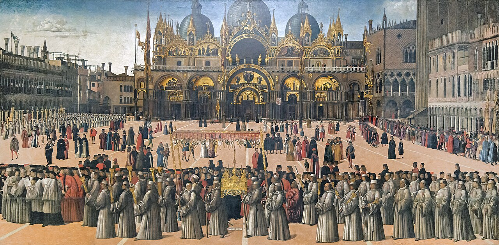

# Sessão 39 — Primeiro mandamento — imagens sagradas e relíquias

*Gentile Bellini, Procession in Saint Mark's Square (1496). Public Domain via Wikimedia Commons.*

> *Um ícone da Vera Cruz levado em procissão. A madeira, a relíquia, a imagem — nada disso é Deus. Mas Deus opera por meio delas. A reverência não é idolatria; é a resposta justa a um sinal que é mais do que um sinal.*

## São Pio X pergunta

**177.** Por que veneramos inclusive as mínimas relíquias e as imagens dos Santos?

*Veneramos inclusive as mínimas relíquias e as imagens dos Santos por sua memória e honra, referindo a eles toda veneração, completamente diferente dos idólatras, que rendem às imagens ou ídolos um culto divino.*

**178.** Deus, no Velho Testamento, não proibiu severamente as imagens?

*Deus, no Velho Testamento, proibiu severamente as imagens para adoração, de fato quase todas as imagens, como ocasião próxima de idolatria para os Judeus, que viviam entre os idólatras e eram muito inclinados à superstição.*

> **Escritura.** *De sorte que até os lenços e aventais que tinham tocado o seu corpo eram levados aos enfermos, e as enfermidades os deixavam, e os espíritos maus saíam deles.* — Atos 19, 12

> *Senhor, Vós santificais a matéria. Hoje, deixai-me ver a Vossa obra nas coisas — sem desprezá-las e sem adorá-las.*
