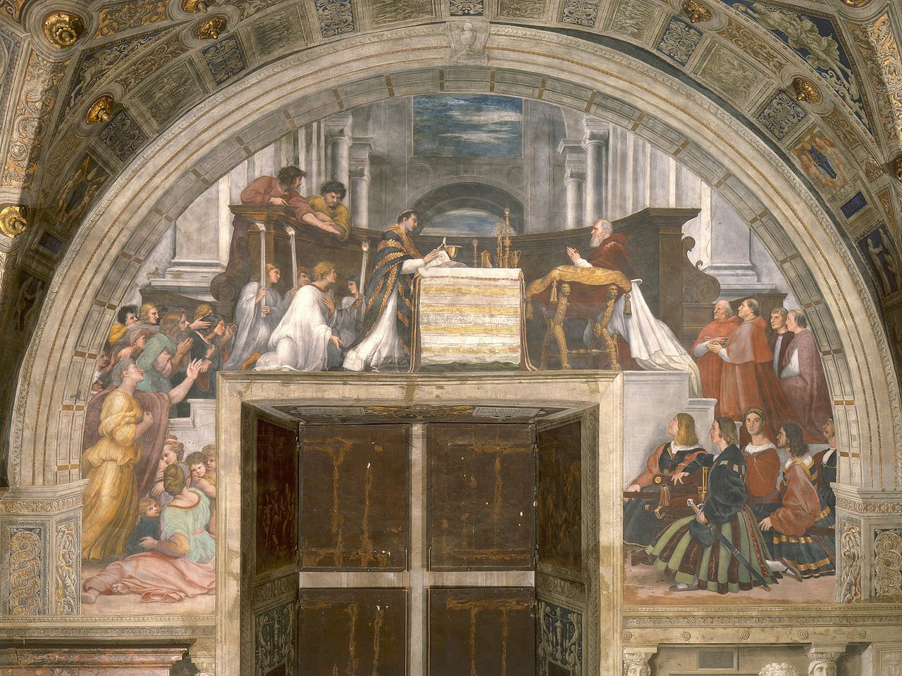

# Sessão 42 — Terceiro mandamento — santificar o dia do Senhor

*Raphael, The Mass at Bolsena (1512). Public Domain via Wikimedia Commons.*

> *O sacerdote eleva a hóstia; o mundo para. O domingo não é um dia que sobra — é o dia ao redor do qual os outros se ordenam. A Missa é a gravidade da semana. Sem ela, o resto se desloca.*

## São Pio X pergunta

**184.** O que nos ordena o Terceiro Mandamento "recorde-te de santificar as festas"?

*O Terceiro Mandamento "recorde-te de santificar as festas" nos ordena honrar a Deus nos dias de festa com atos externos de culto, dentre os quais para os cristãos o essencial é a Santa Missa.*

**185.** Por que devemos fazer atos externos de culto? Não basta adorar a Deus, que é Espírito, internamente no coração?

*Não basta adorar a Deus internamente no coração, mas devemos também render-Lhe o culto externo mandado porque estamos sujeitos a Deus em todo o ser, alma e corpo, e devemos dar bom exemplo; e também porque de outra forma se perde o espírito religioso.*

**186.** O que nos proíbe o Terceiro Mandamento?

*O Terceiro Mandamento nos proíbe, nos dias de festa, as obras servis.*

## São Tomás ensina

Este é o Terceiro Mandamento da lei, e com toda propriedade está colocado neste lugar. Pois primeiro nos é ordenado adorar a Deus em nossos corações, e o Mandamento é adorar a um só Deus: «Não terás outros deuses diante de Mim». No Segundo Mandamento se nos manda reverenciar a Deus pela palavra: «Não tomarás o nome do Senhor teu Deus em vão». O Terceiro nos manda reverenciar a Deus pela ação. É: «Lembra-te de santificar o dia de sábado».[^1] Quis Deus que se separasse um certo dia, em que os homens dirigissem suas mentes ao serviço do Senhor.

> **Escritura.** *Lembra-te de santificar o dia de sábado.* — Êxodo 20, 8

> *Senhor, neste domingo, recolhei-me. Tirai-me da semana. Dai-me de volta a Missa como centro.*

---

#### Aprofundamento — *Catecismo de Trento*

> "Lembra-te de santificar o dia do sábado. Seis dias trabalharás, e farás todos os teus serviços. No sétimo dia, porém, é o Sábado do Senhor teu Deus. Nesse dia, não farás nenhuma obra, nem tu, nem teu filho, nem tua filha, nem teu servo, nem tua serva, nem teu animal de carga, nem o forasteiro que se achar dentro de tuas portas. Pois em seis dias fez o Senhor o céu e a terra, o mar, e tudo que neles se encerra, e no sétimo dia descansou. Por isso, o Senhor abençoou o dia de sábado, e o fez santo".[^222]
