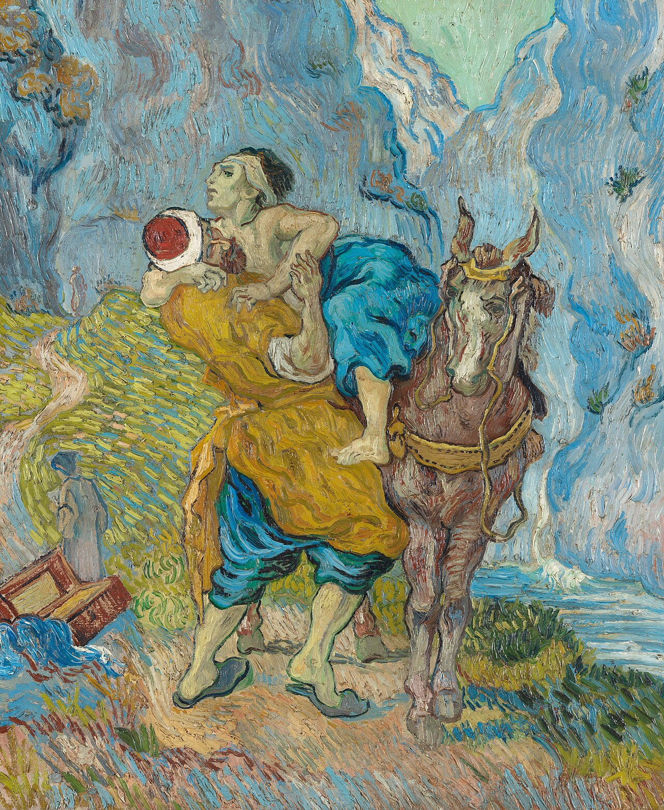

# Sessão 45 — Quinto mandamento — reverência pela vida

*Vincent van Gogh, The Good Samaritan (after Delacroix) (1890). Public Domain via Wikimedia Commons.*

> *O samaritano ajoelha-se ao lado de um homem dado por morto. Não há cálculo nas suas mãos. A vida — a sua, a dos outros, a que ainda está no ventre, a que ainda está no moribundo — pertence a Deus. Defenda-a.*

## São Pio X pergunta

**193.** O que nos proíbe o Quinto Mandamento "não matar"?

*O Quinto Mandamento "não matar" nos proíbe causar dano à vida seja natural ou espiritual do próximo e nossa; proíbe-nos, portanto, o homicídio, o suicídio, o duelo, os ferimentos, os golpes, as injúrias, as imprecações e o escândalo.*

**194.** Por que o suicídio é pecado?

*O suicídio é pecado, como o homicídio, porque só Deus é dono de nossa vida, como da de nosso próximo: além do mais é pecado de desespero que, mais ainda, com a vida, tira a possibilidade de arrepender-se e salvar-se.*

## São Tomás ensina

## O pecado de matar

Na lei divina, que nos diz que devemos amar a Deus e ao próximo, manda-se que não somente façamos o bem, mas também evitemos o mal. O maior mal que se pode fazer ao próximo é tirar-lhe a vida. Isto está proibido no Mandamento: «Não matarás».[^1]

Matar animais é lícito. — A respeito deste Mandamento existem três erros. Alguns disseram que não é lícito matar nem mesmo os animais irracionais. Mas isto é falso, pois não é pecado usar daquilo que está subordinado ao poder do homem. Está na ordem natural que as plantas sirvam de alimento aos animais, certos animais alimentem outros, e tudo para alimento do homem: «Até as ervas verdes vos entreguei a todos».[^2] O Filósofo diz que a caça é como uma guerra justa.[^3] E São Paulo diz: «Comei de tudo o que se vende no açougue, sem nada perguntardes por causa da consciência».[^4] Portanto, o sentido do Mandamento é: «Não matarás homens».

A execução de criminosos. — Outros sustentaram que matar o homem é totalmente proibido. Crêem que os juízes nos tribunais civis são homicidas, ao condenarem os homens à morte segundo as leis. Contra isto, diz Santo Agostinho que Deus, por este Mandamento, não tira a Si mesmo o direito de matar. Assim lemos: «Eu darei a morte e Eu farei viver».[^5] É, pois, lícito ao juiz matar segundo um mandato de Deus, pois nisto opera Deus, e toda lei é um mandamento de Deus: «Por Mim reinam os reis, e os legisladores decretam coisas justas».[^6] E ainda: «Se fizeres o mal, teme; pois não é em vão que ela traz a espada. Pois é ministro de Deus».[^7] Também a Moisés foi dito: «Aos feiticeiros não deixarás viver».[^8] E assim, aquilo que é lícito a Deus é lícito a Seus ministros, quando agem por Seu mandato. É evidente que Deus, que é Autor das leis, tem todo o direito de infligir a morte por causa do pecado. Pois «o salário do pecado é a morte».[^9] Nem peca o Seu ministro ao infligir esse castigo. O sentido, portanto, de «Não matarás» é que ninguém matará por sua própria autoridade.[^10]

O suicídio é proibido. — Houve aqueles que sustentaram que, embora este Mandamento proíba matar a outro, é lícito, contudo, matar-se a si mesmo. Há os exemplos de Sansão (Jz 16) e de Catão e de certas virgens que se atiraram às chamas, como narra Santo Agostinho em *A Cidade de Deus*.[^11] Mas ele também explica isto nestas palavras: «Quem se mata a si mesmo, certamente mata um homem».[^12] Se não é lícito matar senão pela autoridade de Deus, então não é lícito matar-se a si mesmo, salvo pela autoridade de Deus ou instruído pelo Espírito Santo, como foi o caso de Sansão. Portanto, «não matarás».[^13]

Outras acepções de «matar». — Deve-se saber que se pode matar a um homem de várias maneiras. Primeiro, pela própria mão: «Vossas mãos estão cheias de sangue».[^14] Isto não somente é contra a caridade, que nos diz amar o próximo como a nós mesmos: «Nenhum homicida tem a vida eterna permanecendo nele».[^15] É também contra a natureza, pois «todo animal ama o seu semelhante».[^16] E assim se diz: «Aquele que ferir um homem com a vontade de matá-lo, será morto».[^17] Aquele que faz isto é mais cruel do que o lobo, do qual diz Aristóteles que um lobo não come da carne de outro lobo.[^18]

Em segundo lugar, mata-se a outrem com a palavra. Isto se faz dando conselho contra alguém, ou por provocação, acusação ou detração: «Os filhos dos homens, cujos dentes são armas e flechas, e a língua, espada afiada».[^19] Em terceiro lugar, prestando auxílio, como está escrito: «Filho meu, não andes com eles... pois seus pés correm para o mal, e apressam-se a derramar sangue».[^20] Em quarto lugar, pelo consentimento: «São dignos de morte não somente os que tais coisas fazem, mas também os que consentem nas que as fazem».[^21] Por último, mata-se a outrem dando consentimento parcial, quando o ato podia ser inteiramente impedido: «Livra os que são levados à morte»;[^22] ou, se podia impedi-lo e não o fez por negligência ou avareza. Por isso diz Santo Ambrósio: «Dá pão a quem morre de fome; se não o fizeres, és seu homicida».

Já tratamos do homicídio do corpo, mas alguns matam também a alma, afastando-a da vida da graça, isto é, induzindo-a a cometer pecado mortal: «Foi homicida desde o princípio»,[^23] na medida em que arrastou os homens ao pecado. Outros, porém, matam corpo e alma. Isto pode dar-se de dois modos: primeiro, pelo homicídio de uma mulher grávida, pelo qual a criança é morta tanto no corpo quanto na alma; e, em segundo lugar, pelo suicídio.

> **Escritura.** *Quem derramar o sangue do homem, o seu sangue será derramado, porque o homem foi feito à imagem de Deus.* — Gênesis 9, 6

> *Senhor, o corpo que fizestes não é descartável. Hoje, fazei-me notar uma vida e protegê-la.*

---

#### Aprofundamento — *Catecismo de Trento*

> "Não matarás".[^337]

## I. Importância do Preceito: Meio de pacificação

[1] Singular ventura está prometida aos pacíficos, "porquanto serão chamados filhos de Deus".[^338] Esta consideração deve, forçosamente, levar os pastores a explicarem aos fiéis a doutrina deste Mandamento com todo o carinho e exatidão.

Com efeito, para apaziguar os ânimos dos homens, não há melhor alvitre, do que a exata observância deste Preceito, como é de obrigação para todos, desde que receberam uma boa explicação de seus dispositivos. Só então é de esperar que os homens, congraçados na mais perfeita igualdade de sentimentos, cultivem ciosamente a paz e a concórdia.

O quanto se torna necessária uma boa explicação deste Preceito, nós o percebemos pelo fato de que, após o imenso Dilúvio universal, a primeira e a única proibição, que Deus impôs aos homens, foi esta: "O sangue de vossa vida, Eu o vingarei da mão de todos os animais, e da mão do [próprio] homem".[^339]

E também no Evangelho, quando Nosso Senhor explicara pela primeira vez as leis da Antiga Aliança, começou por este Mandamento, como está escrito em São Mateus: "Foi dito: Não matarás" — e o mais que do assunto se diz naquela mesma passagem.[^340]

Os fiéis devem, por sua vez, ouvir com atenção e prazer a explicação deste Preceito. Em sua eficácia, serve para defender a vida de quem quer que seja, porquanto as palavras "Não matarás" proíbem o homicídio de maneira categórica.

Por isso, todos os homens devem aceitá-lo com tanta alegria do coração, como se Deus, sob ameaça de Sua cólera e de outras penas gravíssimas, tivera proibido nominalmente que alguém fosse ferido. Logo, se nos é grato ouvir falar deste Preceito, grata nos deve ser também a advertência contra os pecados que ele proíbe.

## II. Cláusula proibitiva

[2] Ao explicar as obrigações deste Preceito, mostrou Nosso Senhor que nele se continham duas modalidades. A primeira, o que nos é proibido: Não matar. A segunda, o que nos é ordenado: Tratar os inimigos com cordial amizade, ter paz com todos os homens, levar com paciência todos os sofrimentos.

### 1. Não é proibido:

#### a) matar animais

[3] Quanto à proibição de matar, devemos primeiro explicar quais espécies de morte não são proibidas por este Mandamento. Não é, pois, proibido matar os animais. Se Deus permitiu aos homens que se alimentassem deles, também permitiu que os matassem.

Sobre este particular, diz Santo Agostinho: "Quando ouvimos dizer: 'Não matarás', não entendemos que isto se refira às plantas, porque elas não têm nenhuma sensação; nem aos brutos irracionais, porque não se ligam a nós por nenhuma relação de sociedade".[^341]

#### b) executar criminosos

[4] Outra espécie de morte lícita é a que compete às autoridades. Foi-lhes dado o poder de condenar à morte, pelo que punem os criminosos e defendem os inocentes, de acordo com a sentença legalmente lavrada. Quando exercem seu cargo com espírito de justiça, não se tornam culpados de homicídio; pelo contrário, são fiéis executores da Lei Divina, que proíbe de matar.

Se o fim da Lei é garantir a vida e segurança dos homens, as sentenças [capitais] dos magistrados obedecem à mesma finalidade, enquanto eles são os legítimos vingadores dos crimes, reprimindo a audácia e a violência mediante a pena de morte. Por essa razão dizia David: "Desde o romper do dia, exterminava eu todos os pecadores da terra, a fim de suprimir da cidade de Deus todos os que praticam iniquidade".[^342]

#### c) matar em guerra justa

[5] Da mesma forma, não pecam aqueles que, em guerra justa, tiram a vida dos inimigos, não por cobiça ou crueldade, mas ùnicamente por amor da causa comum de seu povo.[^343]

#### d) matar por ordem divina

Aqui pertencem também as mortes que se fazem por ordem expressa de Deus. Assim é que os filhos de Levi não pecaram, quando num só dia mataram tantos milhares de homens. Feita a matança, disse-lhes Moisés: "Hoje consagrastes ao Senhor as vossas mãos".[^344]

#### e) matar por acidente

[6] Não infringe tampouco este Preceito quem mata um homem, sem querer nem refletir, por mera casualidade. Sobre tal emergência, escreve o Livro do Deuteronômio: "Quem ferir seu próximo sem querer, não se provando que tivesse ódio contra ele, nem ontem, nem anteontem; mas que indo com ele simplesmente à floresta para cortar lenha, e, no derrubar a madeira, o machado lhe escapou da mão, e o ferro, saindo do cabo, feriu e matou seu amigo...".[^345]

Como ocorrem sem nenhuma intenção ou premeditação, tais homicídios não entram, de modo algum, na categoria de pecados. Comprova-o a opinião de Santo Agostinho: "Longe de nós, diz ele, que nos atribuam como pecado a ação boa e honesta por nós praticada, que ensejou algum mal, contra a nossa intenção".[^346]

#### Corolário: Homicídio acidental, mas culposo

[7] No homicídio acidental, pode haver pecado, por dois motivos. Primeiro, quando uma pessoa mata outra, ao praticar alguma ação injusta. Por exemplo, alguém dá um soco ou pontapé numa mulher grávida, sobrevindo por isso o aborto. Tal acontece, é verdade, contra a intenção do agressor, mas este não deixa de ter sua culpa, porque de modo algum lhe seria lícito agredir uma mulher grávida.[^347]

Segundo, quando alguém mata outro, por descuido e negligência, por não ter tomado todas as precauções necessárias.

#### f) matar em defesa própria

[8] Pela razão alegada, é de toda evidência que não transgride este Preceito, quem mata outra pessoa, em defesa de sua própria vida, se tiver usado todas as precauções necessárias.[^348]

Estas espécies de homicídios, que acabamos de enumerar, não estão incluídas na proibição deste Mandamento. Com exceção delas, todas as mais são proibidas, quer se tenha em vista o assassino, quer a vítima, quer a maneira de matar.

### 2. É proibido matar:

#### a) quanto ao autor

[9] Quanto ao autor de um homicídio, não se faz exceção de ninguém, nem de ricos, nem de poderosos, nem de patrões, nem de pais. A todos é proibido matar, sem nenhuma seleção ou distinção de pessoa.[^349]

#### b) quanto à vítima

[10] Quanto à vítima de um homicídio, este Preceito abrange todos os homens. Não há pessoa, por mais humilde e desprezível, que não seja protegida pela força deste Preceito.

A ninguém, tampouco, é permitido suicidar-se, porque ninguém dispõe assim de sua vida, que possa a seu talante procurar a morte de própria mão.[^350] Por isso, o Preceito não tem por teor as palavras: "Não mates a outrem", mas diz simplesmente: "Não mates".

#### c) quanto ao modo

[11] Se atentarmos, porém, os vários modos de praticar homicídio, vemos que não há exceção para ninguém. Não só se proíbe tirar a vida do próximo, com as mãos, com ferro, pedra, cacete, corda, veneno; mas é também absolutamente ilícito dar ocasião a um homicídio, por meio de conselho, dinheiro, cooperação pessoal, ou de qualquer maneira que seja.

Inqualificável era, neste ponto, a obtusão moral dos judeus, que julgavam respeitar este Mandamento, contanto que se abstivessem de matar com suas próprias mãos.[^351]

O cristão, porém, pela doutrina de Cristo conhece o sentido espiritual da Lei, que de nós exige não só mãos puras, mas também um coração casto e ilibado.[^352] Ele não pode, de modo algum, contentar-se com o que os judeus julgavam cumprir com bastante perfeição.

### 3. É proibido irar-se

Pois a ninguém é lícito nem sequer irar-se contra o próximo, como ensina o Evangelho, porquanto Nosso Senhor declarou: "Eu, porém, vos digo: Todo aquele que se enraivecer contra seu irmão, será réu perante o juízo. Quem chamar seu irmão de 'raca', será réu diante do conselho. Quem chamar seu irmão de 'louco', será réu do fogo do inferno".[^353]

#### a) sem razão

[12] Dessas palavras se deduz, com evidência, que não está livre de pecado quem se zanga com seu irmão, ainda que reprima a cólera dentro de si mesmo. Todavia, muito mais grave é a falta de quem não receia tratar duramente seu irmão e dirigir-lhe palavras injuriosas.[^354]

Este pecado, porém, só se verifica, quando não há o que possa justificar nossa indignação. Perante Deus e Suas Leis[^355], temos razão de alterar-nos, todas as vezes que corrigimos nossos subordinados, por causa de suas faltas.

#### b) por motivos carnais

A cólera do cristão não deve proceder dos sentidos carnais, mas da ação do Espírito Santo, já que nos compete a dignidade de "templos do Espírito Santo"[^356], nos quais habita Jesus Cristo.[^357]

### 4. Remédios. Contra "estes pecados"

#### a) Em virtude da palavra de Cristo

[13] Nosso Senhor nos deu ainda muitos outros ensinamentos, que se referem à perfeita observância deste Preceito. Dessa natureza é a passagem seguinte: "Não arrostes a quem é mau. Antes, se alguém te bater na face direita, apresenta-lhe também a outra. E a quem quiser pleitear contigo em juízo, e tirar-te a túnica, larga-lhe também a tua capa. Se alguém te forçar a correr uma milha, vai com ele duas milhas".[^358]

Da citação feita, podemos inferir quanto os homens propendem aos pecados que se proíbem neste Mandamento, e como são numerosos os que cometem o crime de homicídio, senão de fato, ao menos pelo desejo do coração.

[14] Ora, como a Sagrada Escritura oferece remédios para essa doença tão perigosa, é dever do pároco ensiná-los aos fiéis com toda a exatidão.

#### b) Reconhecer a atrocidade do homicídio

O principal é que se reconheça quão profundamente Deus aborrece o homicídio. Isto se pode ver em muitos e graves testemunhos da Sagrada Escritura.[^359] Segundo os sagrados textos, Deus aborrece a tal ponto o homicídio, que promete castigar até os animais pela morte dos homens, e manda matar o animal que tenha ferido algum homem.[^360] Quando exigiu do homem tivesse horror em alimentar-se de sangue[^361], não era por outro motivo, senão para que aquele arredasse, a todo o transe, as mãos e o coração do abominável crime do homicídio.

#### c) como crime de lesa-humanidade

[15] São os homicidas os mais encarniçados inimigos do gênero humano, diremos até de toda a natureza. Fazem quanto podem para destruir toda a obra de Deus, matando um homem, por cujo amor Deus declarou ter criado tudo o que existe.[^362]

Ainda mais. Como no Gênesis é proibido matar um homem, porque Deus o criou à Sua imagem e semelhança[^363], grave ofensa faz a Deus, e parece quase que Lhe põe mãos violentas quem tira do mundo uma Sua imagem.

Isto é que David considerava por divina inspiração, quando se queixou amargamente dos sanguinários, e proferiu aquelas palavras: "Seus pés são velozes para derramarem sangue".[^364] Não diz simplesmente "matar", mas "derramar" sangue. Tais palavras falou, para salientar a enormidade do nefando crime e a bárbara crueza dos que matam. E disse "seus pés são velozes", para mostrar, antes de tudo, como eles, impelidos pelo demônio, se precipitam a cometer tal crime.
