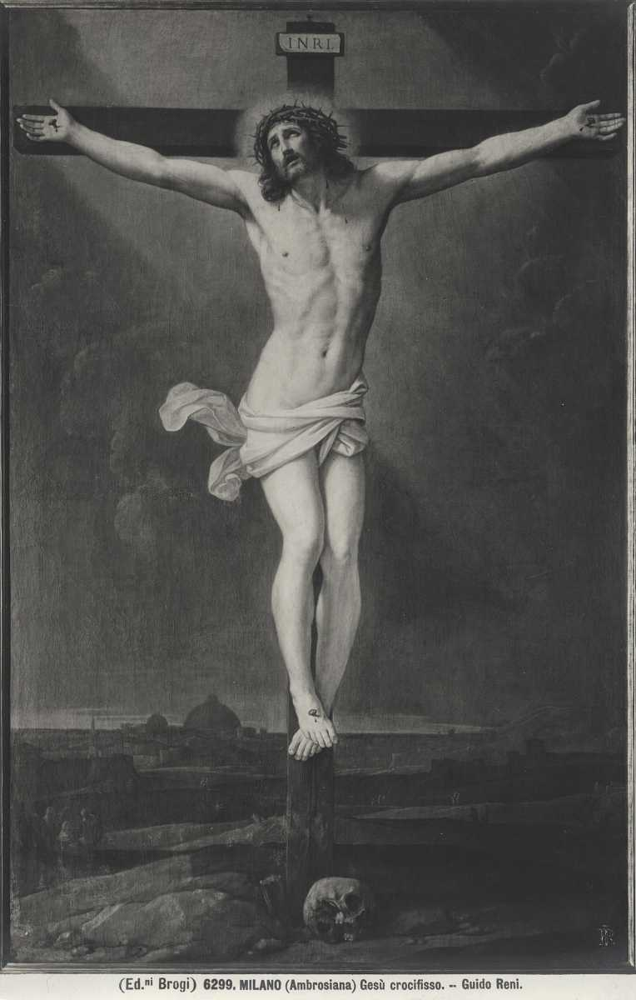

# Sessão 47 — Quinto mandamento — escândalo e amor aos inimigos

*Guido Reni, Christ Crucified (c. 1636). Public Domain via Wikimedia Commons.*

> *Da cruz, Ele ora pelos que O estão matando. Perdoe — e recuse-se a ser a causa da queda de outro. Duas metades do mesmo mandamento. Ambas parecem impossíveis. Ambas são mandadas.*

## São Pio X pergunta

**198.** O que é escândalo?

*Escândalo é dar ao próximo, com qualquer ato mau, ocasião de pecar.*

**199.** O escândalo é pecado grave?

*O escândalo é pecado gravíssimo, e Deus exigirá que se preste conta do mal que se faz cometer os outros com incitações perversas e maus exemplos: "ai daquele homem por quem vem o escândalo" (São Mateus XVIII, 7).*

**200.** O que nos ordena o Quinto Mandamento?

*O Quinto Mandamento nos ordena querer o bem a todos, inclusive aos inimigos, e de reparar o mal corporal e espiritual feito ao próximo.*

## São Tomás ensina

## O pecado da ira

Por que nos é proibido irar-nos. — No Evangelho de São Mateus (cap. V) Cristo ensinou que a nossa justiça deve ser maior do que a justiça da Antiga Lei. Isto significa que os cristãos devem observar os Mandamentos da lei mais perfeitamente do que os judeus os observavam. A razão é que um esforço maior merece uma melhor recompensa: «Quem semeia parcamente, parcamente também ceifará».[^24] A Antiga Lei prometia uma recompensa temporal e terrena: «Se quiserdes e Me ouvirdes, comereis dos bens da terra».[^25] Mas na Nova Lei são prometidas coisas celestes e eternas. Por isso, a justiça, que consiste na observância dos Mandamentos, deve ser mais generosa, porque se espera maior recompensa.

O Senhor mencionou em particular este Mandamento, dentre os outros, quando disse: «Ouvistes que foi dito aos antigos: Não matarás... Eu, porém, vos digo que todo aquele que se ira contra seu irmão estará em risco de juízo».[^26] Por isto se entende a pena prevista pela lei: «Se alguém matar seu próximo de propósito, e por traição, arrancá-lo-ás do Meu altar para que morra».[^27]

Modos de evitar a ira. — Ora, há cinco modos de evitar a ira. O primeiro é não se deixar mover facilmente à ira: «Seja todo homem pronto para ouvir, mas tardio para falar e tardio para a ira».[^28] A razão é que a ira é pecado, e é punida por Deus. Mas será toda ira contrária à virtude? Há duas opiniões sobre isto. Os Estoicos diziam que o sábio é livre de toda paixão; mais ainda, sustentavam que a verdadeira virtude consistia na perfeita quietude da alma. Os Peripatéticos, ao contrário, sustentavam que o sábio está sujeito à ira, mas em grau moderado. Esta é a opinião mais correta. Prova-se, em primeiro lugar, pela autoridade, pois o Evangelho mostra-nos que estas paixões foram atribuídas a Cristo, em quem havia toda a plenitude da sabedoria. Em segundo lugar, prova-se pela razão. Se todas as paixões fossem opostas à virtude, então haveria certas potências da alma sem qualquer fim útil; mais ainda, seriam positivamente nocivas ao homem, pois não teriam atos conformes a si próprias. Assim, as potências irascível e concupiscível estariam dadas ao homem sem nenhum fim. Deve-se, portanto, concluir que por vezes a ira é virtuosa, e outras vezes não.

Três considerações sobre a ira. — Vemos isto considerando a ira de três modos diferentes. Primeiro, conforme existe somente no juízo da razão, sem perturbação alguma da alma; e isto, mais propriamente, não é ira, mas juízo. Assim, do Senhor que pune os ímpios se diz que está irado: «Suportarei a ira do Senhor, porque pequei contra Ele».[^29]

Em segundo lugar, considera-se a ira como paixão. Esta está no apetite sensitivo, e é dúplice. Por vezes é ordenada pela razão ou contida nos seus devidos limites pela razão, como quando alguém se ira porque é justo irar-se, e dentro dos devidos limites. Este é ato de virtude e chama-se ira justa. Por isso o Filósofo diz que a mansidão de modo algum se opõe à ira. Esta espécie de ira, portanto, não é pecado.

Há uma terceira espécie de ira que perturba o juízo da razão e é sempre pecaminosa, ora mortalmente, ora venialmente. E isto dependerá do objeto a que a ira incita, que é por vezes mortal, por vezes venial. Esta pode ser mortal de dois modos: ou em seu gênero, ou pelas circunstâncias. Por exemplo, o homicídio parece ser pecado mortal em seu gênero, porque é diretamente oposto a um Mandamento divino. Assim, consentir no homicídio é pecado mortal em seu gênero, pois, se o ato é pecado mortal, também o consentimento ao ato será pecado mortal. Por vezes, porém, o ato em si é mortal em seu gênero, mas, contudo, o ímpeto não é mortal, porque é sem consentimento. Isto é o mesmo que se alguém é movido pelo ímpeto da concupiscência à fornicação, e contudo não consente; tal não comete pecado. O mesmo vale para a ira. Pois a ira é, propriamente, o ímpeto a vingar uma injúria que se sofreu. Ora, se este ímpeto da paixão é tão grande que enfraquece a razão, então é pecado mortal; se, porém, a razão não é tão pervertida pela paixão a ponto de dar pleno consentimento, então será pecado venial. Por outro lado, se até o momento do consentimento a razão não é pervertida pela paixão, e o consentimento é dado sem essa perversão da razão, então não há pecado mortal. «Todo aquele que se ira contra seu irmão estará em risco de juízo» deve entender-se daquele ímpeto da paixão que tende a fazer dano, na medida em que a razão é pervertida — e este ímpeto, na medida em que se consente nele, é pecado mortal.

Por que não devemos irar-nos com facilidade. — A segunda razão pela qual não devemos irar-nos com facilidade é que todo homem ama a liberdade e detesta a coação. Mas aquele que se enche de ira não é senhor de si: «Quem poderá suportar a violência de um irado?».[^30] E ainda: «A pedra é pesada, e a areia tem peso, mas a ira do tolo é mais pesada que ambas».[^31]

Cuide-se também de não permanecer irado por muito tempo: «Irai-vos, e não pequeis».[^32] E: «Não se ponha o sol sobre a vossa ira».[^33] A razão é dada no Evangelho por Nosso Senhor: «Ajusta-te com teu adversário no caminho enquanto estás com ele; para que não suceda que o adversário te entregue ao juiz, e o juiz te entregue ao oficial, e sejas lançado na prisão. Em verdade te digo: dali não sairás enquanto não pagares o último centavo».[^34]

Devemos guardar-nos para que a nossa ira não cresça em intensidade, tendo o seu princípio no coração e levando, finalmente, ao ódio. Pois há esta diferença entre a ira e o ódio: a ira é súbita, mas o ódio é duradouro e, assim, é pecado mortal: «Todo aquele que odeia a seu irmão é homicida».[^35] E a razão é que ele mata tanto a si mesmo (destruindo a caridade) quanto a outro. Por isso, Santo Agostinho diz em sua *Regra*: «Não haja entre vós contendas; ou, se as houver, terminem depressa, para que a ira não cresça em ódio, o argueiro se torne trave, e a alma se torne homicida».[^36] Ainda: «O homem iracundo provoca contendas».[^37] «Maldito seja o seu furor, porque foi obstinado, e a sua ira, porque foi cruel».[^38]

Devemos guardar-nos para que nossa ira não exploda em palavras iradas: «O tolo logo manifesta a sua ira».[^39] Ora, as palavras iradas são duplas em seus efeitos: ou ferem o outro, ou exprimem o próprio orgulho de si. Nosso Senhor referiu-se à primeira quando disse: «E quem disser a seu irmão: "Tolo", estará em risco do fogo do inferno».[^40] E referiu-se à segunda nas palavras: «E quem disser: "Raca", estará em risco do conselho».[^41] Além disso: «A resposta branda quebra a ira, mas a palavra dura suscita o furor».[^42]

Por fim, devemos guardar-nos para que a ira não nos provoque a más ações. Em todos os nossos tratos devemos observar duas coisas, a saber, a justiça e a misericórdia; mas a ira nos impede em ambas: «Pois a ira do homem não opera a justiça de Deus».[^43] Pois tal pessoa pode estar disposta, mas a sua ira o impede. Disse certo filósofo a um homem que o havia ofendido: «Eu te castigaria, se não estivesse irado».[^44] «A ira não tem misericórdia, nem o furor quando irrompe».[^45] E: «Em seu furor mataram um homem».[^46]

É por tudo isto que Cristo nos ensinou a guardar-nos não somente do homicídio, mas também da ira. O bom médico remove os sintomas externos de uma doença; e mais, remove até a própria raiz da enfermidade, para que não haja recidiva. Assim também o Senhor quer que evitemos os começos do pecado; e por isso a ira deve ser evitada, pois é o começo do homicídio.

[^1]: São Tomás trata também deste Mandamento na *Suma Teológica*, II-II, q. lxix, art. 2, 3; q. cxii, art. 6. «O Senhor mostra (Mt 5, 21) a dupla força deste Mandamento. Uma é proibitiva e nos proíbe matar; a outra é mandatória e nos manda cultivar a caridade, a paz e a amizade para com os nossos inimigos, ter paz com todos os homens e, finalmente, suportar todas as coisas com paciência» (*Catecismo Romano*, «Quinto Mandamento», 2).
[^2]: Gn 9.
[^3]: Aristóteles, *Política*, I.
[^4]: 1 Cor 10, 25.
[^5]: Dt 32, 39.
[^6]: Pr 8, 15.
[^7]: Rm 13, 4.
[^8]: Êx 22, 18.
[^9]: Rm 6, 23.
[^10]: Matar em guerra justa e matar por acidente estão entre as outras exceções a este Mandamento. «O soldado é inocente quando, em guerra justa, tira a vida de um inimigo, contanto que não seja movido por motivos de ambição ou crueldade, mas por puro desejo de servir aos interesses de seu país... Ainda, a morte causada não por intenção ou desígnio, mas por acidente, não é homicídio» (*Catecismo Romano*, *loc. cit.*, 5-6).
[^11]: Livro I, xxvii.
[^12]: *Ibid.*
[^13]: «Não é lícito tirar a própria vida. Nenhum homem tem tal poder sobre sua vida que possa, livremente, dar a si mesmo a morte. Achamos que o Mandamento não diz: "Não matarás a outro", mas simplesmente: "Não matarás"» (*Catecismo Romano*, *loc. cit.*, 10).
[^14]: Is 1, 15.
[^15]: 1 Jo 3, 15.
[^16]: Eclo 13, 19.
[^17]: Êx 21, 12.
[^18]: *De Animal.*, IV.
[^19]: Sl 56, 5.
[^20]: Pr 1, 15-16.
[^21]: Rm 1, 32.
[^22]: Pr 24, 11.
[^23]: Jo 8, 44.
[^24]: 2 Cor 9, 6.
[^25]: Is 1, 19.
[^26]: Mt 5, 21-22.
[^27]: Êx 21, 14. «O Evangelho nos ensinou que é ilícito até mesmo irar-se contra alguém... Destas palavras [de Cristo, citadas acima] segue-se claramente que aquele que se ira contra seu irmão não está livre de pecado, ainda que não manifeste sua ira. Assim também aquele que dá indício de sua ira peca gravemente; e aquele que trata o outro com grande dureza e lhe atira insultos, peca ainda mais gravemente. Isto, contudo, deve ser entendido nos casos em que não há justa causa de ira. Deus e Suas leis nos permitem irar-nos quando corrigimos as faltas dos que nos estão sujeitos. Mas, mesmo nestes casos, a ira do cristão deve nascer do severo dever, e não do ímpeto da paixão, pois somos templos do Espírito Santo, em que pode habitar Jesus Cristo» (*Catecismo Romano*, *loc. cit.*, 12).
[^28]: Tg 1, 19.
[^29]: Mq 7, 9.
[^30]: Pr 27, 4.
[^31]: *Ibid.*, 3.
[^32]: Sl 4, 5.
[^33]: Ef 4, 26.
[^34]: Mt 5, 25.26.
[^35]: 1 Jo 3, 15.
[^36]: *Epist.*, cxi.
[^37]: Pr 15, 18.
[^38]: Gn 49, 7.
[^39]: Pr 12, 16.
[^40]: Mt 5, 22.
[^41]: *Ibid.*
[^42]: Pr 15, 1.
[^43]: Tg 1, 20.
[^44]: Pr 27, 4.
[^45]: Gn 49, 6.
[^46]: Gn 49, 6.

> **Escritura.** *Eu, porém, vos digo: amai os vossos inimigos, fazei o bem aos que vos odeiam, orai pelos que vos perseguem e caluniam.* — Mateus 5, 44

> *Senhor, nomeai em mim o inimigo que amarei hoje. Conduzi-me ao lugar onde poderei.*

---

#### Aprofundamento — *Catecismo de Trento*

## III. Cláusula Preceptiva

### 1. Caridade universal

[16] O que Cristo Nosso Senhor manda observar neste Preceito tem por fim promover nossa paz com todos os homens.[^365] Ele mesmo disse, na explicação deste Preceito: "Se ao levares tua oferta te ocorrer que teu irmão tem alguma queixa contra ti, deixa tua oferenda diante do altar, e vai primeiro reconciliar-te com teu irmão, e depois virás oferecer o teu sacrifício".[^366] E veja-se o mais que diz a mesma passagem.

Na explicação destas palavras, precisa o pároco ensinar que nossa caridade deve abranger todos os homens, sem exceção alguma. Quando pois explicar este Preceito, o pároco fará o que estiver ao seu alcance, para concitar os fiéis à prática dessa caridade, porque nela resplandece, sobremaneira, a virtude do amor ao próximo.

Sendo o ódio expressamente proibido por este Preceito, porque "é homicida aquele que odeia a seu irmão"[^367], segue-se necessàriamente que isso também inclui o preceito do amor e da caridade.

### Com todos os seus efeitos

[17] Mas, ordenando o amor e a caridade, este Preceito impõe também todos os deveres e traças, que costumam nascer da caridade.

"A caridade é paciente", diz São Paulo.[^368] Logo, aqui há para nós o preceito da paciência, pela qual havemos de possuir nossas almas, conforme ensina o Nosso Salvador.[^369]

#### b) benignidade e beneficência

Depois, uma companheira inseparável da caridade é a beneficência, porque a "caridade é benigna".[^370] Ora, a virtude da benignidade e da beneficência é de ampla atuação. Seu fito principal consiste, para nós, em dar de comer aos que têm fome, de beber aos que têm sede, de vestir aos que estão nus; em usar de maior largueza e generosidade, na medida que alguém mais precisar de nossa assistência.

#### c) amor aos inimigos

[18] Estes serviços de caridade e bondade, nobres por sua natureza, tornam-se muito mais grandiosos, quando são prestados aos inimigos. Pois Nosso Salvador declarou: "Amai vossos inimigos, fazei bem aos que vos odeiam".[^371] O mesmo conselho dá o Apóstolo: "Se teu inimigo tiver fome, dá-lhe de comer. Se tiver sede, dá-lhe de beber. Fazendo assim, amontoarás brasas vivas sobre a cabeça dele. Não te deixes vencer pelo mal, mas vence o mal pelo bem".[^372]

Enfim, se considerarmos o preceito da caridade, enquanto esta é benigna, reconheceremos que ela nos obriga a praticar tudo o que se refira à mansidão, à brandura, e a outras virtudes semelhantes.[^373]

#### d) ... perdão das injúrias

[19] Um dever que, de muito, supera todos os mais, abrangendo em si toda a plenitude da caridade, e ao qual nos cumpre aplicar nosso maior esforço, consiste em esquecermos e perdoarmos, de bom coração, todas as injúrias recebidas.

Para o conseguirmos na realidade, as Sagradas Escrituras, como já foi dito[^374], nos exortam e aconselham muitas vezes, não só chamando bem-aventurados os que perdoam sinceramente[^375], mas também afirmando que eles já alcançaram de Deus o perdão de seus pecados[^376]; e que não alcançam perdão os que deixam de perdoar de fato, ou não querem fazê-lo de maneira alguma.[^377]

Ora, estando quase que arraigado no coração dos homens o instinto de vingança, faça o pároco todo o possível, não só para ensinar que o cristão deve perdoar e esquecer as injúrias, como também por deixar os fiéis plenamente persuadidos de tal obrigação.

Desse ponto falam muito os escritores eclesiásticos. Deve o pároco consultá-los, a fim de poder quebrar a pertinácia daqueles que se obstinaram e empedernecidos no desejo de vingança. Tenha sempre à mão aqueles fortíssimos e oportuníssimos argumentos que os Santos Padres usavam com religiosa convicção, quando tratavam da presente matéria.

### 2. Motivação dessa caridade

#### a) O sofrimento vem de Deus

[20] Para esse fim, são três as principais razões que o pároco deve desenvolver. A primeira é conseguir de quem se julga ofendido a firme persuasão de que a primeira causa de seu dano ou ofensa não é a pessoa, da qual deseja vingar-se.

Assim procedeu Job, aquele varão admirável que, sendo gravemente lesado pelos Sabeus, Caldeus, e pelo próprio demônio, não lhes atribuiu nenhuma responsabilidade; mas, como homem justo e sobremaneira piedoso, proferiu as acertadas palavras: "O Senhor o deu, o Senhor o tirou".[^378] Pela palavra e pelo exemplo desse varão pacientíssimo, tenham os cristãos, como absoluta verdade, que tudo quanto sofremos nesta vida vem de Nosso Senhor, Pai e Autor de toda a justiça e misericórdia.

#### b) os homens são meros instrumentos de Deus

[21] Em Sua bondade, Ele não nos castiga, como se fôssemos Seus inimigos; pelo contrário, como a filhos é que nos educa e corrige.

Se bem atendermos, os homens nestas coisas não deixam de ser realmente ministros e como que instrumentos de Deus. Pode o homem nutrir profundo ódio contra seu semelhante, e desejar a sua ruína total, mas não poderá absolutamente fazer-lhe mal algum, sem a permissão de Deus. Compenetrado desta verdade, aturou José, com paciência, as ímpias maquinações de seus irmãos, e David os doestos que lhe dirigia Semei.[^379]

Aqui vem a propósito um pensamento que São João Crisóstomo desenvolveu, com grande insistência e igual erudição: Ninguém pode ser lesado senão por si próprio.[^380] Pois os que se julgam mal tratados por outrem, quando examinarem a coisa com isenção de espírito, hão de descobrir que de outros não receberam nenhuma ofensa ou dano. Com serem injuriados por agentes exteriores, são eles que causam a si mesmos o maior dano, se por isso maculam o próprio coração com o pecado do ódio, da vingança e da inveja.

#### c) O perdão das ofensas oferece grandes vantagens

[22] A segunda razão está em duas imensas vantagens, reservadas aos que, por filial amor a Deus, perdoam as ofensas de bom coração.

A primeira vantagem é que Deus promete perdão dos próprios pecados a quem perdoa as ofensas de seus semelhantes.[^381] De tal promessa transparece o quanto Deus se compraz nesse ato de caridade.

A segunda vantagem é que assim conseguimos certa nobreza e perfeição da alma. Pois o perdão das injúrias nos torna, de certo modo, semelhantes a Deus, "que faz nascer o Seu sol sobre bons e maus, e faz chover sobre justos e injustos".[^382]

#### d) Castigos da implacabilidade

[23] A terceira razão para ser explicada, está nos castigos que havemos de incorrer, se não quisermos perdoar as injúrias que nos forem feitas.

Às pessoas obstinadas em negar perdão aos inimigos, ponha-lhes o pároco diante dos olhos não só que o ódio é grave pecado, mas também que se incrusta cada vez mais na alma, quanto mais se prolongar a sua duração. Pois, quando tal sentimento de ódio se apoderou da alma, a pessoa fica sequiosa do sangue de seu inimigo, nutre plena esperança de poder vingar-se, vive dia e noite numa funesta agitação que a persegue continuamente.

Assim parece que não abandona um instante sequer a ideia de homicídio ou de outra proeza nefasta. Acontece, pois, que tal pessoa nunca, ou só com muita dificuldade, se decide a perdoar plenamente, ou pelo menos em parte, as ofensas recebidas. Seu estado de alma, com razão, se compara ao de uma ferida em que o dardo permanece cravado.

#### e) O ódio engendra outros pecados

[24] Muitos são os males e pecados que, por certa conexão, se ligam necessàriamente a este pecado único de ódio. Por isso, foi nesse sentido que dizia São João: "Quem odeia seu irmão está em trevas, e anda nas trevas, e não sabe para onde vai, porque as trevas lhe cegaram os olhos".[^383] Logo, é fatal que caia muitas vezes.

Do contrário, como poderia alguém fazer justiça às palavras e ações de uma pessoa, se nutre ódio contra ela? Daí nascem, portanto, os juízos temerários e injustos, as iras, as invejas, as detrações, e outros pecados semelhantes, que costumam envolver também as pessoas que a ela se ligam por parentesco e amizade.[^384]

Deste modo acontece, muitas vezes, que de um só pecado nascem muitos outros. E não é sem cabimento que este pecado se chama "pecado do demônio"[^385], porque o demônio foi "homicida desde o início".[^386] Por esta razão é que o Filho de Deus, Nosso Senhor Jesus Cristo, quando os fariseus queriam dar-lhe a morte, declarou que eles tinham por "pai o demônio".[^387]

## V. Remédios contra estes pecados

### 1. O exemplo do N. Senhor

[25] Além destas alegações, que ensejam motivos para a detestação de tal pecado, encontram-se nos testemunhos da Sagrada Escritura outros remédios também, por sinal que eficacíssimos.

O primeiro e o maior de todos os remédios é o exemplo de Nosso Salvador, e devemos tê-lo diante dos olhos para nossa imitação. Ele, em cuja Pessoa não podia recair a mínima suspeita de pecado, depois de ser flagelado, coroado de espinhos, e finalmente crucificado, teve aquela palavra repassada de amor: "Pai, perdoai-lhes, pois eles não sabem o que fazem".[^388] E Seu Sangue derramado, como atesta o Apóstolo, "fala mais vigorosamente do que o sangue de Abel".[^389]

O segundo remédio nos é proposto pelo Eclesiástico: a recordação da morte e do dia do juízo. "Lembra-te dos teus novíssimos, diz Ele, e para sempre deixarás de pecar".[^390]

### 2. A lembrança dos Novíssimos

O sentido destas palavras é como se dissesse: Lembra-te, muitas e muitas vezes, que em breve terás de morrer. Naquele instante, ser-te-á sumamente desejável e absolutamente necessário alcançar a infinita misericórdia de Deus. Por isso, é indispensável que desde já a tenhas continuamente diante de teus olhos. Desta forma, há de extinguir-se em ti aquele medonho desejo de vingança, pois não acharás meio mais próprio e mais eficaz para conseguir a misericórdia de Deus, do que o perdoares as injúrias e amares aqueles que te ofenderam, a ti ou aos teus, por atos ou palavras.

[^337]: Exod 20, 13.
[^338]: Mt 5, 9.
[^339]: Gn 9, 5.
[^340]: Mt 5, 21-26.
[^341]: Aug. De Civit. Dei I 20; item de Moribus Manich. II 13-15.
[^342]: Ps 100, 8.
[^343]: Thom 2 2 q. 40 art. 4. "A coletividade em que nascemos e fomos criados, devemos particular amor e fidelidade, de sorte que o bom cidadão não deve recear a própria morte, em defesa de sua pátria" (Leão XIII, encíclica "Sapientiae christianae": DU 1936a). Pio IX havia condenado a seguinte proposição: "Sendo por amor à Pátria, qualquer ato criminoso e reprovável, contrário à Lei Divina, não só não merece censura, mas é até absolutamente lícito e digno dos maiores encômios" (DU 1764).
[^344]: Exod 32, 29.
[^345]: Deut 19, 4 ss. O texto sagrado continua assim: "... ele se acolherá a uma das sobreditas cidades de asilo, e viverá".
[^346]: Aug. epist. 47.
[^347]: Quando o aborto é intencional, há incursão em penas canônicas: excomunhão, irregularidade, suspensão (cfr. CIC can. 985 § 4 e 2350. Veja-se também DU 1184 1185 1889-1890c).
[^348]: As precauções necessárias consistem em não ferir mortalmente, se um golpe leve basta para neutralizar a agressão. É o que os moralistas chamam "moderamen inculpatae tutelae". Não será lícito matar alguém, para defender a própria honra, a boa fama, nem para evitar uma sentença injusta (cfr. DU 1117 ss. 1180 ss.).
[^349]: A todos é proibido o duelo, ainda que, não aceitando o cartel, venha alguém a perder seu cargo ou sua reputação (DU 1491 ss. 1939 ss. Vejam-se também as penas contra os duelantes e seus padrinhos: CIC can. 1240 § 1 nº 4; 1241 2351).
[^350]: O suicida não pode ter sepultura eclesiástica. Pela simples tentativa, o criminoso incorre em penas canônicas (CIC 2350 § 2).
[^351]: Cfr. Jo 18, 31.
[^352]: Cfr. Mt 15, 1-20.
[^353]: Mt 5, 22.
[^354]: Thom. 2 2 q. 158 art. 3.
[^355]: Ps 4, 5; Eph 4, 26.
[^356]: 1 Cor 6, 19.
[^357]: Eph 3, 17.
[^358]: Mt 5, 39 ss.
[^359]: Gn 4, 10; Exod 21, 12; Levit 24, 17.
[^360]: Gn 9, 5; Exod 21, 28.
[^361]: Gn 9, 4.
[^362]: Gn 1, 26.
[^363]: Gn 9, 6.
[^364]: Ps 13, 3.
[^365]: Rom 12, 18.
[^366]: Mt 5, 23 ss.
[^367]: 1 Jo 3, 15.
[^368]: 1 Cor 13, 4.
[^369]: Lc 21, 19.
[^370]: 1 Cor 13, 4.
[^371]: Mt 5, 44.
[^372]: Rom 12, 20 ss.
[^373]: Vejam-se supra os §§ 16-18.
[^374]: Mt 5, 4; 9, 44.
[^375]: Eccli 28, 2; Mt 6, 14; Mc 11, 25; Lc 6, 37; Eph 4, 32; Col 3, 13.
[^376]: Eccli 28, 1; Mt 6, 15; 18, 4; Mc 11, 26.
[^377]: Iob 1, 21.
[^378]: Gn 45, 4 ss.; 2 Reg 16, 10 ss.
[^379]: Chrysost. in Libro "Quod nemo laeditur nisi a seipso".
[^380]: Mt 6, 14; 18, 33.
[^381]: Mt 5, 45; Lc 6, 35.
[^382]: 1 Jo 2, 14.
[^383]: Assim traduzimos "implicari solent". O ódio raramente permanece individual; alastra-se aos parentes da pessoa odiada, e vice-versa.
[^384]: 1 Jo 3, 10-11.
[^385]: Jo 8, 44.
[^386]: Lc 23, 34.
[^387]: Hb 12, 24.
[^388]: Eccli 7, 40.
[^389]: <!-- OCR-illegible: footnote anchor cut off at end of file -->
[^390]: <!-- OCR-illegible: footnote anchor cut off at end of file -->

## V. Remédios contra estes pecados

### 1. O exemplo do N. Senhor

[25] Além destas alegações, que ensejam motivos para a detestação de tal pecado, encontram-se nos testemunhos da Sagrada Escritura outros remédios também, por sinal que eficacíssimos.

O primeiro e o maior de todos os remédios é o exemplo de Nosso Salvador, e devemos tê-lo diante dos olhos para nossa imitação. Ele, em cuja Pessoa não podia recair a mínima suspeita de pecado, depois de ser flagelado, coroado de espinhos, e finalmente crucificado, teve aquela palavra repassada de amor: "Pai, perdoai-lhes, pois eles não sabem o que fazem".[^388] E Seu Sangue derramado, como atesta o Apóstolo, "fala mais vigorosamente do que o sangue de Abel".[^389]

O segundo remédio nos é proposto pelo Eclesiástico: a recordação da morte e do dia do juízo. "Lembra-te dos teus novíssimos, diz Ele, e para sempre deixarás de pecar".[^390]

### 2. A lembrança dos Novíssimos

O sentido destas palavras é como se dissesse: Lembra-te, muitas e muitas vezes, que em breve terás de morrer. Naquele instante, ser-te-á sumamente desejável e absolutamente necessário alcançar a infinita misericórdia de Deus. Por isso, é indispensável que desde já a tenhas continuamente diante de teus olhos. Desta forma, há de extinguir-se em ti aquele medonho desejo de vingança, pois não acharás meio mais próprio e mais eficaz para conseguir a misericórdia de Deus, do que o perdoares as injúrias e amares aqueles que te ofenderam, a ti ou aos teus, por atos ou palavras.

[^337]: Exod 20, 13.
[^338]: Mt 5, 9.
[^339]: Gn 9, 5.
[^340]: Mt 5, 21-26.
[^341]: Aug. De Civit. Dei I 20; item de Moribus Manich. II 13-15.
[^342]: Ps 100, 8.
[^343]: Thom 2 2 q. 40 art. 4. "A coletividade em que nascemos e fomos criados, devemos particular amor e fidelidade, de sorte que o bom cidadão não deve recear a própria morte, em defesa de sua pátria" (Leão XIII, encíclica "Sapientiae christianae": DU 1936a). Pio IX havia condenado a seguinte proposição: "Sendo por amor à Pátria, qualquer ato criminoso e reprovável, contrário à Lei Divina, não só não merece censura, mas é até absolutamente lícito e digno dos maiores encômios" (DU 1764).
[^344]: Exod 32, 29.
[^345]: Deut 19, 4 ss. O texto sagrado continua assim: "... ele se acolherá a uma das sobreditas cidades de asilo, e viverá".
[^346]: Aug. epist. 47.
[^347]: Quando o aborto é intencional, há incursão em penas canônicas: excomunhão, irregularidade, suspensão (cfr. CIC can. 985 § 4 e 2350. Veja-se também DU 1184 1185 1889-1890c).
[^348]: As precauções necessárias consistem em não ferir mortalmente, se um golpe leve basta para neutralizar a agressão. É o que os moralistas chamam "moderamen inculpatae tutelae". Não será lícito matar alguém, para defender a própria honra, a boa fama, nem para evitar uma sentença injusta (cfr. DU 1117 ss. 1180 ss.).
[^349]: A todos é proibido o duelo, ainda que, não aceitando o cartel, venha alguém a perder seu cargo ou sua reputação (DU 1491 ss. 1939 ss. Vejam-se também as penas contra os duelantes e seus padrinhos: CIC can. 1240 § 1 nº 4; 1241 2351).
[^350]: O suicida não pode ter sepultura eclesiástica. Pela simples tentativa, o criminoso incorre em penas canônicas (CIC 2350 § 2).
[^351]: Cfr. Jo 18, 31.
[^352]: Cfr. Mt 15, 1-20.
[^353]: Mt 5, 22.
[^354]: Thom. 2 2 q. 158 art. 3.
[^355]: Ps 4, 5; Eph 4, 26.
[^356]: 1 Cor 6, 19.
[^357]: Eph 3, 17.
[^358]: Mt 5, 39 ss.
[^359]: Gn 4, 10; Exod 21, 12; Levit 24, 17.
[^360]: Gn 9, 5; Exod 21, 28.
[^361]: Gn 9, 4.
[^362]: Gn 1, 26.
[^363]: Gn 9, 6.
[^364]: Ps 13, 3.
[^365]: Rom 12, 18.
[^366]: Mt 5, 23 ss.
[^367]: 1 Jo 3, 15.
[^368]: 1 Cor 13, 4.
[^369]: Lc 21, 19.
[^370]: 1 Cor 13, 4.
[^371]: Mt 5, 44.
[^372]: Rom 12, 20 ss.
[^373]: Vejam-se supra os §§ 16-18.
[^374]: Mt 5, 4; 9, 44.
[^375]: Eccli 28, 2; Mt 6, 14; Mc 11, 25; Lc 6, 37; Eph 4, 32; Col 3, 13.
[^376]: Eccli 28, 1; Mt 6, 15; 18, 4; Mc 11, 26.
[^377]: Iob 1, 21.
[^378]: Gn 45, 4 ss.; 2 Reg 16, 10 ss.
[^379]: Chrysost. in Libro "Quod nemo laeditur nisi a seipso".
[^380]: Mt 6, 14; 18, 33.
[^381]: Mt 5, 45; Lc 6, 35.
[^382]: 1 Jo 2, 14.
[^383]: Assim traduzimos "implicari solent". O ódio raramente permanece individual; alastra-se aos parentes da pessoa odiada, e vice-versa.
[^384]: 1 Jo 3, 10-11.
[^385]: Jo 8, 44.
[^386]: Lc 23, 34.
[^387]: Hb 12, 24.
[^388]: Eccli 7, 40.
[^389]: <!-- OCR-illegible: footnote anchor cut off at end of file -->
[^390]: <!-- OCR-illegible: footnote anchor cut off at end of file -->
