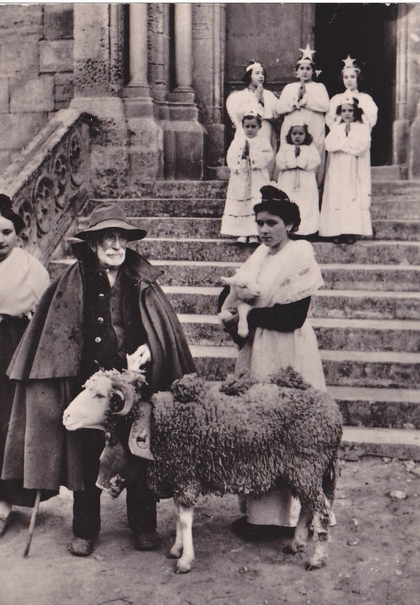

# Sessão 53 — Os preceitos da Igreja — Missa e sexta-feira

*Anonymous (French 19th century), Sortie de la messe des bergers (Leaving Mass) (19th century). Public Domain via Wikimedia Commons.*

> *Uma vila caminha junta para a igreja — pequena, comum, semanal. Os preceitos da Igreja são o andaime de uma vida de graça. Soam mínimos porque o são: este é o piso, não o teto.*

## São Pio X pergunta

**213.** O que são os preceitos gerais da Igreja?

*Os preceitos gerais da Igreja são Leis com as quais Ela, aplicando os Mandamentos de Deus, prescreve aos fiéis alguns atos de religião e determinadas abstinências.*

**214.** Como a Igreja tem autoridade para fazer Leis e Preceitos?

*A Igreja tem autoridade de fazer Leis e Preceitos porque a recebeu na pessoa dos Apóstolos de Jesus Cristo, o Homem-Deus, e por isso quem desobedece à Igreja, desobedece ao próprio Deus.*

**215.** Na Igreja, quem pode fazer Leis e Preceitos?

*Na Igreja, podem fazer Leis e Preceitos o Papa e os Bispos, como sucessores dos Apóstolos, aos quais Jesus Cristo disse: "O que vos ouve, a Mim ouve, e o que vos despreza, a Mim despreza." (São Lucas X, 16)*

**216.** O que nos ordena o Primeiro Preceito "ouvir Missa no domingo e nas outras festas de Preceito"?

*O Primeiro Preceito "ouvir Missa no domingo e nas outras festas de Preceito" nos ordena assistir devotamente em tais dias à Santa Missa.*

**217.** Quem não ouve a Missa nos dias de Preceito, comete pecado grave?

*Quem, sem verdadeiro impedimento, não ouve a Missa nos dias de Preceito, e quem não dá meios a seus dependentes de ouvi-la, comete pecado grave e não cumpre o Mandamento divino de santificar as festas.*

**218.** O que nos proíbe o Segundo Preceito com as palavras "não comer carne às sextas-feiras e nos outros dias proibidos"?

*O Segundo Preceito com as palavras "não comer carne às sextas-feiras e nos outros dias proibidos" nos proíbe comer carne às sextas-feiras (dia da Paixão e Morte de Jesus Cristo) e em alguns dias de jejum.*

*218 a. Os cinco preceitos gerais da Igreja: 1. Ouvir Missa inteira no domingo e nas outras festas de preceito; 2. Abster-se de carne às sextas-feiras e nos outros dias proibidos, e jejuar nos dias de prescritos; 3. Confessar ao menos uma vez por ano, e comungar pelo menos na Páscoa; 4. Sustentar as necessidades da Igreja contribuindo segundo as leis ou os costumes; 5. Não celebrar solenemente as núpcias nos tempos proibidos. Segundo o Terceiro Catecismo da Doutrina Cristã: 1. Ouvir Missa inteira nos domingos e festas de guarda; 2. Confessar-se uma vez cada ano; 3. Comungar ao menos pela Páscoa da Ressurreição; 4. Jejuar e abster-se de carne quando manda a Santa Madre Igreja; 5. Pagar dízimos segundo o costume.*

> **Escritura.** *Não abandoneis a nossa assembleia, como alguns têm por costume, mas exortai-vos uns aos outros, tanto mais quanto vedes que se aproxima o Dia.* — Hebreus 10, 25

> *Senhor, ao menos colocai-me no piso. Levai-me à Missa. Depois, conduzi-me mais ao alto.*
