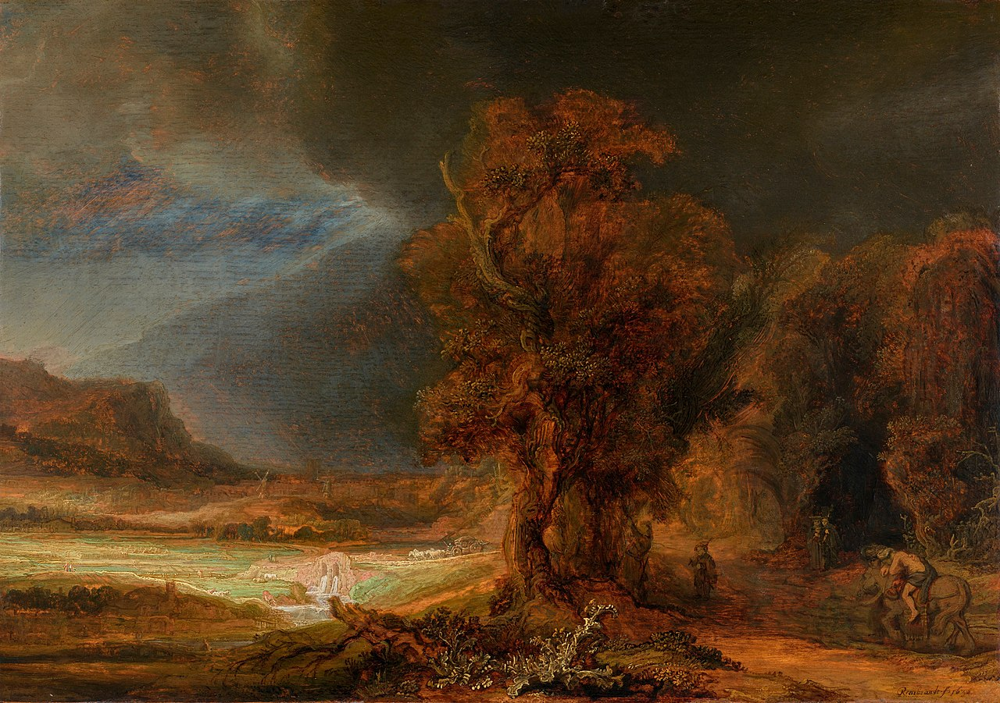

# Sessão 56 — Esperança e caridade — amando a Deus e ao próximo

*Rembrandt van Rijn, The Good Samaritan (1638). Public Domain via Wikimedia Commons.*

> *O samaritano cuida de um estranho ferido à luz da lâmpada. A esperança ousa; a caridade se abaixa. Amar a Deus é recusar pô-Lo de lado; amar o próximo é recusar passar por cima dele. Ambas as coisas estão acontecendo na pintura.*

## São Pio X pergunta

**238.** O que é a Esperança?

*A Esperança é a virtude sobrenatural pela qual confiamos em Deus e dele esperamos a vida eterna e as graças necessárias para merecê-la aqui embaixo com as boas obras.*

**239.** Por qual motivo esperamos de Deus a vida eterna e as graças necessárias para merecê-la?

*Esperamos de Deus a vida eterna e as graças necessárias para merecê-la porque Ele, infinitamente bom e fiel, no-la prometeu pelos méritos de Jesus Cristo, por isso quem desconfia ou desespera O ofende sumamente.*

**240.** O que é a Caridade?

*A Caridade é a virtude sobrenatural pela qual amamos Deus por Si mesmo sobre todas as coisas, e o próximo como a nós mesmos por amor a Deus.*

**241.** Por que devemos amar a Deus?

*Devemos amar a Deus por Si mesmo, como o sumo Bem, fonte de todo nosso bem, e por isso devemos amá-lo sobre todas as coisas "com todo o coração, com toda a alma, com toda a mente e com todas as forças" (São Marcos XII, 30).*

**242.** Por que devemos amar o próximo?

*Devemos amar o próximo por amor a Deus que no-lo ordena, e porque todo homem é criado à imagem de Deus, como nós, e é nosso irmão.*

**243.** Somos obrigados a amar inclusive os nossos inimigos?

*Somos obrigados a amar inclusive os nossos inimigos, perdoando as ofensas, porque são eles também nosso próximo, e porque Jesus Cristo no-lo ordenou expressamente.*

**244.** Quando devemos fazer atos de Fé, Esperança e Caridade?

*Devemos fazer atos de Fé, Esperança e Caridade muitas vezes na vida e, em particular, quando tivermos tentações a vencer ou importantes deveres cristãos a cumprir, e nos perigos de morte.*

**245.** É bom fazer muitas vezes atos de Fé, Esperança e Caridade?

*É bom fazer muitas vezes atos de Fé, Esperança e Caridade, para conservar, aumentar e fortalecer virtudes tão necessárias, que são como partes vitais do "homem espiritual".*

**246.** Como devemos fazer atos de Fé, Esperança e Caridade?

*Devemos fazer atos de Fé, Esperança e Caridade com o coração, a boca e as obras, dando prova em nossa conduta.*

**247.** Como se dá prova da Fé?

*Dá-se prova da Fé confessando-a e defendendo-a, quando necessário, sem temor e sem respeito humano, e vivendo segundo as suas máximas: "a Fé sem obras é morta" (São Tiago II, 26).*

**248.** Como se dá prova da Esperança?

*Dá-se prova da Esperança não se perturbando pelas misérias e contrariedades da vida, e nem mesmo pelas perseguições, mas vivendo resignados, seguros das promessas de Deus.*

**249.** Como se dá prova da Caridade?

*Dá-se prova da Caridade observando os mandamentos e exercitando as obras de misericórdia, e se Deus chama, seguindo os Conselhos Evangélicos.*

*249 a. As Sete Obras de Misericórdia Corporal: 1. Dar de comer aos que têm fome; 2. Dar de beber aos que têm sede; 3. Vestir os desnudos; 4. Dar abrigo aos peregrinos; 5. Visitar os enfermos; 6. Visitar os encarcerados; 7. Enterrar os mortos.*

*249 b. As Sete Obras de Misericórdia Espiritual: 1. Aconselhar os perplexos; 2. Ensinar os ignorantes; 3. Admoestar os pecadores; 4. Consolar os aflitos; 5. Perdoar as ofensas; 6. Suportar pacientemente as fraquezas do próximo; 7. Rogar a Deus pelos vivos e os mortos.*

> **Escritura.** *Se alguém disser: Amo a Deus, e odiar a seu irmão, é mentiroso.* — 1 João 4, 20

> *Senhor, mandai-me hoje um próximo que eu não possa contornar. Fazei-me curvar-me.*
