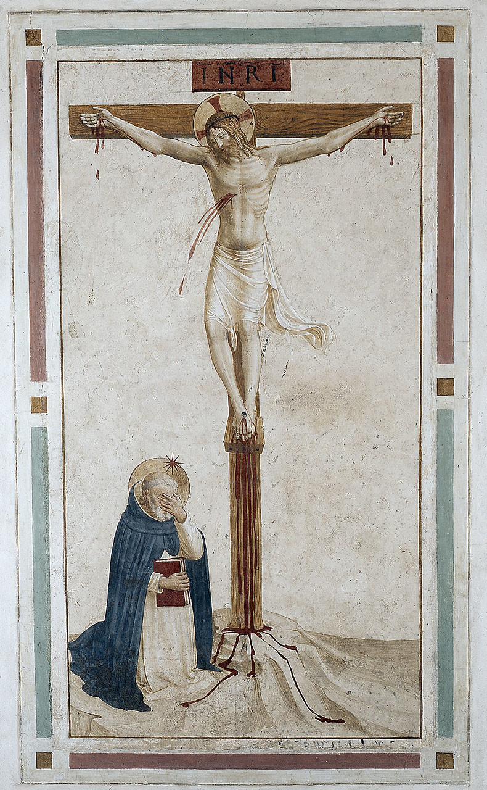

# Sessão 60 — Como os sacramentos dão a graça

*Fra Angelico, Christ Crucified with St. Dominic (c. 1442). Public Domain via Wikimedia Commons.*

> *Do lado do Cristo crucificado, jorram sangue e água. Os sacramentos vêm dali — do lado aberto, do preço. Não são gratuitos no sentido de que nada foi pago. Ele pagou.*

## São Pio X pergunta

**276.** Quem recebe um Sacramento dos vivos sabendo não estar na Graça de Deus comete pecado?

*Quem recebe um Sacramento dos vivos sabendo não estar na Graça de Deus comete pecado gravíssimo de sacrilégio, pois recebe indignamente uma coisa sagrada.*

**277.** O que devemos fazer para conservar a Graça dos Sacramentos?

*Para conservar a Graça dos Sacramentos devemos corresponder com a ação própria, fazendo o bem e fugindo do mal.*

**278.** Quais são os Sacramentos mais necessários para salvar-se?

*Os Sacramentos mais necessários para salvar-se são os Sacramentos dos mortos, isto é, o Batismo e a Penitência, pois dão a Primeira Graça ou a vida espiritual.*

**279.** O Batismo e a Penitência são igualmente necessários?

*O Batismo e a Penitência não são igualmente necessários, pois o Batismo é necessário a todos, nascendo todos com o pecado original; a Penitência, ao invés, é necessária àqueles que, depois do Batismo, perderam a Graça pecando mortalmente.*

**280.** Se o Batismo é necessário a todos, ninguém pode salvar-se sem Batismo?

*Sem Batismo ninguém pode salvar-se, quando, porém, não se pode receber o Batismo de Água, basta o Batismo de Sangue, isto é, o martírio sofrido por Jesus Cristo, ou o Batismo de Desejo, que é o amor de Caridade, desejoso dos meios de salvação instituídos por Deus.*

**281.** Quantas vezes podem-se receber os Sacramentos?

*Alguns Sacramentos podem-se receber muitas vezes; outros, uma só vez.*

**282.** Quais Sacramentos recebem-se uma só vez?

*Recebem-se uma só vez o Batismo, a Crisma e a Ordem.*

## O Catecismo Romano ensina

## Motivos para se instituírem os Sacramentos

[9] Ora, para ensinar a maneira de se fazer bom uso dos Sacramentos, o meio mais eficaz é expor cuidadosamente as razões determinantes de sua instituição.

### a) A fraqueza do espírito humano

Entre as muitas que se costumam alegar, a primeira é a natural fraqueza do espírito humano. Consta, por experiência, ser ele tão limitado, que o homem não pode chegar ao conhecimento de coisas puramente intelectuais, senão por intermédio de percepções sensíveis. Assim, com o intuito de nos facilitar a compreensão das operações invisíveis de Sua onipotência, quis o Supremo Criador de todas as coisas, em Sua infinita sabedoria, manifestar essa oculta virtude [dos Sacramentos] por meio de sinais sensíveis, que fossem também uma prova de Seu amor para conosco.[^27]

São João Crisóstomo diz com toda a clareza: "Se o homem não tivera corpo, os bens espirituais lhe seriam propostos a descoberto, sem nenhum véu que os ocultasse. Mas, desde que a alma se acha unida ao corpo, era de todo necessário que, para a compreensão daqueles bens, ela se valesse de objetos adaptáveis aos sentidos".[^28]

### b) Maior confiança nas promessas divinas

A segunda razão é que nosso espírito dificilmente põe fé nas promessas que nos são feitas. Por isso é que, desde o início do mundo[^29], Deus sempre tornava a anunciar Seus desígnios por meio da palavra. Mas, às vezes, quando decretava alguma obra, cuja grandeza podia abalar a confiança em Sua promessa, acrescentava às palavras ainda outros sinais, que não raro tinham o caráter de milagres.

Deus enviou, por exemplo, Moisés que libertasse o povo de Israel.[^30] Aquele, porém, sem confiar sequer no auxílio de Deus que assim ordenava, receou que a empresa superasse suas forças, ou que também o povo não desse crédito às decisões e palavras divinas. Então Deus confirmou Suas promessas com uma série de vários milagres.[^31]

Ora, assim como Deus fizera no Antigo Testamento, confirmando por sinais a firmeza de Suas promessas: assim também Cristo Nosso Senhor, quando nos prometeu na Nova Lei a remissão dos pecados, a graça santificante, a comunicação do Espírito Santo, instituiu simultaneamente certos sinais sensíveis, nos quais víssemos empenhada a Sua palavra, de molde a excluir toda dúvida na realização do prometido.[^32]

### c) Pronta medicação da Paixão de Cristo

No dizer de Santo Ambrósio[^33], a terceira razão é que os Sacramentos deviam proporcionar, como os remédios do Samaritano no Evangelho[^34], uma pronta medicação que nos restituísse, ou conservasse a saúde da alma.

A virtude que dimana da Paixão de Cristo, isto é, a graça que nos mereceu no altar da Cruz, deve chegar-nos dos Sacramentos, como que por uns canais de comunicação. Sem estes meios, não restaria nenhuma esperança de salvar-nos eternamente.

Levado de grande clemência, Nosso Senhor empenhou Sua palavra, e quis deixar à Igreja os Sacramentos. De nossa parte, temos a firme obrigação de crer que eles realmente nos comunicam os frutos de Sua Paixão, contanto que cada um de nós use tais remédios, com a devida fé e piedade.

### d) Senha e divisa para distinguir os fiéis

Existe uma quarta razão, pela qual se pode julgar necessária a instituição dos Sacramentos. Deviam servir de senha e divisa para os fiéis se reconhecerem entre si. Conforme disse Santo Agostinho[^35], nenhum grupo de homens pode constituir corpo jurídico, a título de verdadeira ou falsa religião, se os membros componentes se não ligarem entre si, pela convenção de alguns sinais distintivos da sociedade. Ora, os Sacramentos da Nova Lei satisfazem essa dupla exigência, porquanto distinguem dos infiéis os seguidores da fé cristã, e unem os fiéis entre si, mediante um vínculo sagrado.[^36]

### e) Profissão pública da fé

Outra razão ponderável para a instituição dos Sacramentos vem expressa nas palavras do Apóstolo: "Crê-se de coração para ser justificado. Mas, para ser salvo, se faz confissão de boca".[^37] Ora, pelos Sacramentos fazemos pública profissão de nossa fé, e damo-la a conhecer na face dos homens. Quando, por exemplo, comparecemos para o Batismo, damos público testemunho de acreditarmos que, pela virtude da água, em que somos purificados pelo Sacramento, se opera também a ablução espiritual de nossa alma.

### f) Aumento do amor fraterno

Além disso, os Sacramentos são de grande eficácia, não só para ativar e nutrir a fé em nossos corações, mas também para inflamar aquela caridade, pela qual devemos amar uns aos outros; porquanto nos recordam que, pela participação dos mesmos Mistérios, nos unimos uns aos outros pelos laços mais estreitos, e nos tornamos membros de um só corpo.

### g) Repressão do orgulho

Há, por último, uma razão de suma importância para a vida cristã. Os Sacramentos domam e reprimem o orgulho do espírito humano. São para nós uma escola de humildade, pois que nos obrigam a submeter-nos a elementos sensíveis, em obediência a Deus, de quem nos havíamos impiamente separado, para nos fazermos escravos das coisas deste mundo.

São estes os pontos principais, que deverão ser explicados ao povo cristão, acerca do nome, natureza e instituição dos Sacramentos.

## Número dos Sacramentos

[14] A seguir, deve indicar-se o número dos Sacramentos. Esta explicação tem a vantagem de levar o povo a engrandecer a singular bondade de Deus para conosco. E ele o fará com tanto mais fervor da alma, ao reconhecer quão abundantes são os auxílios que Deus aprestou, para a nossa eterna salvação e bem-aventurança.

São sete os Sacramentos da Igreja. Disso temos prova nas Escrituras, na doutrina tradicional dos Santos Padres, e na autoridade dos Concílios.[^40]

### 1. Razão de serem sete

[15] A razão de não ser maior, nem menor o seu número, podemos mostrá-la, de modo provável, por uma analogia entre a vida natural e a sobrenatural.

Para viver, conservar-se, levar uma vida útil a si mesmo e à sociedade, precisa o homem de sete coisas: nascer, crescer, nutrir-se; curar-se, quando adoece; recuperar as forças perdidas; ser guiado na vida social, por chefes revestidos de poder e autoridade; conservar-se a si mesmo e ao gênero humano, pela legítima propagação da espécie. Todas estas funções também se adaptam, indubitavelmente, àquela outra vida pela qual a alma vive para Deus. Dessa correlação se pode obviamente inferir o número dos Sacramentos.

### 2. Sua enumeração

O primeiro é o Batismo, a bem dizer, a porta dos outros Sacramentos, e pelo qual renascemos para Cristo.[^41]

Depois vem a Confirmação, por cuja virtude crescemos e nos fortalecemos na graça divina. Como observa Santo Agostinho[^42], só depois de batizados é que Nosso Senhor disse aos Apóstolos: "Deixai-vos ficar na cidade, até serdes revestidos da força que vem do alto".[^43]

Em seguida, temos a Eucaristia, alimento verdadeiramente celestial, que nutre e conserva nossa alma, conforme disse Nosso Salvador: "Minha carne é verdadeiramente uma comida, e Meu Sangue é verdadeiramente uma bebida".[^44]

O quarto lugar ocupa a Penitência, por cuja virtude recobramos a saúde, se a tivermos perdido com as lesões do pecado.[^45]

Depois, a Extrema-Unção nos tira os remanescentes do pecado, e restaura as forças da alma. Com relação a este Sacramento, declarou Santiago: "E se estiver em pecados, ser-lhe-ão remitidos".[^46]

A seguir, vem a Ordem que confere o poder de perpetuar a administração pública dos Sacramentos e o exercício de todas as funções sagradas no seio da Igreja.[^47]

Como derradeiro, existe o Matrimônio, instituído a fim de que da legítima união do homem com a mulher procedam os filhos, e sejam piamente educados para o serviço de Deus, e para a conservação do gênero humano.[^48]

## Diferença dos Sacramentos

### 1. Quanto à necessidade

[16] Há, porém, um ponto que reclama muita atenção. É que todos os Sacramentos comportam em si uma virtude admirável e divina, mas nem todos são igualmente necessários, nem possuem a mesma graduação e finalidade.

Entre eles, existem três que são considerados mais necessários que os outros, embora não o sejam por razões idênticas. Do Batismo, por exemplo, declarou Nosso Salvador ser absolutamente necessário para todos os homens. Suas palavras são as seguintes: "Quem não renascer da água e do Espírito [Santo], não pode entrar no reino de Deus".[^49]

A Penitência só se faz necessária para aqueles que, após o Batismo, tiverem contraído algum pecado mortal; não poderão escapar à eterna condenação, se não expiarem devidamente os pecados que cometeram.

Quanto à Ordem, a necessidade é absoluta, não para os fiéis individualmente, mas para a Igreja coletivamente.[^50]

### 2. Quanto à dignidade

Se, porém, atentarmos à dignidade dos Sacramentos, a Eucaristia sobrepuja a todos os mais, sendo-lhes muito superior pela santidade, número e grandeza de Seus mistérios.

Todos esses aspectos serão mais fáceis de compreender, quando a seu tempo explicarmos cada um dos Sacramentos em particular.

## Efeitos dos Sacramentos

[21] Prosseguindo, deve o pároco falar agora dos efeitos dos Sacramentos. Essa explicação elucida melhor a definição de Sacramento que acima foi apresentada.

São dois os seus efeitos principais. Em primeiro lugar, pomos com razão a graça que, na linguagem dos teólogos, se chama graça "justificante". Assim no-lo ensinou o Apóstolo, com a maior clareza, quando dizia que "Cristo amou a Sua Igreja, e por amor dela Se entregou a Si mesmo, para a santificar, purificando-a pelo banho de água em [Sua] palavra".[^58]

O modo, porém, pelo qual o Sacramento produz um efeito tão grande quão admirável, de sorte que, na bela frase de Santo Agostinho[^59], "a água banha o corpo, para purificar o coração" — constitui um mistério que o engenho humano não poderá jamais deslindar.

O certo é que, por virtude da própria natureza, nenhuma coisa sensível pode atingir a alma. Pela luz da fé, sabemos, todavia, que nos Sacramentos se põe em ação a virtude de Deus Todo-Poderoso; e que por essa virtude os Sacramentos produzem efeitos de que as coisas sensíveis seriam incapazes, por sua própria natureza.

### Comprovada às vezes por milagres

[22] Para remover dos ânimos dos fiéis toda a dúvida que jamais pudesse surgir acerca desse efeito sacramental, quis a bondade de Deus que, nas primeiras administrações, os efeitos internos fossem comprovados por meio de milagres. Assim, pois, devemos crer, com toda a segurança, que tais efeitos sempre se produzem interiormente, por mais que subtraiam à percepção de nossos sentidos.

Por esse motivo, deixamos de parte que, depois do Batismo de Nosso Salvador no Jordão, os céus se abriram, e o Espírito Santo apareceu em figura de pomba[^60], para nos advertir que Sua graça nos é infundida na alma, por ocasião do banho salutar do Batismo. Mas, como dizíamos, não nos detemos nesse fato, porque se reporta antes à significação e importância do Batismo, do que à administração dos Sacramentos.

Entretanto, não lemos porventura que, quando os Apóstolos receberam o Espírito Santo no dia de Pentecostes, e por Sua virtude se tornaram mais fortes e mais animosos, para anunciar a verdade da fé, e arrostar perigos pela glorificação de Cristo[^61]: — então "se ouviu de repente, como vindo do céu, um ruído semelhante ao soprar de um vento impetuoso, e sobre eles pousaram línguas que se repartiam, como se fossem de fogo?"[^62]

Este milagre nos dá a entender que o Sacramento da Crisma nos confere o mesmo Espírito, e nos dá as mesmas forças [como aos Apóstolos], para que possamos resistir valorosamente à carne, ao mundo e ao demônio, nossos inimigos declarados.

Milagres assim se repetiam, por algum tempo, nos primórdios da Igreja, quando os Apóstolos administravam os Sacramentos. Deixaram de ocorrer, desde que a fé ficou bem arraigada nos corações.

### Corolário

[23] As explanações sobre o primeiro efeito dos Sacramentos, qual é a graça justificante, mostram com evidência que os Sacramentos da Nova Lei possuem maior virtude e sublimidade do que os Sacramentos da Lei Antiga.[^63] Estes eram "elementos fracos e pobres"[^64], que santificavam os contaminados mediante a purificação do corpo[^65], e não da alma. Foram, portanto, instituídos apenas como figuras dos efeitos, que deviam produzir os nossos Sacramentos.

Porém os Sacramentos da Nova Aliança manaram do lado de Cristo, que pelo Espírito Santo Se ofereceu a Si mesmo sem mácula a Deus, e purificou nossa consciência das obras mortas, para servirmos ao Deus vivo.[^66]

Desta forma, produzem a graça que significam, em virtude do Sangue de Cristo. Se os compararmos com os Sacramentos da Antiga Aliança, não só possuem maior eficácia, mas são também mais abundantes em frutos, e mais elevados em santidade.[^67]

> **Escritura.** *Mas um dos soldados abriu-Lhe o lado com uma lança, e logo saiu sangue e água.* — João 19, 34

> *Senhor, os sacramentos são as Vossas chagas que correm para mim. Acolhei-me neles hoje, e amanhã ainda.*
