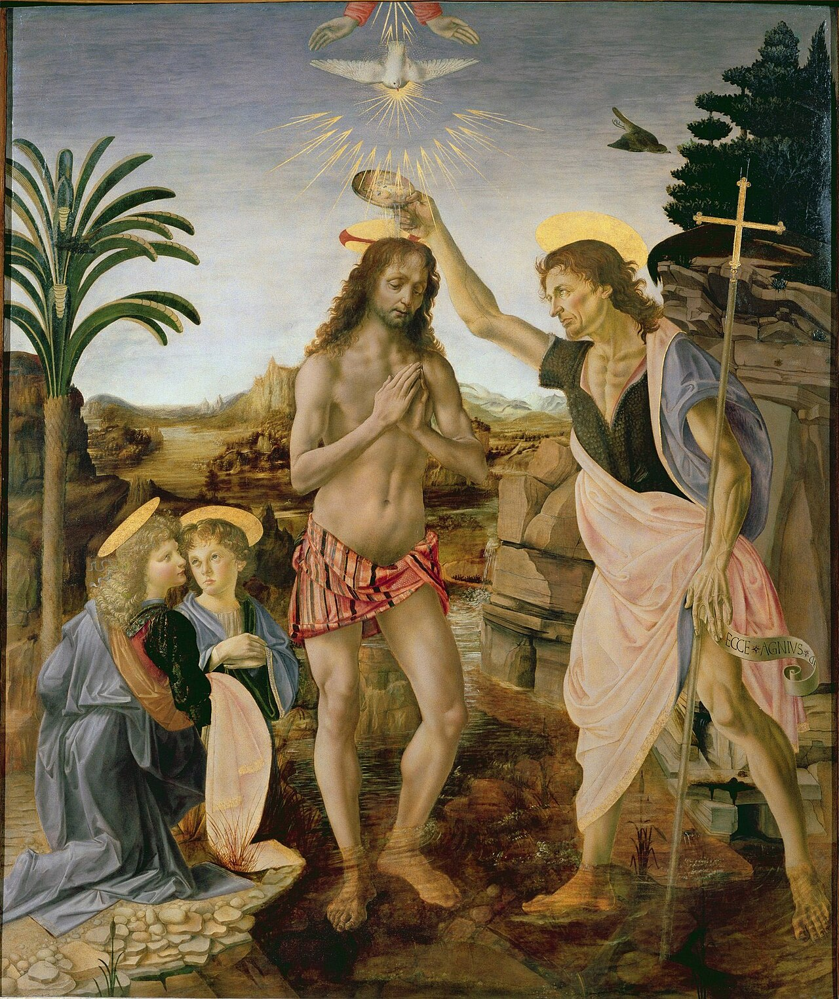

# Sessão 62 — Batismo — a primeira graça

*Andrea del Verrocchio and Leonardo da Vinci, The Baptism of Christ (c. 1472-1475). Public Domain via Wikimedia Commons.*

> *Verrocchio pintou o Jordão; o menino João derrama, a pomba desce. O batismo é a primeira manhã. O pecado original é lavado; a alma recebe um nome no céu; a Trindade vem morar. A maioria dormiu o seu. Hoje, desperte para o que recebeu.*

## São Pio X pergunta

**290.** O que é o Batismo?

*O Batismo é o Sacramento que nos faz cristãos, isto é, seguidores de Jesus Cristo, filhos de Deus e membros da Igreja.*

**291.** Qual é a matéria do Batismo?

*A matéria do Batismo é a água natural.*

**292.** Qual é a forma do Batismo?

*A forma do Batismo são as palavras "eu te batizo em Nome do Pai, e do Filho, e do Espírito Santo".*

**293.** Quem é o ministro do Batismo?

*O ministro do Batismo é ordinariamente o sacerdote, mas, em caso de necessidade, pode ser qualquer pessoa, inclusive um herege ou um infiel, que tenha a intenção de fazer o que faz a Igreja.*

**294.** Como se dá o Batismo?

*O Batismo se dá vertendo a água sobre a cabeça do batizando e dizendo ao mesmo tempo as palavras da forma.*

**295.** Quais efeitos produz o Batismo?

*O Batismo confere a primeira Graça santificante e as virtudes sobrenaturais, removendo o pecado original e os atuais, se houver, com todo débito de pena por eles devido; imprime o caráter de cristão e torna capaz de receber os outros Sacramentos.*

**296.** O Batismo transforma o homem?

*O Batismo transforma o homem no espírito e o faz como renascer tornando-o um homem novo, por isso então se lhe dá um nome conveniente, o de um Santo que lhe seja exemplo e protetor na vida de cristão.*

> **Escritura.** *Quem crer e for batizado será salvo.* — Marcos 16, 16

> *Senhor, no dia em que fui batizado, Vós me nomeastes. Ajudai-me a viver hoje esse nome.*
