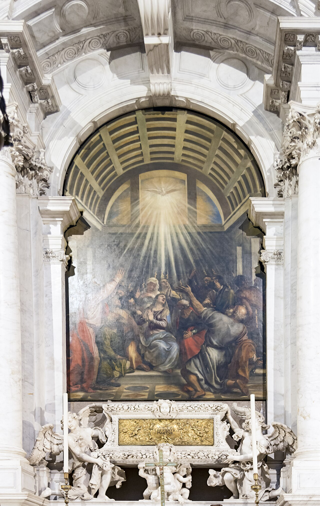

# Sessão 64 — Confirmação — o soldado de Cristo

*Titian, The Descent of the Holy Spirit (c. 1545). Public Domain via Wikimedia Commons.*

> *As chamas de Ticiano descem sobre cabeças. A Crisma é o dia do soldado — não porque o cristianismo seja guerra, mas porque a fé adulta é um combate constante contra a covardia. O sacramento o arma. Use-o.*

## São Pio X pergunta

**304.** O que é a Crisma ou Confirmação?

*A Crisma ou Confirmação é o Sacramento que nos faz perfeitos cristãos e soldados de Jesus Cristo, e nos imprime este caráter.*

**305.** Qual é a matéria da Crisma?

*A matéria da Crisma é o Santo Crisma, isto é, óleo misturado ao bálsamo, consagrado pelo Bispo na Quinta-Feira Santa.*

**306.** Qual é a forma da Crisma?

*A forma da Crisma são as palavras "eu te assinalo com o sinal da Cruz. E te confirmo com o Crisma da salvação. Em Nome do Pai, e do Filho, e do Espírito Santo".*

**307.** Quem é o ministro da Crisma?

*O ministro da Crisma é o Bispo e, extraordinariamente, o sacerdote que tenha recebido do Papa tal faculdade.*

**308.** Como o Bispo administra a Crisma?

*O Bispo estende as mãos sobre os crismandos, invoca o Espírito Santo, depois, com o sagrado Crisma, unge em forma de Cruz a testa de cada um, pronunciando as palavras da forma, em seguida lhes dá um ligeiro tapa dizendo: "a paz esteja contigo"; e ao fim abençoa solenemente todos os crismados.*

**309.** De que modo a Crisma nos faz perfeitos cristãos e soldados de Jesus Cristo?

*A Crisma nos faz perfeitos cristãos e soldados de Jesus Cristo dando-nos a abundância do Espírito Santo, isto é, da sua Graça e de seus dons, os quais nos confirmam ou fortalecem na fé e nas outras virtudes contra os inimigos espirituais.*

## O Catecismo Romano ensina

## Necessidade desta instrução

[1] Sempre foi um imperioso dever de todos os tempos, que os pastores se esmerassem em explicar o Sacramento da Confirmação. Hoje em dia, porém, devem expô-lo com maior empenho e cuidado, porque na Santa Igreja de Deus muitos deixam absolutamente de receber a Crisma; e, de quantos a recebem, raríssimos são os que procuram alcançar, plenamente, os devidos frutos da graça sacramental.

Urge, portanto, instruir os fiéis acerca da natureza, eficácia e sublimidade deste Sacramento. Escolha-se para esse fim não só o dia de Pentecostes, ocasião principal em que é administrado, mas também outros dias que os pastores julgarem mais oportunos.

Os fiéis chegam assim a reconhecer que não lhes será lícito menosprezar este Sacramento, mas que devem recebê-lo com respeito e piedade. Do contrário, poderia advir o dano gravíssimo de lhes ser inútil este dom de Deus, em vista de sua culposa negligência.

## Explicação etimológica

[2] A começar pela explicação do nome, deve ensinar-se que a Igreja lhe chama "Confirmação", porque no momento em que o Bispo unge com o santo Crisma, pronunciando a fórmula solene: "Eu marco-te com o sinal da Cruz, e confirmo-te com o Crisma da salvação, em nome do Padre, e do Filho, e do Espírito Santo": — o batizado torna-se mais firme pela virtude da nova graça, e começa a ser um perfeito soldado de Cristo, se não puser nenhum obstáculo à eficácia do Sacramento.

## A Crisma verdadeiro Sacramento

### 1. Doutrina dos Papas

[3] A Igreja Católica sempre reconheceu que a Confirmação tem o caráter próprio de verdadeiro Sacramento. Atestam-no o Papa Melcíades[^1] e muitos outros dos mais santos Pontífices da mais remota antiguidade.

São Clemente não podia asseverar esta verdade de maneira mais enérgica e positiva, quando declarou: "Todos devem empenhar-se por renascer em Deus, sem mais demora, para serem afinal assinalados pelo Bispo, isto é, para receberem os sete dons do Espírito Santo; em hipótese alguma, poderia ser perfeito cristão quem deixasse de receber este Sacramento, não por motivos imperiosos, mas por voluntária negligência. Esta é a tradição que recebemos de São Pedro, e assim ensinaram os outros Apóstolos, por ordem de Nosso Senhor".[^2]

Pelo seu magistério, confirmaram esta mesma fé Urbano, Fabiano e Eusébio, pontífices romanos, que, cheios do mesmo Espírito, derramaram seu sangue por Jesus Cristo. É o que patenteiam os seus decretos.

### 2. Doutrina dos Santos Padres

[4] Acresce, ainda, a doutrina unânime dos Santos Padres. Entre eles, temos São Dionísio Areopagita, Bispo de Atenas. Ao explicar a maneira de se fazer o santo Crisma, exprimia-se nos termos seguintes: "Os sacerdotes revestem o batizado de uma túnica própria, de cor branca, para o conduzirem ao pontífice; este o marca com uma unção sagrada e verdadeiramente divina, e o faz participante da sacrossanta Comunhão".[^3]

Eusébio de Cesaréia fazia, por sua vez, conceito tão elevado deste Sacramento, que não hesitou em afirmar que o herege Novato não pudera merecer o Espírito Santo, porque, recebendo o Batismo em doença grave, não fora marcado com o sinal do Crisma.[^4]

Da mesma doutrina, temos testemunhos cabais no livro que Santo Ambrósio compôs acerca dos catecúmenos[^5], e nos livros que Santo Agostinho lançou contra as cartas do donatista Petiliano.[^6] Ambos estavam inteiramente convencidos do caráter sacramental da Crisma, a ponto de o enunciarem e demonstrarem por meio de textos da Sagrada Escritura. O primeiro refere ao Sacramento da Confirmação aquelas palavras do Apóstolo: "Não contristeis o Espírito Santo, no qual fostes assinalados".[^7] O segundo, porém, aplica aquela passagem do Salmo: "Como o azeite derramado na cabeça, que desce sobre a barba, sobre a barba de Aarão"[^8]; e mais o texto do Apóstolo: "O amor de Deus está difundido em nossos corações, pelo Espírito Santo que nos foi dado".[^9]

## Sacramento diverso do Batismo

### 1. Pela graça específica

[5] Não obstante Melcíades haver dito que o Batismo se une intimamente à Confirmação[^10], não se deve crer, todavia, que ambos constituam um só Sacramento, pois de um a outro vai uma grande diferença. Como é sabido, torna-os realmente distintos a variedade, não só da graça que cada um deles confere, mas também da matéria sensível que significa a própria graça.

Pela graça do Batismo, são os homens gerados para uma vida nova. Pelo Sacramento da Confirmação, os que foram gerados tornam-se varões, depois de deixarem o que tinham próprio de crianças.[^11]

Por conseguinte, quanto o nascer difere do crescer na vida natural, tanta é também a diferença entre o Batismo que nos gera espiritualmente, e a Confirmação, cuja virtude faz os cristãos crescerem até a perfeita robustez da alma.

Mais ainda. Era também necessário constituir-se outra espécie de Sacramento, para as ocasiões em que a alma entrasse numa nova ordem de dificuldades.

Se havemos mister da graça batismal para munir da fé a nossa alma, desde logo se reconhece a máxima conveniência de que o espírito dos fiéis seja confirmado por uma outra graça, para evitar que nenhum perigo ou receio de penas, de castigos, e até da própria morte, os tolha de confessar a verdadeira fé.

### 2. Pela matéria específica

Ora, sendo este o efeito próprio da unção com o santo Crisma, conclui-se com segurança que este Sacramento difere, essencialmente, do [próprio] Batismo.

O Papa Melcíades exprimiu aliás, em termos precisos, a diferença que existe entre ambos os Sacramentos. "Pelo Batismo, diz ele, o homem alista-se na milícia; pela Confirmação, equipa-se para a luta. Na fonte batismal, o Espírito Santo confere a plenitude da inocência; na Confirmação, dá a consumação da graça. No Batismo, renascemos para a vida; depois do Batismo, somos confirmados para a luta. No Batismo, somos purificados; depois do Batismo, somos munidos de força. A regeneração garante de per si a salvação aos que se batizam em tempo de paz; a Confirmação arma e adestra para os embates da guerra".[^12]

### 3. Pela definição formal da Igreja

Esta é também a doutrina sustentada por vários Concílios[^13], mormente pelo Sagrado Concílio de Trento[^14], de sorte que a ninguém é permitido formular outra opinião, e nem de longe opor-lhe a menor dúvida.

## Instituição por Cristo

[6] Já falamos, em geral, da necessidade de ensinar-se por quem foram instituídos todos os Sacramentos. Agora, é preciso fazer outro tanto acerca da Confirmação, a fim de que os fiéis se compenetrem, mais ao vivo, da santidade deste Sacramento.

Por conseguinte, os pastores terão de explicar que Cristo Nosso Senhor não só o instituiu, mas até determinou, conforme atesta o romano Pontífice São Fabiano[^15], o rito da unção com o Crisma, bem como as palavras que a Igreja Católica emprega em sua administração.

Desta verdade facilmente se convencerá todo aquele que acreditar no caráter sacramental da Confirmação; pois todos os Sacros Mistérios[^16] transcendem as forças da natureza humana, e só por Deus mesmo poderiam ser instituídos.

Vejamos agora quais são as suas partes. Passemos a explicar a matéria em primeiro lugar.

## A matéria

### 1. Sua noção

[7] Ela se chama "crisma"[^17], palavra tirada do grego, que os escritores profanos empregam para designar qualquer espécie de óleo para ungir. Por tradição geral, os escritores eclesiásticos adaptaram-lhe o sentido de só indicar o unguento[^18] composto de azeite doce e bálsamo, e que o Bispo consagra com rito solene.

Portanto, a matéria da Crisma consiste na mistura de dois ingredientes. Esta combinação de elementos diversos simboliza as muitas graças que o Espírito Santo outorga aos crismados, bem como exprime, de maneira notável, a sublimidade do próprio Sacramento.

A Santa Igreja e os Concílios[^19] sempre ensinaram que essa é a matéria do Sacramento. Atestam-no São Dionísio[^20] e muitos outros Padres de máxima autoridade, entre os quais sobressai o Papa Fabiano[^21], declarando que os Apóstolos receberam do Senhor a maneira de fazer o Crisma, e no-la transmitiram.

### 2. Seu simbolismo

#### a) O azeite doce

[8] Com efeito, melhor do que o Crisma, não podia nenhuma matéria exprimir as graças próprias deste Sacramento.

O azeite doce, cuja natureza gordurosa tem a propriedade de fixar-se e difundir-se, exprime a plenitude da graça que o Espírito Santo faz transbordar de Cristo, a Cabeça, sobre os outros [que são seus membros], e a derrama "como o unguento que goteja pela barba de Aarão até a oria de sua veste".[^22] Na verdade, "Deus ungiu-O com o óleo da alegria, de preferência aos Seus companheiros".[^23] E "de Sua plenitude é que todos nós recebemos [a nossa parte]".[^24]

#### b) O bálsamo

[9] Com o seu odor delicado, o bálsamo não simboliza outra coisa senão a fragrância de todas as virtudes, que os fiéis exalam de si, quando são aperfeiçoados pelo Sacramento da Confirmação, a ponto de poderem exclamar com o Apóstolo: "Somos para Deus um suave odor de Cristo".[^25]

Outra propriedade tem ainda o bálsamo. É a de preservar da corrupção todas as coisas que dele forem impregnadas. Torna-se, portanto, muito próprio para designar a eficácia deste Sacramento. O fato é que, apercebidos da graça celestial da Confirmação, os ânimos dos fiéis podem facilmente defender-se do contágio do pecado.

### 3. Sua sagração

[10] A consagração do Crisma é feita pelo Bispo com solenes cerimônias. O Papa Fabiano, muito insigne pela santidade de vida e pela glória do martírio, deixou-nos escrito que Nosso Senhor assim o ordenou na última Ceia, quando ensinou aos Apóstolos a maneira de preparar o Crisma.

Isto não obstante, a própria razão pode demonstrar por que deve ser assim.

Em quase todos os Sacramentos, Cristo instituiu de tal sorte a matéria, que lhe deu pessoalmente uma santificação especial. Ao declarar: "Se alguém não renascer da água e do Espírito [Santo], não pode entrar no reino de Deus"[^26]; não só quis que a água fosse o elemento do Batismo, mas fez também que, pelo Seu próprio Batismo, a água tivesse dali por diante a virtude de santificar.

Esta é a razão de São João Crisóstomo afirmar: "A água batismal não poderia eliminar os pecados dos crentes, se não fora santificada pelo contacto com o Corpo do Senhor".[^27]

Ora, como o Senhor não santificara, por uso e contacto pessoal, a matéria da Confirmação, era mister que ela fosse consagrada por meio de santas e religiosas fórmulas. Essa consagração não incumbe a outrem, senão ao Bispo, que foi instituído ministro ordinário do Sacramento.[^28]

## Sujeito da Crisma

[15] Acontece, muitas vezes, que os fiéis antecipam levianamente a recepção da Crisma, ou a retardam por culposa negligência. E nada diremos daqueles que, num requinte de impiedade, chegam até a desprezá-la e rejeitá-la.

Em vista disso, os pastores têm a obrigação de explicar quem está obrigado a crismar-se, e em que idade, e em quais condições é preciso fazê-lo.

Em primeiro lugar, começarão por ensinar que este Sacramento não é de tal necessidade, que sem ele não possa haver salvação.

### 1. Todos os cristãos

Mas, embora não seja absolutamente necessário, ninguém deve deixar de recebê-lo; devemos antes de tudo evitar qualquer negligência, numa matéria de tanta santidade, que se torna para nós uma fonte de copiosas graças divinas.[^37] Além disso, todos os cristãos devem procurar, com o maior fervor, os meios comuns que Deus lhes instituiu, para a própria santificação.[^38]

[16] Ora, ao relatar o milagre da primeira efusão do Espírito Santo, fez São Lucas a seguinte descrição: "De repente, veio do céu um bramir como de vento que passava impetuoso, e encheu a casa inteira". E pouco depois acrescentou: "Ficaram todos eles cheios do Espírito Santo".[^39]

Sendo aquela casa figura e imagem da Santa Igreja, tais palavras nos levam a concluir que o Sacramento da Crisma, cuja origem datava daquele dia, fora instituído para todos os cristãos.

Isso é também fácil de comprovar pela finalidade do próprio Sacramento.

### Para se tornarem perfeitos seguidores do Espírito de Cristo

Os que devem ainda crescer na vida espiritual, até se tornarem perfeitos seguidores da religião cristã, precisam para isso receber a força que advém da unção com o sagrado Crisma. Ora, nessa grande necessidade se acham todos os cristãos.

Assim como é lei da natureza que os homens cresçam desde o nascimento até chegarem à idade perfeita, embora não o consigam às vezes na devida proporção; assim também a Santa Igreja Católica, nossa mãe comum, deseja ardentemente levar ao estado de cristãos perfeitos aqueles que ela regenerou pelo Batismo.

Este efeito, porém, é operado pelo Sacramento da unção mística. Logo, torna-se evidente que a Crisma diz respeito a todos os fiéis sem distinção.

### 2. Em que idade?

[17] Aqui cabe um reparo. Depois do Batismo, todos podem de per si ser crismados, mas é de menos conveniência que tal aconteça, antes de alcançarem as crianças o uso da razão.[^40]

Portanto, se não parece necessário esperar até os doze anos, há contudo muita conveniência em protelar a recepção deste Sacramento até aos sete anos de idade.

Não foi a Crisma instituída como meio indispensável para a salvação, mas ela deve pela sua virtude tornar-nos fortes e corajosos nas lutas, que temos de travar pela fé de Cristo. Ora, ninguém, certamente, há de julgar que as crianças, antes de atingirem o uso da razão, já sejam capazes de tais refregas.

### 3. Preparação

[18] Desta doutrina se tira uma consequência prática. Os que se crismam em idade adulta, para receberem a graça e os dons deste Sacramento, devem não só apresentar-se com fé e devoção, mas também arrepender-se, cordialmente, de todos os pecados mais graves que tiverem cometido.

#### a) Confessar-se

Por conseguinte, os pastores cuidarão, outrossim, que os fiéis confessem antes os seus pecados. Exortá-los-ão, paternalmente, à prática do jejum e de outras obras de piedade.

#### b) Estar em jejum, se possível

Convém admoestá-los a que renovem o louvável costume de receber a Confirmação em jejum natural, conforme se fazia na Igreja primitiva.[^41]

E não será difícil conseguir estas disposições, desde que os fiéis compreendam os dons deste Sacramento e seus admiráveis efeitos.

> **Escritura.** *Então eles lhes impunham as mãos e recebiam o Espírito Santo.* — Atos 8, 17

> *Espírito Santo, afiai os dons que me destes. Hoje, fazei-me falar quando falar for mais difícil do que calar.*
