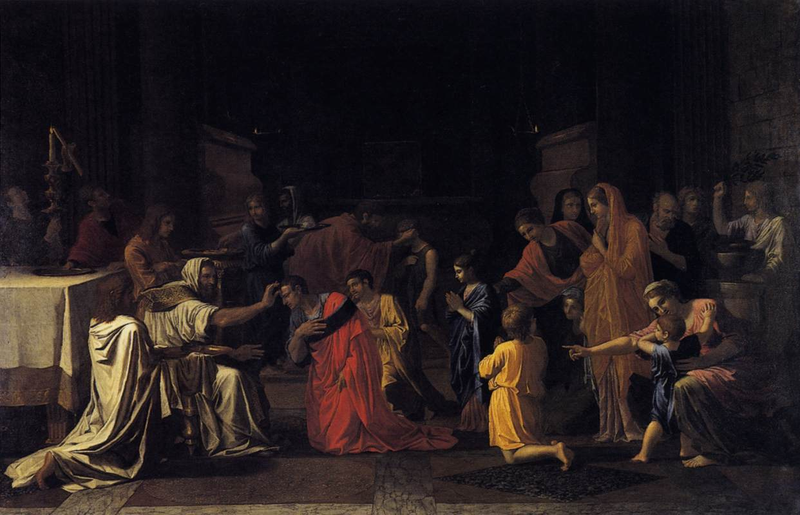

# Sessão 65 — Confirmação — preparar a alma

*Nicolas Poussin, Confirmation (Seven Sacraments) (1645). Public Domain via Wikimedia Commons.*

> *Um bispo impõe a mão sobre uma cabeça jovem. A Crisma não é formatura. É alistamento. A primeira mão é suave, mas o trabalho que vem é real. Reze pelos que serão crismados na sua paróquia este ano.*

## São Pio X pergunta

**310.** Com que idade é bom receber a Crisma?

*É bom receber a Crisma com aproximadamente a idade de sete anos, pois é quando costumam começar as tentações, e se pode conhecer suficientemente a Santidade e a Graça deste Sacramento.*

**311.** Quais disposições deve ter quem recebe a Crisma?

*Quem recebe a Crisma deve estar na Graça de Deus e, se tem uso da razão, deve conhecer os mistérios principais da Fé, e aproximar-se do Sacramento com devoção, profundamente compenetrado do que o rito significa.*

**312.** O que significa o sagrado Crisma?

*O sagrado Crisma, com o óleo que se expande e dá força, significa a Graça abundante da Confirmação, e com o bálsamo que é cheiroso e preserva da corrupção, significa o bom odor das virtudes que os crismados deverão possuir, fugindo da corrupção dos vícios.*

**313.** O que significa a unção que se faz sobre a testa em forma de Cruz?

*A unção que se faz sobre a testa em forma de Cruz significa que o crismado, valente soldado de Jesus Cristo, deverá manter a cabeça erguida sem envergonhar-se da Cruz e sem ter medo dos inimigos da Fé.*

**314.** O que significa o leve tapa que o Bispo dá no crismado?

*O leve tapa que o Bispo dá no crismado significa que este deve estar disposto a sofrer pela Fé toda afronta e toda pena.*

**315.** Existem padrinhos na Crisma?

*Na Crisma existem para os homens os padrinhos e, para as mulheres, as madrinhas, que devem ser bons cristãos para edificar e assistir espiritualmente os crismados.*

## O Catecismo Romano ensina

## A forma

[11] Cumpre, agora, explicar a outra parte essencial do Sacramento: a forma segundo o teor que se emprega na sagrada unção.

É preciso aconselhar aos fiéis que, ao serem crismados, façam interiormente atos de amor, confiança e devoção, sobretudo quando ouvirem pronunciar as palavras sacramentais, para que (de sua parte) não se erga nenhum óbice à graça celestial.

### 1. Seu teor

A forma completa da Crisma resume-se nas seguintes palavras: "Eu marco-te com o sinal da Cruz, e confirmo-te com o Crisma da salvação, em nome do Padre, e do Filho, e do Espírito Santo".

Se quisermos, um simples raciocínio pode mostrar-nos a justeza destas palavras, porquanto a forma sacramental deve abranger tudo o que exprime a natureza e a substância do próprio Sacramento.

### 2. Seu sentido

[12] Ora, são três os pontos essenciais que nos cumpre realçar na Confirmação: o poder divino, que opera no Sacramento como causa primária; o vigor do coração e do espírito, que a sagrada unção comunica aos fiéis para a sua salvação; por último, o sinal com que é marcado quem vai descer à liça das hostes cristãs.

Ao primeiro ponto se referem claramente as palavras finais: "em nome do Padre, e do Filho, e do Espírito Santo". Ao segundo, as palavras do meio: "confirmo-te com o Crisma da salvação". Ao terceiro, as palavras iniciais: "Eu marco-te com o sinal da Cruz".

Em rigor, não dispõe a razão de elementos bastantes, para provar que essa é a forma autêntica e perfeita do Sacramento; mas a autoridade da Igreja Católica não permite que disso tenhamos a menor dúvida, conforme o que sempre aprendemos do seu magistério oficial.

## O ministro

[13] Os pastores devem, também, ensinar a que pessoas incumbe, em primeiro lugar, a administração deste Sacramento. Já que muitos correm, como diz o Profeta[^29], sem serem enviados, é preciso especificar quais são, na verdade, os ministros legítimos, para que o povo fiel possa receber [validamente] a graça sacramental da Confirmação.

### 1. O bispo

Ora, doutrina é da Sagrada Escritura que só o Bispo tem o poder ordinário de administrar este Sacramento. Lemos nos Atos dos Apóstolos que, tendo Samaria acolhido a palavra de Deus, foram enviados para lá Pedro e João, que oraram por eles, a fim de receberem o Espírito Santo; pois não baixara sobre nenhum deles, porquanto só tinham sido batizados.[^30]

Desta passagem inferimos que o ministro do Batismo, por ser apenas diácono[^31], não tinha nenhuma faculdade de crismar; que tal ofício era reservado a ministros superiores, quer dizer, aos [próprios] Apóstolos. Ainda mais. Chega-se à mesma conclusão, onde quer que a Sagrada Escritura venha a falar deste Sacramento.[^32]

Em prova do mesmo argumento, não faltam os ilustres pareceres dos Santos Padres e Soberanos Pontífices, de um Urbano, de um Eusébio, de um Dâmaso, de um Inocêncio, de um Leão, conforme averiguamos claramente em seus decretos.[^33]

Santo Agostinho, por sua vez, protesta enérgicamente contra o péssimo costume que havia, entre os cristãos do Egito e de Alexandria, onde os sacerdotes se atreviam a administrar o Sacramento da Confirmação.[^34]

### 2. Razão dessa exclusividade

O motivo de se reservar aos bispos o exercício de tal ministério, podem os pastores explicá-lo por meio da seguinte analogia. Na construção de casas, os operários desempenham o papel de ajudantes inferiores. São eles que preparam e assentam a pedra, a argamassa, a madeira, os outros materiais, e assim erguem a construção. Mas a última demão do edifício fica na responsabilidade do mestre de obras.

Ora, o mesmo se dá também com este Sacramento. Como simboliza, por assim dizer, o remate de um edifício espiritual, era conveniente que por nenhum outro fosse administrado, senão por quem tivesse a plenitude do sacerdócio.

## Padrinho de Crisma

[14] Para a Confirmação, é costume tomar-se um padrinho, analogamente como se faz para o Batismo[^35], conforme já foi explicado.

Se aqueles que se adestram como gladiadores, precisam de alguém que lhes mostre, teórica e praticamente, como prostrar o adversário com golpes certeiros, sem expor a própria vida; tanto mais carecem os fiéis de um guia e conselheiro, uma vez que pelo Sacramento da Confirmação se guarnecem, por assim dizer, de poderosas armas, para entrarem na liça espiritual, onde se põe em jogo a salvação eterna.

Assim, pois, se justifica a obrigação de admitir padrinhos também na administração deste Sacramento. Daí nasce a mesma afinidade espiritual, com impedimento de Matrimônio[^36], como a que já foi explicada, quando se falou dos padrinhos de Batismo.

## Efeitos

### 1. Confere uma graça

[19] Os pastores explicarão que, em comum com todos os outros Sacramentos, tem a Crisma por efeito conferir uma graça nova, a não ser que haja algum óbice da parte de quem a recebe.

Como já tivemos ocasião de provar, os sagrados e místicos sinais [dos Sacramentos] possuem a virtude não só de simbolizar, mas até de produzir a graça. Daí nasce que a Confirmação também perdoa e remite pecados, pois não se concebe que a graça possa, de algum modo, coexistir com o pecado.[^42]

### 2. Aperfeiçoa a graça do Batismo

Além destes efeitos, comuns a todos os Sacramentos, o primeiro efeito peculiar da Confirmação é aperfeiçoar a graça do Batismo.

Os que se fizeram cristãos pelo Batismo, são como crianças recém-nascidas[^43], que por então se conservam ainda fracas e mimosas. Pelo Sacramento da Crisma é que, depois, adquirem maior resistência contra os assaltos da carne, do mundo e do demônio. Seu espírito é confirmado numa fé inabalável, para que possam proclamar e engrandecer o Nome de Nosso Senhor Jesus Cristo.

Deste efeito é que, por certo, se deriva o nome do próprio Sacramento.[^44]

### A origem do nome

[20] O termo "Confirmação" não tem por origem um costume de outrora, segundo o qual as crianças batizadas, quando atingiam a adolescência, seriam levadas à presença do Bispo, para ratificarem a fé aceita por ocasião do Batismo. Assim o imaginaram alguns [inovadores], cuja ignorância ombreava com a sua impiedade. Nesse caso, nenhuma diferença haveria entre a Confirmação e a catequese.[^45] Mas, de tal costume, ninguém pode alegar prova que seja autêntica.

Pelo contrário, a origem dessa denominação está no fato de que Deus, pela virtude do Sacramento, confirma em nós o que começou a operar no Batismo, conduzindo-nos a uma sólida perfeição da vida cristã.

### 3. Faz crescer espiritualmente

E o Sacramento não só confirma, mas até aumenta em nós a graça, consoante o que doutrinava Melcíades: "O Espírito Santo desce, de modo salutar, sobre as águas do Batismo, e confere na fonte batismal a plenitude da inocência. Na Confirmação, porém, dá crescimento na graça".[^46]

Ele não dá um simples aumento, mas um desenvolvimento prodigioso. A Sagrada Escritura exprime-o na belíssima comparação que faz com uma investidura. Pois Nosso Senhor disse com referência a este Sacramento: "Deixai-vos ficar na cidade, até serdes revestidos da força que vem do alto".[^47]

### Corolário: O exemplo dos Apóstolos

[21] Se os pastores quiserem mostrar a divina eficácia deste Sacramento — o que sem dúvida fará grande impressão no ânimo dos fiéis — basta que lhes exponham tudo quanto sucedeu aos Apóstolos.

Antes da Paixão, e até na hora que ela ia começar, tão fracos e tímidos se mostraram, que na prisão de Nosso Senhor logo deitaram a fugir.[^48] O próprio Pedro fora designado para ser a pedra fundamental da Igreja[^49], e dera provas de firme constância e grande coragem[^50]; no entanto, aterrado com o que lhe dizia uma pobre mulher, negou não só uma vez, mas por duas e três vezes, que era Discípulo de Jesus Cristo.[^51] E todos, depois da Ressurreição, se fecharam no interior de uma casa, com medo dos judeus.[^52]

Mas, no dia de Pentecostes, receberam todos o Espírito Santo, em tal plenitude, que logo se puseram, com arrojada coragem, a espalhar o Evangelho, não só no país dos Judeus[^53], mas também pelo mundo inteiro, como lhes havia sido ordenado; sentiam até um gozo inexprimível, por serem julgados dignos de sofrer, pelo Nome de Cristo, afrontas, tormentos e crucificações.[^54]

### 4. Imprime um caráter

[22] Outro efeito da Crisma é a impressão de um caráter sacramental.[^55] Por conseguinte, não pode jamais reiterar-se, como já foi dito a respeito do Batismo, e como ainda se dirá, mais por extenso, na explicação do Sacramento da Ordem.[^56]

Se os pastores, com amor e zelo, insistirem nestas explicações, é infalível que os fiéis reconhecerão a grandeza e a utilidade do Sacramento, e se disporão a recebê-lo com fé e piedade.

Resta agora expor, resumidamente, os ritos e cerimônias, que a Igreja Católica usa na administração deste Sacramento. Os pastores compreenderão a oportunidade de tais explicações, se quiserem reportar-se ao que acima se disse a respeito das cerimônias.[^57]

## Ritos e cerimônias

### 1. A unção: e seu sentido

[23] Os crismados são, pois, ungidos na testa com o sagrado Crisma. Pela virtude deste Sacramento, o Espírito Santo Se derrama na alma dos fiéis, aumenta-lhes a força e a coragem, para que possam bater-se varonilmente nas lutas espirituais, e resistir aos mais traiçoeiros dos inimigos.

Portanto, a unção na testa significa que, doravante, os crismados não devem abster-se da livre profissão do nome cristão, e que não os deve tolher nenhum medo ou vergonha, cujos sintomas se manifestam principalmente na fronte.

Ademais, o sinal [da Cruz] distingue os cristãos dos outros homens, assim como as insígnias distinguem os militares dos paisanos. Convinha, pois, que fosse impresso na parte mais visível do corpo.

### Corolário: O dia de Crisma por excelência

[24] Na Igreja de Deus, conservou-se o religioso costume de preferir a data de Pentecostes para a administração da Crisma, por ser precisamente o dia em que os Apóstolos foram fortalecidos e confirmados pela virtude do Espírito Santo.

A recordação desse prodígio divino faz ver aos fiéis a natureza e a sublimidade dos Mistérios, que devemos considerar no Sacramento da Confirmação.

### 2. A pancada na face

[25] Depois da unção, o bispo dá com a mão uma leve pancada na face de quem acaba de ser confirmado, lembrando-lhe assim que dali por diante deve estar pronto, qual forte campeão, a sofrer intrépido todas as adversidades, por causa do Nome de Cristo.

### 3. O ósculo de paz

Em último lugar, dá-lhe ainda o ósculo da paz, para o crismado compreender que acaba de conseguir a plenitude das graças celestiais e aquela paz que "excede toda a noção humana".[^58]

Sejam estes pontos um ligeiro apanhado da doutrina, que os pastores deverão explanar acerca do Sacramento da Crisma, não em linguagem seca e inexpressiva, mas repassada de tanto zelo e piedade, que as instruções calem profundamente no espírito e coração dos fiéis.

[^1]: Melch. epist. ad Episcopos Hispaniae 2.
[^2]: Clem. Papa epist. 4 ad Jul.
[^3]: Dion. de eccles. hier. 2, 7.
[^4]: Cfr. Euseb. Caesar. Hist. eccles. 6, 43.
[^5]: Ambros. De iis qui mysteriis initiantur 7, 41 ss.; De Sacram. 3, 2.
[^6]: Aug. Contra Petilianum 2, 104. Galiterer cita 2, 239.
[^7]: Eph 4, 30.
[^8]: Ps 132, 2.
[^9]: Rom 5, 5.
[^10]: Melch. epist. ad episc. Hisp.
[^11]: 1 Cor 13, 11.
[^12]: Melch. epist. ad episc. Hisp.
[^13]: DU 419 465 543 669 697.
[^14]: DU 871-873.
[^15]: Fabiani epist. 2 ad episc. Orientales.
[^16]: Quer dizer: Sacramentos.
[^17]: Atenda-se, em português, à diferença entre o Crisma e a Crisma.
[^18]: Tome-se aqui o termo no sentido clássico primitivo de resina aromática.
[^19]: Conc. Laod. c. 48; Conc. Carthag. III c. 3.
[^20]: Dion. de eccles. hier. 4.
[^21]: Fab. Papae epist. 2 ad episc. Orient.
[^22]: Ps 132, 2 ss.
[^23]: Ps 44, 8.
[^24]: Jo 1, 16.
[^25]: 2 Cor 2, 15.
[^26]: Jo 3, 5.
[^27]: Citado no Corpus jur. cap. 10 dist. IV de consecr.
[^28]: "O Crisma para o Sacramento da Confirmação deve ser sagrado pelo Bispo, ainda que o Sacramento, por direito ou por indulto apostólico, seja administrado por um presbítero" (CIC cân. 781 § 1).
[^29]: Jer 23, 21.
[^30]: Act 8, 14 ss.
[^31]: Era o diácono Filipe (cfr. Act 8, 5).
[^32]: Cfr. Act 19, 6.
[^33]: DU 98 419 1458 3035 3041. Urbani epist. ad omnes christianos in fine; Euseb. epist. 3 ad episc. Tusciae et Campaniae; Damasi epist. 4 ad Prosperum et Caet. episc. orthodoxos circa medium; Innocent. epist. 1 ad Veren. c. 3; Leon. epist. 88 ad Germaniae et Galliae episc.
[^34]: Aug. Quaestiones vet. et nov. Testam. 1, 101. É uma obra pseudo-agostiniana (cfr. RK II p. 80). O CIC diz o seguinte: "Ministro extraordinário é o presbítero a quem é concedida essa faculdade, quer por direito comum, quer por especial indulto da Santa Sé Apostólica" (cân. 782 § 2). Por decreto de 14 de Setembro de 1946, a S. Congregação dos Sacramentos permitiu, sob certas cláusulas, que os párocos territoriais, e os que lhes são canônicamente equiparados, excluídos os párocos pessoais e familiares, possam crismar os enfermos que estejam em verdadeiro perigo de morte.
[^35]: Ao que parece, pela cláusula "si haberi possit" (cân. 793), o CIC já não impõe com rigor a necessidade de padrinho na Confirmação (RK II p. 81).
[^36]: Esse impedimento foi abolido pelo CIC (cân. 1079, combinado com os 768 e 797).
[^37]: "Quanquam hoc Sacramentum non est de necessitate medii ad salutem, nemini tamen licet, oblata occasione, illud negligere; imo parochi curent ut fideles ad illud opportuno tempore accedant" (CIC, cân. 787).
[^38]: Acidentalmente, a Crisma pode ser até de absoluta necessidade para as pessoas que correm perigo de perder a fé.
[^39]: Act 2, 2 ss.
[^40]: A S. Congregação dos Sacramentos declarou que, na Península Ibérica e na América Latina, pode conservar-se o antigo costume de crismar as crianças antes de chegarem ao uso da razão; mas, que os fiéis sejam frequentemente instruídos acerca da lei universal da Igreja Latina. Salvo caso de necessidade, a dita Congregação acha conveniente que, na Igreja Latina, as crianças sejam crismadas antes da Primeira Comunhão (AS XIV, 1932, p. 271; cfr. Ibidem XXIII, 1931, 353).
[^41]: Conc. Aurel. c. 3. — A sugestão do CRO é hoje impraticável, dada a tendência geral, pelo menos no Brasil, de se administrar a Crisma nas horas da tarde.
[^42]: Como Sacramento dos vivos, a Crisma pressupõe o estado de graça. Só confere a graça primeira, quando se trata de pecados esquecidos, etc. Seria sacrilégio receber a Crisma, com plena consciência de um pecado mortal.
[^43]: 1 Petr 2, 2.
[^44]: Confirmação.
[^45]: Exame sobre as verdades da fé a que eram submetidos os candidatos ao Batismo. DU 871.
[^46]: Melch. epist. ad episc. Hisp.
[^47]: Lc 24, 49.
[^48]: Mt 26, 56.
[^49]: Mt 16, 18.
[^50]: Mt 26, 33-35.
[^51]: Mt 26, 69 ss.; Jo 18, 17.
[^52]: Jo 20, 19.
[^53]: Act 2, 1 ss; 8, 4 ss; cap. 10 e seg.
[^54]: Act 5, 41 ss.
[^55]: CRO II 1 24-25.
[^56]: Há aqui um lapso evidente dos autores. O CRO só fala do caráter em II 1 24-25.
[^57]: CRO II 1 13.
[^58]: Phil 4, 7.

> **Escritura.** *Porque Deus não nos deu um espírito de timidez, mas de fortaleza, de amor e de prudência.* — 2 Timóteo 1, 7

> *Espírito de fortaleza, fazei-me hoje agir conforme aquilo com que fui selado. Confirmai em ato o que foi confirmado em óleo.*
