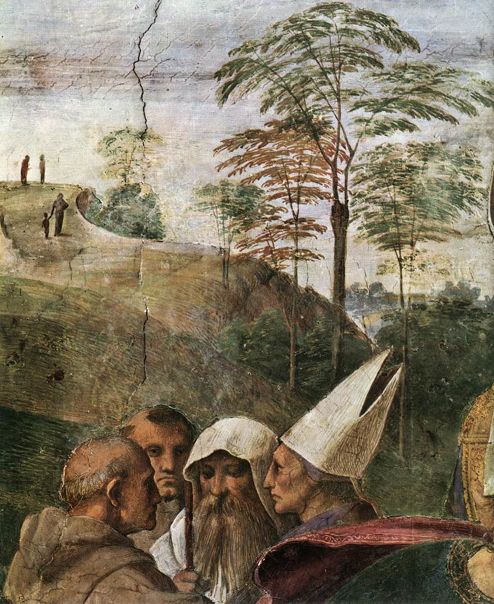

# Sessão 67 — A Presença Real e a transubstanciação

*Raphael, Disputation of the Sacrament (1509-1510). Public Domain via Wikimedia Commons.*

> *A Disputa do Sacramento, de Rafael: o céu e a terra reunidos ao redor de uma única hóstia branca. Esta é a Presença Real. Não símbolo, não metáfora — Cristo inteiro, oculto sob o menor véu possível. Ajoelhe-se.*

## São Pio X pergunta

**322.** Na Eucaristia há o mesmo Jesus Cristo que está no Céu e que nasceu na Terra de Maria Virgem?

*Na Eucaristia há o mesmo Jesus Cristo que está no Céu e que nasceu na Terra de Maria Virgem.*

**323.** Por que vós acreditais que Jesus Cristo está verdadeiramente na Eucaristia?

*Creio que Jesus Cristo está verdadeiramente na Eucaristia porque Ele mesmo chamou Corpo e Sangue seu o pão e o vinho consagrados e porque assim nos ensina a Igreja; mas é um mistério, e grande mistério.*

**324.** O que é a hóstia antes da consagração?

*A hóstia antes da consagração é pão.*

**325.** Após a consagração o que é a hóstia?

*Após a consagração a hóstia é o verdadeiro Corpo de Nosso Senhor Jesus Cristo sob as aparências do pão.*

**326.** No cálice antes da consagração o que se contém?

*No cálice, antes da consagração, se contém vinho com algumas gotas d'água.*

**327.** Após a consagração o que há no cálice?

*No cálice, após a consagração, há o verdadeiro Sangue de Nosso Senhor Jesus Cristo sob as aparências do vinho.*

## O Catecismo Romano ensina

[1] Se entre todos os Sagrados Mistérios que Nosso Senhor e Salvador nos confiou, como meios infalíveis para conferir a divina graça, não há nenhum que possa comparar-se com o Santíssimo Sacramento da Eucaristia: assim também não há crime que faça temer pior castigo da parte de Deus, do que não terem os fiéis devoção e respeito na prática de um Mistério, que é todo santidade, ou antes, que contém em si o próprio autor e fonte da santidade. Com muita perspicácia, alcançou o Apóstolo esta verdade e sobre ela nos advertiu em termos peremptórios. Tendo, pois, mostrado como era enorme o crime daqueles que não distinguem o Corpo do Senhor, acrescentou logo em seguida: “Por isso é que entre vós há tantos doentes e fracos, e muitos chegam a morrer”. Os pastores devem, portanto, esmerar-se na exposição de todos os pontos doutrinários, que mais realcem a majestade da Eucaristia, para que o povo cristão, compreendendo que deve tributar honras divinas a este celestial Sacramento, consiga os mais abundantes frutos da graça, e aparte de si a justíssima cólera de Deus.

> **Escritura.** *Quem come a minha carne e bebe o meu sangue permanece em mim e eu nele.* — João 6, 56

> *Senhor, Vós estais realmente ali. Tornai-me capaz de estar realmente ali também.*
