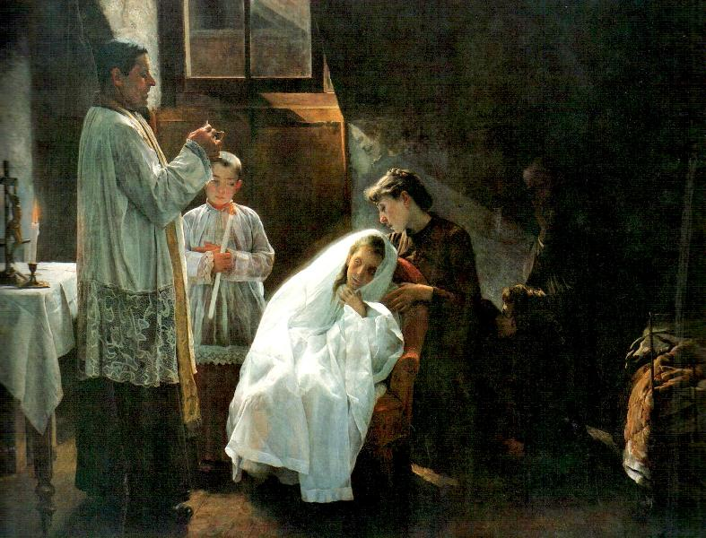

# Sessão 68 — Receber dignamente a Eucaristia

*Cristóbal Rojas, First Communion (1888). Public Domain via Wikimedia Commons.*

> *Uma menina de véu branco, mãos juntas, ajoelha-se na grade. A Primeira Comunhão é também o modelo das próximas dez mil. Aproxime-se do sacramento com o recolhimento que teria se fosse a última.*

## São Pio X pergunta

**328.** Quando o pão e o vinho se transformam em Corpo e Sangue de Jesus?

*O pão e o vinho se transformam em Corpo e Sangue de Jesus no momento da consagração.*

**329.** Após a consagração, não há mais nada do pão e do vinho?

*Após a consagração, não há mais nem pão nem vinho, mas permanecem somente as espécies ou aparências, sem a substância.*

**330.** O que são as espécies ou aparências?

*As espécies ou aparências são tudo o que cai sob os sentidos, como a figura, a cor, o odor, o sabor do pão e do vinho.*

**331.** Sob as aparências do pão há só o Corpo de Jesus Cristo, ou sob as do vinho há só o seu Sangue?

*Não, sob as aparências do pão há Jesus Cristo todo inteiro, com Corpo, Sangue, Alma e Divindade; assim como sob as do vinho.*

**332.** Quando se parte a hóstia em muitas partes, parte-se o Corpo de Jesus Cristo?

*Quando se parte a hóstia em muitas partes, não se parte o Corpo de Jesus Cristo, mas só as espécies do pão, e o Corpo do Senhor permanece inteiro em cada parte.*

**333.** Jesus Cristo encontra-se em todas as hóstias consagradas do mundo?

*Sim, Jesus Cristo encontra-se em todas as hóstias consagradas do mundo.*

## O Catecismo Romano ensina

## Disposições para a Comunhão

[54] A seguir, devemos expor quais disposições deve haver na alma dos fiéis, antes que eles recebam sacramentalmente a Eucaristia.

Em primeiro lugar, para que se reconheça que tal preparação é sumamente necessária, cumpre aduzir o exemplo de Nosso Salvador. Antes de dar aos Apóstolos o Sacramento do Seu precioso Corpo e Sangue, Cristo “lavou-lhes os pés, apesar de que [os Apóstolos] já estavam puros”. Queria, assim, indicar como devemos ter todo o cuidado de que nada falte à máxima pureza e retidão de nossa alma, quando vamos receber os Mistérios Eucarísticos.

Depois, devem os fiéis compreender o seguinte. Quem toma a Eucaristia, com boas e santas disposições, é provido com os mais abundantes dons da graça divina. Em razão inversa, quem comunga sem estar preparado, não só nenhum proveito tira, mas até incorre em muitos danos e prejuízos.

Como é notório, existe, nas coisas mais úteis e salutares, a propriedade de sortirem os melhores efeitos, quando aplicadas a propósito; e de causarem ruína e destruição, quando aplicadas fora do momento oportuno. Não é, pois, de estranhar, que estes imensos e preciosos dons de Deus nos ajudem, poderosamente, a conseguir a glória celestial, quando os recebemos com boas disposições; e que ao invés produzam em nós a morte eterna, se deles nos fazemos indignos [por falta de boa preparação].

Disso temos uma prova cabal no exemplo da Arca do Senhor, que os Israelitas prezavam acima de todas as coisas. Por ela, o Senhor lhes havia dispensado um sem-número dos maiores benefícios. Aos filisteus, porém, que a tinham roubado, a Arca da Aliança acarretou-lhes uma peste maligna, e um flagelo que os cobria de eterna vergonha. Assim também acontece com os alimentos. Quando ingeridos por um estômago bem disposto, sustentam e fortalecem o organismo. Se entram, porém, num estômago viciado, provocam até graves enfermidades.

[55] A primeira coisa que os fiéis devem fazer, como preparação, é distinguir entre mesa e mesa, entre esta Mesa Sagrada e as outras profanas, entre este Pão do céu e o pão comum. De fato faremos tal distinção, se crermos que ali está presente o verdadeiro Corpo e Sangue de Nosso Senhor, que os Anjos adoram no céu; a cujo aceno estremecem e vacilam as colunas do firmamento; e de cuja glória estão cheios o céu e a terra. Realmente, nisso consiste o “distinguir o Corpo do Senhor”, como recomendava o Apóstolo. Sem embargo, devemos antes reverenciar, silenciosos, a grandeza desse Mistério, em vez de querermos devassar a sua realidade com investigações impertinentes.

O segundo ponto de preparação, absolutamente indispensável, consiste em examinar-se cada qual a si mesmo, se vive em paz com os outros, se ama realmente ao próximo de todo o coração. “Portanto, se apresentas tua oferta diante do altar, e aí te lembras que teu irmão tem motivo de queixa contra ti, deixa a tua oferenda diante do altar, vai primeiro reconciliar-te com teu irmão, e vem depois fazer a tua oferta”.

Em seguida, devemos examinar, cuidadosamente, a nossa consciência, se não está talvez manchada de alguma culpa mortal, de que precisamos penitenciar-nos. Ela deve ser extinta, antes de comungarmos, pelo remédio da contrição e da Confissão. Pois o Santo Concílio de Trento decretou que ninguém pode receber a Sagrada Eucaristia, se a consciência o acusa de algum pecado mortal; embora se julgue contrita, deve a pessoa purificar-se, antes, pela Confissão sacramental, contanto que haja a presença de um sacerdote.

Afinal, devemos considerar, no silêncio de nossas almas, quanto somos indignos desta divina mercê que o Senhor nos dispensa. De todo o coração, repetiremos aquelas palavras do Centurião, a cujo respeito o próprio Salvador disse que não havia encontrado tanta fé em Israel: “Senhor, eu não sou digno de que entreis em minha casa”. Vejamos, outrossim, se podemos fazer nossa aquela declaração de São Pedro: “Senhor, Vós sabeis que eu Vos amo”. Pois não devemos esquecer: Aquele que, “sem a veste nupcial tomara lugar no banquete do Senhor, foi lançado num cárcere tenebroso”, e condenado a penas eternas.

[56] De mais a mais, não só a alma, mas também o corpo precisa de certas disposições. Para nos aproximarmos da Sagrada Mesa, devemos estar em jejum, de sorte que não tenhamos comido nem bebido nada em absoluto, desde a meia-noite antecedente até o momento de recebermos a Sagrada Eucaristia.

Requer ainda a dignidade de tão sublime Sacramento que as pessoas casadas se abstenham por alguns dias, a exemplo de David que, antes de receber do sacerdote os pães de proposição, afiançou que ele e seus soldados, desde três dias, estavam longe das esposas.

São estas, pouco mais ou menos, as condições principais que os fiéis devem levar em conta, a fim de se prepararem para uma frutuosa recepção dos sagrados Mistérios. Outras disposições ainda, que se refiram à preparação, podem facilmente reduzir-se aos pontos já especificados.

## Disposições para a Comunhão

[54] A seguir, devemos expor quais disposições deve haver na alma dos fiéis, antes que eles recebam sacramentalmente a Eucaristia.

Em primeiro lugar, para que se reconheça que tal preparação é sumamente necessária, cumpre aduzir o exemplo de Nosso Salvador. Antes de dar aos Apóstolos o Sacramento do Seu precioso Corpo e Sangue, Cristo “lavou-lhes os pés, apesar de que [os Apóstolos] já estavam puros”. Queria, assim, indicar como devemos ter todo o cuidado de que nada falte à máxima pureza e retidão de nossa alma, quando vamos receber os Mistérios Eucarísticos.

Depois, devem os fiéis compreender o seguinte. Quem toma a Eucaristia, com boas e santas disposições, é provido com os mais abundantes dons da graça divina. Em razão inversa, quem comunga sem estar preparado, não só nenhum proveito tira, mas até incorre em muitos danos e prejuízos.

Como é notório, existe, nas coisas mais úteis e salutares, a propriedade de sortirem os melhores efeitos, quando aplicadas a propósito; e de causarem ruína e destruição, quando aplicadas fora do momento oportuno. Não é, pois, de estranhar, que estes imensos e preciosos dons de Deus nos ajudem, poderosamente, a conseguir a glória celestial, quando os recebemos com boas disposições; e que ao invés produzam em nós a morte eterna, se deles nos fazemos indignos [por falta de boa preparação].

Disso temos uma prova cabal no exemplo da Arca do Senhor, que os Israelitas prezavam acima de todas as coisas. Por ela, o Senhor lhes havia dispensado um sem-número dos maiores benefícios. Aos filisteus, porém, que a tinham roubado, a Arca da Aliança acarretou-lhes uma peste maligna, e um flagelo que os cobria de eterna vergonha. Assim também acontece com os alimentos. Quando ingeridos por um estômago bem disposto, sustentam e fortalecem o organismo. Se entram, porém, num estômago viciado, provocam até graves enfermidades.

[55] A primeira coisa que os fiéis devem fazer, como preparação, é distinguir entre mesa e mesa, entre esta Mesa Sagrada e as outras profanas, entre este Pão do céu e o pão comum. De fato faremos tal distinção, se crermos que ali está presente o verdadeiro Corpo e Sangue de Nosso Senhor, que os Anjos adoram no céu; a cujo aceno estremecem e vacilam as colunas do firmamento; e de cuja glória estão cheios o céu e a terra. Realmente, nisso consiste o “distinguir o Corpo do Senhor”, como recomendava o Apóstolo. Sem embargo, devemos antes reverenciar, silenciosos, a grandeza desse Mistério, em vez de querermos devassar a sua realidade com investigações impertinentes.

O segundo ponto de preparação, absolutamente indispensável, consiste em examinar-se cada qual a si mesmo, se vive em paz com os outros, se ama realmente ao próximo de todo o coração. “Portanto, se apresentas tua oferta diante do altar, e aí te lembras que teu irmão tem motivo de queixa contra ti, deixa a tua oferenda diante do altar, vai primeiro reconciliar-te com teu irmão, e vem depois fazer a tua oferta”.

Em seguida, devemos examinar, cuidadosamente, a nossa consciência, se não está talvez manchada de alguma culpa mortal, de que precisamos penitenciar-nos. Ela deve ser extinta, antes de comungarmos, pelo remédio da contrição e da Confissão. Pois o Santo Concílio de Trento decretou que ninguém pode receber a Sagrada Eucaristia, se a consciência o acusa de algum pecado mortal; embora se julgue contrita, deve a pessoa purificar-se, antes, pela Confissão sacramental, contanto que haja a presença de um sacerdote.

Afinal, devemos considerar, no silêncio de nossas almas, quanto somos indignos desta divina mercê que o Senhor nos dispensa. De todo o coração, repetiremos aquelas palavras do Centurião, a cujo respeito o próprio Salvador disse que não havia encontrado tanta fé em Israel: “Senhor, eu não sou digno de que entreis em minha casa”. Vejamos, outrossim, se podemos fazer nossa aquela declaração de São Pedro: “Senhor, Vós sabeis que eu Vos amo”. Pois não devemos esquecer: Aquele que, “sem a veste nupcial tomara lugar no banquete do Senhor, foi lançado num cárcere tenebroso”, e condenado a penas eternas.

[56] De mais a mais, não só a alma, mas também o corpo precisa de certas disposições. Para nos aproximarmos da Sagrada Mesa, devemos estar em jejum, de sorte que não tenhamos comido nem bebido nada em absoluto, desde a meia-noite antecedente até o momento de recebermos a Sagrada Eucaristia.

Requer ainda a dignidade de tão sublime Sacramento que as pessoas casadas se abstenham por alguns dias, a exemplo de David que, antes de receber do sacerdote os pães de proposição, afiançou que ele e seus soldados, desde três dias, estavam longe das esposas.

São estas, pouco mais ou menos, as condições principais que os fiéis devem levar em conta, a fim de se prepararem para uma frutuosa recepção dos sagrados Mistérios. Outras disposições ainda, que se refiram à preparação, podem facilmente reduzir-se aos pontos já especificados.

> **Escritura.** *Pois o que come e bebe indignamente come e bebe a sua própria condenação, não distinguindo o corpo do Senhor.* — 1 Coríntios 11, 29

> *Senhor, jamais permitais que eu Vos coma por hábito. Fazei a Comunhão me sacudir. Fazei a Comunhão me curar.*
