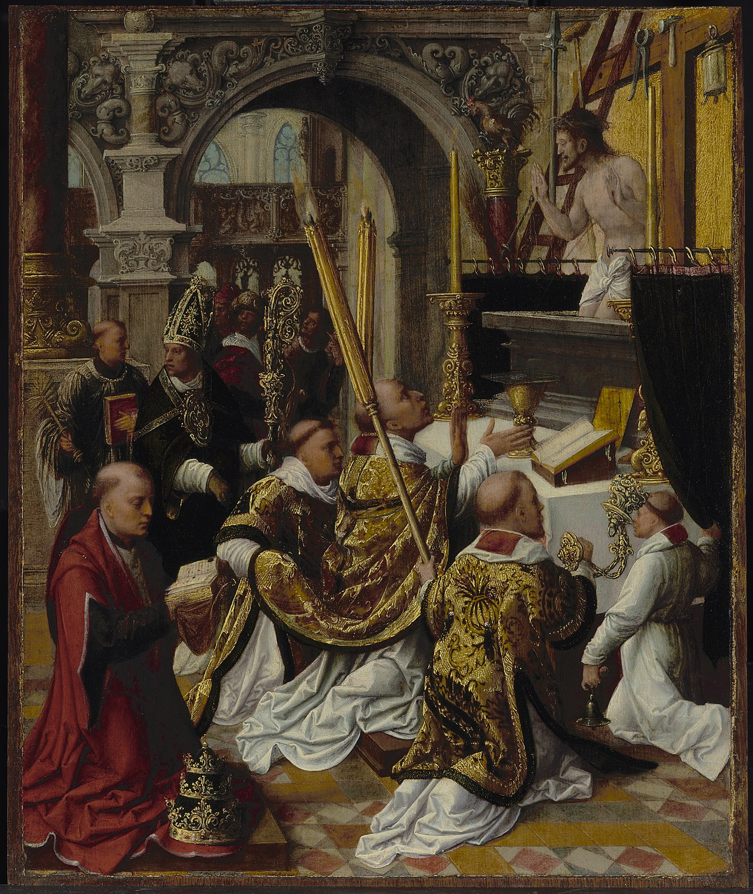

# Sessão 71 — A Missa como sacrifício

*Adriaen Ysenbrandt (Isenbrandt), The Mass of Saint Gregory (c. 1510-1550). Public Domain via Wikimedia Commons.*

> *O sacerdote eleva a hóstia no altar; atrás dele o povo se ajoelha. A Missa não é uma reunião comunitária com decoração sagrada — é o único Sacrifício do Calvário tornado presente, aqui, esta manhã. A coisa mais importante que está acontecendo na terra.*

## São Pio X pergunta

**346.** A Eucaristia é só um Sacramento?

*A Eucaristia não é só um Sacramento, mas é também o Sacrifício permanente do Novo Testamento e como tal se chama "Santa Missa".*

**347.** O que é o Sacrifício?

*O Sacrifício é a pública oferta a Deus de uma coisa que se destrói para professar que Ele é o Criador e Dono supremo, a quem tudo inteiramente é devido.*

**348.** O que é a Santa Missa?

*A Santa Missa é o Sacrifício do Corpo e do Sangue de Jesus Cristo que, sob as espécies do pão e do vinho, se oferece pelo sacerdote a Deus sobre o altar, em memória e renovação do Sacrifício da Cruz.*

**349.** O Sacrifício da Missa é o mesmo Sacrifício da Cruz?

*O Sacrifício da Missa é o mesmo Sacrifício da Cruz, só há diferenças no modo de realizá-lo.*

**350.** Que diferença há entre o Sacrifício da Cruz e o da Missa?

*Entre o Sacrifício da Cruz e o da Missa há esta diferença: que Jesus Cristo sobre a Cruz se sacrificou dando voluntariamente o próprio Sangue e mereceu todas as Graças por nós; pelo contrário, sobre o altar Ele, sem derramar Sangue, se sacrifica e se aniquila misticamente pelo ministério do sacerdote e aplica-nos os méritos do Sacrifício da Cruz.*

**351.** Para quais fins se oferece a Deus a Missa?

*A Missa se oferece a Deus para render-lhe o culto supremo de latria ou adoração, para agradecer-lhe por seus benefícios, para aplacá-lo e prestar-lhe satisfação pelos nossos pecados, e para obter Graças, a favor dos fiéis vivos e defuntos.*

**352.** A Missa não se oferece também aos Santos?

*A Missa não se oferece aos Santos, mas só a Deus, ainda quando se celebra em honra dos Santos: o Sacrifício é devido apenas ao Criador e Dono supremo.*

**353.** Somos obrigados a ouvir a Missa?

*Somos obrigados a ouvir a Missa aos domingos e outras festas de guarda; é útil, no entanto, assisti-la frequentemente, para participar do maior ato da Religião, sumamente agradável a Deus e meritório.*

**354.** Qual é o modo mais conveniente de assistir à Missa?

*O modo mais conveniente de assistir à Missa é oferecê-la a Deus em união com o sacerdote, rememorando o Sacrifício da Cruz, isto é, a Paixão e Morte do Senhor, e comungando: a Comunhão é união real com a Vítima imolada, e é por isso a maior participação no Santo Sacrifício.*

## O Catecismo Romano ensina

## A Eucaristia como Sacrifício

O que resta, agora, é encará-la como Sacrifício, para os pastores saberem quais são os pontos principais que, por decreto do Sagrado Concílio, devem ser explanados ao povo fiel, nos domingos e dias de festa.

[67] Este Sacramento não é apenas um tesouro de riquezas celestiais, que nos garante a graça e o amor de Deus, quando o usamos nas devidas disposições; mas tem ainda uma virtude particular, que nos põe em condições de agradecer a Deus os imensos benefícios que nos tem dispensado.

Um confronto nos fará compreender como deve ser agradável e bem aceita a Deus esta Vítima, uma vez que imolada segundo as prescrições da Lei. Dos sacrifícios da Antiga Aliança está escrito: “Não quisestes sacrifício nem oferenda”. E noutro lugar: “Se quisésseis um sacrifício, Eu certamente o teria oferecido; mas Vós não Vos comprazeis com holocaustos”. No entanto, esses mesmos sacrifícios eram tão agradáveis ao Senhor, que, no dizer da Escritura, “Deus os sorvia como um suave odor”. Ora, que não devemos, pois, esperar deste outro Sacrifício? Nele é imolado e oferecido Aquele mesmo, de quem por duas vezes se ouviu falar a voz do céu: “Este é o Meu Filho bem-amado, em quem pus as Minhas complacências”. Força é que os párocos se detenham bastante na exposição deste Mistério, para que os fiéis, por ocasião do culto divino, aprendam a meditar, com atenção e piedade, o Sagrado Sacrifício a que assistem.

[68] Antes do mais, os pastores ensinarão que Cristo instituiu a Eucaristia por duas razões. A primeira, para ser um alimento celestial de nossa alma, com que pudéssemos proteger e conservar em nós a vida espiritual.

A segunda razão era para que, na Igreja, houvesse um sacrifício perene, em reparação de nossos pecados, pelo qual o Pai do céu, a quem tantas vezes ofendemos gravemente com nossos crimes, se volvesse da cólera à misericórdia, e do justo rigor à clemência.

Como imagem e semelhança dessa finalidade, podemos considerar o Cordeiro Pascal, que os Filhos de Israel costumavam oferecer e comer, como Sacrifício e como Sacramento.

Na verdade, quando estava prestes a imolar-Se a Deus Padre no altar da Cruz, não podia Nosso Salvador dar prova mais cabal do Seu imenso amor para conosco, do que esta de deixar-nos um Sacrifício visível, em renovação daquele que pouco depois ia consumar-se na Cruz, de maneira cruenta, uma vez por todas, e cuja memória a Igreja havia de celebrar todos os dias, com o máximo proveito, em toda a redondeza da terra.

[69] Há, porém, uma grande diferença entre estas duas noções. O Sacramento é consumado pela Consagração. O Sacrifício tem toda a sua razão de ser no ato de ofertar. Por isso, quando conservada no cibório, ou levada a um enfermo, a Eucaristia tem caráter de Sacramento, que não de Sacrifício.

Enquanto é Sacramento, torna-se ela causa de mérito para quem recebe a Divina Hóstia, e confere-lhe todos os frutos espirituais, que acabamos de mencionar. Enquanto é Sacrifício, possui a virtude não só de merecer, como também de satisfazer. Assim como Cristo Nosso Senhor mereceu e satisfez por nós em Sua Paixão: da mesma forma, os que oferecem este Sacrifício, pelo qual se põem em comunhão conosco, merecem os frutos da Paixão de Nosso Senhor e prestam satisfação.

[70] Acerca da instituição deste Sacrifício, o Santo Concílio de Trento não deixa lugar a nenhuma dúvida. Pois declarou ter sido instituído por Cristo Nosso Senhor na Última Ceia; fulminou, ao mesmo tempo, a pena de excomunhão contra quem afirmasse que não se oferece a Deus um verdadeiro Sacrifício, no rigor da palavra, ou que a oblação sacrificial não consiste em outra coisa senão em dar-Se Cristo a Si mesmo como comida.

[71] O Concílio teve, porém, o cuidado de precisar que só a Deus se pode oferecer Sacrifício. Ainda que a Igreja costuma, às vezes, celebrar Missas em memória e honra dos Santos, contudo sempre ensinou que o Sacrifício é oferecido, não a eles, mas unicamente a Deus, que coroou os Santos de glória imortal.

Esta é a razão por que o sacerdote jamais dirá: “Ofereço-te este Sacrifício, ó Pedro, ou, ó Paulo”. Mas, oferecendo o Sacrifício só a Deus, rende-Lhe graças pela insigne vitória dos bem-aventurados Mártires, aos quais implora proteção, mas de tal maneira, “que no céu se dignem interceder por nós aqueles cuja memória celebramos na terra”.

[72] O que a Igreja Católica ensina acerca deste Sacrifício, como dogma de fé, foi por ela tirado das palavras de Nosso Senhor, quando naquela última noite confiou aos Apóstolos os próprios Mistérios Sagrados, e lhes disse: “Fazei isto em Minha memória”. Consoante a definição do Sagrado Concílio, foi nessa ocasião que Ele os instituiu sacerdotes, e lhes ordenou que eles mesmos e seus sucessores no ministério sacerdotal imolassem e oferecessem o Seu Corpo. Uma prova bastante clara desse fato está nas palavras que o Apóstolo escreveu aos Coríntios: “Não podeis, diz ele, beber o Cálice do Senhor e o cálice dos demônios; não podeis tomar parte na Mesa do Senhor e na mesa dos demônios”. Ora, se por “mesa dos demônios” devemos entender o altar em que lhes eram oferecidos sacrifícios, a “Mesa do Senhor” não pode significar outra coisa, senão o altar em que se sacrificava ao Senhor. Só nesse sentido é que as palavras do Apóstolo têm sua força de argumentação.

[73] Se buscarmos figuras e oráculos deste Sacrifício, no Antigo Testamento, encontraremos em primeiro lugar o que dele vaticinou Malaquias, com perfeita clareza: “Desde o nascer do sol até o ocaso, grande é o Meu Nome entre as nações; e, em todo lugar, é sacrificada e oferecida ao Meu Nome uma oblação pura, porque o Meu Nome é grande entre as nações, diz o Senhor dos exércitos”.

Ademais, antes e depois da promulgação da Lei, foi este Sacramento prefigurado por várias espécies de sacrifícios; pois todos os bens da salvação, significados por aqueles sacrifícios, estão contidos neste único Sacrifício, que constitui, por assim dizer, o remate e a consumação de todos os outros.

Entre eles, porém, não se pode considerar uma figura mais expressiva, do que o sacrifício de Melquisedec. O próprio Salvador, na última Ceia, ofereceu a Deus Padre Seu Corpo e Sangue, sob as espécies de pão e de vinho, e assim Se declarava constituído Sacerdote, segundo a ordem de Melquisedec.

[74] Dizemos, portanto, que o Sacrifício que se oferece na Missa, e o Sacrifício oferecido na Cruz são, e devem ser considerados como um único e mesmo Sacrifício. Da mesma forma, a Vítima é uma e a mesma, Cristo Senhor Nosso, que uma vez só Se imolou de modo cruento no altar da Cruz.

As vítimas, cruenta e incruenta, não são tampouco duas vítimas, mas constituem uma única, cuja imolação se renova todos os dias na Eucaristia, desde que o Senhor assim determinou: “Fazei isto em Minha memória!”

[75] Mas o Sacerdote também é o mesmo, Cristo Nosso Senhor. Pois os ministros que oferecem o Sacrifício, não fazem prevalecer a sua própria, mas a Pessoa de Cristo, quando consagram Seu Corpo e Sangue. É o que mostram as próprias palavras da Consagração. Não diz o sacerdote: “Isto é o Corpo de Cristo”, mas diz: “Isto é o Meu Corpo”. Representando, assim, a Pessoa de Cristo Nosso Senhor, converte a substância do pão e do vinho na verdadeira substância de Seu Corpo e Sangue.

[76] Nestes termos, é preciso ensinar, sem nenhuma hesitação, um ponto que também já foi exposto pelo Sagrado Sínodo: o Sacrossanto Sacrifício da Missa não é apenas um Sacrifício de louvor e ação de graças, ou uma simples comemoração do Sacrifício consumado na Cruz, mas é também um verdadeiro Sacrifício de propiciação, pelo qual Deus se torna brando e favorável a nosso respeito.

Por conseguinte, se imolarmos e oferecermos esta Vítima Sacratíssima, com pureza de coração, fé ardente, e profunda compunção de nossos pecados, podemos estar certos de que havemos de conseguir “do Senhor misericórdia e graça em tempo oportuno”.

Pois é tão agradável ao Senhor o perfume desta Vítima, que [por ela] nos dá os dons da graça e da penitência, e desta maneira nos perdoa os pecados. Este é o sentido daquela súplica oficial da Igreja: “Quantas vezes se celebra a memória deste Sacrifício, tantas vezes entra em ação a obra de nossa Redenção”. Noutros termos, este Sacrifício incruento derrama, então, sobre nós os ubérrimos frutos do Sacrifício cruento.

[77] Depois, ensinarão os párocos ser tal a virtude deste Sacrifício, que não só aproveita a quem oferece e a quem comunga, mas também a todos os fiéis cristãos, quer vivam ainda conosco aqui na terra, quer já tenham morrido no Senhor, sem estarem de todo purificados. A estes últimos não é aplicado com menos fruto do que se aplica aos vivos, por seus pecados, penas, satisfações, por qualquer desgraça e aflição. Assim o ensina, com absoluta certeza, a Tradição Apostólica.

[78] Por aqui vemos, sem mais dificuldade, que todas as Missas são comunitárias, porquanto dizem respeito ao bem e à salvação comum de todos os homens.

[79] Em torno deste Sacrifício se fazem muitas cerimônias, sobremaneira solenes e grandiosas. Nenhuma delas deve ser considerada inútil ou inexpressiva. Pelo contrário, todas elas têm por fim realçar a majestade de tão sublime imolação, e mover os fiéis, que contemplam os ritos salutares, a considerarem as realidades divinas que se ocultam nesse mesmo Sacrifício.

No entanto, não é mister tratarmos mais de perto este assunto: já porque sua explicação exorbita de nosso programa; já porque os sacerdotes podem ter à mão esses quase inumeráveis opúsculos e comentários, que sobre a matéria escreveram homens de notável piedade e erudição.

Com isso julgamos ter dito, com a ajuda de Nosso Senhor, o necessário sobre os pontos principais, que se referem à Eucaristia, como Sacramento e como Sacrifício.

> **Escritura.** *Temos um altar, do qual não podem comer os que servem ao tabernáculo.* — Hebreus 13, 10

> *Senhor, a Missa é o Calvário. Não me deixeis assistir como espectador. Fazei-me ajoelhar dentro dela.*
