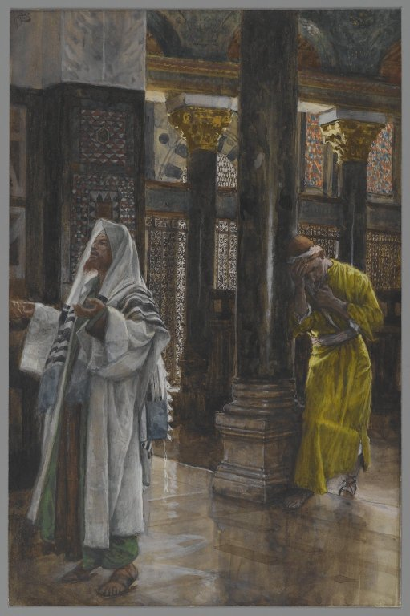

# Sessão 73 — Penitência — confissão e exame

*James Tissot, The Pharisee and the Publican (c. 1886-1894). Public Domain via Wikimedia Commons.*

> *Tissot pinta os dois que subiram a orar — o fariseu agradecendo a Deus por não ser como os outros, o publicano batendo no peito de longe. O exame de consciência não é autodepreciação — é a cortesia de uma alma prestes a pedir misericórdia. Faça a lista.*

## São Pio X pergunta

**361.** O que é a dor?

*A dor ou arrependimento é o desgosto e ódio dos pecados cometidos, que faz propor-nos a não mais pecar.*

**362.** De quantas espécies é a dor?

*A dor é de duas espécies: perfeita ou contrição, e imperfeita ou atrição.*

**363.** O que é a dor perfeita ou contrição?

*A dor perfeita ou contrição é o desgosto dos pecados cometidos porque são ofensas a Deus Nosso Pai, infinitamente bom e amável, e causa da Paixão e Morte de Nosso Redentor Jesus Cristo, Filho de Deus.*

**364.** Por que a contrição é dor perfeita?

*A contrição é dor perfeita porque nasce de um motivo perfeito, isto é, do amor filial a Deus ou Caridade, e porque nos obtém imediatamente o perdão dos pecados, embora permaneça a obrigação de confessá-los.*

**365.** O que é a dor imperfeita ou atrição?

*A dor imperfeita ou atrição é o desgosto dos pecados cometidos por medo dos castigos eternos e temporais, ou também pela feiura do pecado.*

**366.** Por que a atrição é dor imperfeita?

*A atrição é dor imperfeita porque nasce de motivos menos perfeitos e próprios de servos em vez de filhos, e porque não nos obtém o perdão dos pecados senão mediante o Sacramento.*

## O Catecismo Romano ensina

## As Três Partes da Penitência

[21] Em matéria de aplicação prática, como esta, não bastam as explicações genéricas. Por isso mesmo, devem os pastores entrar em todos os pormenores necessários, para que os fiéis possam ter uma compreensão da verdadeira penitência e de seus efeitos salutares.

Ora, além da matéria e forma, que ocorrem em todos os Sacramentos, é próprio deste Sacramento ter também aquelas partes já mencionadas, que constituem, por assim dizer, a perfeita integridade da Penitência: contrição, acusação, satisfação. Delas fala São João Crisóstomo nestes termos: "A penitência impele o pecador a suportar tudo de boa vontade. Em seu coração está o arrependimento; em sua boca, a acusação; em suas obras, plena humildade e proveitosa satisfação".

Dizemos partes, e nisso seguimos a linguagem comum, porque elas se assemelham a partes que são necessárias para constituir um todo perfeito. Por exemplo, o corpo humano compõe-se de muitos membros, mãos, pés, olhos, e outras partes semelhantes. Com razão é tido por imperfeito, se lhe faltar uma dessas partes, e por perfeito, se lhe não faltar nenhuma.

Assim, a Penitência de tal modo se compõe dessas três partes que, embora a contrição e acusação, justificando o homem, sejam bastantes para constituir a essência do Sacramento, todavia não fica aquela perfeitamente integrada, se não lhe acresce também a terceira das partes, que é a satisfação.

Por isso, tão estreita é a conexão entre estas partes, que o arrependimento inclui o propósito de confessar e satisfazer; a contrição e a intenção de satisfazer precedem à acusação; a satisfação, afinal, pressupõe as duas outras partes.

[22] Como razão de ser dessas três partes da Penitência, podemos alegar que os pecados contra Deus são precisamente cometidos por pensamentos, palavras e obras. Havia, pois, justiça e conveniência que, para nos sujeitarmos às chaves da Igreja, procurássemos aplacar a cólera de Deus, e conseguir d'Ele o perdão dos pecados, pelos mesmos meios, com que havíamos ultrajado a santíssima Majestade Divina.

Podemos, ainda, dar outra argumentação. A Penitência é uma espécie de compensação dos delitos, nascida da livre vontade do delinquente, mas sujeita ao arbítrio de Deus, contra quem se cometeu o pecado. Destarte, não só se requer a vontade de compensar, o que muito condiz com o caráter do arrependimento, mas também é necessária a submissão do penitente ao juízo do sacerdote, que faz as vezes de Deus, para que o mesmo possa determinar uma pena proporcional à gravidade dos pecados. Daí deduzimos, claramente, a razão e a necessidade, tanto da acusação, como da satisfação.

## A Confissão

[36] Os bons cristãos estão, geralmente, persuadidos de que as manifestações de santidade, piedade e religião que a imensa bondade de Deus até hoje conservou em sua Igreja, devem ser atribuídas, em grande parte, à Confissão.

Ninguém estranha, portanto, que o inimigo do gênero humano, querendo arrasar a fé católica, faça seus escravos e apaniguados lançarem mão de todos os meios para investir contra esse baluarte da virtude cristã. Desta persuasão geral podem os pastores inferir o cuidado e interesse, com que lhes incumbe explicar esta parte da Penitência.

Em primeira plana, ensinarão que para nós havia muita vantagem, digamos até, absoluta necessidade de que fosse instituída a Confissão. Reconhecemos, sim, que a contrição apaga os pecados, mas quem ignora que ela deve ser tão forte, tão intensa, e tão ardente, que a veemência da dor esteja em justa proporção com a gravidade dos pecados? Ora, como são muito poucos os que chegam a esse grau de arrependimento, segue-se que muito poucos poderiam, por esse meio, esperar o perdão de seus pecados.

[37] Por isso, era necessário que Nosso Senhor, em sua grande clemência, providenciasse um meio mais fácil para a salvação dos homens em geral. Assim o fez realmente, quando por um desígnio admirável entregou as chaves do Reino dos céus à sua Igreja. Com efeito, a fé católica nos propõe um ponto de doutrina, que todos devem aceitar e professar como dogma: Quando alguém confessa, sinceramente, seus pecados ao sacerdote, estando arrependido de os haver cometido, tendo ao mesmo tempo o propósito de não tornar a cometê-los, todos os seus pecados lhe são plenamente perdoados, em virtude do poder das chaves, ainda que a dor de sua contrição, de per si, não seja suficiente para impetrar a remissão dos pecados.

Com razão, pois, diziam os antigos Padres da Igreja, varões de insigne santidade, que as chaves da Igreja franqueiam as portas do céu. E ninguém pode, com razão, duvidar dessas palavras, pois lemos no decreto do Concílio de Florença que o efeito da Penitência é a absolvição dos pecados.

Existe ainda um fato, que nos leva a reconhecer quantas vantagens se tiram da Confissão. Pois vemos, por experiência, que nada contribui tanto para emendar os costumes de pessoas desviadas e corrompidas, como o confiarem, de vez em quando, os seus ocultos sentimentos, suas palavras e obras a um amigo fiel e ponderado, que lhes possa valer com seus préstimos e conselhos.

Pela mesma razão, devemos julgar de muito proveito que as pessoas, atormentadas pelos remorsos de suas culpas, exponham as doenças e chagas de sua alma ao sacerdote, que faz as vezes de Cristo aqui na terra, e ao qual foi imposta a mais estrita obrigação de sigilo. Nisso terão elas uma pronta medicação, não só para curar os seus achaques atuais, mas até para premunir a alma com um vigor celestial, que dali por diante há de preservá-la de futuras recaídas em tais pecados e misérias.

Afinal, não devem os pastores passar em silêncio a grande importância da Confissão, para o bem-estar e segurança da sociedade.

Se eliminarmos da vida cristã a Confissão Sacramental, é certo que em toda a parte se insinuarão crimes ocultos e nefandos; depois, os homens não terão vergonha de cometer, pùblicamente, outros crimes mais graves ainda, uma vez que se depravaram com o hábito de pecar. Ora, o pudor natural de confessar impõe uma espécie de freio à desenvoltura do pecado, e reprime os maus sentimentos do coração.

Acabando, pois, de expor as vantagens da Confissão, devem os pastores falar, agora, de sua natureza e virtude.

[38] A Confissão se define como uma acusação sacramental dos pecados, feita no intuito de alcançarmos perdão, mediante o poder das chaves.

Com propriedade dizemos ser uma acusação, porque os pecados não devem ser relatados, como se quiséramos fazer gala de nossos atos condenáveis, à semelhança dos que "se alegram de terem procedido mal"; nem devemos dizê-los com displicência, como se estivéssemos a recrear ouvidos ociosos com histórias amenas. Não, na intenção de acusar-nos a nós mesmos, devemos enumerar de tal forma os pecados, que também sintamos, em nosso coração, o desejo de penitenciá-los.

Todavia, se confessamos os pecados, é para alcançar o perdão. Nisso está, justamente, a enorme diferença entre este tribunal e as ações judiciais, que se movem contra crimes graves. Estas prevêem para o réu confesso pena e execução, em vez de isenção da culpa e condonação do delito.

Embora usassem de outros termos, era quase neste mesmo sentido que os Santos Padres definiam a Confissão. Haja vista ao que declarava Santo Agostinho: "Ela é uma declaração, pela qual se descobre uma doença oculta, na esperança do perdão". E São Gregório: "Confissão é detestação dos pecados". Ambas as afirmações se reduzem fàcilmente à nossa definição, porque nela estão contidas.

## Instituição da Confissão por Cristo

[39] Agora vem um ponto, a que se deve ligar a máxima importância. Os párocos ensinarão e dirão aos fiéis, com plena segurança, que este Sacramento foi instituído como efeito da infinita bondade e misericórdia de Cristo Nosso Senhor, que "fez bem todas as coisas", únicamente por causa de nossa salvação. Pois, estando os Apóstolos reunidos no mesmo lugar, Cristo bafejou-os com o Seu hálito, e disse-lhes: "Recebei o Espírito Santo. A quem perdoardes os pecados, ser-lhes-ão perdoados; e a quem os retiverdes, ser-lhes-ão retidos".

[40] Ora, desde que Nosso Senhor conferiu aos sacerdotes o poder de reterem e perdoarem pecados, torna-se evidente que também os instituiu juízes dessa matéria. Nosso Senhor parece ter dado isso mesmo a entender, quando incumbiu os Apóstolos de desprenderem, das ataduras a que estava ainda ligado, Lázaro ressuscitado dentre os mortos. Desta passagem fazia Santo Agostinho o seguinte comentário: "Os sacerdotes já podem prestar maiores serviços [do que os simples leigos]. Podem também usar de maior clemência para com os confessados, a quem conferem o perdão das culpas. Sem dúvida, quando Nosso Senhor por meio dos próprios Apóstolos entregou Lázaro ressuscitado aos Discípulos, para que estes o desatassem, queria mostrar como o poder de desligar fora entregue aos sacerdotes".

Foi também nesse sentido que Nosso Senhor mandou aos leprosos, curados durante o caminho, se apresentassem aos sacerdotes e se submetessem ao seu julgamento.

[41] Desde que Nosso Senhor conferiu aos sacerdotes o poder de reterem e perdoarem pecados, torna-se evidente que também os instituiu juízes dessa matéria. Ora, o Santo Concílio de Trento ponderou, com muita justeza, que não se pode julgar nenhum processo, nem moderar a justiça na aplicação de penas aos delitos, sem que haja pleno e absoluto conhecimento de causa. Donde se deduz lògicamente que, pela confissão dos penitentes, todos os pecados devem ser discriminados um por um aos sacerdotes.

Esta é a doutrina que os pastores hão de ensinar, de acordo com a definição do Sagrado Concílio de Trento, e com a tradição constante da Igreja Católica.

Se, pois, percorrermos com atenção os Santos Padres, encontraremos a cada passo os mais inequívocos testemunhos, a comprovarem que este Sacramento foi instituído por Cristo Nosso Senhor, e que o preceito da Confissão Sacramental, designada pelos Santos Padres com os vocábulos gregos de "exomológesis" e "exagóreusis", tem o caráter de uma lei evangélica.

Se quisermos recorrer às figuras do Antigo Testamento, é indubitável que se referiam à confissão dos pecados, as diversas categorias de sacrifícios que os sacerdotes ofertavam, em expiação das várias espécies de pecados.

[42] Além de saberem que a Confissão foi instituída por Nosso Senhor e Salvador, devem os fiéis tomar conhecimento de que a Igreja, por sua própria autoridade, lhe acrescentou certos ritos e cerimônias solenes. Embora não constituam a essência do Sacramento, fazem todavia realçar a sua grandeza e afervoram os piedosos corações dos penitentes, para que consigam, mais fàcilmente, a graça de Deus.

Quando, pois, prostrados aos pés do sacerdote, de cabeça descoberta, com o rosto inclinado para a terra, com as mãos erguidas num gesto de súplica, e com outros sinais de humildade cristã, que não são necessários para a validade do Sacramento, confessamos então os nossos pecados: acode-nos logo a lembrança nítida de que devemos não só reconhecer a celestial virtude deste Sacramento, mas também procurar e pedir a misericórdia divina, com todas as veras de nossa alma.

[43] Não pense alguém que Nosso Senhor instituiu a Confissão, mas sem determinar que fosse de uso obrigatório. Devem os fiéis estar certos de que toda pessoa, onerada de culpa grave, não pode reintegrar-se na vida sobrenatural, senão pelo Sacramento da Confissão.

Disso temos um sinal evidente na belíssima metáfora usada por Nosso Senhor, quando Ele deu o nome de chave dos céus ao poder de administrar este Sacramento. Como ninguém pode entrar num recinto fechado, sem a intervenção de quem guarda as chaves: assim também não será admitida pessoa alguma no céu, se as portas lhe não forem abertas pelos sacerdotes, a cuja discrição Nosso Senhor entregou as chaves.

Do contrário, nenhum valor teria, na Igreja, o exercício do poder das chaves. Se houvesse outro meio de franquear a entrada, debalde o detentor das chaves excluiria alguém de entrar no céu. Santo Agostinho reconheceu essa situação, com muita perspicácia, quando assim se externava: "Ninguém diga de si para consigo: Eu faço penitência às ocultas, na presença do Senhor. Deus sabe o que me vai na alma, e me dará perdão. Seriam, então, infundadas aquelas palavras: O que desligardes na terra, será desligado também no céu? Será que as chaves foram confiadas, inùtilmente, à Igreja de Deus?"

A mesma opinião expende Santo Ambrósio no seu Livro sobre a Penitência, onde confuta a heresia dos Novacianos, segundo os quais o poder de perdoar pecados deve reservar-se exclusivamente a Deus Nosso Senhor. "Queria eu saber, diz ele, quem honra mais a Deus: aquele que obedece às Suas ordens, ou aquele que Lhe opõe resistência? Deus mandou-nos obedecer aos Seus ministros. Quando, pois, lhes obedecemos, sòmente a Deus é que prestamos homenagem".

> **Escritura.** *Se confessarmos os nossos pecados, Ele é fiel e justo para nos perdoar os pecados e nos purificar de toda iniquidade.* — 1 João 1, 9

> *Senhor, esta noite iluminai o que escondi hoje. Mostrai-me o que devo trazer.*
