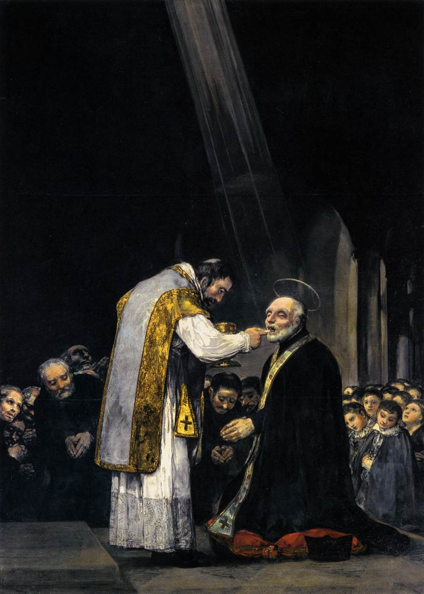

# Sessão 77 — Extrema-unção — a unção dos enfermos

*Francisco de Goya, The Last Communion of Saint Joseph of Calasanz (1819). Public Domain via Wikimedia Commons.*

> *A sala da morte de Van der Weyden: o sacerdote junto ao leito, o óleo da unção brilhando sobre a fronte. O último sacramento prepara não só para a morte, mas para o que está do outro lado dela. Reze pelos que morrem. Alguns não têm mais ninguém.*

## São Pio X pergunta

**392.** O que é a Extrema-Unção?

*A Extrema-Unção, chamada também de Óleo santo, é o Sacramento instituído para consolação espiritual e mesmo corporal dos cristãos gravemente enfermos.*

**393.** Quem é o ministro da Extrema-Unção?

*O ministro da Extrema-Unção é o sacerdote pároco, ou outro sacerdote que tenha sua permissão.*

**394.** Como o sacerdote administra a Extrema-Unção?

*O sacerdote administra a Extrema-Unção ungindo em forma de cruz, com o óleo benzido pelo Bispo, os órgãos dos sentidos do enfermo, dizendo: "Por esta santa Unção e por sua piíssima misericórdia, o Senhor te perdoe tudo o que de mal fizeste com os olhos, com os ouvidos, etc. Amém."*

**395.** Que efeitos produz a Extrema-Unção?

*A Extrema-Unção aumenta a Graça santificante; apaga os pecados veniais, e inclusive os mortais que o enfermo, atrito, não pudesse confessar; dá força para suportar pacientemente os males, resistir às tentações e morrer santamente; e ajuda inclusive a recuperar a saúde, se é bom para a alma.*

**396.** Quando se pode dar o Óleo santo?

*O Óleo santo se pode dar quando a doença é perigosa, e é bom dá-lo imediatamente após a Confissão e o Viático, enquanto o doente conserva a consciência.*

## O Catecismo Romano ensina

## Extrema-Unção e lembrança da morte

[1] "Em todas as tuas obras, lembra-te dos teus novíssimos, e nunca chegarás a pecar".[^1] Estas santas palavras das Escrituras são uma tácita advertência aos párocos de que não percam nenhuma ocasião de exortar os fiéis a entreter-se com a assídua meditação da morte.

Como o Sacramento da Extrema-Unção traz forçosamente consigo a recordação daquele último dia, desde logo se compreende a necessidade de sempre tornar a explicá-lo, não só pela máxima conveniência de versar os Mistérios relativos à salvação, como também para que os fiéis reprimam as paixões desordenadas, quando se recordam de que a todos foi imposta a necessidade de morrer.

Outro efeito dessa explicação é que os fiéis se sentem menos perturbados na iminência da morte, e dão até infinitas graças a Deus, porque instituiu o Sacramento da Extrema-Unção, para que tivéssemos, na saída desta vida mortal, um caminho mais rápido para o céu, da mesma forma que, pelo Sacramento do Batismo, já nos havia aberto uma porta para a vida verdadeira.

## Razão do nome

[2] Para explicarmos os pontos capitais, na mesma ordem que se observou na exposição dos demais Sacramentos, começaremos por dizer que este Sacramento se chama Extrema-Unção, porque de todas as sagradas unções, prescritas por Nosso Senhor em sua Igreja, esta é a última na ordem de administração.

Por isso, os nossos antepassados também lhe chamaram Unção dos enfermos e Sacramento dos moribundos[^2], nomes que por si mesmos fazem despertar nos fiéis a lembrança daquele novíssimo.

## Verdadeiro Sacramento

[3] Em primeira plana, é preciso demonstrar que a Extrema-Unção possui o caráter de verdadeiro Sacramento. Far-se-á com a maior clareza, se analisarmos as palavras com que o Apóstolo Santiago promulgou a obrigatoriedade deste Sacramento. Diz ele: "Há entre vós algum enfermo? Mande chamar os sacerdotes da Igreja para rezarem sobre ele, e ungirem-no com óleo, em nome do Senhor. E a oração da fé salvará o enfermo, e o Senhor lhe dará alívio. E, se estiver em pecados, ser-lhe-ão perdoados".[^3]

Quando o Apóstolo diz que os pecados são perdoados, quer por aí declarar a ação e a natureza de um Sacramento. Esta foi sempre a inalterável doutrina da Igreja Católica acerca da Extrema-Unção, conforme o testemunharam não só muitos outros Concílios[^4], mas antes de tudo o Concílio de Trento, que chegou até a fulminar pena de excomunhão contra quem ousasse ensinar ou pensar de outra maneira.[^5] O Papa Inocêncio I também recomendou muito aos fiéis este Sacramento.[^6]

## Um só Sacramento

[4] Com toda a insistência, devem os pastores ensinar que aqui temos um verdadeiro Sacramento, por sinal que um só, e não vários Sacramentos, apesar de administrado com muitas unções, empregando-se, para cada qual, orações e fórmulas especiais.

O Sacramento constitui uma unidade, não por uma junção indivisível de suas partes, mas porque cada uma delas contribui para a sua perfeita integridade, assim como acontece em todas as outras coisas que se componham de várias partes. Uma casa, por exemplo, se compõe de muitas partes diferentes, e sua perfeição está na unidade da planta. Assim, este Sacramento também se compõe de várias coisas e palavras; no entanto, constitui um só sinal, e tem a eficácia de produzir o efeito único por ele significado.

## Matéria e forma

Os párocos ensinarão, outrossim, quais são as partes deste Sacramento, digamos melhor, o elemento e a palavra. Santiago não deixou de mencioná-las.[^7] Numa e outra há Mistérios que merecem a nossa atenção.

### 1. Matéria, azeite doce sagrado pelo Bispo

[5] Consoante as definições dos Sagrados Concílios, entre os quais avulta o Tridentino[^8], o elemento ou matéria deste Sacramento é o óleo consagrado pelo Bispo, não qualquer líquido consistente e gorduroso, mas só o azeite extraído dos bagos de oliveira.

Esta matéria assinala, com muita propriedade, o efeito intrínseco que o Sacramento produz na alma. Pois, assim como o azeite doce serve, ótimamente, para mitigar as dores do corpo, assim também a virtude do Sacramento atenua a dor e aflição da alma.

O azeite tem ainda por efeito restituir a saúde, despertar alegria, alimentar o clarão e a luz; presta-se, também, para revigorar o corpo aquebrantado pela fadiga.

Ora, todas estas qualidades [do azeite] simbolizam os efeitos que, por virtude divina, produz no enfermo a administração deste Sacramento. Tanto basta acerca da matéria.

### 2. Forma é uma súplica

[6] A forma sacramental consiste nos dizeres da solene deprecação, que o sacerdote profere, ao aplicar cada uma das unções. Seu teor é o seguinte: "Por esta santa Unção, Deus te perdoe tudo quanto fizeste de mal pela vista... pelo olfato... pelo tacto..."[^9]

Tal é a forma autêntica e própria deste Sacramento, como o dá a entender o Apóstolo Santiago com as palavras: "E rezem sobre ele, e a oração da fé salvará o enfermo".[^10] Delas se conclui, também, que a forma deve ser deprecatória, embora o Apóstolo não indicasse o teor exato de sua redação.

Entretanto, esse teor chegou até nós, por fiel tradição dos Santos Padres, de sorte que todas as igrejas conservam a mesma forma empregada pela Santa Igreja de Roma, que é a Mãe e Mestra de todas as igrejas.

Nessa forma, há variantes de palavras. Por exemplo, em lugar de "perdoe-te Deus, etc.", dizem algumas liturgias "remita" ou "indulte", ou também "sare"[^11], tudo quanto de mal fizeste. Isso, porém, não traz nenhuma alteração de sentido. Por conseguinte, é fato averiguado que, em todas as igrejas, se observa rigorosamente a mesma forma [sacramental].

### a) Motivo da deprecação

[7] Ninguém deve estranhar o seguinte. Nos demais Sacramentos, a forma declara, de modo absoluto, o efeito que ela produz — por exemplo, quando dizemos: "Eu te batizo", "Eu te assinalo com o sinal da Cruz" — ou vem expressa em termos de intimação, como acontece no Sacramento da Ordem: "Recebe o poder, etc.". Mas a forma da Extrema-Unção é a única que consiste numa deprecação.

Na verdade, isso tem sua boa razão de ser. A finalidade deste Sacramento, além da graça espiritual que confere, é restituir ao doente a saúde do corpo. Ora, como os enfermos nem sempre conseguem recobrar a saúde, emprega-se a forma deprecatória, para alcançar da bondade de Deus um efeito que a virtude do Sacramento não costuma produzir, com infalível regularidade.

### b) Outras orações concomitantes

Há também ritos próprios, para a administração deste Sacramento; consistem, em grande parte, nas deprecações que o sacerdote faz para pedir a saúde do enfermo. Nenhum outro Sacramento é ministrado com a recitação de tantas preces. Sobejam razões para isso, pois nessa ocasião é que os fiéis mais precisam de ser ajudados com piedosas súplicas. Por conseguinte, todas as outras pessoas que assistirem ao ato, mas principalmente o próprio pároco, devem rezar a Deus de todo o coração, e com muito fervor recomendar à Sua misericórdia a vida e a saúde do enfermo.

## Instituição por Cristo

[8] Ficou provado que a Extrema-Unção pertence ao número dos Sacramentos, em sentido próprio e verdadeiro. Segue-se, portanto, que sua instituição remonta a Cristo Nosso Senhor. Mais tarde, foi proposta e inculcada aos fiéis pelo Apóstolo Santiago.

### 1. Fato bíblico

No mais, ao que parece, Cristo já havia instituído uma unção semelhante, quando enviou Seus Discípulos, dois a dois, diante de Si.[^12] Deles escreveu o Evangelista: "Postos a caminho, pregavam que fizessem penitência. Expulsavam muitos demônios. Ungiam com óleo muitos enfermos, e eles saravam".[^13] Devemos, pois, admitir que essa unção não foi inventada pelos Apóstolos, mas prescrita por Nosso Senhor, não dotada de qualquer virtude natural, mas cheia de mistério, instituída mais para curar as almas do que para socorrer ao corpo.

### 2. Testemunhos dos SS. Padres

Assim o testemunham São Dionísio, Santo Ambrósio, São João Crisóstomo, e São Gregório Magno. Não resta, pois, nenhuma dúvida. Com profundo respeito, devemos considerar na Extrema-Unção um dos sete Sacramentos da Igreja Católica.

## Sujeito

### 1. Não os sãos, nem os fanáticos

[9] Outro ponto que os fiéis devem aprender. Este Sacramento destina-se para todos, mas excetuam-se certas classes de pessoas a que não pode ser ministrado.

Em primeiro lugar, são excluídas as pessoas que estejam em gozo de perfeita saúde. Não se deve administrar-lhes a Extrema-Unção, de acordo com o ensinamento do Apóstolo: "Há algum enfermo entre vós?" Prova-o também um simples raciocínio, porquanto foi instituída para remédio, não só da alma, mas também do corpo.

### 2. Mas só os doentes em perigo de morte

Como só precisam de medicação os que estão doentes, assim também este Sacramento só pode ser ministrado aos que sofrem de doença tão grave, que para eles haja o perigo de um desenlace fatal. Isto não obstante, cometem falta muito grave os responsáveis que, para ungir o doente, aguardam o momento em que o mesmo, já sem nenhuma esperança de salvar-se, começa a perder a vida e os sentidos.[^14]

### Com possível lucidez de espírito

Pois é certo que muito concorre para intensificar a graça sacramental, se o doente recebe a unção dos Sagrados Óleos com plena lucidez de espírito, e pode ainda despertar sentimentos de fé e piedade. Nisso vai uma advertência aos párocos, para aplicarem este celestial remédio, de per si tão salutar, enquanto virem que os doentes o podem tornar mais eficaz ainda, pelo fervor de suas próprias disposições.

### 3. Não os sãos que vão expor-se em perigo de vida

Não se deve, pois, dar o Sacramento da Extrema-Unção a quem não estiver gravemente enfermo, ainda que se exponha a perigo de vida, como acontece aos que se aprestam para uma navegação arriscada, ou que entram em batalha, com perigo de morrer, ou que são levados ao suplício, por sentença capital.

### 4. Nem as crianças, os dementes, os loucos furiosos

Além disso, não são capazes de receber este Sacramento todos os que estão privados do uso da razão: as crianças que não cometem pecados, cujos resíduos devam ser purificados por este Sacramento; os alienados e loucos furiosos, a não ser que tenham intervalos lúcidos, durante os quais mostrem sentimentos religiosos, e peçam a Extrema-Unção.

Não pode, porém, receber a Extrema-Unção quem é louco de nascença. Deve todavia ser ungido o enfermo que pedira o Sacramento, enquanto estava com juízo perfeito, e só depois caiu em loucura furiosa.

### 5. Ungem-se só os órgãos dos sentidos

[10] Não se devem ungir todas as partes do corpo, mas sòmente aquelas que a natureza assinalou, no homem, como instrumentos dos sentidos: os olhos, por causa da vista; as orelhas, por causa da audição; o nariz, por causa do olfato; a boca, por causa do paladar e da linguagem; as mãos, por causa do tacto que, embora distribuído pelo corpo inteiro, tem nessa parte sua esfera principal.[^15]

A Igreja Universal conserva esta maneira de ungir, porque se adapta, engenhosamente, ao caráter deste Sacramento, instituído à semelhança de um remédio. Nas doenças corporais, ainda que o corpo esteja todo atacado, não se aplica o remédio senão na parte onde está localizada a fonte e causa da enfermidade. Assim, também, não se unge o corpo inteiro, mas só os membros, que são os órgãos principais das sensações; por igual, são ungidos os rins como centro das paixões libidinosas[^16], e os pés como instrumentos naturais de transporte e locomoção.[^17]

### 6. Repete-se a Extrema-Unção, todas as vezes que aparecer novo perigo de vida

[11] Força é atender que, na mesma doença, enquanto o doente estiver no mesmo perigo de vida, só se pode ministrar uma vez a Extrema-Unção.[^18] Se convalescer depois da Unção, o doente poderá ter o socorro deste Sacramento, todas as vezes que cair em novo perigo de vida. Isso mostra que a Extrema-Unção pertence aos Sacramentos que podem ser reiterados.[^19]

### 7. Disposições do sujeito

#### a) Estado de graça

[12] É preciso cuidar, com todo o escrúpulo, que a graça deste Sacramento não seja sustada por nenhum óbice. Como nada lhe faz maior obstáculo, do que a consciência de um pecado mortal, cumpre observar o costume que a Igreja Católica sempre manteve, de ministrar-se antes da Extrema-Unção os Sacramentos da Penitência e da Eucaristia.

#### b) Fé e confiança

Depois, procurem os párocos induzir o enfermo a que se faça ungir pelo sacerdote, naquela mesma fé com que as pessoas se apresentavam outrora, para serem curadas pelos Apóstolos.

Em primeiro lugar, devemos pedir a salvação da alma, depois a saúde do corpo, mas com a ressalva: "Se a saúde for útil para a glória eterna".

Para os fiéis, não pode haver a menor dúvida de que Deus atende aquelas santas e solenes orações, recitadas pelo sacerdote, não em seu próprio nome, mas em nome da Igreja e de Nosso Senhor Jesus Cristo.

A razão decisiva para exortar os enfermos a que peçam, com fé e piedade, a administração desta salubérrima Unção Sacramental, é que a luta então recrudesce, enquanto as forças da alma e do corpo começam a desfalecer.

## Ministro: o Sacerdote

[13] Da boca do mesmo Apóstolo, que promulgou o preceito de Nosso Senhor, ficamos também sabendo quem é o ministro da Extrema-Unção. Conforme bem explicou o Concílio de Trento[^20], quando o Apóstolo diz que "chame os presbíteros"[^21], não quer por esta palavra designar os mais idosos[^22], nem os mais nobres do povo, mas os sacerdotes validamente ordenados pelos próprios Bispos, mediante a imposição das mãos.

### 1. Por sinal que o próprio pároco

Ao sacerdote, pois, está confiada a administração deste Sacramento.[^23] No entanto, por determinação da Santa Igreja, não é lícito a qualquer sacerdote administrar este Sacramento, mas sòmente ao próprio pároco jurisdicionado, ou a outro sacerdote que receba dele a autorização de substituí-lo.[^24]

### 2. Em nome de Cristo

Acima de tudo, não se perca de vista que, nessa administração, como aliás em todos os mais Sacramentos, o sacerdote faz as vezes de Cristo Nosso Senhor e da Santa Igreja, Sua Esposa.

## Efeitos

[14] Devemos também esmerar-nos na explicação das vantagens que se tiram deste Sacramento, para que os fiéis, se não o fizerem por nenhum outro motivo, ao menos sejam levados a recebê-lo em seu próprio interesse; porque uma propensão natural nos faz avaliar quase todas as coisas pela medida de nossas conveniências pessoais.

### 1. Perdão dos pecados

Ensinem, pois, os pastores que a graça, conferida por este Sacramento, apaga os pecados, principalmente os mais leves, os que se conhecem por veniais; as faltas mortais são tiradas pelo Sacramento da Penitência. A Extrema-Unção não foi instituída com o fito primordial de extinguir pecados graves; sòmente o Batismo e a Penitência é que o fazem, em virtude de sua própria finalidade.[^25]

### 2. Coragem e confiança

Outro fruto da Sagrada Unção é livrar a alma da indolência e fraqueza, contraída por seus pecados, bem como de todos os outros remanescentes do pecado. Certamente, o tempo mais oportuno para essa cura é a ocasião em que somos atormentados por doença grave, quando nos ameaça perigo de vida.

### Na hora da morte

Por natureza, o homem nada mais teme, neste mundo, do que a morte. Ora, esse temor agrava-se, sobremaneira, com a lembrança dos pecados passados, mormente quando a consciência nos oprime com temerosas recriminações; pois está escrito: "Comparecerão medrosos com a lembrança de seus pecados, e suas iniquidades levantar-se-ão contra eles, para os acusar".[^26]

### No tribunal de Deus

Muito aflitiva é também a lembrança de que, dentro em breve, é preciso apresentar-nos ao tribunal de Deus que, segundo nossos merecimentos, há de proferir sobre nós uma sentença de inexorável justiça. Não raras vezes acontece que, sob a influência desse terror, os fiéis sentem uma perturbação extraordinária.

De outro lado, nada contribui tanto para uma morte tranquila, como o lançarmos fora a tristeza, e aguardarmos com alegria a vinda do Senhor[^27], prontos a restituir-Lhe de boa vontade o nosso depósito[^28], em qualquer hora que o queira exigir. Ora, o Sacramento da Extrema-Unção tem por efeito livrar dessa angústia os corações dos fiéis, e encher-lhes a alma de santa e piedosa alegria.

### 3. Força contra o espírito maligno

Pela Extrema-Unção, conseguimos ainda outro fruto que, por boas razões, é considerado como o maior de todos. Enquanto vivemos, o inimigo do gênero humano não deixa jamais de premeditar a nossa ruína e destruição; mas, para alcançar nossa perda completa, e, possivelmente, para nos tirar toda a esperança na misericórdia divina, em tempo algum investe com mais força, senão quando vê aproximar-se o último dia de nossa vida. Por isso é que este Sacramento fornece aos fiéis armas e recursos com que possam quebrar a violenta arrancada do inimigo, e opor-lhe a mais tenaz resistência. A alma toma novo alento pela esperança na bondade divina, e, assim confortada, suporta mais facilmente todos os incômodos da doença, e com menos custo desfaz a rija astúcia do próprio demônio, que lhe insidia o calcanhar.[^29]

### 4. Recuperação da saúde corporal

Como fruto final, acresce a saúde do corpo, todas as vezes que for de proveito. Se na época atual[^30] muitos doentes não recuperam a saúde, não é por defeito do Sacramento; devemos antes admitir que não há bastante fé na maior parte daqueles que recebem ou administram a Extrema-Unção. Com razão diz o Evangelista que Nosso Senhor deixou de fazer muitos milagres, entre os seus compatriotas, "por causa da incredulidade que havia entre eles".[^31]

Muito embora, quanto mais a Religião Cristã se vai arraigando profundamente no coração dos homens, não erramos em afirmar que ela já não carece do auxílio de tais milagres, naquela mesma proporção que se tornavam necessários nas primeiras origens da Igreja. Ainda assim, devemos nesse ponto estimular vivamente a nossa fé.

### Segundo os desígnios de Deus

Sem embargo do que Deus, em Seus desígnios, aprouver determinar acerca da saúde corporal, cumpre que os fiéis tenham a firme esperança de alcançar a saúde espiritual, e de sentirem em si, quando sobrevier a morte, os salutares efeitos daquelas palavras das Escrituras: "Bem-aventurados os mortos que morrem no Senhor!"[^32]

Até aqui o tratado sobre a Extrema-Unção. Verdade é que o damos resumido, mas se os pastores desenvolverem mais amplamente estes pontos capitais, com o zelo que o assunto demanda, não há a menor dúvida de que os fiéis colherão, desta doutrina, os mais abundantes frutos de piedade.

[^1]: Eccli 7, 40.
[^2]: Em latim, é mais expressivo: Sacramentum exeuntium — Sacramento dos que partem.
[^3]: Jac 5, 14 ss.
[^4]: II Conc. de Pavia em 850, I Conc. de Lião em 1274, Conc. de Constança em 1414, Conc. de Florença em 1438 (DU 315 465 669 700).
[^5]: Conc. Trid. XIV de Extr. Unctione cap. 3 can. 1 (DU 909 926).
[^6]: Innoc. I epist. 25, 8 (DU 99).
[^7]: Jac 5, 14.
[^8]: Conc. Trid. XIV de Extr. Unctione cap. 1 (DU 908).
[^9]: O CRO resume, ao citar, as palavras do Ritual. Cfr. Rit. Rom. cap. II nº 8-10.
[^10]: Jac 5, 14-15.
[^11]: Difícil de traduzir, porque em vernáculo os termos se confundem: Indulgère, remìttere, párcere.
[^12]: Mc 6, 7.
[^13]: Mc 6, 12 ss.
[^14]: Isto se refere ao sacerdote em primeiro lugar, mas também aos parentes do enfermo, que chamam o sacerdote no último instante. Ora, se chamar tarde é pecado, que dizer então dos que deixam de chamar o sacerdote?
[^15]: O CRO não se refere aqui aos pés, por não constituírem propriamente um sentido, mas apenas um órgão de locomoção.
[^16]: O CIC suprimiu a unção dos rins (cân. 947 § 2).
[^17]: A unção dos pés pode ser omitida, por qualquer motivo razoável (CIC cân. 947 § 3).
[^18]: Na mesma doença, pode haver várias crises perigosas.
[^19]: Noldin e outros autores opinam, com S. Afonso de Ligório, que a Extrema-Unção pode repetir-se após um mês, porque nesse ínterim o primeiro perigo já passou. Noldin afirma que, em certas doenças, como asma e tuberculose, o perigo pode passar em menos tempo, digamos, após uma semana. Nesse caso, pode repetir-se a Extrema-Unção, para que o doente não fique privado de todos os seus frutos (Noldin III lib. VI q. V nº 488).
[^20]: Conc. Trid. XIV cap. 3 can. 4 (DU 910 929).
[^21]: Jac 5, 14.
[^22]: Segundo o étimo grego, presbítero quer dizer ancião.
[^23]: CIC cân. 938.
[^24]: O que amiúde acontece onde há escassez de Clero, como no Brasil.
[^25]: Acidentalmente, a Extrema-Unção confere a graça primeira, quando já não é possível a Confissão, contanto que haja contrição e o desejo de confessar-se, se fora possível. — O CRO não realça um efeito importante da Extrema-Unção. Quando recebida em boas disposições, a Extrema-Unção extingue os castigos temporais do pecado; livra, portanto, do Purgatório.
[^26]: Sap 4, 20.
[^27]: Tit 2, 13.
[^28]: 2 Tim 1, 12.
[^29]: Gn 3, 15.
[^30]: Isto no séc. XVI.
[^31]: Mt 13, 58.
[^32]: Apoc 14, 13.

> **Escritura.** *Está alguém entre vós doente? Chame os presbíteros da Igreja, e estes orem sobre ele, ungindo-o com óleo em nome do Senhor.* — Tiago 5, 14

> *Senhor, quando chegar a minha hora, mandai um sacerdote. Enquanto espero, enviai-me aos que têm a sua hora próxima.*
