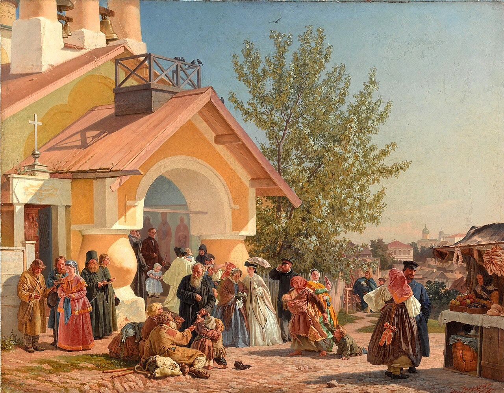

# Sessão 78 — Ordem — o sacerdócio de Cristo

*Alexander Morozov, The Easter Service (priest at the altar) (19th century). Public Domain via Wikimedia Commons.*

> *Uma pintura antiga de ordenação — mãos sobre uma cabeça, o bispo inclinando-se sobre um jovem. O sacerdote não é seu amigo nem seu gerente. Ele é, misteriosamente, as próprias mãos de Cristo quando pronuncia as palavras. Reze hoje pelos sacerdotes.*

## São Pio X pergunta

**397.** O que é a Ordem?

*A Ordem é o Sacramento que dá o poder de realizar as ações sagradas relativas à Eucaristia e à salvação das almas, e imprime o caráter de ministros de Deus.*

**398.** Quem é o ministro da Ordem?

*O ministro da Ordem é o Bispo que dá o Espírito Santo e o poder sagrado ao impor as mãos e entregar os objetos sagrados próprios da Ordem, dizendo as palavras da forma prescrita.*

**399.** Por que o Sacramento que faz os ministros de Deus se chama Ordem?

*O Sacramento que faz os ministros de Deus se chama Ordem porque compreende vários graus de ministros, uns subordinados aos outros, dos quais resulta a sagrada Hierarquia.*

**400.** Quais são os graus da sagrada Hierarquia?

*Os graus da sagrada Hierarquia são: as Ordens menores, o Subdiaconato e o Diaconato, que são preparatórios; o Presbiterado ou o Sacerdócio que dá o poder de consagrar a Eucaristia e de remitir os pecados; e o Episcopado, plenitude do Sacerdócio, que dá o poder de conferir as Ordens e de ensinar e governar os fiéis.*

**401.** É grande a dignidade do Sacerdócio?

*A dignidade do Sacerdócio é grandíssima pelo seu poder sobre o Corpo real de Jesus Cristo que torna presente na Eucaristia, e sobre o seu Corpo Místico, a Igreja, que governa com a missão sublime de conduzir os homens à santidade e à vida bem-aventurada.*

**402.** Qual fim deve ter quem entra nas Ordens?

*Quem entra nas Ordens deve ter por fim somente a glória de Deus e a salvação das almas.*

**403.** Pode qualquer um entrar por vontade própria nas Ordens?

*Ninguém pode entrar por vontade própria nas Ordens, mas deve ser chamado por Deus por meio do próprio Bispo, isto é, deve ter a vocação, com as virtudes e com as predisposições para o sagrado ministério por ela requeridas.*

**404.** Quem entrasse no Sacerdócio sem vocação faria mal?

*Quem entrasse no Sacerdócio sem vocação faria muito mal porque dificilmente poderia observar seus altíssimos deveres, com evidente perigo de escândalos públicos e de perdição eterna.*

**405.** Quais deveres têm os fiéis com respeito aos chamados às Ordens?

*Os fiéis têm o dever de deixar aos filhos e dependentes plena liberdade para seguir sua vocação, além de implorar a Deus bons pastores e ministros, e de jejuar para tal fim nas quatro Têmporas, finalmente de venerar os ordenados como pessoas sagradas a Deus.*

## O Catecismo Romano ensina

## Importância da catequese sobre este Sacramento

[1] Quem analisar, com atenção, a natureza e o caráter particular dos outros Sacramentos, desde logo reconhecerá que todos eles dependem do Sacramento da Ordem, de sorte que, na sua falta, alguns não poderiam de nenhum modo ser feitos e ministrados, enquanto outros ficariam privados de suas solenes cerimônias e ritos litúrgicos. Para os pastores será de obrigação, quando desenvolvem a doutrina dos Sacramentos, tratarem também do Sacramento da Ordem com o maior cuidado e diligência.

### Para os pastores

Essa explicação será muito proveitosa, em primeiro lugar para os próprios pastores; depois, para os outros que iniciaram a carreira eclesiástica; afinal, para os simples fiéis cristãos. Para eles mesmos, porque no desenvolvimento do assunto serão mais facilmente levados a renovar em si a graça que receberam pela virtude deste Sacramento.[^1]

### Para os candidatos ao sacerdócio

Para os outros, que são chamados para a herança do Senhor, já porque se afervoram no mesmo desejo de piedade sacerdotal, já porque ficam conhecendo as condições que lhes são mais necessárias, para serem mais facilmente promovidos às Ordens Maiores.

### Para os fiéis em geral

Para os demais fiéis, porque aprendem, em primeiro lugar, quanto são dignos de veneração os ministros da Igreja; depois, havendo não raro entre eles, quem de boa mente queira, mais tarde, consagrar seus filhinhos ao serviço da Igreja[^2], ou quem queira pessoalmente abraçar, de sua livre e espontânea vontade, esse gênero de vida: não é justo deixar tais pessoas na ignorância das principais questões relativas a esta matéria.

## A sublime dignidade do sacerdote

[2] Primeiro, devemos mostrar aos fiéis quanta é a nobreza e excelência desta vocação, considerada no seu apogeu, que é o sacerdócio. Se os Bispos e sacerdotes, como que intérpretes e medianeiros de Deus, em Seu nome anunciam aos homens a Lei Divina e as normas da vida cristã, e representam o próprio Deus aqui na terra: é claro que se não pode imaginar dignidade maior do que a deles. Por isso, são chamados não só "anjos"[^3], mas até "deuses"[^4], pois representam entre nós o poder e a majestade de Deus imortal.

Ainda que os sacerdotes, em todos os tempos, já gozavam da mais alta consideração, todavia os da Nova Aliança sobrelevam consideràvelmente a todos os mais em dignidade; pois o poder que lhes foi outorgado, seja para consagrar e oferecer o Corpo e o Sangue de Nosso Senhor, seja para remitir os pecados, excede a compreensão da inteligência humana, e muito menos se encontrará na terra um poder que lhe seja igual ou similar.

[3] Como Nosso Salvador foi enviado pelo Pai[^5], e os Apóstolos e Discípulos foram enviados por Cristo Nosso Senhor através do mundo inteiro[^6]; assim também os sacerdotes são enviados todos os dias, com o mesmo poder que eles, "a fim de aperfeiçoarem os santos, exercerem o sagrado ministério, edificarem o Corpo de Cristo".[^7]

## A vocação sacerdotal

Por conseguinte, a obrigação de tão grave ministério não deve ser imposta, temeràriamente, a quem quer que seja, mas únicamente aos que a possam cumprir, pela santidade de sua vida, pela sua instrução, pela sua fé e prudência. Nem tampouco deve alguém tomar para si essa dignidade, "senão aquele que por Deus é chamado, como o foi Aarão".[^8]

### 1. Chamamento de Deus

Consideramos, porém, chamados por Deus os que são chamados pelos legítimos ministros da Igreja[^9]; pois, daqueles que por arrogância se intrometem neste ministério, já dizia evidentemente Nosso Senhor: "Eu não os enviava como profetas, e eles corriam".[^10] Não pode haver homens mais infelizes e desgraçados do que eles, nem mais perniciosos para a Igreja de Deus.[^11]

### 2. Disposições do chamado

#### a) Não ter intenções indignas

[4] Em qualquer empresa, é de muita importância o fim, que cada um se propõe alcançar; pois, estando certo o fim colimado, tudo o mais decorre na melhor ordem. Em primeiro lugar, devemos, portanto, advertir os candidatos ao sacerdócio que se não proponham fim algum indigno de tão sublime ministério. Disto se deve tratar, com tanto mais escrúpulo, quanto mais gravemente costumam os fiéis pecar contra essa matéria, nos tempos que correm.

#### Ganância

Alguns abraçam este modo de vida, na intenção de prover-se do necessário para comida e roupa, de sorte que no sacerdócio só miram lucros materiais, como fazem geralmente os outros homens, que se entregam a baixas especulações. Na verdade, o Apóstolo ensina que as leis natural e divina mandam "viver do altar a quem está a serviço do altar"[^12]; mas, subir ao altar, por causa do ganho e lucro, é um enorme sacrilégio.

#### Ambição

Outros há que são levados ao sacerdócio, porque desejam e cobiçam altas dignidades; outros, ainda, querem as Ordens Sacras como fontes de grandes riquezas; por sinal, só pensam em ordenar-se, quando recebem a oferta de rendoso benefício eclesiástico. A estes é que Nosso Salvador chama de "mercenários"[^13], e deles também dizia Ezequiel que "apascentam a si próprios, e não as ovelhas".[^14]

A torpe malícia desses homens denigre a tal ponto o estado sacerdotal, que aos olhos dos fiéis nada pode haver de mais baixo e aviltante; de outro lado, faz com que eles mesmos nenhum fruto possam tirar do seu sacerdócio, senão o que Judas colheu do exercício de seu apostolado: acarretou-lhe a condenação eterna.

#### b) Ter santa e reta intenção

Com razão, porém, dizemos que entram pela porta[^15] os que são legitimamente chamados por Deus, e assumem as obrigações sacerdotais únicamente para se porem a serviço da glória de Deus.

### 3. Chamamento só aos ministérios especiais da Igreja

[5] Entanto, não é para entender que esta mesma obrigação não seja imposta por igual a todos os homens; pois todos os homens foram criados para prestar culto a Deus. E devem fazê-lo "de todo o seu coração, de toda a sua alma, e com todas as suas forças"[^16], principalmente os fiéis cristãos, por terem alcançado a graça do Batismo.[^17]

Todavia, os que desejam receber o Sacramento da Ordem, devem propor-se, como obrigação, não só de procurar a honra de Deus em todas as coisas — o que certamente é um dever comum de todos os homens, sobretudo dos fiéis cristãos — mas também de consagrar-se a um determinado ministério na Igreja, e servir assim a Deus "em santidade e justiça".[^18]

Num exército, todos os soldados obedecem às ordens do general. Porém um deles é capitão, outro é tenente, outros ainda têm as suas graduações próprias. Assim também, ainda que todos os fiéis devam esmerar-se na prática da piedade e pureza — objeto principal do culto a Deus — todavia, os que receberam o Sacramento da Ordem, estão obrigados a desempenhar na Igreja certos cargos e funções especiais, de grande responsabilidade.

Eles oferecem, pois, o Sagrado Sacrifício, por si mesmos e por todo o povo cristão[^19]; explanam o sentido da Lei de Deus[^20]; exortam os fiéis a cumpri-la com coragem e alegria; administram os Sacramentos de Cristo Nosso Senhor, pelos quais toda graça é conferida e aumentada. Para o dizer numa palavra, eles vivem separados do resto do povo, e como tais exercem o maior e o mais sublime de todos os ministérios.

Dadas essas explicações, os párocos começarão a tratar das questões peculiares deste Sacramento, para que os fiéis, desejosos de abraçar o estado eclesiástico, compreendam a que ministério são chamados, e vejam quão grande é o poder que Deus conferiu à Igreja e seus ministros.

## O poder sacerdotal

[6] Ora, esse poder é duplo: de Ordem e de jurisdição. O poder de Ordem refere-se ao verdadeiro Corpo de Cristo Nosso Senhor na Sagrada Eucaristia. O poder de jurisdição aplica-se inteiramente ao Corpo Místico de Cristo, e sua finalidade é governar e dirigir o povo cristão, e levá-lo à eterna bem-aventurança no céu.

### 1. O poder de Ordem em particular

[7] O poder de Ordem não envolve apenas o poder de consagrar a Eucaristia, mas prepara também os corações dos homens, e confere-lhes a aptidão necessária para a receberem; enfim, abrange tudo o que, de qualquer maneira, diga respeito à Eucaristia.

Em abono deste poder, falam muitas passagens que se podem tirar da Sagrada Escritura; porém as mais belas e mais enérgicas se encontram nos Evangelhos de São Mateus e São João. São, pois, palavras de Nosso Senhor: "Assim como o Pai Me enviou, também Eu vos envio a vós. — Recebei o Espírito Santo. A quem vós perdoardes os pecados, ser-lhes-ão perdoados; e a quem os retiverdes, ser-lhes-ão retidos".[^21] E ainda: "Em verdade vos digo, tudo o que ligardes sobre a terra, será ligado também no céu".[^22]

Sobre esta verdade, podem as supraditas passagens projetar muita luz e clareza, desde que os pastores as expliquem segundo a autorizada doutrina dos Santos Padres.

### 2. Sublimidade desse poder no sacerdócio cristão

#### a) Superior ao sacerdócio natural

[8] O poder de que falamos sobrepuja, de muito, ao que a lei natural conferia outrora a certos indivíduos, para que se encarregassem do culto religioso. A era que precedeu à Lei escrita, tinha necessàriamente seu sacerdócio com o respectivo poder espiritual; pois consta, com bastante evidência, que tinha também uma lei própria.[^23] Esses dois elementos[^24], conforme ensina o Apóstolo, estão de tal modo ligados entre si, que a mudança de um acarreta forçosamente a imediata mudança do outro.[^25] Ora, como os homens reconhecessem, por um senso natural, a obrigação de prestarem culto a Deus, deviam instituir, pois, em cada comunidade, algumas pessoas a que fossem cometidos os sacrifícios e demais atos do culto divino, e cujo poder fosse, de certo modo, considerado como espiritual.

#### b) Superior ao sacerdócio judaico

No povo de Israel, havia também um poder assim, superior em dignidade ao que possuíam os sacerdotes no regime da lei natural; mas incomparàvelmente inferior ao poder espiritual que vigora na Lei do Evangelho.[^26]

Este poder é celestial, e ultrapassa até a virtude dos próprios Anjos. Sua origem não remonta ao sacerdócio mosaico, mas a Cristo Nosso Senhor, que foi Sacerdote, "não à maneira de Aarão, mas segundo a ordem de Melquisedec".[^27] Ele é quem tinha um poder infinito para conferir a graça e perdoar os pecados, e quem deixou à sua Igreja esse mesmo poder, embora o limitasse em seus efeitos, e o ligasse aos Sacramentos.

Por esse motivo, são instituídos determinados ministros para o exercício de tal poder, e sagrados com a pompa de determinadas cerimônias. Esta sagração é que se chama Sacramento da Ordem, ou Sagrada Ordenação.

## A Ordem, um Sacramento

### 1. Origem do nome

[9] Os Santos Padres preferiram adotar este termo, de sentido genérico[^28], para melhor indicarem a dignidade e grandeza dos ministros de Deus. Realmente, se a tomarmos em sua própria acepção, "ordem" é uma composição de coisas, umas superiores e outras inferiores, mas de tal modo acomodadas entre si, que permanecem numa relação recíproca. Assim, havendo neste ministério várias categorias e funções, que se distribuem todas numa determinada classificação, houve muito acerto e vantagem em dar-se-lhe o nome de "Ordem".

### 2. Um verdadeiro Sacramento

[10] Que a Sagrada Ordenação pertence aos Sacramentos da Igreja, o Santo Concílio de Trento[^29] o comprovou por uma argumentação já alegada repetidas vezes: Sacramento é o sinal de uma coisa sagrada. Ora, o rito exterior da Ordenação assinala a graça e o poder que se confere ao ordinando. Logo, é absolutamente lógico concluir que a Ordem tem o caráter de verdadeiro Sacramento, no sentido próprio da palavra.

Por esse motivo, quando entrega ao ordinando o cálice com vinho e a patena com o pão, o Bispo pronuncia as seguintes palavras: "Recebe o poder de oferecer o Sacrifício, etc.". Consoante o que sempre ensinou a Igreja, estas palavras, ditas na entrega da matéria, conferem o poder de consagrar a Eucaristia, e imprimem na alma um caráter particular, ao qual está ligada a graça necessária para o exercício exato e legítimo desse ministério.[^30] A este ponto alude o Apóstolo nas palavras seguintes: "Eu te exorto a que faças reviver a graça de Deus, que em ti está, pela imposição das minhas mãos; pois que Deus não nos deu o espírito de temor, mas o de força, de amor e sobriedade".[^31]

### 3. Comporta vários graus do mesmo poder

[11] Servindo-nos das palavras do Sagrado Concílio[^32], dizemos que o exercício de tão sublime sacerdócio é uma função divina. Ora, para ser desempenhada com mais dignidade e reverência, convinha haver, na ótima organização da Igreja, várias e diversas ordens de ministros que, por ofício, servissem ao sacerdócio, e de tal modo distribuídos que, após a recepção da tonsura, subissem das Ordens Menores para as Maiores.

### 4. Seu número

[12] Devemos ensinar que, na constante tradição da Igreja, todos esses graus de Ordem perfazem um setenário, e seus nomes são os seguintes: ostiário, leitor, exorcista, acólito, subdiácono, diácono, sacerdote.

Com muito acerto, foi fixado esse número de ministros, como podemos demonstrá-lo, pelos ministérios, que parecem necessários no Sacrossanto Sacrifício da Missa, na consagração e administração da Eucaristia, por cuja causa foram principalmente instituídos.

### 5. Sua classificação

Destas Ordens, umas são maiores, ditas também Ordens Sacras, e outras são menores. As Ordens Maiores ou Sacras são: presbiterato, diaconato, subdiaconato. Às Ordens Menores pertencem os acólitos, exorcistas, leitores, ostiários. De cada uma dessas Ordens diremos algumas palavras, para que os párocos tenham os elementos necessários à instrução daqueles que, na sua opinião, devem receber alguma Ordem.[^33]

## As Ordens Menores

### 1. Cerimônia preliminar

[13] Vamos começar pela Primeira Tonsura. Diremos que é uma espécie de preparação para receber as Ordens. Assim como os exorcismos preparam o homem para o Batismo, e os esponsais para o matrimônio: assim também o corte do cabelo é uma consagração a Deus, que lhe franqueia, por assim dizer, o caminho para o Sacramento da Ordem.

A Tonsura exprime quais predicados deve ter quem deseja ordenar-se. O nome de clérigo, que desde logo lhe é imposto, quer dizer que terá doravante o Senhor por sorte e partilha[^34], assim como o tinham, entre os Hebreus, aqueles que estavam ligados e consagrados ao culto divino. O Senhor proibiu que, na Terra Prometida, lhes fosse dado algum quinhão, porquanto afiançava: "Eu serei a tua partilha e herança".[^35] Essa palavra se refere a todos os fiéis em geral, mas aplica-se em sentido mais particular àqueles que se consagraram ao serviço de Deus.

#### a) Proporções

[14] Corta-se o cabelo na forma e semelhança de uma coroa, que deve ser sempre conservada, e mais tarde ampliada em sua circunferência, todas as vezes que alguém passar a um grau mais alto de Ordem. Ensina a Igreja que tal costume é de tradição apostólica, pois o costume de se fazer tonsura já é mencionado por São Dionísio Areopagita, Santo Agostinho, São Jerônimo, Padres muito respeitáveis pela sua antiguidade e pela autoridade de sua doutrina.

#### b) Simbolismo: coroa de espinhos

Corre uma tradição de que o Príncipe dos Apóstolos foi de todos o primeiro a introduzir esse costume, em recordação da coroa de espinhos posta na cabeça de Nosso Salvador. Assim, o que os ímpios haviam inventado, para humilhação e sofrimento de Cristo, deviam os Apóstolos usar como sinal de honra e glória, enquanto davam também a entender a obrigação, que aos ministros da Igreja incumbe, de procurarem tornar-se, em tudo, uma imagem e semelhança de Cristo Nosso Senhor.

#### Coroa real

Todavia, na opinião de outros, esse distintivo denota a régia dignidade que, antes de tudo, parece reservada aos que são chamados à sorte do Senhor. Sem dificuldade, somos levados a crer que aos ministros da Igreja compete, de modo particular e mais apropriado, o que São Pedro atribuía ao povo fiel: "Vós sois uma raça eleita, um sacerdócio real, um povo santo".[^36]

#### Sinal de vida perfeita

Não falta quem diga que o círculo, a mais perfeita das figuras geométricas, simboliza a vocação do clérigo a uma vida mais perfeita, o menosprezo das coisas mundanas, e a renúncia aos cuidados e vaidades da vida; o que se expressa no cortar o cabelo, como se fosse algo de supérfluo no corpo humano.

### 2. Ostiariato

[15] Depois da primeira Tonsura, o primeiro passo costuma ser para a Ordem de Ostiário, cujo ofício era guardar as chaves e a porta do templo, e afastar do templo aqueles que estavam interditos de entrar nele.

Assistia também ao Sacrifício da Missa, com a obrigação de atender a que ninguém se aproximasse demais do altar, e perturbasse o sacerdote na celebração dos Sagrados Mistérios. Estava ainda incumbido de outros misteres, conforme se deduz dos ritos próprios de sua Ordenação.

Realmente, quando o Bispo toma as chaves, que estão sobre o altar, para as entregar a quem vai ordenar-se ostiário, profere as seguintes palavras: "Comporta-te como quem há de prestar contas a Deus das coisas que são fechadas com estas chaves".

Na Igreja Primitiva, era muito elevada a dignidade desta Ordem. Chegamos a essa conclusão pelos costumes que ainda hoje se conservam na Igreja. O cargo de tesoureiro, que era ao mesmo tempo guarda da sacristia, estava confiado aos ostiários; ainda agora é um dos cargos mais honrosos da Igreja.[^37]

### 3. Leitorado

[16] O segundo grau de Ordem é o ministério de Leitor, a quem pertencia ler na Igreja, em voz alta e inteligível, os livros do Antigo e do Novo Testamento, sobretudo aqueles que costumam ser lidos durante a recitação noturna dos Salmos. Era também de sua obrigação ensinar aos fiéis os primeiros rudimentos da doutrina cristã.

Por conseguinte, no ato da ordenação, o Bispo entrega-lhe, à vista do povo, um livro que contém todas as prescrições relativas a este ministério, e diz as palavras: "Recebe este Livro, e transmite a Palavra de Deus. Se desempenhares teu ofício com perseverança e edificação, terás parte com aqueles que, desde o começo, souberam administrar a palavra de Deus".

### 4. Exorcistado

[17] A terceira é a Ordem dos Exorcistas, aos quais foi dado o poder de invocar o nome do Senhor sobre os possessos de espíritos imundos. Por isso, ao ordená-los, o Bispo entrega-lhes o Livro de exorcismos, e usa esta fórmula: "Toma e guarda na memória este Livro, e fica com o poder de impor as mãos aos possessos, quer sejam batizados, quer sejam catecúmenos".

### 5. Acolitato

[18] O quarto grau é a Ordem dos Acólitos, a última dentre as que se chamam Ordens Menores, não Sacras. Incumbe-lhes a obrigação de acompanhar e servir, nas funções do altar, aos diáconos e subdiáconos, que são os ministros de Ordens Maiores.

Além disso, são eles que levam e apresentam os círios na celebração do Sacrifício da Missa, principalmente quando se faz a leitura do Evangelho; razão pela qual também se chamam ceroferários.

No ato de ordenação, o Bispo observa o rito seguinte. Depois de bem instruí-los acerca das obrigações de seu ministério, entrega a cada um dos ordinandos um círio, e pronuncia as palavras: "Recebe este castiçal com a vela, e reconhece que ficas obrigado a acender as luzes na igreja, em nome do Senhor". Depois, dá-lhes também, vazias, as galhetas, em que se serve água e vinho para o Sacrifício: "Recebe as galhetas, a fim de ministrares vinho e água para o Sacrifício Eucarístico do Corpo de Cristo, em nome do Senhor".

## As Ordens Maiores

### 1. Subdiaconato

#### a) Função

[19] As Ordens Menores, não-Sacras, de que tratamos até agora, abrem o legítimo acesso e promoção para as Ordens Maiores e Sacras. No primeiro grau destas está o subdiácono, cuja função, como diz o próprio nome, é a de servir o diácono ao altar. Cabe-lhe preparar os corporais, os vasos, o pão e o vinho, que são necessários para o Sacrifício. Hoje em dia, derrama água, quando o Bispo e o sacerdote lavam as mãos, durante o Sacrifício da Missa.[^38]

O subdiácono lê também a Epístola, que antigamente era recitada pelo diácono na Missa. Assiste, como testemunha, ao Santo Sacrifício, e atende que ninguém possa perturbar o sacerdote celebrante.

#### b) Obrigação do celibato

Todas estas obrigações, inerentes ao ministério de subdiácono, são expressas pelas solenes cerimônias que acompanham a ordenação. Antes de tudo, o Bispo faz lembrar que esta Ordem traz consigo a obrigação de perpétua castidade, e declara, formalmente, que não pode ser admitido à Ordem de Subdiaconato quem não se proponha tomar a si essa obrigação.[^39]

Recitada solenemente a ladainha de Todos os Santos, o Bispo põe-se a enumerar e explicar as funções e deveres do subdiácono. A seguir, cada um dos ordinandos recebe, das mãos do Bispo, o cálice e a sagrada patena; do arcediago, porém, as galhetas cheias de vinho e água, juntamente com uma bacia e toalha para enxugar as mãos, para assim se mostrar que o subdiácono deve servir o diácono em suas funções. E nessa ocasião, diz o Bispo: "Considerai qual ministério vos é confiado. Por isso, eu vos exorto, portai-vos de maneira que Deus possa ter em vós a Sua complacência".

Acrescentam-se ainda outras orações. Por último, depois de revestir o subdiácono das vestes sagradas, usando para cada uma delas orações e cerimônias apropriadas, o Bispo lhe entrega o epistolário, e diz ao mesmo tempo: "Toma o Livro das Epístolas, e recebe o poder de lê-las na Santa Igreja de Deus, assim pelos vivos, como pelos defuntos".

### 2. Diaconato

#### a) Função

[20] Ocupa o segundo grau de Ordens Sacras o diácono, cujo ministério é mais amplo, e sempre tido como mais sagrado. Cabe-lhe a obrigação de acompanhar sempre o Bispo, fazer-lhe guarda durante a pregação, assistir o Bispo e o sacerdote na celebração da Missa, ou na administração de outros Sacramentos, e fazer a leitura do Evangelho no Sacrifício da Missa.

Antigamente, o diácono exortava os fiéis a estarem atentos aos Sagrados Mistérios. Ministrava também o Sangue do Senhor nas igrejas, onde os fiéis costumavam receber a Eucaristia debaixo de ambas as espécies. Além disso, ao diácono estava entregue a administração dos bens eclesiásticos, com a incumbência de fornecer a cada um o que era necessário para a sua manutenção.

Ao diácono pertence, também, como se fora os olhos do Bispo, investigar, cuidadosamente, quem na cidade leva vida cristã e piedosa, e quem não leva; quem comparece à Missa e à pregação nos dias marcados, e quem não comparece: para que o Bispo, por ele informado de tudo o que acontece, possa então exortar e advertir cada um à puridade, ou censurar e corrigir publicamente, conforme o julgar mais indicado.

Deve, outrossim, proclamar os nomes dos catecúmenos, e apresentar ao Bispo os que estão para receber o Sacramento da Ordem. Na ausência do Bispo ou do sacerdote, pode explicar o Evangelho, mas não do púlpito, para se dar a entender que isso não é próprio do seu ministério.

#### b) Escolha dos candidatos

[21] Descrevendo a Timóteo os costumes, a virtude, a integridade própria do diácono, o Apóstolo mostra quanta precaução se deve ter a que nenhum indigno seja promovido a este grau de Ordem. É o que também indicam, com muita clareza, os solenes ritos e cerimônias, que o Bispo emprega no ato de ordenação. O Bispo diz maior número de orações mais solenes, na Ordenação do diácono, do que na Ordenação do subdiácono, e faz entrega de outras alfaias a mais. Além disso, impõe-lhe as mãos; lemos na Escritura que assim praticaram os Apóstolos, quando instituíram os primeiros diáconos.[^40] Por fim, entrega-lhes o Livro dos Evangelhos, dizendo a fórmula: "Recebe o poder de ler o Evangelho na Igreja de Deus, assim pelos vivos, como pelos defuntos, em nome do Senhor".

### 3. Presbiterato

#### a) Nome

[22] O terceiro, e o supremo grau de todas as Ordens Sacras, é o sacerdócio. Aos que possuem este grau, os Santos Padres costumavam designá-los por dois nomes. Por vezes, chamavam-lhes "presbíteros", palavra grega que significa "anciãos", não só pela madureza da idade, que é muito necessária para este grau de Ordem; mas, muito mais ainda, pela cordura de caráter, pela doutrina e pelo bom-senso, pois está escrito: "A velhice veneranda não é a que dura muito, nem a que se mede pelo número de anos; porém o bom-senso do homem supre as suas cãs, e a vida ilibada é uma verdadeira velhice".[^41]

Outras vezes, chamavam-lhes "sacerdotes", já porque são consagrados a Deus, já porque lhes compete administrar os Sacramentos, e tratar das coisas sagradas e divinas.[^42]

#### b) Sacerdócio interno

[23] Desde que nas Sagradas Escrituras se fala de um duplo sacerdócio, um interno, e outro externo, devemos fazer uma distinção, para que os pastores possam explicar de qual deles se trata neste lugar.

Relativamente ao sacerdócio interno, todos os fiéis são considerados sacerdotes, a partir do momento em que receberam a regeneração do Batismo; mas, de primazia, os justos que possuem o Espírito de Deus, e pela graça de Deus se tornaram membros vivos de Jesus Cristo, o Sumo Sacerdote.

São eles que, no altar de seus corações, oferecem a Deus sacrifícios espirituais[^43], naquela fé que se abrasa na caridade. A tais sacrifícios pertencem todas as obras boas e virtuosas que se praticam, na intenção de glorificar a Deus. Por isso, lemos no Apocalipse: "Em Seu Sangue, Cristo lavou-nos de nossos pecados, e fez de nós um Reino, e instituiu-nos sacerdotes para Deus, Seu Pai".[^44]

Nesse mesmo sentido, declarou o Príncipe dos Apóstolos: "Sobre Ele sois edificados, à maneira de pedras vivas, como edifícios espirituais, como um santo sacerdócio, a fim de oferecerdes sacrifícios espirituais, que sejam agradáveis a Deus por Jesus Cristo".[^45]

E o Apóstolo nos exorta a que "façamos de nossos corpos uma oblação viva, santa, agradável a Deus, como um culto razoável de nossa parte".[^46] Muito antes, David também havia dito: "Aos olhos de Deus, o espírito compungido vale como um sacrifício. Vós, meu Deus, não desprezareis um coração contrito e humilhado".[^47] Naturalmente, todas estas passagens se referem ao sacerdócio interno.

#### c) Sacerdócio externo é o Sacramento da Ordem

O sacerdócio externo, porém, não pertence à coletividade de todos os fiéis, mas só a certos indivíduos, ordenados e consagrados a Deus, pela legítima imposição das mãos, segundo o solene cerimonial da Santa Igreja, e que se destinam de modo particular ao sagrado ministério.

Esta distinção, entre dois sacerdócios, também se verificava no Antigo Testamento. Acabamos de ver como David falou do sacerdócio interno. De outro lado, todos sabem perfeitamente que o Senhor havia dado muitas prescrições a Aarão e Moisés acerca do sacerdócio externo.[^48] Além do mais, reservou toda a tribo de Levi para o serviço do Templo, e assentou por lei que ninguém de outra tribo ousasse ingerir-se nesse ministério.[^49] E, de fato, o rei Ozias foi ferido de lepra pelo Senhor, porque havia usurpado o ministério sacerdotal, e assim expiou duríssimamente a sua sacrílega arrogância.[^50]

Como na Lei do Evangelho também se pode averiguar a mesma distinção entre os dois sacerdócios, força é prevenir os fiéis que, neste lugar, tratamos do sacerdócio externo, conferido a uma determinada classe de homens, pois só este sacerdócio faz parte do Sacramento da Ordem.

#### d) Função do sacerdócio

[24] Ofício do sacerdote é oferecer a Deus o Sacrifício, administrar os Sacramentos da Igreja, conforme patenteiam os ritos da Ordenação. Quando, pois, o Bispo ordena algum sacerdote, impõe-lhe as mãos em primeiro lugar, fazendo outro tanto os sacerdotes que estiverem presentes. Depois, lança-lhe aos ombros a estola, e dispõe-na em forma de cruz sobre o peito, para assinalar que o sacerdote se reveste da força do alto, pela qual consegue tomar, sobre si, a Cruz de Cristo Nosso Senhor e o jugo suave da Lei Divina, e apregoá-los, não só de boca, mas também pelo exemplo de uma vida muito santa e muito pura.

A seguir, unge-lhe as mãos com o Óleo Sagrado, e entrega-lhe o cálice com o vinho e a patena com a hóstia, dizendo: "Recebe o poder de oferecer o Sacrifício a Deus, de celebrar Missas, tanto pelos vivos, como pelos defuntos". Por estas cerimônias e palavras, o candidato é constituído intérprete e medianeiro entre Deus e os homens, e nisso consiste a principal função do sacerdote.

Por último, impõe-lhe de novo as mãos sobre a cabeça, e diz as palavras: "Recebe o Espírito Santo. A quem perdoardes os pecados ser-lhes-ão perdoados, e a quem os retiverdes, ser-lhes-ão retidos".[^51] Assim lhe confere aquele poder sobrenatural, que Nosso Senhor havia dado a seus Discípulos, o de perdoar e reter pecados.

São estes os principais ministérios, privativos da Ordem sacerdotal.

## Graus de Sacerdócio

### 1. Sacerdotes

[25] Existe um só sacerdócio, mas que comporta vários graus de dignidade e poder. Ao primeiro grau pertencem os que se chamam simplesmente sacerdotes, e cujas funções foram explicadas até agora.

### 2. Bispos

O segundo grau é dos Bispos, que são postos à frente das dioceses, não só para dirigirem os outros ministros da Igreja, mas também o povo cristão, provendo à salvação de todos, com o máximo cuidado e vigilância.

Por isso, as Sagradas Escrituras lhes chamam muitas vezes pastores de ovelhas. Suas funções e deveres, São Paulo os descreve naquele sermão aos Efésios, que lemos nos Atos dos Apóstolos.[^52] São Pedro, o Príncipe dos Apóstolos, estabeleceu por sua vez uma norma divinamente inspirada para o exercício do ministério episcopal.[^53] Se os Bispos se governarem zelosamente por ela, não há dúvida que serão bons pastores, e como tais também considerados. Os Bispos chamam-se também pontífices, nome usado pelos pagãos, que costumavam chamar pontífices aos sumos sacerdotes.

### 3. Arcebispos

O terceiro grau é constituído pelos Arcebispos. Estão à frente de vários Bispos. Chamam-se também metropolitas, por serem Bispos de cidades, que são tidas como mães da Província Eclesiástica. Por esse motivo, são superiores aos Bispos em dignidade e jurisdição, mas em nada diferem deles pela sagração episcopal.[^54]

### 4. Patriarcas

Em quarto grau estão os patriarcas, ou sejam os primeiros e mais eminentes dos Padres.[^55] Além do Sumo Pontífice Romano, antigamente só havia quatro patriarcas na Igreja Universal; mas que por sua vez não se igualavam em dignidade. Por causa da predominância do Império Bizantino, o Patriarca de Constantinopla granjeou uma posição de maior prestígio, embora sua elevação fosse posterior a de todos os mais Patriarcas. O imediato era o Patriarca de Alexandria, cuja igreja o Evangelista São Marcos havia fundado por ordem do Príncipe dos Apóstolos. O terceiro é Patriarca de Antioquia, onde São Pedro havia primeiro assentado sua sede episcopal. No último grau, ficava o Patriarca de Jerusalém, e sua igreja foi governada por Santiago, o "irmão do Senhor".[^56]

### 5. Papa, o Bispo de Roma

Mas, acima de todos eles, a Igreja Católica sempre reverenciou o Bispo de Roma como o Pontífice Máximo. No Concílio de Éfeso, São Cirilo de Alexandria chama-lhe Arcebispo, pai e patriarca de toda a redondeza da terra. Como ocupa a cadeira de Pedro, Príncipe dos Apóstolos, que nela consta ter ficado até o fim de sua vida, a Igreja reconhece nele o sumo grau de dignidade e a plenitude de jurisdição, mas que lhe foram outorgados, não por decisão sinodal ou qualquer alvitre humano, mas em virtude de um direito divino.

Por isso, o Pontífice Romano é pai e guia de todos os fiéis e Bispos, de todos os mais prelados, quaisquer que sejam suas funções e poderes. Como sucessor de São Pedro, como verdadeiro e legítimo representante de Cristo Nosso Senhor, governa a Igreja Universal.

Servindo-se destas exposições, os pastores ensinarão também quais são os principais deveres e funções das várias Ordens e dignidades eclesiásticas, e quem é o ministro deste Sacramento.

## Ministro: O bispo

[26] É certo que a administração deste Sacramento pertence ao Bispo. Não custa prová-lo pela autoridade da Sagrada Escritura, pela Tradição que é absolutamente certa, pelo testemunho dos Santos Padres, pelos decretos dos Concílios, pela praxe contínua da Santa Igreja.

### Corolário: Poderes dos abades monásticos

Alguns abades recebem, às vezes, a licença de conferir as Ordens Menores, não-Sacras[^57], mas nem por isso pode alguém contestar que esse ministério é próprio do Bispo, a quem únicamente pertence, e a mais ninguém, conferir as outras Ordens, que se chamam Maiores ou Sacras. Por conseguinte, sòmente o Bispo pode ordenar subdiáconos, diáconos e presbíteros. É de tradição apostólica, sempre mantida na Igreja, que os Bispos sejam sagrados por três Bispos.

## Sujeito

### 1. Necessidade de seleção

[27] Resta, agora, explicar quem é apto para receber este Sacramento, sobretudo a Ordenação Sacerdotal, e quais são em primeira linha os predicados que neles se requerem. Isso permite facilmente estabelecer o que se deve observar na admissão para as outras Ordens, de acordo com seu grau e dignidade.

Na administração deste Sacramento, deve haver a maior cautela, como se deduz da seguinte consideração. Os outros Sacramentos produzem a graça, para utilidade e santificação de quem os recebe. Mas quem toma Ordens Sacras, torna-se participante da graça divina, a fim de promover, pelo ministério sacerdotal, o bem da Igreja e com isso a salvação de toda a humanidade.

Reconhecemos ser este o motivo por que as Ordenações só se realizam em dias determinados[^58], nos quais a Igreja Católica, por costume muito antigo, marcava solenes jejuns. O povo cristão devia, por meio de santas e fervorosas preces, alcançar de Deus tais ministros do Santuário, que fossem particularmente idôneos para o digno exercício de tão sublime ministério, em proveito da Igreja.

### 2. Qualidades dos candidatos

#### a) Santidade de vida

[28] Em primeiro lugar, o candidato ao sacerdócio deve distinguir-se sobremaneira, pela pureza de vida e caráter. Não só porque cometeria uma incrível monstruosidade, se procurasse a Ordenação, ou consentisse em recebê-la, estando consciente de alguma culpa mortal: mas, antes de tudo, porque deverá ser um luzeiro de virtude e inocência para os seus semelhantes.

Aqui devem os pastores explicar as prescrições do Apóstolo a Tito e a Timóteo.[^59] Ensinem também que, pela Lei do Evangelho, devemos antes referir aos defeitos da alma, em sentido figurado, os defeitos corporais que, na Lei Antiga, excluíam do sacerdócio, por determinação do Senhor.[^60]

Por esta razão, vemos a Igreja manter o santo costume de que os candidatos a Ordens Sacras procurem purificar, cuidadosamente, a sua consciência antes da Ordenação.[^61]

#### b) Instrução adequada

[29] Ademais, é mister que o sacerdote tenha não só as noções indispensáveis ao uso e administração dos Sacramentos, mas também um tal conhecimento das Sagradas Escrituras, que possa instruir o povo cristão nos Mistérios da fé, explicar-lhe os Preceitos da Lei de Deus, incitá-lo à prática da virtude e da piedade, e apartar os fiéis dos vícios.

Portanto, dois são os deveres do sacerdote. O primeiro é fazer e administrar legitimamente os Sacramentos. O segundo é instruir, nas verdades e preceitos necessários à salvação, o povo que está confiado à sua responsabilidade. Assim já ensinava Malaquias: "Os lábios do sacerdote serão depositários da ciência; e de sua boca hão de conhecer a Lei, porque ele é um Anjo do Senhor dos exércitos".[^62]

Pode o sacerdote cumprir essa primeira obrigação, ainda que tenha um preparo medíocre; mas a segunda obrigação não requer certamente um estudo vulgar, mas antes uma instrução esmerada. De todos os sacerdotes não se exige um conhecimento requintado de questões difíceis, mas apenas o que lhe seja suficiente para o desempenho de seu cargo e ministério.

### 3. Impedimentos de Ordenação

#### Inaptidão e irregularidade

[30] Este Sacramento não é para o conferir a crianças, dementes e loucos furiosos. Todavia, se lhes fosse ministrado, é ponto certo de fé que, na alma, lhes ficaria impresso o caráter sacramental. Quanto à idade requerida para cada grau de Ordem, é fácil estabelecê-la pelos decretos do Concílio Tridentino.[^63]

São também excluídos os escravos, porque não pode consagrar-se ao culto divino quem não é senhor de si mesmo, e vive na sujeição de outrem.

São igualmente irregulares, os que exercem uma profissão sangrenta, e os homicidas, porque não são admitidos pela Lei da Igreja. Na mesma condição se acham os espúrios, e todos os que não nasceram de legítimo Matrimônio. Convém, pois, que os candidatos ao sacerdócio nada tenham em si, que seja para os outros justo motivo de desprezo e pouco caso.

Afinal, não podem ser admitidos os que sofrem de algum defeito físico de maior vulto, ou são aleijados das mãos. Tais disformidades e fraquezas físicas provocam reparos, e dificultam forçosamente a administração dos Sacramentos.[^64]

## Efeitos do Sacramento

### 1. Graça de estado

[31] Dadas estas explicações, só resta aos pastores ensinar quais são os efeitos deste Sacramento. Verdade é que este Sacramento, como já foi dito, tem por fim primordial a vantagem e grandeza da Igreja; mas, ainda assim, produz também na alma de quem se ordena, uma graça santificadora, que o torna idôneo e disposto para bem exercer o seu ministério, e administrar os Sacramentos; de maneira análoga, como a graça do Batismo também confere ao indivíduo a aptidão de receber os demais Sacramentos.

### 2. Poder sobre o SS. Sacramento

Por certo, outra graça inegável deste Sacramento é o poder especial, com relação ao Santíssimo Sacramento da Eucaristia. No sacerdote, esse poder é pleno e perfeito, por ser ele o único que pode consagrar o Corpo e o Sangue de Nosso Senhor; nos outros ministros de Ordens inferiores, o poder é maior ou menor, na proporção em que cada qual se achega, mais ou menos, do Sacramento do Altar, em virtude de seu próprio ministério.

### 3. Caráter indelével

Este poder se chama também caráter espiritual, porque distingue dos outros fiéis os iniciados em Ordens Sacras, por meio de um sinal, que lhes imprime no interior da alma, e os consagra exclusivamente ao serviço do culto divino.

O Apóstolo parece referir-se a esse caráter, quando escreve a Timóteo: "Não deixes de aproveitar a graça, que em ti existe, e que te foi dada em virtude de uma palavra profética, juntamente com a imposição de mãos dos sacerdotes".[^65] E noutro lugar: "Eu te exorto a que faças reviver a graça de Deus, que está em ti, pela imposição de minhas mãos".[^66]

Basta o que já dissemos acerca do Sacramento da Ordem. Nosso intento era apresentar aos pastores só os pontos capitais, e sugerir-lhes temas que sirvam para a catequese e para a formação religiosa do povo cristão.

[^1]: 2 Tim 1, 6.
[^2]: O CIC determina: "Deve cuidar-se que os candidatos às Ordens Sacras sejam admitidos no Seminário, desde a tenra idade" (cân. 972 § 1).
[^3]: Malach 2, 7.
[^4]: Exod 22, 28.
[^5]: Jo 3, 17.
[^6]: Mt 28, 19; Mc 16, 15.
[^7]: Eph 4, 12.
[^8]: Hb 5, 4.
[^9]: Os legítimos ministros são aqui os bispos. A vocação subjetiva do candidato é consolidada pelo "chamamento" da Igreja.
[^10]: Jer 23, 21.
[^11]: "É pecado forçar alguém, por qualquer motivo, a entrar no estado clerical, ou dele afastar a quem tenha canônica vocação" (CIC cân. 971). A Igreja fulmina tais pessoas com a pena de excomunhão (cân. 2352).
[^12]: 1 Cor 9, 13.
[^13]: Jo 10, 13.
[^14]: Ezech 35, 2 ss.
[^15]: Jo 10, 1.
[^16]: Deut 7, 5; Mt 22, 37; Lc 10, 27.
[^17]: DU 803-804. CIC cân. 87.
[^18]: Lc 1, 75.
[^19]: Hb 5, 3.
[^20]: Lev 10, 11; Deut 17, 8 ss.
[^21]: Jo 20, 21.
[^22]: Mt 18, 18.
[^23]: Ditada pela própria lei natural, que se impõe no coração de todos os homens.
[^24]: Lei e sacerdócio.
[^25]: Cfr. Hb 7, 12: "Ora, a mudança de sacerdócio importa necessariamente em mudança de lei".
[^26]: Hb 8, 11.
[^27]: Ps 109, 4; Hb 7, 11.
[^28]: Isto é: Ordem.
[^29]: Conc. Trid. XXIII de Ordine cap. 1 can. 3 (DU 957 963).
[^30]: Com a Constituição Apostólica "Sacramentum Ordinis", de 28 de Janeiro de 1948, Pio XII dirimiu todas as controvérsias que dividiam os teólogos a respeito da matéria e forma do sacramento da Ordem. Diz ele no n. 5: "Na ordenação de Diáconos a matéria é a única imposição da mão do Bispo que ocorre neste rito. A forma consta das palavras da 'Prefação', sendo essenciais e, por isso, requeridas para a validade, as seguintes: 'Emitte in eum, quaesumus, Domine, Spiritum Sanctum, quo in opus ministerii tui fideliter exsequendi septiformia gratiae tuae munere roboretur'. — Na ordenação de Presbítero a matéria é a primeira imposição das mãos do Bispo que se faz em silêncio. A forma consta das palavras da 'Prefação', sendo essenciais e, por isso, requeridas para a validade, as seguintes: 'Da, quaesumus, omnipotens Pater, in hunc famulum tuum Presbyterii dignitatem; innova in visceribus eius spiritum sanctitatis, ut acceptum a Te, Deus, secundi meriti munus obtineat censuramque morum exemplo suae conversationis insinuet'. — Finalmente na Sagração Episcopal a matéria é a imposição das mãos feita pelo Bispo Sagrante. A forma consta das palavras da 'Prefação', sendo essenciais e, por isso, requeridas para a validade as seguintes: 'Comple in Sacerdote tuo ministerii tui summam, et ornamentis totius glorificationis instructum caelestis unguenti rore sanctifica'".
[^31]: 2 Tim 1, 6-7.
[^32]: Conc. Trid. XXIII de Ordine cap. 2 (DU 958 962).
[^33]: Isto na Idade Média. Desde muito, a Igreja já não admite candidatos que só queiram contentar-se com os graus inferiores da Ordem. Na recepção das primeiras Ordens, há o compromisso moral de se chegar também até ao presbiterato, não sobrevindo nenhum impedimento ou irregularidade. O clérigo que não quisesse receber as Ordens subsequentes, seria reduzido ao estado leigo.
[^34]: Do grego: kléros. — O termo "Primeira Tonsura" refere-se às ampliações da Tonsura nas Ordens Maiores, principalmente no Episcopado.
[^35]: Num 18, 20.
[^36]: 1 Petr 2, 9; cfr. Exod 19, 6.
[^37]: Situação do século XVI. Atualmente, esta idéia está inteiramente obliterada. Na sacristia, guardava-se muitas vezes a Santa Reserva.
[^38]: Esta rubrica, alegada pelo CRO, já não existe. Onde houver costume, o diácono ministra a água, e o subdiácono o manustérgio, na Missa Solene de Requiem (Reus, Curso de Liturgia).
[^39]: Antes de conferir as Ordens Menores, deve o Bispo ter uma certeza moral da aptidão canônica do candidato (CIC cân. 973 § 3). Por isso mesmo, há obrigação de proclamar os ordinandos nas respectivas igrejas paroquiais, e os fiéis devem denunciar os inaptos ou impedidos (CIC cân. 998-999). O pároco deve fazer sindicância, e comunicar o resultado ao Bispo (cân. 1000).
[^40]: Act 6, 6.
[^41]: Sap 4, 8 ss.
[^42]: Os termos sacerdote, consagrar, Sacramento derivam do mesmo étimo latino: sacer — santo, sagrado.
[^43]: 1 Petr 2, 5.
[^44]: Apoc 1, 5 ss.
[^45]: 1 Petr 2, 5.
[^46]: Rom 12, 1 ss.
[^47]: Ps 50, 19.
[^48]: Exod 28-29; Lev 8-10, 21, 23; Num 8, 5 ss, 15, 18, 28.
[^49]: Num 3, 10.
[^50]: 2 Paral 26, 19.
[^51]: Cfr. Jo 20, 23.
[^52]: Act 20, 28 ss.
[^53]: "Apascentai o rebanho de Deus que vos está confiado; cuidai dele, não constrangidos, mas de boa vontade, segundo Deus, não por sórdida ganância, mas por dedicação; não para dominar sobre a herança [de Deus], mas feitos sinceramente modelos para o rebanho" (1 Petr 5, 2-3).
[^54]: Quanto à jurisdição atual dos metropolitas, vide CIC cân. 271-274.
[^55]: Da etimologia grega: "patriarches".
[^56]: Essa classificação teve sua origem no IV Concílio de Constantinopla (cân. 21) e no IV Concílio de Latrão (cap. 5). Cfr. DU 341 436 466. Desde 1716, o Arcebispo de Lisboa tem o título de Patriarca. Antigamente, os Patriarcas gozavam de certos direitos e privilégios, que foram abolidos pelo CIC, salvo algumas concessões de direito particular (cân. 271).
[^57]: Esse direito é hoje extensivo a todos os abades, nas condições postas pelo CIC cân. 964 § 1. — Quanto à data de ordenação, o CIC determina o seguinte: "A sagração episcopal deve ser conferida, durante a Missa, num domingo, ou na festa de um Apóstolo. A colação de Ordens Maiores seja feita durante a Missa, nos sábados das Têmporas, no Sábado antes da dominga da Paixão e no Sábado Santo. Havendo motivo grave, o Bispo pode dá-las em qualquer domingo ou festa de preceito. A primeira Tonsura pode ser conferida em qualquer dia e hora; as Ordens Menores nos domingos e festas de rito duplo, mas durante a manhã" (CIC cân. 1006 § 1-4).
[^58]: Vejam-se as datas no CIC.
[^59]: Tit c. 1; 1 Tim c. 3.
[^60]: Lev 21, 16 ss. — O CIC estabelece irregularidade por defeitos físicos: "São irregulares os defeituosos de corpo, que não podem exercer o ministério do altar com a devida segurança, por causa da fraqueza, nem com o devido decoro, por causa da deformidade" (cân. 984).
[^61]: O CIC prescreve Retiro Espiritual para a recepção das várias Ordens: três dias antes da Tonsura e Ordens Menores; seis dias, pelo menos, antes das Ordens Maiores (cân. 1001).
[^62]: Mal 2, 7.
[^63]: Conc. Trid. XXIII cap. 12 de reformat. — Vejam-se as prescrições atuais do CIC, cân. 975 ss. O subdiaconato não pode ser conferido antes dos 21 anos completos; o diaconato, não antes dos 22 anos completos; o presbiterato, não antes dos 24 anos completos.
[^64]: Vejam-se as irregularidades e impedimentos no CIC, cân. 983-991.
[^65]: 1 Tim 4, 14.
[^66]: 2 Tim 1, 6.

> **Escritura.** *Todo sumo sacerdote escolhido dentre os homens é constituído em favor dos homens, nas coisas que se referem a Deus.* — Hebreus 5, 1

> *Senhor, enviai trabalhadores. Abençoai os sacerdotes que já enviastes. Tornai-me grato quando receber a sua absolvição.*
