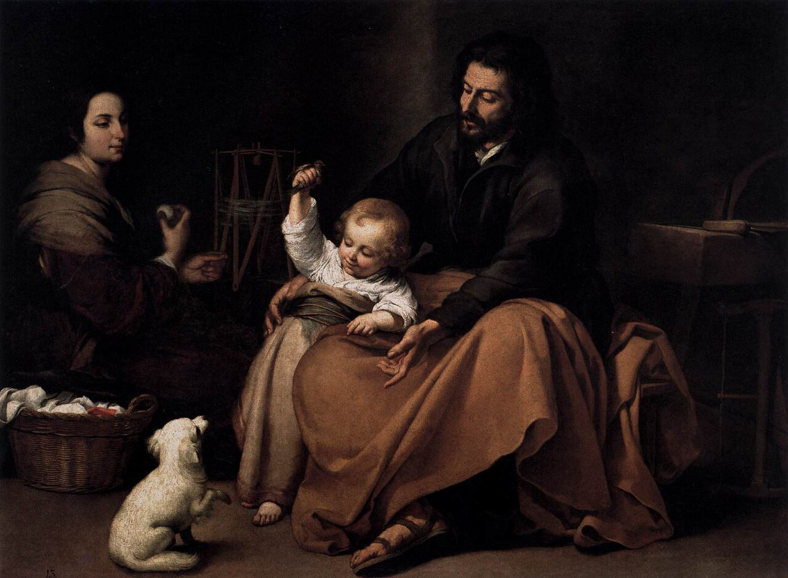

# Sessão 80 — Matrimônio — deveres dos esposos

*Bartolomé Esteban Murillo, The Holy Family with a Bird (c. 1650). Public Domain via Wikimedia Commons.*

> *A Sagrada Família com pássaro, de Murillo — um momento simples, uma bênção dez mil vezes. O amor conjugal não é romance conservado em âmbar; é fé e paciência trabalhadas em pão, contas e hora de dormir. Boa parte da santidade acontece aqui.*

## São Pio X pergunta

**411.** Os esposos católicos podem também realizar o Matrimônio civil?

*Os esposos católicos não podem realizar o Matrimônio civil nem antes nem após o Matrimônio religioso: porque se atrevessem a fazê-lo, inclusive com a intenção de celebrar em seguida o Matrimônio religioso, são considerados pela Igreja pecadores públicos.*

**412.** Os esposos, ao contrair o Matrimônio, devem estar na Graça de Deus?

*Os esposos, ao contrair o Matrimônio, devem estar na Graça de Deus, de outro modo cometem um sacrilégio.*

**413.** Que dever têm os esposos?

*Os esposos têm o dever de conviver santamente, de ajudarem-se com afeto constante nas necessidades espirituais e temporais, e de educar bem os filhos, cuidando da alma não menos que do corpo, e formando-os antes de tudo à Religião e à virtude com a palavra e com o exemplo.*

## O Catecismo Romano ensina

## Deveres dos cônjuges

### 1. Do marido

[26] É, pois, dever do marido tratar sua mulher com bondade e consideração. Importa-lhe recordar que Adão chamou Eva de companheira, quando dizia: "A mulher que me destes por companheira".[^66]

Por esse motivo, como ensinaram alguns dos Santos Padres, ela não foi formada dos pés, mas da ilharga do homem; da mesma forma, não foi tirada da cabeça, para reconhecer que não era senhora do marido, mas antes sua subordinada.

Depois, é preciso que o marido tenha sempre alguma boa ocupação, não só para prover o necessário ao sustento da família, mas também para não amolecer na ociosidade, fonte de quase todos os vícios.

Finalmente, deve o marido governar bem a sua família, corrigir as faltas de todos os seus membros, e manter cada qual no cumprimento de suas obrigações.

### 2. Da mulher

[27] De outro lado, as obrigações da mulher são aquelas que o Príncipe dos Apóstolos enumerou na seguinte passagem: "Sejam as mulheres submissas a seus maridos, de sorte que, se alguns deles não acreditam na palavra, sejam ganhos pelo procedimento de suas mulheres, sem o auxílio da palavra, quando consideram a vossa vida santa, cheia de temor de Deus. Seu adorno não consista exteriormente em toucados, em adereços de ouro, em requintes no trajar; mas antes [tornai] a índole humana que se oculta dentro do coração, com a pureza de sentimentos pacíficos e modestos, que são preciosos aos olhos de Deus. Desta forma se ornavam, antigamente, as mulheres santas que em Deus punham sua esperança, e viviam submissas a seus maridos, assim como Sara obedecia a Abraão[^67], a quem chamava de seu senhor".[^68]

Outro dever principal, para elas, seja também educar os filhos na prática da Religião, e cuidar zelosamente das obrigações domésticas.

De boa vontade vivam dentro de casa. Não saiam senão por necessidade, e nunca se atrevam a fazê-lo, sem a permissão do marido.[^69]

Afim, como requisito essencial para a boa união entre casados, estejam sempre lembradas de que, abaixo de Deus, a ninguém devem mais amor e estima do que a seus maridos; aos quais devem também atender e obedecer, com suma alegria, em todas as coisas que não forem contrárias à virtude cristã.

## Legislação Matrimonial

[28] Como complemento destas explicações, devem os pastores falar agora das cerimônias que se observam na celebração do Matrimônio. Todavia, ninguém há de esperar que se exponham aqui as respectivas prescrições; pois o Sagrado Concílio de Trento as determinou, com toda a minúcia e rigor, e os pastores não podem ignorar essa legislação.[^70] Por conseguinte, será bastante exortá-los a que estudem, do Concílio de Trento, a doutrina relativa a esta parte, e a exponham aos fiéis com a devida solicitude.

### 1. Forma legítima

[29] Antes de tudo, a fim de evitar que jovens e donzelas, na idade de maior ausência de critério, contraiam ligações de amor impuro, iludidos por algum falso título de casamento[^71], não se cansem os párocos de ensinar, repetidas vezes, que só podem ser considerados legítimos e verdadeiros os Matrimônios que forem contraídos em presença do pároco, ou de outro sacerdote, com licença[^72] do próprio pároco ou do Ordinário do lugar, e perante um determinado número de testemunhas.[^73]

### 2. Impedimentos matrimoniais

[30] Devem também ser explicados os impedimentos matrimoniais. Nas obras que escreveram sobre os vícios e as virtudes, a maior parte dos mais ponderados e instruídos moralistas trataram esta matéria tão exaustivamente, que a todos será fácil intercalar aqui a doutrina por eles ministrada, ainda mais que os párocos quase nunca poderão deixar tais livros fora da mão.

Por conseguinte, lerão atentamente essas prescrições, bem como os decretos do Sagrado Sínodo acerca dos impedimentos resultantes de parentesco espiritual, de pública honestidade, de fornicação[^74], e farão por esclarecer os fiéis a esse respeito.

## Preparação para o Matrimônio

### 1. Disposições íntimas

[31] Da doutrina exposta, não custa averiguar com que disposições devem os fiéis apresentar-se, quando estão para contrair Matrimônio. Compenetrar-se-ão, forçosamente, de que não vão tratar de um negócio puramente humano, mas de uma instituição divina, para a qual devem trazer invulgar pureza de sentimentos e piedade. Assim o demonstram, claramente, os exemplos dos Patriarcas da Antiga Aliança. Embora seus Matrimônios se não revestissem da dignidade sacramental, nem por isso deixavam de considerá-los dignos do maior respeito e da mais santa veneração.

### 2. Obediência e respeito aos pais

[32] Entre outras recomendações, é preciso exortar, sèriamente, os filhos adultos a terem tanta consideração aos pais e aos detentores do pátrio poder, que não contraiam núpcias, sem eles o saberem, muito menos contra a sua vontade, ou não obstante a sua oposição.[^75]

Observa-se, no Antigo Testamento, que os pais sempre determinavam o casamento de seus filhos.[^76] A grande importância que, nessa parte, se deve consagrar à vontade dos pais, o Apóstolo parece insinuá-la naquelas suas palavras: "Quem casa sua filha donzela, faz bem; quem não a casa, faz melhor".[^77]

## Uso do Matrimônio

[33] Como última questão, resta-nos tratar do uso do Matrimônio. Na elucidação dessa matéria, devem os pastores exprimir-se de tal maneira, que de sua boca não escape nenhuma palavra susceptível de melindrar os ouvidos cristãos, de perturbar as consciências piedosas, ou de provocar risotas maliciosas.[^78]

Dado que as "palavras do Senhor são castas"[^79], é de suma necessidade que o doutrinador do povo cristão use de uma linguagem em que transpareça uma extraordinária gravidade e nobreza de coração.

### 1. Espiritualizar a vida conjugal

Ora, duas são as principais instruções, que se devem dar aos fiéis. Em primeiro lugar, que ninguém se entregue à vida conjugal [só] por prazer e sensualidade, mas use do Matrimônio dentro daquelas normas que foram prescritas por Nosso Senhor, conforme o que acima ficou demonstrado.[^80]

Convém lembrar, aqui, a exortação do Apóstolo: "Os que têm mulher, vivam como se a não tivessem".[^81] Da mesma forma, aquela opinião de São Jerônimo: "O homem sensato deve amar sua esposa com discernimento, não ao sabor da paixão. Regulará os impulsos da sensualidade, e não se deixará arrastar cegamente à satisfação da carne. Nada mais vergonhoso, do que amar alguém a sua esposa, como se ela fora uma adúltera".[^82]

### 2. Saber conter-se quando o exija a oração ou a necessidade

[34] De outra parte, como devemos alcançar de Deus todos os bens, por meio de santas orações, os párocos devem ensinar aos fiéis, em segundo lugar, que se abstenham de vez em quando das relações conjugais, por amor das orações e súplicas que fazem a Deus.

Tal aconteça, principalmente, pelo menos três dias antes de receberem a Sagrada Eucaristia[^83]; mais vezes até, durante o tempo em que se observa o santo jejum da Quaresma, de acordo com as boas e graves prescrições que os nossos Santos Padres nos deixaram.[^84]

Desta forma, eles verão os bens do Matrimônio avultarem, dia a dia, com o aumento sempre maior da graça divina. Pela fervorosa prática da piedade, não só terão, neste mundo, uma vida tranquila e bonançosa, mas poderão também apoiar-se naquela verdadeira e sólida esperança, que "não engana"[^85], de conseguirem a vida eterna, graças à misericórdia de Deus.[^86]

[^1]: Eph 5, 22; Col 3, 13. (Contexto: 1 Cor 7, 7.)
[^2]: 1 Cor 7, 7.
[^3]: Eph 5, 22 ss.
[^4]: 1 Petr 3, 1 ss.
[^5]: Do latim: núbere = velar, cobrir com um véu.
[^6]: Ambros. De Abraham 1, 9.
[^7]: Em latim: coniunctio.
[^8]: Agora, só até o 3º grau (CIC 1076 § 6).
[^9]: Agora, antes dos 14 e 16 anos completos, para as donzelas e os rapazes, respectivamente (CIC cân. 1067 § 1).
[^10]: Conc. Florent. decret. pro Armenis (DU 702).
[^11]: Em linguagem forense: palavras de presente.
[^12]: Para serem válidos, os esponsais devem ser feitos em termo escrito, assinado pelas partes, pelo pároco ou pelo Ordinário do lugar, ou, na falta de ambos, por duas testemunhas (CIC cân. 1017 § 1).
[^13]: Isto, suppositis supponendis, com muita reserva, quanto à liberdade do consentimento.
[^14]: Ambros. De institut. virginum 6, 42.
[^16]: Gn 1, 27-28.
[^17]: Gn 2, 18.
[^18]: Gn 2, 20 ss. Cfr. Eph 5, 31.
[^19]: Conc. Trid. XXIV de Sacram. Matrim. (DU 969).
[^20]: Mt 19, 6; Mc 10, 9.
[^21]: Gn 1, 28.
[^22]: Nunca houve preceito individual. A ordem de Deus foi dada ao gênero humano.
[^23]: Mt 19, 12.
[^24]: 1 Cor 7, 25.
[^25]: Tob 6, 16 ss.
[^26]: Tob 6, 22.
[^27]: O CIC fulmina excomunhão contra os que provocam aborto, sem excluir a própria mãe abortante, se a tentativa surtir o efeito desejado (cân. 2350 § 1).
[^28]: De fato, tal crime raramente se comete sem cúmplices.
[^29]: 1 Cor 7, 2.
[^30]: 1 Cor 7, 5.
[^31]: Tob 8, 5.
[^32]: Gn 29, 30.
[^33]: Mt 22, 2; Apoc 21, 2-9.
[^34]: Eph 5, 22 ss.
[^35]: No original está "Sacramentum".
[^36]: Conc. Trid. XXIV de Matrim. doctr. et can. 1 (DU 969-971).
[^37]: Acerca desta alínea, veja-se Eph 5, 22-25.
[^38]: Conc. Trid. XXIV de Matrim. can. 1 (DU 971).
[^39]: Hb 13, 4.
[^40]: Gn 12, 3; 22, 18.
[^41]: Gn 4, 19; 16, 3; 21, 24; 26, 34; 28, 9; 29, 28; 30, 1-9.
[^42]: Deut 24, 1 ss.
[^43]: Mt 19, 9.
[^44]: Mt 19, 5 ss.
[^45]: Mt 19, 9; Mc 10, 11; Lc 16, 18.
[^46]: A respeito do Privilégio Paulino, em benefício dos pagãos recém-convertidos, veja-se o CIC, cân. 1120-1127, com os Documentos VI-VIII, anexos ao próprio Código. No entanto, para um estudo sistemático, consultar os autores de moral.
[^47]: Lc 16, 18; Mt 19, 9; Mc 10, 11.
[^48]: 1 Cor 7, 39; Rom 7, 2.
[^49]: 1 Cor 7, 10 ss.
[^50]: Conc. Trid. XXIV can. 5, 7, 8 (DU 975, 977-978). Cfr. CIC cân. 1128-1132.
[^51]: Aug. De conjug. adult. I 5, 8 (alias II 6, 9).
[^52]: Prov 18, 22.
[^53]: 1 Cor 7, 28.
[^54]: 1 Tim 2, 15.
[^55]: Eccli 7, 25.
[^56]: Eph 6, 4.
[^57]: Tob 4, 1 ss; Job 1, 5.
[^58]: Esta explicação tem mais cabimento no texto original, por causa da noção de "fides". Em latim, pode ser "fé" e "fidelidade".
[^60]: Gn 2, 24.
[^61]: 1 Cor 7, 4.
[^62]: Lev 20, 10.
[^63]: Eph 5, 25.
[^64]: 1 Cor 7, 10 ss.
[^65]: Eph 5, 22 ss; 1 Petr 3, 1 ss.
[^66]: Gn 3, 12.
[^67]: Gn 12, 13; 18, 6-12.
[^68]: 1 Petr 3, 1 ss.
[^69]: Levem-se em conta certas transformações sociais, do século XVI a esta parte, sem cair nas tendências paganizantes e anticristãs de hoje.
[^70]: Conc. Trid. XXIV de reformat. Matrim. (DU 969-982). — O CIC regulou novamente as prescrições acerca da forma, nos cânones 1094-1099. Vejam-se também os cânones 1019-1033 sobre a preparação, mormente os proclamas.
[^71]: Não excluído, hoje em dia, o mero contrato civil, que para o católico não estabelece a vida conjugal propriamente dita.
[^72]: Não é uma simples licença. Trata-se, pelo contrário, de uma verdadeira delegação a um sacerdote determinado para um casamento igualmente determinado (CIC cân. 1096 § 1).
[^73]: O CIC prescreve pelo menos duas testemunhas (cân. 1094).
[^74]: Conc. Trid. XXIV de reformat. Matrim. can. 24 (DU 972-974). Veja-se a legislação atual no CIC, cân. 1035-1080.
[^75]: O CIC determina que os párocos não assistam ao Matrimônio de menores, sem prévio consentimento dos pais, ou contra a sua vontade, a não ser que o Ordinário do lugar o tenha permitido (cân. 1034).
[^76]: Gn 24, 3 ss.
[^77]: 1 Cor 7, 38.
[^78]: O sacerdote não deve recuar, ante a dificuldade intrínseca do assunto. As multidões de hoje perderam o pudor de antanho, e deixam-se doutrinar por uma literatura cínica e anticristã.
[^79]: Ps 11, 7.
[^80]: O CIC diz assim: "O fim primário do Matrimônio é a geração e criação da prole; o secundário é o auxílio mútuo dos cônjuges e o remédio da concupiscência" (cân. 1013 § 1).
[^81]: 1 Cor 7, 29.
[^82]: Hieron. contra Jovinianum 1, 30 (alias 1, 49).
[^83]: Estes conselhos ascéticos caducaram com a Comunhão frequente e cotidiana, desconhecida no século XVI. São também posteriores aos primeiros tempos do cristianismo, quando os fiéis assistiam à Missa, e comungavam como participantes dos Sagrados Mistérios.
[^84]: É assunto de exposição muito delicada. Não deve ser levado ao púlpito. Convém omiti-lo nas instruções individuais aos noivos, porque no Matrimônio as obrigações são bilaterais. Além disso, os tempos mudaram. Ainda mal, as gerações de hoje não compreendem a candura e a elevação de certos pensamentos cristãos da antiguidade.
[^85]: Rom 5, 5.
[^86]: Acerca do Matrimônio, é indispensável o estudo das admiráveis encíclicas papais "Arcanum divinae Sapientiae", de Leão XIII, e "Casti Connubii", de Pio XI.

> **Escritura.** *Por isso, deixará o homem ao seu pai e à sua mãe, e se unirá à sua mulher; e os dois serão uma só carne.* — Gênesis 2, 24

> *Senhor, o sim diário do matrimônio — concedei-o aos que o estão dizendo, e a mim quando eu for chamado a dizê-lo.*
