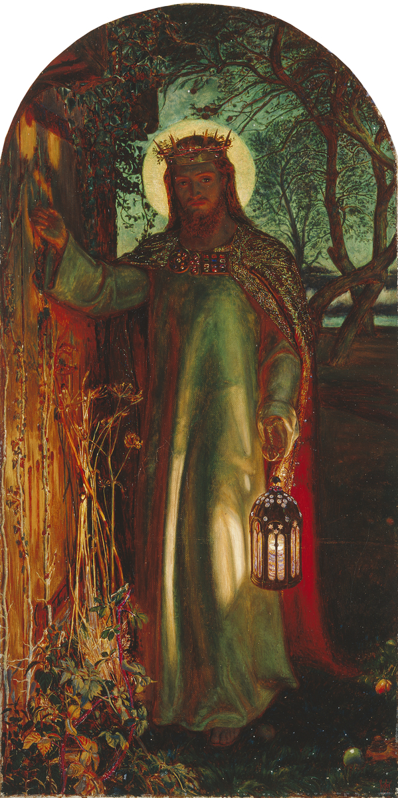

# Sessão 82 — Por que Deus nos ouve

*William Holman Hunt, The Light of the World (1851-1853). Public Domain via Wikimedia Commons.*

> *O Cristo de Holman Hunt bate a uma porta tomada de ervas daninhas — não há maçaneta do lado d'Ele. Deus ouve a oração porque é fiel, não porque somos persuasivos. Abra primeiro a porta; o resto segue.*

## São Pio X pergunta

**420.** Por que Deus concede as Graças que suplicamos?

*Deus concede as Graças que suplicamos porque Ele, que é fidelíssimo, prometeu atender-nos se rezamos com confiança e perseverança no Nome de Jesus Cristo.*

**421.** Por que devemos rezar a Deus no Nome de Jesus Cristo?

*Devemos rezar a Deus no Nome de Jesus Cristo porque só por Ele, seu Filho e único Mediador entre Deus e os homens, têm valor as nossas rezas e boas obras, por isso a Igreja costuma terminar as orações com estas ou equivalentes palavras: pelo Vosso Filho Jesus Cristo, Nosso Senhor.*

**422.** Por que não somos sempre atendidos quando rezamos?

*Não somos sempre atendidos quando rezamos ou porque rezamos mal ou porque pedimos coisas inúteis ao nosso verdadeiro bem, isto é, ao bem espiritual.*

**423.** O que devemos pedir a Deus?

*Devemos pedir a Deus a sua Glória e para nós a vida eterna e também as Graças temporais, como nos ensinou Jesus Cristo no Pai-Nosso.*

**424.** O que é o "Pai-Nosso"?

*O Pai-Nosso é a oração ensinada e recomendada por Jesus Cristo, a qual por isso se diz Oração Dominical ou do Senhor, e é a mais excelente de todas.*

**425.** Por que o "Pai-Nosso" é a oração mais excelente?

*O Pai-Nosso é a oração mais excelente porque é nascida da Mente e do Coração de Jesus, e contém em sete breves súplicas o que devemos pedir a Deus como seus filhos e como irmãos entre nós.*

> **Escritura.** *Pedi, e dar-se-vos-á; buscai, e achareis; batei, e abrir-se-vos-á.* — Mateus 7, 7

> *Senhor, pedi em mim aquilo que devo pedir. E depois pedi-o através de mim.*
