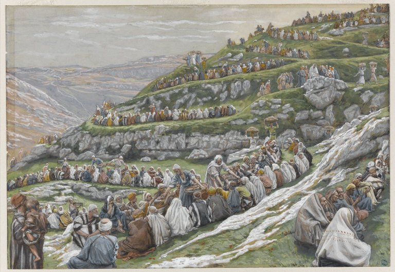

# Sessão 87 — Quarta petição — "O pão nosso de cada dia nos dai hoje"

*James Tissot, The Miracle of the Loaves and Fishes (c. 1886-1894). Public Domain via Wikimedia Commons.*

> *A multiplicação dos pães — cinco pequenos em Suas mãos. "O pão de cada dia" é pão, é o dinheiro do aluguel, é o trabalho que sustenta — e também é o Pão que é o Seu Corpo. Ele dá ambos. Peça ambos.*

## São Pio X pergunta

**427.** Como irmãos entre nós o que devemos pedir?

*Como irmãos entre nós devemos pedir a nutrição corporal e espiritual, o perdão dos pecados, a defesa das tentações e a liberação do mal: e isso se pede, por nós e por todos os homens, nas últimas quatro súplicas do Pai-Nosso.*

## São Tomás ensina

Acontece, às vezes, que alguém de grande sabedoria e ciência se torne medroso e tímido; é necessário, pois, que tenha fortaleza de coração, para que não lhe falte o necessário: «É Ele quem dá força ao cansado, e aumenta o vigor e a energia aos que não têm».[^1] O Espírito Santo dá esta fortaleza: «E entrou em mim o espírito… e me pôs em pé».[^2] Esta fortaleza, dada pelo Espírito Santo, fortalece de tal modo o coração do homem que ele não teme pelas coisas que lhe são necessárias, mas confia em que Deus há de prover a todas as suas necessidades. O Espírito Santo, que nos dá esta força, ensina-nos a orar a Deus: «O pão nosso de cada dia nos dai hoje». E, por isso, é chamado Espírito de fortaleza.

Cumpre notar que nas três primeiras petições desta oração se pedem somente coisas espirituais — aquelas que, embora começando neste mundo, só na vida eterna se completam. Assim, ao orar para que o nome de Deus seja santificado, na verdade pedimos que o nome de Deus seja conhecido; ao orar para que venha o Reino de Deus, pedimos que possamos participar do Reino de Deus; e ao orar para que se faça a vontade de Deus, pedimos que Sua vontade se cumpra em nós. Todas estas coisas, porém, embora tendo seu início aqui na terra, não podem ter sua plenitude senão no céu. Daí ser necessário pedir certas coisas necessárias que possam ser plenamente alcançadas nesta vida. O Espírito Santo, pois, ensinou-nos a pedir as exigências desta vida presente, que aqui se podem obter em sua plenitude, ao mesmo tempo mostrando que nossas necessidades temporais são providas por Deus. É isto o que se quer dizer quando dizemos: «O pão nosso de cada dia nos dai hoje».[^3]

Por estas mesmas palavras, o Espírito Santo nos ensina a evitar cinco pecados que costumam cometer-se por desejo das coisas temporais. O primeiro pecado é o do homem que, por um desejo desordenado, busca aquelas coisas que ultrapassam o seu estado e condição de vida. Não se contenta com o que lhe convém. Assim, se for soldado e desejar roupas, não as quererá próprias de soldado, mas de cavaleiro; ou, se for clérigo, roupas próprias de bispo. Este vício afasta o homem das coisas espirituais, porque faz seus desejos apegarem-se às coisas transitórias. Nosso Senhor ensinou-nos a evitar este vício, instruindo-nos a pedir as necessidades temporais desta vida presente conforme a posição de cada um. Tudo isto se entende sob o nome de «pão». E assim Ele não nos ensina a pedir o que é luxuoso, nem o que é variado, nem o demasiadamente refinado; mas o pão, que é comum a todos, e sem o qual a vida do homem não pode sustentar-se: «O principal para a vida do homem é a água e o pão».[^4] E ainda: «Tendo o que comer e com que cobrir-nos, contentemo-nos com isto».[^5]

O segundo pecado é o de alguns que, ao adquirir os bens temporais, oneram outros e os defraudam. Esta prática viciosa é perigosa, pois os bens assim subtraídos só com dificuldade podem ser restituídos. Pois, como diz Santo Agostinho: «O pecado não é perdoado enquanto não se restitui o que foi tomado».[^6] «Comem o pão da iniquidade».[^7] Nosso Senhor ensina-nos a evitar este pecado e a pedir nosso próprio pão, e não o de outrem. Os ladrões não comem o seu próprio pão, mas o pão de seu próximo.

O terceiro pecado é a solicitude desnecessária. Há os que jamais se contentam com o que têm, mas sempre querem mais. Isto é totalmente desmedido, pois o desejo deve sempre medir-se pela necessidade: «Não me dês mendicidade nem riquezas, dá-me apenas o necessário para a vida».[^8] Ensina-nos a evitar este pecado a expressão «pão nosso de cada dia», isto é, pão de um dia ou para um tempo.[^9]

O quarto pecado é a voracidade desordenada. Há os que num só dia consomem o que bastaria para muitos dias. Tais não pedem o pão de um dia, mas o de dez. E, porque gastam demais, sucede que dissipam toda a sua fazenda. «Os que se entregam à bebida, e os que entram em sociedades para isso, se hão de consumir».[^10] E ainda: «O operário ébrio não enriquecerá».[^11]

O quinto pecado é a ingratidão. A pessoa enche-se de soberba em suas riquezas, e não reconhece que o que tem vem de Deus. É falta grave, pois todas as coisas que temos, espirituais ou temporais, vêm de Deus: «Tudo é Teu, e Te demos o que recebemos da Tua mão».[^12] Por isso, para extirpar este vício, a oração diz: «Dai-nos o nosso pão de cada dia», a fim de que reconheçamos que todas as coisas vêm de Deus.

De tudo isto tiramos uma grande lição. Acontece, às vezes, que quem possui grandes riquezas não faz uso delas, mas sofre dano espiritual e temporal; pois alguns por causa das riquezas pereceram. «Há ainda outro mal que vi debaixo do sol, e é frequente entre os homens. Um homem a quem Deus deu riquezas, fazenda e honra, e à sua alma nada falta de tudo quanto deseja; contudo, Deus não lhe dá poder de comer disso, mas um estranho o consumirá».[^13] E ainda: «Riquezas conservadas para mal de seu dono».[^14] Devemos, pois, orar para que as nossas riquezas nos sejam úteis; e isto é o que pedimos quando dizemos «Dai-nos o nosso pão», isto é, faze que as nossas riquezas nos sejam úteis. «Seu pão se converterá em fel de áspides em seu ventre. Vomitará as riquezas que engoliu; e Deus as fará sair de suas entranhas».[^15]

Outro grande vício diz respeito às coisas deste mundo, a saber, a solicitude excessiva por elas. Pois há os que diariamente se inquietam com bens temporais que lhes bastariam para um ano inteiro; e os que assim se atribulam jamais terão descanso: «Não andeis, pois, ansiosos, dizendo: Que comeremos, ou que beberemos, ou com que nos vestiremos?»[^16] Nosso Senhor, portanto, ensina-nos a pedir que hoje nos seja dado o nosso pão, isto é, o que nos for necessário para o tempo presente.

Pode-se ainda ver neste pão um duplo significado: o Pão sacramental e o Pão da Palavra de Deus. Assim, no primeiro sentido, oramos pelo nosso Pão sacramental, que é consagrado diariamente na Igreja, para que o recebamos no Sacramento, e assim nos seja proveitoso para a salvação: «Eu sou o Pão vivo descido do céu».[^17] E ainda: «Quem come e bebe indignamente, come e bebe sua própria condenação».[^18]

No segundo sentido, este pão é a Palavra de Deus: «Não só de pão vive o homem, mas de toda palavra que sai da boca de Deus».[^19] Oramos, pois, para que Ele nos dê pão, isto é, a Sua Palavra.[^20] Daqui o homem tira aquela felicidade que é a fome de justiça. Pois, ao serem consideradas, as coisas espirituais tanto mais se desejam; e este desejo desperta uma fome, e desta fome se segue a plenitude da vida eterna.

[^1]: Is 40, 29.
[^2]: Ez 2, 2.
[^3]: «As demais petições, a partir da quarta, em que pedimos especial e expressamente o que é necessário ao corpo e à alma, estão subordinadas às que precedem. Conforme a ordem da Oração do Senhor, só pedimos o que diz respeito ao corpo e à sua conservação depois de termos orado pelas coisas que se referem a Deus» (*Catecismo Romano*, «Oração do Senhor», Capítulo XIII, 1).
[^4]: Eclo 29, 27.
[^5]: 1 Tm 6, 8. «Pedimos também o "nosso pão de cada dia", isto é, o sustento necessário; e sob o nome de "pão" entendemos tudo o que for necessário para alimento e vestuário. … Para compreender plenamente o sentido desta petição, deve-se ainda notar que por esta palavra "pão" não se há de entender abundância de comidas requintadas e de vestes ricas, mas o que é necessário e simples» (*Catecismo Romano*, *loc. cit.*, 10).
[^6]: *Epistola* 153, em Migne, P.L., XXXIII, 662.
[^7]: Pr 4, 17.
[^8]: «Ibid.», 30, 8.
[^9]: «Chamamo-lo também "pão nosso de cada dia", porque dele nos servimos para recobrar a energia vital que diariamente se consome. … Por fim, a palavra "de cada dia" implica a necessidade de orar continuamente a Deus, para sermos conservados no hábito de O amar e servir, e para que estejamos plenamente persuadidos de que d'Ele dependemos para a vida e a salvação» (*Catecismo Romano*, *loc. cit.*, 12).
[^10]: Pr 23, 21.
[^11]: Eclo 19, 1.
[^12]: 1 Cr 29, 14.
[^13]: Ecl 6, 1-2.
[^14]: «Ibid.», 5, 12.
[^15]: Jó 20, 14.
[^16]: Mt 6, 31.
[^17]: Jo 6, 51.
[^18]: 1 Cor 11, 29. «Mas Cristo Nosso Senhor, substancialmente presente no Sacramento da Eucaristia, é por excelência este pão. Este penhor inefável de Seu amor deu-nos quando estava para retornar a Seu Pai, e d'Ele disse: "Quem come a Minha carne e bebe o Meu sangue, permanece em Mim, e Eu nele" (Jo 6, 57). "Tomai e comei: isto é o Meu corpo" (Mt 26, 26). … Este Pão chama-se "nosso pão", porque é o alimento espiritual unicamente dos fiéis, isto é, daqueles que, unindo a caridade à fé, lavam o pecado de suas almas no Sacramento da Penitência e, lembrados de que são filhos de Deus, recebem e adoram este divino mistério com toda a santidade e veneração a que se possam dispor» (*Catecismo Romano*, *loc. cit.*, 20).
[^19]: Mt 4, 4.
[^20]: «Resta falar daquele pão espiritual que também é objeto desta petição da Oração do Senhor, e que abrange tudo o que é necessário para a saúde e segurança do espírito e da alma. Assim como o alimento pelo qual se nutre o corpo é de várias espécies, também o alimento que conserva a vida do espírito e da alma não é de uma só espécie. Assim, a Palavra de Deus é o alimento da alma» (*Catecismo Romano*, *loc. cit.*, 18).

> **Escritura.** *O pão nosso de cada dia nos dai hoje.* — Mateus 6, 11

> *Pai, hoje, minhas necessidades — confio-as a Vós. O pão da mesa, o pão do altar — dai-nos ambos.*

---

#### Aprofundamento — *Catecismo de Trento*

> O pão nosso de cada dia nos dai hoje

## I. Conexão desta petição com as anteriores

[1] A quarta petição e as outras seguintes, nas quais especificamos os bens necessários para alma e corpo, estão em íntima conexão com as petições anteriores. Pois na Oração Dominical há uma sequência determinada, pela qual o pedido das coisas divinas precede às petições relativas à conservação do corpo e dos bens temporais. Assim como os homens tendem para Deus, seu fim último, pela mesma razão devem os bens da vida humana subordinar-se aos bens da glória divina.

### 2. Razão de ser desta petição

[2] Devemos pedir e desejar esses bens humanos, ou porque assim o requer a disposição de Deus; ou porque eles nos são necessários, para conseguirmos os bens divinos, em quanto nos servem de instrumentos para chegarmos ao fim que nos é proposto — o Reino e a glória do Pai Celestial — pela fiel observância dos Mandamentos, que são para nós a expressa manifestação da vontade de Deus. Por conseguinte, em Deus e Sua glória devemos colimar toda a razão de ser desta petição.

## II. Disposições de quem reza

### 1. Sobrepor a tudo a vontade de Deus

[3] Graças à diligência dos párocos, os fiéis ouvintes hão de compreender que, ao pedirmos a posse e o gozo dos bens terrenos, devemos regular nossos desejos e intenções pela vontade de Deus, sem dela nos desviarmos em hipótese alguma.

No pedir coisas terrenas e caducas é que mais se erra, confirmando o que escrevia o Apóstolo: "Não sabemos o que devemos pedir, como é necessário".[^306] Devemos, portanto, pedir esses bens, mas "como convém", para que não aconteça desejarmos alguma coisa fora de propósito, e ouvirmos a resposta de Deus: "Vós não sabeis o que pedis".[^307]

### b) Ter reta intenção

O critério mais seguro para se distinguir, se a petição é acertada ou descabida, está na intenção e sentimento de quem pede. Se alguém pede bens terrenos, disposto a julgá-los absolutamente bons, e a descansar na posse deles, como seu último fim, sem ter outras aspirações mais elevadas, esse certamente não reza "como é necessário". Pois são palavras de Santo Agostinho: "Não pedimos essas coisas temporais, como se fossem bens nossos, mas como necessidades nossas".[^308]

O Apóstolo também ensina, na epístola aos Coríntios, que todas as coisas relativas às necessidades da vida devem servir para a glorificação de Deus. "Quer comais, diz ele, quer bebais, quer façais outra coisa qualquer, fazei tudo para a honra de Deus".[^309]

## III. Necessidade desta petição

### 1. Necessidades materiais antes do pecado de Adão

[4] Devem os fiéis reconhecer também a necessidade da presente petição. Os párocos hão de mostrar-lhes quanto precisamos das coisas exteriores, para a nossa vida e sustento. Isso calará melhor no espírito, se confrontarmos as necessidades do primeiro pai do gênero humano com as condições de vida que, dali por diante, se impunham aos outros homens.

Verdade é que ele precisava de alimento para reparar as forças, não obstante o glorioso estado de inocência, do qual [mais tarde] se privou a si mesmo e, por sua culpa, a todos os descendentes. Entretanto, muito vai de suas precisões às necessidades de nossa vida. Ele não carecia de roupa para cobrir o corpo, nem de casa para morar, nem de armas para se defender, nem de remédios para se curar, nem de outras coisas, que nos são necessárias, para acudirmos à nossa mísera e frágil natureza. Para conservar a vida imortal, bastar-lhe-ia o fruto que a ditosa árvore da vida havia de produzir, sem nenhum trabalho para ele e sua posteridade.

Mas, entre as maiores delícias do Paraíso, não ficaria o homem ocioso; pois foi para trabalhar que Deus o colocara naquele lugar de felicidade.[^310] Todavia, nenhum esforço lhe seria penoso, nenhuma atividade deixaria de ser agradável. Pelo cultivo daqueles ditosos jardins, colheria sempre os frutos mais suaves, e jamais veria baldarem-se seus esforços e esperanças.

### 2. Depois da queda de Adão

[5] Seus descendentes, ao invés, foram não só esbulhados do fruto da árvore da vida, mas até atingidos por aquela tremenda condenação: "Maldita será a terra por causa de tua obra. Com fadiga, tirarás dela o que comer, todos os dias de tua vida. Ela te produzirá espinhos e abrolhos, e tu comerás ervas do campo. No suor do teu rosto comerás o teu pão, até voltares à terra, da qual foste tomado; porque tu és pó, e ao pó hás de voltar".[^311]

Para nós, pois, saiu tudo ao contrário do que caberia a Adão e sua posteridade, se ele desse ouvidos à palavra de Deus. Por isso, tudo mudou de face e reverteu na pior das desgraças.

A aflição chega ao seu auge, quando as maiores despesas, os mais aturados trabalhos e fadigas não dão, muitas vezes, nenhum resultado. Acontece, por exemplo, que as colheitas não correspondem às semeaduras; que ervas daninhas as sufocam; que a chuva, o vento, o granizo, a alforra e a ferrugem assolam e destroem as plantações. Desta sorte, qualquer catástrofe da natureza pode, em pouco tempo, reduzir a nada os trabalhos de um ano inteiro.

Todas essas coisas são uma consequência de nossos enormes pecados. Deus os aborrece, e por causa deles não abençoa de modo algum os nossos trabalhos, e faz prevalecer aquela terrível sentença, que desde o princípio havia lavrado contra nós.

### 3. Necessidade de nosso trabalho

[6] Neste lugar, incumbe aos pastores mostrar ao povo cristão que os homens caem, por sua própria culpa, em tais angústias e misérias. Façam o povo compreender que se não deve poupar nenhum trabalho nem fadiga, para se conseguir os meios de subsistência; mas que são ilusórias as esperanças, e inúteis os esforços, se Deus não abençoar a nossa atividade. Pois "o que vale não é quem planta, nem rega, mas quem faz crescer, que é Deus".[^312] E mais: "Se o Senhor não edificar a casa, debalde se esforçam os que querem levantá-la".[^313]

### Mas só Deus pode valer-nos

[7] Advirtam os párocos que há um sem-número de coisas, cuja privação nos tiraria a vida, ou no-la faria insuportável. Desde que o povo cristão reconheça a necessidade dessas coisas, agravada pela impotência da natureza humana, ver-se-á obrigado a recorrer ao Pai Celestial, e a pedir-Lhe suplicante todos os bens temporais e espirituais.

Imitará, então, o filho pródigo que, começando a sofrer em lugar longínquo, não tinha quem, para matar a fome, lhe desse o bagulho dos porcos; caiu afinal em si, e reconheceu que só de seu pai alcançaria remédio para os males que o assoberbavam.[^314]

O povo cristão dispor-se-á, também, a rezar com maior confiança, se pela consideração da divina bondade não esquecer que Deus como Pai conserva sempre os ouvidos atentos aos clamores de Seus filhos.

Por isso mesmo, quando Ele nos exorta a pedir pão, promete dá-lo em abundância a todos os que souberem pedir nas devidas condições. Ensinando-nos o modo de pedir, Ele nos convida a pedir; convidando, insiste conosco; insistindo, promete; prometendo, dá-nos a absoluta certeza de sermos atendidos.

## IV. Conteúdo desta petição

### A. Materialmente, "pão" significa o necessário para a vida

[8] Depois de atilar e acender assim o ânimo dos fiéis, devem os párocos explicar, logo em seguida, o objeto desta petição, dizendo, antes de tudo, que pão é esse que pedimos aqui.

Ora, cumpre saber que, nas Sagradas Escrituras[^315], o termo "pão" admite várias significações, entre as quais duas se distinguem mais em particular. A primeira acepção compreende tudo o que usamos para a mantença do corpo e de nosso padrão de vida; a segunda, tudo o que a bondade de Deus outorgou para a vida e a salvação de nossa alma.

Mas, na sólida opinião dos Santos Padres, o que se pede aqui são os meios para a conservação de nossa vida temporal.

### Corolário: É lícito pedir coisas temporais

[9] Por conseguinte, não devemos absolutamente dar ouvidos aos que dizem ser vedado aos cristãos pedir a Deus os bens da vida terrena. Contra esse erro, depõe o consenso unânime dos Santos Padres, e uma infinidade de exemplos do Antigo e Novo Testamento.

Jacob, por exemplo, ao fazer um voto, rezou assim: "Se Deus for comigo, e me proteger no caminho que faço, e me der pão para comer e roupa para vestir; e se eu voltar são e salvo à casa de meu pai: o Senhor será o meu Deus, e esta pedra que levantei como padrão será chamada Casa de Deus; e de todas as coisas que me derdes, eu Vos oferecerei o dízimo".[^316]

Salomão certamente pedia meios de subsistência, quando formulava aquela célebre oração: "Não me deis penúria, nem tão pouco riqueza; dai-me somente o que for necessário para sustentar a vida".[^317]

Que dizer então do Salvador do gênero humano? Ele nos manda pedir coisas que, indiscutivelmente, se reportam às exigências de nosso corpo. "Rogai, diz Ele, que a vossa fuga não seja durante o inverno, nem caia em dia de sábado".[^318] Que julgaremos também daquelas palavras de Santiago: "Está triste algum de vós? Recorra à oração. Se está alegre, meta-se a cantar".[^319]

Que opinião faremos do Apóstolo, que assim falava aos Romanos: "Rogo-vos, irmãos meus, por Nosso Senhor Jesus Cristo, e pelo amor do Espírito Santo, que me ajudeis com vossas orações a Deus, para eu ficar livre dos infiéis que vivem na Judéia".[^320]

Ora, como Deus mesmo permitiu aos fiéis peçam as coisas humanamente necessárias, e Cristo Nosso Senhor lhes ensinou esta fórmula perfeita de orar, não padece a menor dúvida de que ela assim faz parte das sete petições.

### 1. Pedimos

#### a) Comida, roupa, etc.

[10] Pedindo o pão "de cada dia", entendemos por pão as coisas necessárias para a subsistência: roupa suficiente para nos vestirmos, comida bastante para nos alimentarmos, e tanto faz que esta seja pão, carne, peixe, ou qualquer outro mantimento.

Vemos que, nesse sentido, falava o profeta Eliseu. Quando ele advertiu o rei mandasse dar pão aos soldados assírios, receberam estes muitas espécies de iguarias.[^321] A mesma coisa lemos, nas Escrituras, acerca de Cristo Nosso Senhor. "Chegara, em dia de sábado, à casa de um chefe dos fariseus, para comer pão".[^322] Ora, é claro que tal expressão designa tanto a comida como a bebida.

#### b) Mas só o necessário é suficiente

Para atinarmos com o pleno sentido desta petição, devemos ter em conta que o termo "pão" não se toma para exprimir alimentos e agasalhos em requintada abundância, mas únicamente em quantidade necessária, de acordo com a teoria do Apóstolo: "Se tivermos o que comer, e com que nos vestir, demo-nos por satisfeitos".[^323] E também com aquilo que já citamos de Salomão: "Dai-me só o que preciso para viver".[^324]

### 2. O termo "nosso"

#### a) Recomenda a temperança

#### b) Proíbe o desperdício

[11] O termo imediato, também, nos concita à mesma simplicidade e temperança. Pois, quando dizemos "nosso", damos a entender que pedimos pão para nosso sustento, e não para ser desperdiçado. Não lhe chamamos "nosso", como se fôssemos capazes de adquiri-lo por nosso esforço, sem a mão dadivosa de Deus, uma vez que David declarou: "Todos esperam de Vós, que lhes deis de comer a seu tempo. Se lho derdes, eles o receberão. Se abrirdes a Vossa mão, todos se encherão de Vossos bens".[^325] E noutra passagem: "Os olhos de todos em Vós se esperançam, e Vós lhes dais de comer na ocasião oportuna".[^326]

Dizemos "nosso", porquanto nos é necessário, e nos foi dado por Deus, Pai de todos, que pela Sua Providência sustenta todos os seres animados.[^327]

#### c) Manda adquirir legitimamente

[12] Chama-se ainda "pão nosso", porque devemos adquiri-lo por meios legítimos, e não por injustiças, fraudes e furtos. O que adquirimos, por especulações ilícitas, não é nosso, mas dos outros. O mais das vezes tal aquisição ou retenção é funesta e acarreta danos inevitáveis.

No entanto, os lucros honestos e laboriosos de pessoas tementes a Deus trazem consigo grande paz e felicidade, conforme sentencia o Profeta: "Por te sustentares com o trabalho de tuas mãos, serás feliz e terás prosperidade".[^328] E noutro lugar, promete Deus a bênção de Sua bondade aos que procuram viver de trabalho honesto: "O Senhor lançará a Sua bênção sobre os teus celeiros, sobre todas as obras de tuas mãos, e te abençoará".[^329]

Afinal, não só pedimos a Deus a graça de gozarmos daquilo que, ajudados de Sua bondade, conseguimos com o nosso suor e trabalho, e por isso chamamos "nosso", mas também Lhe rogamos nos dê as devidas disposições, para podermos usufruir, com retidão e prudência, o que foi por nós honestamente adquirido.

### "De cada dia"

#### 3. A cláusula "de cada dia"

#### a) Recomenda a frugalidade

[13] A presente cláusula está intimamente ligada à noção de simplicidade e temperança, de que há pouco se falava; porquanto não pedimos iguarias variadas e esquisitas, mas só uma alimentação que corresponda às necessidades de nossa natureza. Esta petição deve, pois, cobrir de vergonha os que, enfastiados da comida e bebida comum, só procuram o que há de melhor em acepipes e marcas de vinho.

#### b) Condena a avareza e gastança

Não menos atinge esta cláusula "de cada dia" todos os que são fulminados pela terrível ameaça de Isaías: "Ai de vós que juntais casa com casa, e acrescentais campo a campo, até chegardes ao fim do terreno. Por acaso sois vós os únicos para morar em toda a terra?"[^330] Na verdade, insaciável é a cobiça desses homens, dos quais escreveu Salomão: "O avarento jamais se fartará de dinheiro".[^331] Quadra-lhes também aquela sentença do Apóstolo: "Os que querem enriquecer caem na tentação e nas ciladas do demônio".[^332]

Sob outro aspecto, dizemos "pão de cada dia", porque o ingerimos para restaurar as forças vitais, que todos os dias se consomem pelo processo de combustão orgânica.

#### c) Impõe o dever da oração diária

O último motivo de tal designação é a necessidade de pedir assiduamente, a fim de nos conservarmos na prática de amar e adorar a Deus, e para nos convencermos, acima de qualquer dúvida, que de Deus depende nossa vida e nossa salvação.

### "Nos dai"

### 4. O "nos dai" exorta:

#### a) A reconhecer o domínio de Deus

[14] Inegavelmente, estas duas palavras sugerem copioso assunto para se induzir os fiéis a honrarem e venerarem, com filial devoção, o poder infinito de Deus, em cujas mãos estão todas as coisas[^333], e a detestarem aquela nefanda impostura de Satanás: "A mim me foram entregues todas as coisas, e eu as dou a quem eu quiser".[^334] Pois somente Deus é que por Sua vontade distribui, conserva, e aumenta todas as coisas.

#### b) Os ricos a pedirem a proteção divina

[15] Mas que obrigação, dirá alguém, foi imposta aos ricos, de pedirem o "pão de cada dia", se vivem na abundância de todas as coisas? Ora, eles precisam fazer a mesma petição, não para conseguirem o que, pela mercê de Deus, já possuem com largueza, mas para que não venham a perder o que, fartamente, lhes foi outorgado.

Por isso, como escreve o Apóstolo, aprendam os ricos a "não sobrelevar-se, nem a confiar na falsidade das riquezas, mas em Deus vivo, que para nosso gozo nos dá a abundância de todas as coisas".[^335]

São João Crisóstomo procura ainda motivar esta petição, dizendo que não é só para termos alimento em abundância, mas também para que o mesmo nos seja distribuído pela mão do Senhor; pois, comunicando ao pão de cada dia um efeito benéfico e sobremaneira salutar, ela faz com que o alimento aproveite ao corpo, e o corpo por sua vez esteja a serviço da alma.[^336]

### Corolário: Por que pedimos no plural

[16] Por que dizemos "dai-nos", no plural, e não "dai-me"? Por ser próprio da caridade cristã, que cada qual não cuide apenas de si mesmo, mas procure também ocupar-se de seu próximo, e lembrar-se dos outros, quando trata de seus próprios interesses.

De mais a mais. Ao fazer benefícios ao homem, Deus não os faz, para que um só indivíduo os desfrute ou ponha fora, mas para que reparta com o próximo tudo quanto sobejar de suas próprias utilidades. Pois São Basílio e Santo Ambrósio o declaram formalmente: "Aos famintos pertence o pão, que tu guardas; dos nus é a roupa que seguras em tua arca; ao resgate e livramento de míseros escravos se destina esse dinheiro, que tu escondes no fundo da terra".[^337]

### "Hoje"

#### 5. O advérbio "hoje" lembra-nos a contínua dependência de Deus

[17] Este advérbio nos faz lembrar a insuficiência natural da condição humana. De per si, quem não se julgaria capaz de agenciar, por um só dia, a sua própria manutenção, embora não presumisse consegui-lo por tempo mais dilatado? Entretanto, nem essa confiança em nós mesmos, Deus não no-la deixou, pois que nos deu ordem de Lhe pedirmos o sustento para cada dia. Desse fato tiramos uma ilação necessária. Se todos, dia por dia, carecemos de pão, força é que todos também rezemos, diariamente, a Oração Dominical.

Até aqui se falou do pão, que ingerimos pela boca, para nutrir e conservar o nosso corpo. Deus o reparte a todos, sem distinção, a fiéis e infiéis, a justos e pecadores, por um admirável efeito de Sua bondade, pois Ele faz raiar o Seu sol sobre os bons e os maus, e derrama as chuvas sobre os justos e os injustos.[^338]

### B. Espiritualmente, "pão" indica nosso alimento espiritual

[18] Resta-nos falar agora do pão espiritual, que também pedimos neste lugar. Por ele, entendemos todas as coisas que neste mundo são necessárias para conservar e incentivar a vida sobrenatural da alma.

Assim como é variada a comida, com que se nutre e conserva o corpo, assim também não é uniforme o alimento que sustenta a vida sobrenatural da alma.

Nestas condições, um alimento da alma, temo-lo na palavra de Deus, pois diz a Sabedoria: "Vinde, comei do meu pão, e bebei do vinho que vos tenho temperado".[^339]

#### 1. A palavra de Deus

Quando, pois, Deus priva os homens de ouvirem essa palavra — o que faz de ordinário, quando é mais gravemente ofendido pelos nossos pecados — dizem as Escrituras que Ele castiga o gênero humano por meio da fome. O profeta Amós o declara, nos termos seguintes: "Eu enviarei fome sobre a terra, não a fome de pão, nem a sede de água, mas a de ouvir a palavra do Senhor".[^340]

Assim como é sinal certo de estar próxima a morte, quando alguém já não pode ingerir alimentos, nem retê-los no estômago: assim temos também um grande indício de condenação eterna, quando alguém não procura a palavra de Deus, nem aceita a sua pregação, e lança contra Deus aquele brado de impiedade: "Retirai-Vos de nós, pois não queremos saber de Vossos caminhos".[^341]

Nessa turvação e cegueira de espírito, acham-se os que abandonaram seus legítimos pastores, os bispos e sacerdotes católicos; os que arrenegaram a Santa Igreja de Roma, para se fazerem discípulos dos hereges, que corrompem a palavra de Deus.[^342]

#### 2. Cristo Nosso Senhor

[19] Como alimento de nossa alma, pão é para nós Cristo Nosso Senhor, que de Si mesmo declarou formalmente: "Eu sou o pão vivo, que desci do céu".[^343]

Não é possível descrever o grande gozo e alegria, de que este Pão satura os corações fervorosos, mormente quando mais os contundem as amarguras e provações da terra. Sirva-nos de exemplo o sagrado Colégio dos Apóstolos, acerca dos quais está escrito: "Eles se retiraram alegres da presença do Conselho".[^344]

De exemplos assim estão cheias as biografias dos Santos. E de tais alegrias íntimas, que são as arras dos virtuosos, nos fala Deus na passagem seguinte: "A quem vencer, darei o maná escondido".[^345]

#### 3. Em particular, a Eucaristia

[20] Porém nosso pão por excelência é o próprio Cristo Nosso Senhor, em quanto mantém Sua presença substancial no Sacramento da Eucaristia. Ele nos deu esse penhor inefável de Sua caridade, quando estava na iminência de voltar para junto de Seu Pai. Desse pão declarou Ele: "Quem comer a Minha Carne, e beber o Meu Sangue, permanece em Mim, e Eu nele".[^346] "Tomai e comei: Isto é o Meu Corpo".[^347]

Para instruírem o povo cristão nas questões mais oportunas, podem os párocos recorrer ao tratado que explica, por partes, a natureza e eficácia deste Sacramento.[^348]

##### a) Como nosso pão...

[Como Eucaristia], dizemos que esse pão é "nosso", porque se destina só para os fiéis, isto é, para aqueles que unem a fé com a caridade, purificando-se das manchas de pecado pelo Sacramento da Penitência; para os que não esquecem jamais que são Filhos de Deus, recebendo e adorando o Divino Sacramento com a máxima piedade e veneração.

##### b) ...de cada dia

[21] Dizemos também ser de "cada dia", por duas razões que se justificam plenamente. A primeira é que, nos Sagrados Mistérios da Igreja de Cristo, diariamente se oferece a Deus esse Pão, e se distribui aos que o pedem, com santas e fervorosas disposições.

A segunda é que o devemos tomar todos os dias, ou pelo menos viver, de modo que nos seja lícito tomá-lo todos os dias, se nos oferecer a oportunidade.

Os que abraçam a opinião contrária, entendendo que só de longe em longe deve a alma nutrir-se desse salutar alimento, ouçam o que diz Santo Ambrósio: "Se é pão de cada dia, por que o tomas só depois de um ano?"[^349]

## V. Exortação final

### 1. Confiar a Deus o resultado das diligências humanas

[22] Na presente petição, devemos ainda inculcar aos fiéis um aspecto de grande importância. Depois de se terem empenhado, com reta intenção, por conseguir os meios necessários de subsistência, devem eles entregar a Deus o andamento das coisas, e conformar seus desejos com a vontade d'Aquele "que não deixará o justo numa eterna angústia".[^350]

Com efeito, ou Deus atende o que Lhe pedem, e assim [os fiéis] alcançam a satisfação de seus desejos; ou não atende, e nisso vai a certeza absoluta de não ser salutar, nem proveitoso, o que Deus nega aos bons cristãos. Pois Deus cuida mais de sua salvação, do que eles próprios o poderiam fazer.

Na explicação deste problema, podem os párocos escudar-se nas exímias argumentações que Santo Agostinho desenvolve em sua epístola a Proba.[^351]

### 2. Os ricos devem acudir aos pobres

[23] O tratado sobre a presente petição deve culminar numa advertência aos ricos. Vejam eles em seus largos cabedais uma mera dádiva de Deus, e não esqueçam que, na obrigação de reparti-las com os pobres, está a razão por que foram aquinhoados de tais riquezas.

Reforça esta doutrina o que o Apóstolo expõe na primeira epístola a Timóteo.[^352] Dali podem os párocos tirar muitos pensamentos, divinamente inspirados, para confirmar esta tese com argumentações úteis e convincentes.

[^306]: Rom 8, 26.
[^307]: Mt 20, 22.
[^308]: Aug. De serm. Domini in monte II, 16.
[^309]: 1 Cor 10, 31.
[^310]: Gn 2, 15.
[^311]: Gn 3, 17 ss.
[^312]: 1 Cor 3, 7.
[^313]: Ps 126, 1.
[^314]: Lc 15, 11 ss.
[^315]: Gn 3, 19; 14, 18; Eccles 11, 1; cfr. abaixo as citações do § 9.
[^316]: Gn 28, 20 ss.
[^317]: Prov 30, 8.
[^318]: Mt 24, 20.
[^319]: Jac 5, 13.
[^320]: Rom 15, 30.
[^321]: 4 Reg 6, 22-23.
[^322]: Lc 14, 1.
[^323]: 1 Tim 6, 8.
[^324]: Prov 30, 8.
[^325]: Ps 103, 27.
[^326]: Ps 144, 15.
[^327]: Ps 146, 9.
[^328]: Ps 127, 2.
[^329]: Deut 28, 8.
[^330]: Is 5, 8.
[^331]: Eccles 5, 9.
[^332]: 1 Tim 6, 9.
[^333]: Ps 23, 1.
[^334]: Lc 4, 6.
[^335]: 1 Tim 6, 17.
[^336]: Chrysost. Opus imperfectum in Matthaeum, homil. 14.
[^337]: Ambrosius ex Basilii homilia in Lc 12, 18 (Destruam horrea) nº 7.
[^338]: Mt 5, 45.
[^339]: Prov 9, 5.
[^340]: Amos 8, 11.
[^341]: Job 21, 14.
[^342]: Em idênticas condições se acham, hoje, os que professam o espiritismo, o comunismo, etc.
[^343]: Jo 6, 41.
[^344]: Act 5, 41.
[^345]: Apoc 2, 17.
[^346]: Jo 6, 57.
[^347]: Mt 26, 26; Mc 14, 22; Lc 22, 19; 1 Cor 11, 23.
[^348]: Cfr. CRO II IV 1 ss.
[^349]: Ambros. Lib. V de Sacram. 4.
[^350]: Ps 54, 23.
[^351]: Aug. epist. 130, alias 121, 17.
[^352]: 1 Tim 6, 17 ss.
