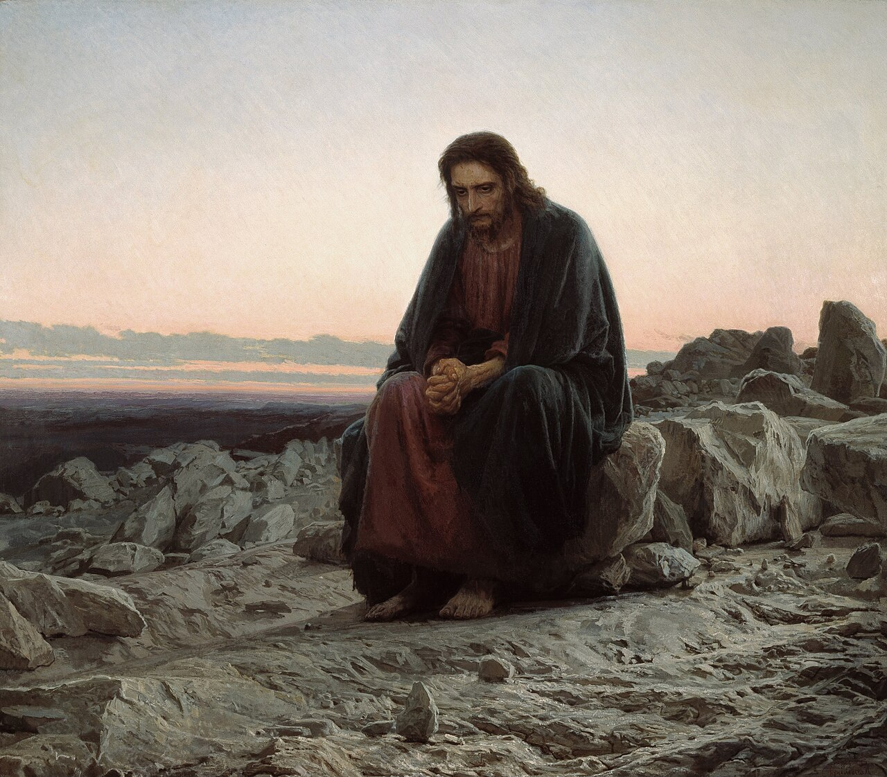

# Sessão 89 — Sexta e Sétima Petições e o Amém — tentação, libertação, confirmação

*Ivan Kramskoi, Christ in the Wilderness (1872). Public Domain via Wikimedia Commons.*

> *O Cristo no deserto de Kramskoi está sentado numa pedra, só, exausto, antes da decisão. A tentação é real; a libertação é pedida. Rezar "e não nos deixeis cair em tentação, mas livrai-nos do mal" é conhecer a própria hora.*

## São Tomás ensina

Há aqueles que pecaram e desejam o perdão de seus pecados. Confessam suas faltas e se arrependem. Contudo, não se esforçam tanto quanto deveriam para não tornar a cair em pecado. E nisso, com efeito, não são consequentes. Pois, de um lado, deploram seus pecados, sentindo-se arrependidos por eles; e, de outro, pecam outra vez e outra ainda, e tornam a tê-los para deplorar. Como está escrito: «Lavai-vos, purificai-vos. Tirai dos meus olhos a maldade dos vossos desígnios. Cessai de proceder perversamente».[^1]

Vimos na petição anterior que Cristo nos ensinou a buscar o perdão dos nossos pecados. Nesta petição, ensina-nos a orar para que possamos evitar o pecado — isto é, para que não sejamos induzidos à tentação e, assim, caiamos em pecado. «E não nos deixeis cair em tentação».[^2]

Três questões se consideram agora: (1) Que é a tentação? (2) De que modos é alguém tentado, e por quem? (3) Como é alguém libertado da tentação?

## Que é a tentação?

Quanto à primeira, cumpre saber que tentar nada mais é do que pôr à prova ou experimentar. Tentar a um homem é pôr à prova ou experimentar a sua virtude. Isto se faz de dois modos, assim como a virtude do homem requer duas coisas. Uma exigência é fazer o bem; a outra, evitar o mal: «Aparta-te do mal e faze o bem».[^3] Às vezes a virtude do homem é experimentada no fazer o bem, e às vezes é provada no evitar o mal. Assim, quanto à primeira, a pessoa é provada na sua prontidão para fazer o bem, por exemplo, jejuar e coisas semelhantes. Então, grande é a tua virtude quando és pronto a fazer o bem. Deste modo Deus às vezes prova a virtude de alguém, não, contudo, porque tal virtude esteja oculta para Ele, mas para que todos a conheçam e sirva de exemplo a todos. Assim Deus tentou Abraão, e também Jó.[^4] Por esta razão Deus envia frequentemente provações aos justos, os quais, suportando-as com toda paciência, manifestam sua virtude e nela crescem: «O Senhor vosso Deus vos prova, para ver se O amais com todo o vosso coração e toda a vossa alma, ou não».[^5] Assim Deus tenta o homem, incitando-o a boas obras.

Quanto à segunda, a virtude do homem é provada pela solicitação ao mal. Se ele resiste verdadeiramente e não consente, então sua virtude é grande. Se, porém, cede à tentação, está desprovido de virtude. Deus a ninguém tenta deste modo, pois está escrito: «Deus não é tentador para o mal, e a ninguém tenta».[^6]

## Como é alguém tentado?

**As tentações da carne.** — O homem é tentado por sua própria carne, pelo demônio e pelo mundo. É tentado pela carne de dois modos. Primeiro, a carne incita-o ao mal. Sempre busca seus próprios prazeres, a saber, os prazeres carnais, nos quais muitas vezes está o pecado. Quem se entrega aos prazeres carnais negligencia as coisas espirituais: «Cada um é tentado pela sua própria concupiscência».[^7]

Segundo, a carne tenta o homem afastando-o do bem. Pois o espírito, por seu lado, sempre se deleitaria nas coisas espirituais, mas a carne, afirmando-se, põe obstáculos ao espírito: «O corpo corruptível é peso para a alma».[^8] «Pois, segundo o homem interior, deleito-me na lei de Deus. Mas vejo nos meus membros outra lei, que combate a lei da minha mente, e me faz cativo na lei do pecado, que está nos meus membros».[^9] Esta tentação que vem da carne é gravíssima, porque o nosso inimigo, a carne, está unido a nós; e, como diz Boécio: «Não há praga mais perigosa do que um inimigo no círculo da família». Devemos, portanto, estar sempre em guarda contra este inimigo: «Vigiai e orai, para não entrardes em tentação».[^10]

**As tentações do demônio.** — O demônio nos tenta com extrema força. Mesmo quando a carne está subjugada, surge outro tentador, a saber, o demônio, contra quem temos pesada luta. Disto diz o Apóstolo: «Nossa luta não é contra a carne e o sangue, mas contra os principados e potestades, contra os dominadores deste mundo de trevas, contra os espíritos malignos nas alturas».[^11] Por isso é muito apropriadamente chamado o tentador: «Para que talvez aquele que tenta não vos haja tentado».[^12]

O demônio procede com astúcia extrema ao tentar-nos. Opera como um general hábil quando está prestes a atacar uma cidade fortificada. Procura os pontos fracos no objeto de seu assalto e, na parte em que o homem é mais fraco, tenta-o. Tenta o homem nos pecados a que mais se inclina, depois de subjugada a carne. Tais são, por exemplo, a ira, a soberba e os demais pecados espirituais. «Vosso adversário, o demônio, anda como leão que ruge, à procura de quem devorar».[^13]

**Como o demônio nos tenta.** — O demônio faz duas coisas quando nos tenta. Assim, não sugere logo algo que nos pareça mau, mas algo que tenha aparência de bem. Com isso desejaria, ao menos no princípio, desviar o homem de seu propósito principal, e depois será mais fácil induzi-lo ao pecado, uma vez desviado por pouco que seja. «O próprio Satanás se transfigura em anjo de luz».[^14] Então, quando uma vez já levou o homem ao pecado, encadeia-o de modo a impedi-lo de reerguer-se de seu pecado. O demônio, portanto, faz duas coisas: primeiro engana o homem, e depois, depois de o trair, prende-o no seu pecado.

**As tentações do mundo.** — O mundo tem dois modos de tentar o homem. O primeiro é o desejo excessivo e desregrado pelos bens desta vida: «O desejo do dinheiro é a raiz de todos os males».[^15] O segundo modo são os temores engendrados por perseguidores e tiranos: «Estamos envoltos em trevas».[^16] «Todos os que querem viver piedosamente em Cristo Jesus, padecerão perseguição».[^17] E ainda: «Não temais os que matam o corpo».[^18]

**Como é alguém libertado da tentação?** — Vimos agora o que é a tentação, e também de que modo e por quem é alguém tentado. Mas como é alguém libertado da tentação? Aqui devemos notar que Cristo nos ensina a orar não para que não sejamos tentados, mas para que não sejamos induzidos à tentação. Pois é quando alguém vence a tentação que merece a recompensa. Por isso está dito: «Tende por motivo de toda alegria, irmãos meus, quando cairdes em diversas tentações».[^19] E ainda: «Filho, quando vieres servir a Deus… prepara a tua alma para a tentação».[^20] E: «Bem-aventurado o homem que suporta a tentação, pois, quando for provado, receberá a coroa da vida».[^21] Nosso Senhor, portanto, ensina-nos a orar para que não sejamos induzidos à tentação, isto é, dando-lhe nosso consentimento: «Não vos sobrevenha tentação senão humana».[^22] A razão é que ser tentado é coisa humana, mas consentir é coisa diabólica.

Mas Deus leva alguém ao mal, para que se ore: «Não nos deixeis cair em tentação»? Respondo que Deus se diz levar alguém ao mal por permissão, na medida em que, por causa de seus muitos pecados, retira de si a Sua graça, e, em consequência dessa retirada, o homem cai no pecado. Por isso cantamos no Salmo: «Quando me faltarem as forças, não me abandones».[^23] Deus, contudo, dirige o homem pelo fervor da caridade, para que não seja induzido à tentação. Pois a caridade, mesmo em seu menor grau, é capaz de resistir a qualquer espécie de pecado: «Muitas águas não puderam apagar a caridade».[^24] Guia também o homem pela luz do entendimento, no qual lhe ensina o que deve fazer. Pois, como diz o Filósofo: «Todo aquele que peca é ignorante».[^25] «Eu te darei entendimento e te instruirei».[^26] Era por este último que orava Davi, dizendo: «Ilumina os meus olhos, para que eu jamais durma na morte; para que jamais diga o meu inimigo: prevaleci contra ele».[^27] Recebemos isto pelo dom do entendimento. Por isso, ao recusarmos consentir à tentação, conservamos puros os nossos corações: «Bem-aventurados os puros de coração, porque verão a Deus».[^28] E desta petição se segue que somos conduzidos à visão de Deus — à qual a todos nós leve Deus!

[^1]: Is 1, 16.
[^2]: «Devemos implorar o auxílio divino em geral em todas as tentações, e especialmente quando somos assaltados por alguma tentação particular» (*Catecismo Romano*, «Oração do Senhor», Capítulo XV, 15).
[^3]: Sl 33, 15.
[^4]: Gn 22; Jó 1.
[^5]: Dt 13, 3.
[^6]: Tg 1, 13.
[^7]: *Ibid.*, 1, 14.
[^8]: Sb 9, 15.
[^9]: Rm 7, 22-23.
[^10]: Mt 26, 41.
[^11]: Ef 6, 12.
[^12]: 1 Ts 3, 5.
[^13]: 1 Pd 5, 8.
[^14]: 2 Cor 11, 14.
[^15]: 1 Tm 6, 10.
[^16]: Jó 37, 19.
[^17]: 2 Tm 3, 12.
[^18]: Mt 10, 28.
[^19]: Tg 1, 2.
[^20]: Eclo 2, 1.
[^21]: Tg 1, 12.
[^22]: 1 Cor 10, 13.
[^23]: Sl 70, 9.
[^24]: Ct 8, 7.
[^25]: Aristóteles, «Ética», III, 1.
[^26]: Sl 31, 8.
[^27]: Sl 12, 4-5.
[^28]: Mt 5, 8.

---

Já o Senhor nos ensinou a orar pelo perdão dos nossos pecados e a evitar as tentações. Nesta petição ensina-nos a orar para sermos preservados do mal — e, na verdade, de todo mal em geral, como pecado, doença, aflição e quaisquer outros, conforme explica Santo Agostinho.[^1] Mas, visto que já mencionamos o pecado e a tentação, devemos agora considerar outros males, tais como a adversidade e todas as aflições deste mundo. Destas Deus nos preserva de quatro modos.

Primeiro, preserva-nos da própria aflição; mas isto é muito raro, porque é sorte dos justos, neste mundo, padecer, conforme está escrito: «Todos os que querem viver piedosamente em Cristo Jesus padecerão perseguição».[^2] Uma vez ou outra, contudo, Deus impede o homem de ser afligido por algum mal; isto se dá quando sabe que tal pessoa é fraca e incapaz de o suportar. Assim como o médico não prescreve remédios violentos a um paciente fraco. «Eis que pus diante de ti uma porta aberta, que ninguém pode fechar; pois tu tens pouca força».[^3] No céu, isto será coisa geral, pois ali ninguém será afligido. «Em seis tribulações» — a saber, as desta vida presente, que se divide em seis idades — «Ele te livrará, e na sétima o mal não te tocará».[^4] «Não terão mais fome nem sede».[^5]

Segundo, Deus nos livra das aflições quando nos consola nelas; pois, se Ele não nos consolasse, não poderíamos perseverar por muito tempo: «Fomos sobrecarregados desmedidamente, acima de nossas forças, a tal ponto que estávamos cansados até da vida».[^6] «Mas Deus, que conforta os humildes, nos consolou».[^7] «Conforme a multidão das dores em meu coração, Tuas consolações alegraram a minha alma».[^8]

Terceiro, Deus dá tantos bens aos que estão afligidos que esquecem os seus males: «Depois da tempestade fazes vir a calmaria».[^9] As aflições e provações deste mundo, portanto, não devem ser temidas, tanto porque vêm acompanhadas de consolações como porque são de breve duração: «Pois esta nossa tribulação leve e momentânea produz para nós um peso eterno e desmedido de glória».[^10]

Quarto, somos preservados das aflições nisto: que todas as tentações e provações concorrem para o nosso bem. Não oramos: «Livrai-nos da tribulação», mas «do mal». Isto porque as tribulações trazem coroa aos justos, e por essa razão se alegravam os Santos em seus sofrimentos: «Gloriamo-nos também nas tribulações, sabendo que a tribulação produz a paciência».[^11] «No tempo da tribulação, perdoas os pecados».[^12]

## O valor da paciência

Deus, portanto, livra o homem do mal e da aflição, convertendo-os em seu bem. É sinal de suprema sabedoria desviar o mal para o bem. E a paciência em suportar as provações é resultado disto. As outras virtudes operam por bens, mas a paciência opera nos males, e, com efeito, é muito necessária nos males, a saber, na adversidade: «O saber do homem se conhece pela sua paciência».[^13]

O Espírito Santo, por meio do dom da sabedoria, faz-nos usar desta oração, e por ela alcançamos a suprema felicidade, que é a recompensa da paz. Pois é pela paciência que obtemos a paz, quer no tempo da prosperidade, quer no da adversidade. Por esta razão os pacíficos chamam-se filhos de Deus, porque são semelhantes a Deus nisto: que nada pode prejudicar a Deus, e nada pode prejudicá-los, seja a prosperidade ou a adversidade: «Bem-aventurados os pacíficos, porque serão chamados filhos de Deus».[^14] «Amém». Esta é a ratificação geral de todas as petições.[^15]

[^1]: «Nosso Senhor mesmo se valeu desta petição quando, na véspera de Sua paixão, orou a Deus Pai pela salvação de toda a humanidade. Disse: "Rogo que os preserves do mal" (Jo 17, 15). Nesta forma de oração resumiu, por assim dizer, a força e a eficácia das demais petições; e a deu por preceito e a confirmou pelo exemplo» (*Catecismo Romano*, *loc. cit.*, Capítulo XVI, 1).
[^2]: 2 Tm 3, 12.
[^3]: Ap 3, 8.
[^4]: Jó 5, 19.
[^5]: Ap 7, 16.
[^6]: 2 Cor 1, 8.
[^7]: *Ibid.*, 7, 6.
[^8]: Sl 93, 19.
[^9]: Tb 3, 22.
[^10]: 2 Cor 4, 17.
[^11]: Rm 5, 3.
[^12]: Tb 3, 13.
[^13]: Pr 19, 11.
[^14]: Mt 5, 9.
[^15]: «A palavra "Amém", que encerra a Oração do Senhor, contém, por assim dizer, os germes de muitos dos pensamentos e considerações que acabamos de tratar. Tão frequente, com efeito, era esta palavra hebraica nos lábios de Nosso Senhor, que aprouve ao Espírito Santo conservá-la na Igreja de Deus. Seu significado pode dizer-se: "Sabe que tuas orações foram ouvidas". Tem força de uma resposta, como se Deus respondesse à oração do suplicante e benignamente o despedisse depois de ter atendido bondosamente as suas orações» (*Catecismo Romano*, *loc. cit.*, Capítulo XVII, 4).

---

A modo de breve resumo, deve-se saber que a Oração do Senhor contém tudo o que devemos desejar e tudo o que devemos evitar. Ora, de todas as coisas desejáveis, o que mais se há de desejar é o que mais se ama; e isso é Deus.

Por isso, buscas, antes de tudo, a glória de Deus quando dizes: «Santificado seja o vosso Nome». Deves desejar três coisas de Deus, e dizem respeito a ti mesmo. A primeira é alcançar a vida eterna. E oras por isto quando dizes: «Venha a nós o vosso Reino». A segunda é fazer a vontade de Deus e a Sua justiça. Oras por isto nas palavras: «Seja feita a vossa vontade, assim na terra como no céu». A terceira é ter o necessário à vida. E assim oras: «O pão nosso de cada dia nos dai hoje». Sobre todas estas coisas diz o Senhor: «Buscai primeiro o Reino de Deus», o que corresponde à segunda, «e todas estas coisas vos serão acrescentadas»,[^16] o que está conforme à terceira.

Devemos evitar e fugir de tudo o que se opõe ao bem. Pois, como vimos, o bem é, antes de tudo, o que se há de desejar. Este bem é quádruplo. Primeiro, é a glória de Deus, e nenhum mal lhe é contrário: «Se pecares, em que O ofenderás? E se procederes com justiça, que Lhe darás?»[^17] Quer seja o mal — enquanto Deus o castiga —, quer seja o bem — enquanto Deus o recompensa —, tudo redunda em Sua glória.

O segundo bem é a vida eterna, à qual o pecado é contrário, porque a vida eterna se perde pelo pecado. E assim, para tirar este mal, oramos: «Perdoai-nos as nossas ofensas, assim como nós perdoamos a quem nos tem ofendido». O terceiro bem é a justiça e as boas obras, e a tentação lhes é contrária, porque a tentação nos impede de fazer o bem. Oramos, portanto, para que este mal seja afastado, dizendo: «Não nos deixeis cair em tentação». O quarto bem são todas as necessidades da vida, e a estas se opõem as tribulações e adversidades. E procuramos removê-las quando oramos: «Mas livrai-nos do mal. Amém».

[^16]: Mt 6, 33.
[^17]: Jó 35, 6-7.

> **Escritura.** *Deus é fiel: não permitirá que sejais tentados além das vossas forças, mas, juntamente com a tentação, dará o meio de sair dela.* — 1 Coríntios 10, 13

> *Senhor, hoje, na tentação que enfrentarei, ide à minha frente. Livrai-me, antes mesmo que eu perceba o perigo.*

---

#### Aprofundamento — *Catecismo de Trento*

> E não nos deixeis cair em tentação

## I. Motivo desta petição

[1] Desde que alcançam o perdão de seus pecados, os Filhos de Deus afervoram-se em render culto e veneração a Deus, desejando ansiosamente o Reino do céu, cumprindo todos os seus deveres de filhos para com a Majestade Divina, abandonando-se inteiramente à Sua paternal vontade e providência.

### 1. Sanha do demônio contra os bons

Mas coisa é averiguada que, então, o inimigo do gênero humano mais se esforça em usar contra eles todas as astúcias, em lhes assestar todas baterias, em cercá-los de todos os lados. Isso dá motivo para temer que, mudando de resolução, venham eles a titubear e a reincidir nos antigos vícios, e se tornem muito piores do que antes eram. Com razão se lhes aplicaria aquele princípio do Príncipe dos Apóstolos: "Melhor lhes fora não terem jamais conhecido o caminho da justiça, do que, depois de conhecê-lo, voltarem atrás e afastarem-se da santa Lei que lhes foi ensinada".[^408]

### 2. Ordem formal de Cristo

[2] Este é o motivo por que Cristo Nosso Senhor nos mandou recitar a presente petição. Devemos todos os dias encomendar-nos a Deus, implorar a Sua paternal proteção e assistência, não tendo a menor dúvida de que, se nos desamparasse o favor divino, ficaríamos presos nos laços do mais ardiloso inimigo.

De mais a mais, não foi só na Oração Dominical que Ele nos ordenou pedir a Deus não nos deixasse cair em tentação, mas também naquelas palavras que dirigiu aos Santos Apóstolos pouco antes de Sua Morte. Embora dissesse que todos estavam limpos[^409], lembrou-lhes essa mesma obrigação: "Rezai, para não entrardes em tentação".[^410]

Esta advertência, mais uma vez inculcada por Cristo Nosso Senhor, impõe aos párocos o rigoroso dever de induzirem o povo fiel ao uso frequente desta petição. Como o demônio, nosso inimigo, lança os homens, a cada instante, em tantos perigos dessa natureza, recorram eles a Deus, que únicamente pode conjurá-los, e peçam com toda a instância: "Não nos deixeis cair em tentação".

## II. Sua importância

### 1. Pela fraqueza humana

[3] Sem embargo, o povo fiel há de compreender melhor quanto se lhe faz mister esse auxílio divino, se tiver lembrança de sua própria fraqueza e ignorância, se não olvidar aquelas palavras de Cristo Nosso Senhor: "O espírito está aparelhado, mas a carne é fraca"[^410]; se considerar quão graves e ruinosas são as quedas dos homens, a que o demônio os pode arrastar, se não forem sustentados pela poderosa destra de Deus.

Poderá haver exemplo mais impressionante da fraqueza humana, do que a sagrada junta dos Apóstolos? Pouco antes, estavam cheios de coragem; mas, aos primeiros sinais de perigo, abandonaram o Salvador, e fugiram desatinados.[^411]

Mais palpável, ainda, é o exemplo do Príncipe dos Apóstolos. Com grande veemência, havia proclamado, pouco antes, a sua coragem e particular afeição a Cristo Nosso Senhor, e cheio de confiança em si mesmo chegara a dizer: "Ainda que seja preciso morrer convosco, eu não Vos negarei".[^412] Todavia, logo se atemorizou com a interpelação de uma única mulherzinha, e afirmou sob juramento que não conhecia o Senhor. O fato é que suas forças não corresponderam à grande prontidão de seu espírito.

Ora, se homens de eminente virtude pecaram gravemente, por fragilidade da natureza humana, em que punham demasiada confiança: quanto não devem temer os demais, que muitíssimo se distanciam de tal santidade?

### 2. Dos perigos em que vivemos

#### a) Por parte da má concupiscência

[4] Por isso mesmo, devem os párocos falar, ao povo fiel, das lutas e perigos a que assiduamente nos achamos expostos, enquanto a alma viver em corpo mortal[^413], e de todos os lados nos assediarem a carne, o mundo e o demônio. Que mal incalculável podem fazer em nós a cólera e a cobiça! Quantos já não o sentiram com grande prejuízo próprio! Quem não é atormentado por tais aguilhões? Quem não sente tais acicates? Quem não se queima com tais brasidos? A bem dizer, tão variados são os golpes, tão imprevistos os assaltos, que muito difícil será escapar alguém, sem graves ferimentos.

#### b) Por parte dos demônios

Além desses inimigos, que moram e vivem conosco[^414], sobejam aqueles assanhados inimigos, dos quais dizem as Escrituras: "A nossa luta não é contra a carne e o sangue, mas contra os principados e as potestades, contra os dominadores deste mundo tenebroso, contra os espíritos malignos nas alturas".[^415]

#### Poderosos no seu intento

[5] Aos combates interiores, acrescem, de fora, os ataques e investidas dos demônios, que não só nos agridem de frente, como também se insinuam com tanto disfarce em nossas almas, que mal podemos acautelar-nos contra eles.

Chama-lhes o Apóstolo "príncipes" pela eminência de sua natureza, pois em virtude de seus dotes naturais sobrepujam aos homens e às demais criaturas sensíveis. Chama-lhes também "potestades", porque nos são superiores, já pela própria natureza, já pelo âmbito de seu poder.

Dá-lhes o nome de "dominadores deste mundo tenebroso", porque não governam o mundo formoso e luminoso, quais são os bons e justos, mas antes o mundo confuso e tenebroso, que se compõe daqueles que, obcecados pelas imundas trevas de uma vida dissoluta e criminosa, se comprazem em seguir ao demônio, príncipe das trevas.

Diz igualmente que os demônios são "espíritos malignos"; pois, havendo malícia da carne, há também uma malícia do espírito. A malícia carnal provoca o apetite dos gozos e prazeres sensuais. A malícia espiritual consta dos maus desejos e paixões desregradas, que empolgam as potências superiores da alma. É, pois, tanto mais funesta do que a outra, quanto mais nobre e elevada é a razão e a inteligência.

Como a malícia de Satanás visa, sobretudo, privar-nos da herança celestial, por isso é que o Apóstolo especificou "nas alturas". Donde devemos inferir que são grandes as forças de nossos inimigos, inflexível a sua coragem, cruel e imenso o seu ódio contra nós; que nos movem uma guerra contínua, de sorte que nem paz, nem tréguas podemos fazer com eles.

#### Atrevidos no atacar

[6] A que ponto vai a sua arrogância, bem o mostra aquela palavra de Satanás, referida pelo Profeta: "Hei de subir até ao céu".[^416] E de fato, acercou-se dos primeiros homens no Paraíso[^417], investiu contra os Profetas[^418], chegou-se aos Apóstolos, para os joeirar como o trigo, conforme dizia Nosso Senhor no Evangelho.[^419] Não se vexou de se pôr na presença do próprio Cristo Nosso Senhor.[^420] Dessa infrene cobiça e obstinada astúcia do demônio nos fala São Pedro naquela passagem: "O demônio, vosso inimigo, anda em redor como um leão a rugir, buscando a quem devorar".[^421]

#### Tremendos pelo seu poder

Além disso, Satanás não é o único que tenta os homens. Muitas vezes, os demônios se congregam para investir contra um indivíduo. Assim o confessou aquele demônio, a quem Cristo Nosso Senhor perguntara pelo nome, porquanto respondeu: "Meu nome é Legião".[^422] Era, na verdade, um tropel de demônios que havia atormentado o pobre homem. E de outro demônio está escrito: "Toma consigo outros sete espíritos, piores do que ele, e, entrando, fazem ali a sua morada".[^423]

### Corolário: Por que os perversos não sentem o demônio

[7] Muitos julgam que tudo não passa de imaginação, só porque de modo algum experimentam, em si mesmos, as tentações e ataques dos demônios. Todavia, não admira não sejam tais pessoas acometidas pelos demônios, uma vez que se entregaram a eles de própria vontade.

Não possuem piedade, nem caridade, nem virtude alguma própria de um cristão. Daí nasce estarem, inteiramente, no poder do demônio. E o demônio não precisa valer-se das tentações para as derribar, desde que consentiram, espontaneamente, em lhe dar morada no coração.

Entretanto, os que se consagraram a Deus, e levam na terra uma vida toda celestial, são por isso mesmo atingidos, mais do que todos, pelos furores de Satanás, que nutre contra eles um ódio implacável, e lhes arma ciladas a cada instante. A História Sagrada está cheia de exemplos, relativos a santos varões que ele derribou, por violência e traição, não obstante terem lutado corajosamente. Adão, David, Salomão, e outros mais, que seria difícil enumerar, sofreram violentos ataques e pérfidas traições dos demônios, a que a mera prudência e força humana não pode resistir.

Sendo assim, quem poderia julgar-se seguro, se contasse somente com o seu próprio resguardo? Com piedade e pureza de intenção, pois, devemos pedir a Deus não permita sermos tentados além do que podem as nossas forças, e nos faça, antes, tirar alento da própria tentação, para podermos resistir com firmeza.[^424]

#### c) Limites da tentação

[8] Neste ponto, devemos também acoroçoar os fiéis, se alguns por covardia ou ignorância ficam transidos com o poder dos demônios, para que, na tormenta das tentações, se acolham ao porto seguro desta petição.

Mau grado seu grande poder e obstinação, e seu ódio mortal contra o gênero humano, o demônio não pode tentar-nos e importunar-nos, com a força ou pelo tempo que ele queira, pois toda a sua influência é regulada pela vontade e permissão de Deus.

Disso temos em Job o exemplo mais conhecido. Não tivesse Deus dito ao diabo a seu respeito: "Tudo quanto ele possui está em tuas mãos"[^425] — não poderia Satanás tocar em nada que fosse dele. Todavia, se o Senhor não tivesse acrescentado: "Só não estendas tua mão contra a sua pessoa"[^425] — um único golpe do demônio o teria fulminado, juntamente com seus filhos e todos os cabedais. A tal ponto está ligado o poder dos demônios, que sem permissão de Deus não poderiam sequer entrar nos porcos, de que falam os Evangelistas.[^426]

## III. Explicação verbal

### 1. Sentido do "tentar"

[9] Para se compreender o pleno sentido desta petição, força é explicar o que, neste lugar, significa "tentação", bem como o que quer dizer "cair em tentação".

Ora, tentar é pôr em situação perigosa a quem desejamos experimentar, a fim de fazê-lo trair seus sentimentos acerca de alguma coisa. Nessa modalidade, não se pode admitir nenhuma tentação da parte de Deus. Pois que coisa pode haver que Deus não saiba de antemão? Diz o Apóstolo: "Tudo está franco e descoberto aos Seus olhos".[^427]

#### a) Deus não tenta para apurar a verdade...

Outra espécie de tentação consiste em exagerar alvitres, que costumam sortir efeitos contrários, tanto para o bem, como para o mal.[^428] É para o bem, quando dessa forma se experimenta a virtude de alguma pessoa, com o fito de deixá-la bem averiguada, de cumular de honras e benefícios a quem a pratica, de propor tal exemplo à imitação dos outros, e de incitar a todos que, por isso mesmo, rendam louvor a Deus.

Esta maneira de tentar é a única possível da parte de Deus. Exemplo de tal tentação são aquelas palavras do Deuteronômio: "O Senhor vosso Deus vos põe à prova, para que se torne manifesto, se O amais, ou não".[^429]

#### b) Mas para provar a virtude

Também se diz que Deus tenta os seus, quando os aflige com pobreza, doença e outras adversidades. Assim procede, para lhes apurar a paciência, e para os apresentar aos outros homens como exemplos do dever cristão.

#### c) Máxime pelo sofrimento

Nesse sentido, lemos que Abraão foi tentado, porquanto devia imolar seu próprio filho[^430]; e, pelo seu procedimento, se tornou um exemplo singular de obediência e resignação, que jamais se apagará da lembrança dos homens. De forma análoga, dizem as Escrituras a respeito de Tobias: "Porque eras benquisto de Deus, foi preciso que a tentação te provasse".[^431]

#### d) O demônio tenta para o mal

[10] É para o mal, a tentação dos homens, quando estes são induzidos ao pecado, ou à sua ruína espiritual. Nisso vai um mister próprio do diabo, que tenta os homens, com o fito de enganá-los e perdê-los. Por isso, as Sagradas Escrituras lhe chamam simplesmente "o tentador".[^432]

#### Pela rebeldia da concupiscência, ou por meio de outros

Em tais tentações, ele ora produz em nós uma rebelião interior, valendo-se dos apetites e inclinações de nossa alma; ora nos persegue exteriormente, lançando mão de fatores extrínsecos, uns favoráveis, para nos levar à soberba, outros prejudiciais para nos tirar a coragem. Às vezes, dispõe também de homens perdidos como seus emissários e batedores, entre os quais se destacam os hereges que, sentados na cadeira da pestilência[^433], lançam por toda a parte a semente mortífera de suas perversas doutrinas, para fazerem a ruína completa dos fracos e vacilantes, que de si mesmos propendem para o mal, e não possuem nenhum critério para julgar entre a virtude e os vícios.

### 2. Sentido de "cair em tentação"

[11] Dizemos "cair em tentação"[^434], todas as vezes que sucumbimos às tentações. Ora, há dois modos de cair em tentação.

#### a) Deus não quer o pecado

Primeiramente, quando nos deixamos conturbar, e nos rendemos ao pecado, para o qual alguém nos arrastou por sua instigação. Mas é certo que, deste modo, Deus não induz ninguém em tentação, porque Deus não pode ser causa de pecado para ninguém, pois até odeia "todos aqueles que praticam a iniquidade".[^435] Assim o declarou também o Apóstolo Santiago: "Quando alguém for tentado, não diga que é tentado por Deus, pois Deus não tenta para o mal".[^436]

#### b) Mas permite tentações e quedas

Em segundo lugar, de quem não nos tenta propriamente, nem contribui para sermos tentados, dizemos todavia que tenta da mesma forma, porquanto não nos atalha as ocasiões de tentação, ou não impede nossa derrota, embora lhe seja possível fazê-lo. Deus, por sua vez, permite que os bons e justos sejam tentados dessa maneira, mas não os deixa sem o auxílio de Sua graça. Algumas vezes, por um justo e secreto juízo de Deus, que nossos pecados provocaram, ficamos entregues às nossas próprias forças, e sucumbimos miseravelmente.

#### c) Nem impede o abuso das Suas graças

[12] Afirma-se, ainda, que Deus nos induz em tentação, quando, por desgraça nossa, abusamos dos dons e benefícios que Ele nos dispensou para nossa salvação, e, como o filho pródigo, desbaratamos a fortuna paterna na libertinagem, vivendo ao sabor de nossas paixões. A nosso respeito podemos repetir o que o Apóstolo havia dito da Lei: "Conforme averiguei, o preceito que devia levar à vida, tornou-se ocasião de morte".[^437]

Disso temos um exemplo apropriado na cidade de Jerusalém, de acordo com o testemunho do profeta Ezequiel. Deus a tinha provido de todas as preciosidades, e chegou ao ponto de declarar pela boca do Profeta: "Tu eras perfeita no Meu ornato, qual Eu havia lançado sobre ti".[^438]

Todavia, em vez de ser grata a Deus, pelo muito que lhe fizera, e continuava fazendo, e de aproveitar os dons celestes como meios que recebera, para garantir a sua eterna bem-aventurança: aquela cidade, dotada de tantas mercês divinas, se mostrou ingratíssima para com Deus seu Pai, abandonou toda a esperança e recordação dos bens celestiais, para só gozar das riquezas terrenas, na mais ruinosa devassidão. Assim Ezequiel o descreve, largamente, no mesmo capítulo.[^439]

Por igual motivo, são ingratos para com Deus, os homens que com Sua permissão empregam em vícios os abundantes favores que Deus lhes concede para a prática da virtude.

### 3. Idiotismos da Bíblia nesse sentido

[13] Mas aqui é preciso levar em conta a linguagem da Sagrada Escritura. Para designar a permissão de Deus, usa certas locuções que, em seu sentido próprio, indicariam um ato positivo da parte de Deus. No Êxodo, por exemplo, está escrito assim: "Eu endurecerei o coração de Faraó".[^440] Em Isaías: "Hás de cegar o coração deste povo".[^441] Na epístola aos Romanos, escreve o Apóstolo: "Deus os entregou a paixões vergonhosas e sentimentos depravados".[^442]

Ora, em tais passagens e noutras semelhantes, não se deve absolutamente entender que Deus tal fizesse, mas que o tinha apenas permitido.

### 4. Vantagens das tentações

[14] Em vista do que foi exposto, não será difícil compreender o que se pretende nesta cláusula da petição. Nem de longe pedimos isenção completa de tentações, pois a vida do homem é uma provação sobre a terra.[^443] Elas são úteis e proveitosas para o gênero humano, porque nas tentações ficamos conhecendo a nós mesmos, isto é, as nossas próprias forças.

Por esse motivo é que também nos humilhamos, debaixo da poderosa mão de Deus[^444], e, depois de combatermos varonilmente, esperamos "uma coroa imarcescível de glória".[^445] Pois "quem porfia na arena não é coroado, se não tiver lutado de acordo com todas as regras".[^446] Ou, também, como diz Santiago: "Feliz o homem que sofre tentação, porque, depois de provado, receberá a coroa da vida, que Deus prometeu aos que O amam".[^447]

Se os inimigos, por vezes, nos acossam com tentações, muito nos confortará a lembrança de que temos, para nos auxiliar, "um Pontífice que pode compadecer-Se de nossas fraquezas, uma vez que Ele mesmo foi provado em todas as coisas".[^448]

Por conseguinte, que havemos de pedir aqui? Que não nos falte o auxílio divino, para não consentirmos — iludidos — nas tentações, nem cedermos a elas por falta de coragem; que prontamente nos acuda a graça de Deus, para nos confortar e alegrar, quando desfalecerem as nossas próprias forças.

### 5. Sentido básico desta petição

[15] Por isso, devemos pedir, em geral, o auxílio de Deus em todas as tentações, e rezar de modo particular, todas as vezes que formos tentados. Lemos, nas Escrituras, que David assim procedia em quase todas as espécies de tentação. Contra a mentira rezava assim: "Não tireis jamais de minha boca a palavra da verdade".[^449] Nas tentações de cobiça: "Inclinai o meu coração para os Vossos Preceitos, e não para a avareza".[^450] Contra as vaidades desta vida e as seduções da má concupiscência, usava a oração seguinte: "Desviai os meus olhos, para que não vejam a vaidade".[^451]

Pedimos, portanto, a graça de não cedermos aos maus apetites; de não arrefecermos na luta contra as tentações[^452]; de não nos arredarmos do caminho do Senhor[^453]; de conservarmos igualdade e constância de ânimo, tanto na desgraça, como na ventura; que nenhuma parcela de nosso ser careça da proteção de Deus. Instamos, afinal, que Ele "esmague a Satanás debaixo de nossos pés".[^454]

## IV. Sugestões práticas

### 1. Modo de fazer esta petição

[16] Resta, pois, que o pároco esclareça os fiéis sobre as idéias e reflexões, que devem principalmente acompanhar esta petição. Já que conhecemos nossa grande fragilidade, o melhor alvitre será desconfiar de nossas próprias forças, colocar na bondade divina toda a esperança de nossa salvação, entregar-nos cegamente à proteção de Deus, e ter assim uma coragem inabalável em face dos maiores perigos. Isso tanto mais, se cuidarmos como Deus já livrou da goela aberta de Satanás a muitos que estavam compenetrados dessa esperança e coragem.

### 2. Entregar-se à Bondade Divina

Pois não foi Deus que salvou José do maior perigo, e lhe conferiu as mais subidas honras, quando ele já se via envolto, de todos os lados, pelos loucos ardores de uma mulher libidinosa?[^455] Não conservou Ele a vida de Susana que, assediada pelos agentes de Satanás, estava prestes a sofrer a morte, em consequência de uma sentença injusta?[^456] Mas não admira que assim acontecesse, pois "seu coração punha toda a confiança no Senhor".[^457] Insigne é também a honra e glória de Job, por ter triunfado do mundo, da carne, e do demônio.

Muitos são os exemplos dessa natureza, a que o pároco deve recorrer assiduamente, para exortar o povo fiel à prática de tal esperança e confiança.

### 4. Fitar os olhos em Cristo, vencedor do demônio

[17] Por seu lado, devem os fiéis considerar qual é o chefe que lhes assiste nas tentações dos inimigos, a saber, Cristo Nosso Senhor, que nessa luta já alcançou a vitória.[^458] Ele em pessoa venceu o demônio. Ele é o mais forte, que atacou e prostrou o inimigo armado, a quem subtraiu as armas e os despojos.[^459]

A respeito da vitória, que Ele alcançou sobre o mundo, diz São João no Evangelho: "Tende confiança, Eu venci o mundo".[^460] No Apocalipse, é chamado o Leão triunfante, que saiu "como vencedor, para vencer"[^461], porque pela Sua vitória deu aos Seus seguidores a possibilidade de também triunfarem. A epístola do Apóstolo aos Hebreus está cheia de vitórias obtidas por santos varões, "que pela fé venceram impérios... fecharam a boca dos leões"[^462], e outras coisas mais.

### 4. Pensar nos triunfos de Cristo

Essas façanhas, que lemos nas Escrituras, devem levar-nos a pensar nas vitórias que todos os dias alcançam, em lutas internas e externas contra os demônios, as pessoas animadas de verdadeira fé, esperança e caridade. São vitórias tão numerosas e tão brilhantes, que, se nossos olhos pudessem percebê-las, teríamos a convicção de que não acontece outra coisa no mundo, com mais frequência e grandeza. A derrota dos inimigos que atacam tais pessoas, se referem as palavras de São João: "Eu vos escrevo, jovens, porque sois fortes, porque a palavra de Deus permanece dentro de vós, e porque vencestes o maligno".[^463]

### 5. Usar os meios condizentes

[18] O demônio, naturalmente, não é vencido por meio da vadiagem, da sonolência, da bebedeira, da glutonaria e da luxúria, mas tão somente pela oração, pelo trabalho, pela vigilância, pela abstinência, pelo domínio de si mesmo, e pela castidade. Diz uma passagem da Bíblia, citada anteriormente: "Vigiai e orai, para não entrardes em tentação".[^464] Ora, quem usa destas armas para lutar, afugenta os inimigos, pois o demônio foge daqueles que lhe fazem resistência.[^465]

Considerando, porém, as vitórias dos Santos, que acabamos de referir, ninguém presuma de si mesmo, ninguém tenha a vaidosa confiança de poder resistir, por si mesmo, às rijas tentações e ataques dos demônios. Tal vitória não é mérito de nossa natureza, nem obra da fragilidade humana.

### 6. Pedir forças a Deus

[19] As forças, para vencermos o demônio e seus apaniguados, nos são dadas por Deus, que faz de nossos braços um arco de bronze.[^466] Por Sua bondade, é quebrado o arco dos fortes, e os fracos são cingidos de força.[^467] Ele nos dá a defesa da salvação, e nos sustenta com a Sua direita[^468]; aparelha nossas mãos para o combate, e nossos punhos para a guerra.[^469]

Sendo assim, a Deus somente devemos render todas as graças pela vitória, porque só pela Sua força e direção podemos sair vencedores.

Tal era a atitude do Apóstolo, quando dizia: "Graças a Deus, que nos deu a vitória por Jesus Cristo Nosso Senhor".[^470] No Apocalipse, uma voz misteriosa do céu também O proclamava como autor da vitória: "Agora foi estabelecida a salvação, o poder, e o reinado de nosso Deus, e a soberania do Seu Ungido; porque acaba de ser precipitado o acusador de nossos irmãos... E eles o venceram pelo Sangue do Cordeiro".[^471] O mesmo Livro fala, noutro lugar, da vitória que Cristo Nosso Senhor alcançou sobre o mundo e a carne: "Eles lutarão contra o Cordeiro, mas o Cordeiro há de vencê-los".[^472]

Tanto dizemos das condições essenciais para vencer. E quanto basta.

### 7. Almejar os prêmios da vitória

[20] Depois dessas explicações, os párocos falarão ao povo fiel das coroas que Deus prepara aos vencedores, e das infinitas recompensas que lhes destinou na eternidade.

Em abono de tal doutrina, poderão aduzir os divinos testemunhos do mesmo Apocalipse: "Quem sair vencedor, nada terá que sofrer da segunda morte".[^473] E alhures: "Quem vencer, será adornado de vestiduras brancas. Eu não apagarei o seu nome do Livro da Vida, mas proclamarei o seu nome diante do Meu Pai, e na presença de Seus Anjos".[^474]

Mais adiante, Deus Nosso Senhor mesmo diz a São João as seguintes palavras: "Ao que vencer, fá-lo-ei coluna no templo do Meu Deus, e dali não será jamais removido para fora".[^475] E noutra passagem: "Quem vencer, Eu o farei sentar Comigo no Meu trono, assim como Eu mesmo também venci, e Me sentei com Meu Pai no Seu trono".[^476]

Afinal, depois de descrever a glória dos Santos, e a eterna abundância de bens que hão de gozar no céu, acrescenta o Apocalipse: "Aquele que vencer, possuirá todas estas coisas".[^477]

[^408]: 2 Petr 2, 21.
[^409]: Jo 13, 10.
[^410]: Mt 26, 41.
[^411]: Mt 26, 56.
[^412]: Mt 26, 35.
[^413]: Job 7, 1 ss.
[^414]: Mt 10, 36.
[^415]: Eph 6, 12.
[^416]: Is 14, 13.
[^417]: Gn 3, 1 ss.
[^418]: Job 1, 6 ss.; 1 Paral 21, 1.
[^419]: Lc 22, 31.
[^420]: Mt 4, 3.
[^421]: 1 Petr 5, 8.
[^422]: Mc 5, 9.
[^423]: Mt 12, 45.
[^424]: 1 Cor 10, 13.
[^425]: Job 1, 12.
[^426]: Mt 8, 28 ss.; Mc 5, 1 ss.; Lc 8, 26 ss.
[^427]: Hb 4, 13.
[^428]: Em latim: "Est alterum tentandi genus, quum longius progrediendo aliud quaeri solet in bonam vel in malam partem". Esta frase é de difícil tradução. Não nos satisfez o confronto com várias traduções.
[^429]: Deut 13, 3.
[^430]: Gn 22, 1 ss.
[^431]: Tob 12, 13.
[^432]: Mt 4, 3.
[^433]: Ps 1, 1.
[^434]: Em latim se diz "induci in tentationem" — ser induzido, ser levado à tentação. Nossa tradução vernácula não exprime esse matiz do original.
[^435]: Ps 5, 7.
[^436]: Jac 1, 13.
[^437]: Rom 7, 10.
[^438]: Ezech 16, 14.
[^439]: Ezech 16, 5 ss.
[^440]: Exod 7, 3.
[^441]: Is 6, 10.
[^442]: Rom 1, 26-28.
[^443]: Job 7, 1 (segundo a versão da Septuaginta).
[^444]: 1 Petr 5, 6.
[^445]: 1 Petr 5, 4.
[^446]: 2 Tim 2, 5.
[^447]: Jac 1, 12.
[^448]: Hb 4, 15.
[^449]: Ps 118, 43.
[^450]: Ps 118, 36.
[^451]: Ps 118, 37.
[^452]: Hb 12, 3.
[^453]: Deut 31, 20; Ps 24, 4.
[^454]: Rom 16, 20.
[^455]: Gn 39, 7 ss.; 41 ss.
[^456]: Dan 13, 45 ss.
[^457]: Dan 13, 35.
[^458]: Mt 4, 1 ss.; Mc 1, 12-13; Lc 4, 1 ss.; 12, 32.
[^459]: Lc 11, 22.
[^460]: Jo 16, 33.
[^461]: Apoc 5, 5; 6, 2.
[^462]: Hb 11, 33.
[^463]: 1 Jo 2, 14.
[^464]: Mt 26, 41.
[^465]: Jac 3, 7.
[^466]: Ps 17, 35.
[^467]: 1 Reg 2, 4.
[^468]: Ps 17, 36.
[^469]: Ps 143, 1.
[^470]: 1 Cor 15, 57.
[^471]: Apoc 12, 10 ss.
[^472]: Apoc 17, 14.
[^473]: Apoc 2, 11.
[^474]: Apoc 3, 5.
[^475]: Apoc 3, 12.
[^476]: Apoc 3, 21.
[^477]: Apoc 21, 7.

---

> Mas livrai-nos do mal

## I. Importância desta petição

[1] A derradeira petição, com que o Filho de Deus remata esta prece divina, vale por todas as precedentes. Para nos mostrar seu sentido e importância, ao rogar a Deus pela salvação dos homens, quando estava pois na iminência de morrer, Ele se serviu desta mesma fórmula de oração: "Peço, diz Ele, que os preserveis do mal".[^478] Na presente fórmula deprecatória, que Ele nos dava como preceito, e confirmava com o Seu exemplo, abrangeu, como num breve sumário, a verdadeira razão de todas as outras petições.

No sentir de São Cipriano[^479], se tivermos alcançado o objeto desta petição, nada mais nos resta que pedir. Pois, desde que pedimos a proteção de Deus contra o mal, e realmente a conseguimos, ficamos livres e garantidos contra todas as tramas que o demônio e o mundo nos possam preparar.

Logo, sendo esta petição de tanta importância, como acabamos de afirmar, deve o pároco esmerar-se na maneira mais perfeita de explicá-la aos fiéis cristãos.

No entanto, esta petição difere da anterior, porque numa pedimos preservação de culpa, e noutra libertação de castigo.

## II. Sua necessidade

[2] Por isso mesmo, já não se faz mister lembrar ao povo fiel, quanto o homem sofre com trabalhos e provações, nem quanto precisa da proteção divina. Pois, sem levar em conta as alentadas exposições de escritores sagrados e profanos, cada qual sabe, por si mesmo e pelo sofrimento alheio, quão numerosas e graves são as misérias, a que está sujeita a vida humana.

Todos se convenceram daquela verdade que nos legou Job, modelo de paciência: "O homem, nascido que é da mulher, tem uma vida breve e cheia de muitas misérias. Desabrocha como uma flor, e logo fenece. Dissipa-se como uma sombra, e jamais permanece na mesma condição".[^480]

Não passa um dia sequer que não seja assinalado por algum incômodo ou sofrimento, consoante o testemunho de Cristo Nosso Senhor: "Basta para cada dia o mal que traz consigo".[^481] Esta condição da vida humana transparece, claramente, naquela advertência do mesmo Senhor, quando fala da obrigação de tomarmos nossa cruz todos os dias, e de aprendermos a segui-l'O.[^482]

Ora, como todos sentem quanto a vida humana é trabalhosa e arriscada, fácil será persuadir o povo fiel da necessidade de implorar a Deus que o livre de todos os males. E isso se fará com mais razão, porque nada move tanto os homens a rezar, como o desejo e a esperança de se livrarem dos males que os oprimem, ou que os ameaçam.

No coração humano, há uma tendência inata de recorrer logo a Deus, quando aparece o sofrimento. Aí está a razão de ser daquelas palavras da Escritura: "Cobri, Senhor, o seu rosto de ignominia, e eles buscarão o Vosso Nome".[^483]

## III. Maneira de fazê-la

[3] Ainda que para os homens seja um ato quase espontâneo invocar a Deus em perigos e desgraças, devem contudo aprender a fazê-lo acertadamente. Isto, porém, é tarefa primordial daqueles, a cuja fidelidade e prudência está confiado o negócio de sua salvação. Pois não faltam pessoas que, no uso desta oração, invertem a ordem, contrariando o preceito de Cristo Nosso Senhor.

### 1. Pedir livramento dos males

Na verdade, quem nos mandou recorrer a Si no dia da tribulação[^484], prescreveu também uma ordem na maneira de rezar. Quis, portanto, que, antes de pedirmos livramento do mal, pedíssemos a santificação do Nome de Deus, o advento de Seu Reino e outras intenções, pelas quais devíamos chegar, gradualmente, a esta petição.

Entanto, se lhes dói a cabeça, o lado, o pé; se perdem bens de fortuna; se temem ameaças de inimigos; se estão no meio da fome, da peste e da guerra: muitos há que omitem os graus intermédios da Oração Dominical, e pedem somente que se vejam livres de tais calamidades. Ora, o proceder assim vai de encontro ao preceito de Cristo Nosso Senhor: "Buscai primeiro o Reino de Deus".[^485]

### 2. Mas subordinado à glória de Deus

Por conseguinte, os que rezam com as devidas disposições, subordinam tudo à glória de Deus, quando pedem o afastamento de suas penas, dores e males. Assim é que David, ao fazer a súplica: "Senhor, não me castigueis em Vossa cólera!" — aduzia uma razão que revelava seu grande zelo pela glória de Deus. Pois acrescentou: "Porque na morte não há quem se lembre de Vós, e nos infernos quem Vos louvará?"[^486] Da mesma forma, quando implorava a misericórdia de Deus, aduziu a cláusula: "Ensinarei aos maus os vossos caminhos, e os ímpios se converterão a Vós".[^487]

O que importa é exortar os fiéis ouvintes a praticarem esta espécie salutar de oração, e a imitarem o exemplo do Profeta. Ao mesmo tempo, devemos mostrar-lhes quanta é a diferença que há entre a oração dos infiéis e a dos cristãos.

### 3. Não confiando apenas em recursos humanos

[4] Aqueles também pedem a Deus, com a maior instância, para que possam guarecer de doenças e ferimentos, e escapar de grandes e iminentes calamidades. Mas a principal confiança de seu livramento, eles a põem em remédios dados pela natureza, ou aviados pelo engenho humano. Sem nenhum escrúpulo, aceitam medicação de quem quer que seja, e pouco se lhes dá ser ela preparada com bruxaria, malefício, e intervenção diabólica, contanto que haja alguma esperança de reaver a saúde.[^488]

Muito diversa é a prática dos cristãos. Nas doenças e outras calamidades, procuram em Deus o seu melhor refúgio e garantia de salvação; só a Ele reconhecem e veneram, como Autor de todo o bem, e como seu Libertador. Quanto aos remédios, estão convencidos de que sua virtude medicinal vem de Deus, e admitem que só aproveitam aos enfermos, na medida que Deus mesmo determinar.

Ora, foi Deus quem deu aos homens a arte médica para curar as enfermidades. Nesse sentido, declarou o Eclesiástico: "O Altíssimo é quem produziu os medicamentos, e o homem prudente não terá repugnância por eles".[^489]

Portanto, os fiéis discípulos de Jesus Cristo não põem, nos remédios, a sua maior esperança de recuperarem a saúde, mas confiam sobretudo em Deus, que é o próprio Autor da medicina.

### Corolário: a função da medicina

[5] Esta é também a razão por que as Sagradas Escrituras repreendem aqueles que só confiam na medicina, e nenhum auxílio pedem a Deus.[^490] Os que regulam sua vida pelos preceitos divinos, deixam de usar qualquer remédio, se não tiverem a certeza de que Deus o instituiu como medicamento.[^491] Ainda que o uso de tais remédios desse a esperança de sarar, contudo não deixariam de aborrecê-los como encantos e artifícios diabólicos.[^492]

Nesse particular, é necessário exortar os fiéis a confiarem em Deus. Como Pai todo-bondoso, Deus nos mandou pedir livramento de todos os males, com o intuito de que, na Sua própria ordem, tivéssemos a esperança de sermos atendidos.

A esse respeito, são muitos os exemplos que se nos deparam nas Sagradas Escrituras. Ora, tal cópia de exemplos deve mover à confiança os que dificilmente se entregariam à esperança só por meio de raciocínios. Diante dos olhos temos Abraão, Jacob, Lot, José, David, que são testemunhas cabais da bondade divina.[^493] Os textos sagrados do Novo Testamento mencionam tantas pessoas que se salvaram dos maiores perigos pela oração bem feita, que não se faz mister alegar mais exemplos.[^494]

Contentar-nos-emos com uma palavra do Profeta, por ser de molde a revigorar o mais pusilânime dos homens: "Clamaram os justos, e o Senhor os atendeu, livrando-os de todas as suas tribulações".[^495]

## IV. Conteúdo desta petição

### 1. Em que consiste

[6] Segue-se, agora, explicar o sentido e a importância desta petição. Os fiéis devem alcançar de que modo pedimos, aqui, a isenção de todos os males. Na verdade, existem muitas coisas que se consideram males, mas que são de proveito para quem as padece. Dessa natureza era o aguilhão que empolgava o Apóstolo. Mediante a graça de Deus, devia "a virtude aperfeiçoar-se na fraqueza".[^496] Estas coisas enchem os justos de sumo prazer, desde que eles conheçam a sua finalidade. Nem de longe lhes acode a idéia de pedir que Deus as faça desaparecer.

Aqui, portanto, só pedimos livramento de tais males que nenhum proveito podem trazer à nossa alma; mas de modo nenhum nos referimos aos demais, enquanto deles se pode esperar algum fruto para a salvação.

### a) Quanto aos males interiores e exteriores

[7] Os termos [desta Petição] exprimem, cabalmente, que, livres do pecado, sejamos também preservados de tentações perigosas e dos males interiores e exteriores; que estejamos a salvo da água, do fogo e do corisco; que a saraiva não destrua as novidades; que não soframos falta de mantimentos, nem passemos por sedições e guerras. Pedimos a Deus afaste as doenças, a peste, as depredações; que nos guarde de grilhões, masmorras, desterros, traições, ciladas, e todos os mais flagelos que costumam aterrar e oprimir sobremaneira a vida humana; que destrua, afinal, todas as causas de crimes e maldades.[^497]

### b) Quanto a coisas que são bens apreciáveis

Porém, pela nossa súplica, não queremos, apenas, ficar livres daquilo que é mau, na opinião geral; mas queremos também alcançar o que quase todos consideram bens apreciáveis, como sejam riquezas, honras, saúde, robustez, e a própria vida. Pedimos, entretanto, que tais bens não nos redundem para o mal, nem para a ruína de nossa alma.

Rogamos, ainda, a Deus a graça de não sermos acometidos de morte repentina; de não atrairmos sobre nós a cólera divina; de não incorrermos nos castigos reservados aos réprobos; de não termos que sofrer no fogo do Purgatório, do qual pedimos, com santa confiança, sejam libertados também os nossos semelhantes.

Assim é que a Igreja interpreta esta petição, tanto na Missa como na ladainha de Todos-os-Santos, porquanto nos faz pedir que sejamos livres dos "males presentes, passados e futuros".[^498]

### 2. Maneira de Deus atender

[8] É de vários modos que a Bondade Divina nos livra dos males.

#### a) Afasta desgraças iminentes

Deus afasta, por exemplo, as desgraças iminentes. Lemos nas Sagradas Escrituras que, desta forma, livrou o grande Patriarca Jacob de seus inimigos, que estavam enfurecidos contra ele, por causa da matança entre os moradores de Siquém. O texto diz assim: "O terror de Deus invadiu todas as cidades circunvizinhas, e não se atreveram a persegui-los na retirada".[^499]

Na verdade, todos os bem-aventurados que reinam nos céus com Cristo Nosso Senhor, estão absolutamente livres de todos os males, por efeito da graça divina. Com relação a nós, enquanto peregrinamos neste mundo, não quer Deus forrar-nos de todos os incômodos, mas ainda assim nos livra de alguns em particular.

#### b) Sinais nos sofrimentos

Assemelha-se, pois, a um resgate de todos os males, essa consolação que Deus, por vezes, concede aos que sofrem tribulações. Tal conforto sentia o Profeta, quando se desafogou nas seguintes palavras: "Na medida que as muitas dores invadiam o meu coração, as Vossas consolações alegraram a minha alma".[^500]

#### c) Acode milagrosamente

Além disso, Deus livra os homens dos males, quando os conserva sãos e salvos no meio do maior perigo, como lemos, nas Escrituras, que fez com os três jovens lançados na fornalha ardente, e com Daniel, a quem os leões nenhum mal fizeram, da mesma forma que o fogo nem sequer chamuscara os adolescentes.[^501]

### 3. O demônio é o "mau"

#### a) Autor do pecado

[9] Pela doutrina de São Basílio Magno, São João Crisóstomo e Santo Agostinho[^502], dizemos que o demônio é mau, principalmente por ser ele a causa da culpa dos homens, isto é, de sua queda e pecado.

#### b) Instrumento de castigo

Deus também se serve dele, como Seu instrumento, para castigar os malvados e criminosos; pois Deus é quem manda aos homens todo o mal que eles sofrem, em consequência do pecado. Por isso, dizem as Sagradas Escrituras: "Acontecerá alguma desgraça na cidade, que não seja por disposição do Senhor?"[^503] E noutro lugar: "Eu sou o Senhor, e não há outro, que forme a luz, produza as trevas, faça a paz, e estabeleça a correção".[^504]

#### c) Com ódio contra os homens

Dizemos, também, que o demônio é maligno, porque nos promove uma guerra sem tréguas, e nutre contra nós um ódio de morte, sem lhe termos feito injúria alguma. Muito embora não consiga prejudicar-nos, em quanto formos protegidos pelo escudo da fé e inocência[^505], ele todavia não cessa nunca de tentar-nos com males de fora, e atormentar-nos por todos os meios que estiverem ao seu alcance. Por isso é que pedimos a Deus nos livre do "maligno".[^506]

#### d) Instigador para o mal

[10] Dizemos, porém, do "mal", e não "dos males", porque atribuímos ao "maligno", como seu autor e instigador, todos os males que nos infligem os nossos semelhantes. Donde se segue que não é [propriamente] contra o próximo que devemos melindrar-nos; todo o nosso ódio e indignação deve recair sobre o próprio demônio, que instiga os homens a praticarem o mal.

Portanto, se o próximo te ofender com alguma coisa, quando fizeres oração a Deus nosso Pai, pede-Lhe não só que te livre do mal, isto é, das ofensas que o próximo te faça, mas também que salve o teu próprio semelhante das garras do demônio, por cuja malícia os homens são levados à prevaricação.

## V. Sugestões práticas

### 1. Devemos sofrer com resignação

[11] Finalmente, precisamos atender a uma particularidade. Se pelas nossas orações e promessas não conseguimos livrar-nos dos males, devemos contudo suportar com paciência as tribulações que nos oprimem, considerando ser do agrado da Majestade Divina que as soframos com toda a resignação.

Não temos, portanto, nenhum direito de mostrar-nos irritados ou tristes, porque Deus não escuta as nossas preces; antes, pelo contrário, devemos submeter tudo ao Seu poder e vontade, nutrindo a convicção de que útil e salutar só pode ser aquilo que agrada a Deus, e não o que bem nos parece.

### Com alegria

[12] Como última instrução, cumpre explicar aos fiéis que, no decurso desta vida mortal, convém estarmos dispostos a sofrer qualquer incômodo ou desgraça, não só com serenidade, mas até com sentimentos de alegria. "Pois todos os que querem levar uma vida piedosa em Cristo Jesus, diz a Escritura, hão de sofrer perseguição".[^507] Mais ainda: "Por muitas tribulações é que devemos entrar no Reino de Deus".[^508] E nesta outra passagem: "Não foi preciso que Cristo padecesse estas coisas, para assim entrar na Sua glória?"[^509]

Não é, pois, razoável que o servo seja mais do que o seu senhor.[^510] Da mesma forma, seria uma vergonha, no dizer de São Bernardo, se debaixo de uma cabeça coroada de espinhos houvesse membros entregues à moleza.[^511]

### 2. Exemplo dos Santos

Nesse particular, temos para nossa imitação o grandioso exemplo de Urias. Quando David lhe aconselhava de ficar em casa, respondeu ele: "A Arca de Deus, e Israel e Judá moram debaixo de tendas... e haveria eu de entrar em minha casa?"[^512]

Se nos dispusermos a rezar, preparados por tais idéias e reflexões, conseguiremos a graça de ficar intactos, no meio das ameaças e perigos que nos cercam e oprimem de todos os lados, assim como os três jovens ficaram ilesos do fogo[^513]; ou, pelo menos, como os Macabeus[^514], suportaremos com valor e constância todas as adversidades.

No meio das afrontas e tormentos, imitaremos os Apóstolos. Depois de serem açoitados, exultaram sobremaneira, por serem julgados dignos de sofrer injúrias por amor de Jesus Cristo.[^515]

Se nos deixarmos possuir de iguais sentimentos, cantaremos com o maior enlevo de nossa alma: "Os grandes me perseguiram sem motivo, e o meu coração só teve temor de Vossos preceitos. Eu me alegrarei com as Vossas promessas, como quem alcançou ricos despojos".[^516]

[^478]: Jo 17, 15.
[^479]: Cyprianus, serm. II de Orat. Dominica.
[^480]: Job 14, 1-2.
[^481]: Mt 6, 34.
[^482]: Lc 9, 23.
[^483]: Ps 82, 17.
[^484]: Ps 49, 15.
[^485]: Mt 6, 33.
[^486]: Ps 6, 2.6.
[^487]: Ps 50, 15.
[^488]: Hoje em dia: espiritismo, macumba, etc.
[^489]: Eccli 38, 4.
[^490]: 2 Paral 16, 12.
[^491]: Cfr. Tob 6, 7 ss.
[^492]: Cabe aqui uma doutrina sobre a medicação espírita, às vezes em conflito com a medicina, mas sempre incompatível com a Moral católica.
[^493]: Gn 12, 2; 14, 20; 28, 14; 39, 2; 1 Reg 22, 14 ss.
[^494]: O CRO alude aqui aos fatos narrados nos Evangelhos, nos Atos dos Apóstolos, e nas Epístolas Apostólicas: às pessoas que recorreram a Cristo, e foram atendidas.
[^495]: Ps 33, 18.
[^496]: 2 Cor 12, 7-9.
[^497]: Hoje, as intenções continuam a ser as mesmas, só em outras modalidades: horrores da guerra química, racionamento de gêneros essenciais (portanto, fome disfarçada), campos de concentração, etc.
[^498]: Oração depois do "Padre-Nosso" na Missa.
[^499]: Gn 35, 5.
[^500]: Ps 93, 19.
[^501]: Dan 3, 21; 6, 22.
[^502]: Basil. in homil. Quod Deus non sit auctor malorum; Chrysost. homil. 20 in Matth.; Aug. De eccles. dogmat. 57.
[^503]: Amos 3, 6.
[^504]: Is 45, 7.
[^505]: Quer dizer, da graça santificante.
[^506]: No original, "a malo" pode derivar-se tanto de "malus", como de "malum"; daí a interpretação do CRO, baseada no próprio termo, e difícil de ser bem expressa em vulgar.
[^507]: 2 Tim 3, 12.
[^508]: Act 14, 21.
[^509]: Lc 24, 26.
[^510]: Lc 6, 40; Jo 13, 16; 15, 20.
[^511]: Bernard. serm. V de omnibus Sanctis.
[^512]: 2 Reg 11, 11.
[^513]: Dan 3, 49.
[^514]: 1 Macch 2, 16 ss.
[^515]: Act 5, 40 ss.
[^516]: Ps 118, 161 ss.

---

## I. Importância desta conclusão

[1] Em seus comentários ao Evangelho de São Mateus[^517], diz São Jerônimo que esta partícula é o "sinete da Oração Dominical", e isso corresponde à realidade.

Se antes instruimos os fiéis acerca da preparação que lhes incumbe fazer, quando se põem a rezar a Oração Dominical, agora nos parece necessário ensinar-lhes, também, o sentido e razão de ser desta cláusula final da mesma oração. Pois tanto importa começar a oração com diligência, como terminá-la com toda a devoção.

### O amor e as graças

Saiba o povo fiel que muitos são, e abundantes, os frutos que podemos tirar deste remate da Oração Dominical, mas que o mais rico e o mais consolador de todos está em conseguirmos as graças pedidas. Disso, porém, já se falou bastante nos capítulos anteriores. Todavia, por esta cláusula final da oração, logramos não só o bom despacho de nossas petições, mas também outros favores, tão grandes e invulgares, que a linguagem humana não os pode exprimir com propriedade.

### Processo misterioso pelo qual a Majestade Divina se torna mais acessível

[2] Como diz São Cipriano[^518], quando os homens privam com Deus na oração, opera-se um processo misterioso, pelo qual a Majestade de Deus se torna acessível a quem reza, mais do que aos outros homens, e lhe confere além disso dons singulares. Até certo ponto, os que rezam, podemos compará-los a quem se aproxima do fogo. Se sentem frio, aquecem-se; se sentem calor, abrasam-se. Assim, também, os que se aproximam de Deus pela oração, tornam-se mais fervorosos, na medida de sua devoção e confiança. Seu coração abrasa-se pela glória de Deus, sua inteligência ilumina-se de clarões admiráveis, e todo o seu ser é cumulado de dons divinos. Assim o doutrinam as Sagradas Escrituras: "Vós lhe fostes ao encontro com a doçura de Vossas bênçãos".[^519]

Sirva de exemplo, para todos, o grande Moisés. Ao retirar-se do trato íntimo com Deus, resplandecia a tal ponto, no fulgor da Divindade, que os Israelitas não podiam contemplar-lhe os olhos e a face.[^520]

### Bondade divina experimentada

Realmente, os que rezam com tal fervor do coração, experimentam de modo admirável os efeitos da bondade e majestade divina. "Desde a manhã, me porei na Vossa presença, e erguerei os olhos, porque não sois um Deus que tenha prazer no pecado".[^521]

### Afervoramo-nos no Seu serviço

Quanto mais os homens se compenetrarem desta verdade, tanto mais se afervorarão no culto e serviço de Deus, tanto maior será a alegria de sentirem como o Senhor é suave, e como são verdadeiramente felizes todos aqueles que n'Ele põem a sua esperança.[^522]

### Faz-nos reconhecer nossa miséria

No clarão dessa luz que os envolve, eles reconhecem então a que ponto vai a sua própria baixeza, e quão imensa é a majestade de Deus. Serve-lhes de norma aquela palavra de Santo Agostinho: "Que eu Vos conheça, a Vós, qual sois, e que eu me conheça a mim, qual sou!"[^523]

Daí nasce que, desconfiados de sua própria suficiência, eles se entregam totalmente à bondade de Deus, e não duvidam, nem de longe, de que Deus os há de acolher com o Seu admirável amor de Pai, e lhes dispensará com abundância todos os meios, que são necessários para a vida presente e para a eterna salvação.

### Desperta em nós a gratidão

Desde logo, entram a agradecer a Deus, com todo o afeto de que é capaz o seu coração, e de todas as maneiras que pode exprimir a linguagem humana. Nas Sagradas Escrituras, lemos que assim o fez o magnânimo David. Começou sua oração pelas palavras: "Salvai-me de todos os que me perseguem". Mas terminou-a com esta declaração: "Renderei graças ao Senhor, pela Sua justiça, e entoarei louvores ao Nome do Altíssimo".[^524]

### Exemplos de David

[3] Entre os Santos, encontramos um sem-número de orações desse gênero. Começam cheias de temor, e terminam com transportes de alegre confiança. Mas, nesse ponto, é de admirar a perfeição a que chegavam as orações de David.

Transido de pavor, começou a rezar: "Muitos se levantam contra mim, muitos dizem à minha alma: Para ele, não há salvação do seu Deus". Pouco depois, acrescentava animado e cheio de alegria: "Não temerei os milhares de inimigos que me cercam".[^525] Noutro Salmo, deplora primeiro a sua miséria, mas depois põe sua confiança em Deus, e exulta sobremaneira, ante a perspectiva da eterna felicidade: "Por isso mesmo, diz ele, dormirei e descansarei em paz".[^526]

E que dizer daquelas palavras: "Senhor, não me acuseis em Vossa cólera, nem me castigueis em Vossa indignação?" Não é de crer que o Profeta as proferisse no maior sobressalto e angústia? Entretanto, aquilo que continuou a dizer revela confiança e entusiasmo: "Apartai-vos de mim, vós todos que obrais iniquidade, porque o Senhor ouviu o clamor do meu pranto".[^527]

Atemorizado com os ímpetos raivosos de Saul, com que humildade e aniquilamento de si mesmo não implorava David o auxílio divino: "Deus, salvai-me pelo amor de Vosso Nome, e com o Vosso poder julgai a minha causa". Não obstante, no mesmo Salmo acrescentou com alegre confiança: "Mas eis que Deus acode em meu auxílio, e o Senhor é quem protege a minha vida".[^528]

Portanto, o que vai fazer oração, ponha-se cheio de fé e confiança diante de Deus seu Pai, e de modo algum descreia da possibilidade de alcançar tudo quanto necessita.

## II. Significação do "amém" nos lábios de Cristo

[4] Como derradeiro termo da Oração Dominical, o "amém" encerra, como que em embrião, muitas das verdades e sugestões que acabamos de apresentar.[^529]

Com efeito, esse termo hebraico era tão frequente na boca do Salvador, que ao Espírito Santo aprouve, por isso mesmo, conservá-lo na Igreja de Deus. Ela quer dizer, mais ou menos, o seguinte: Fica ciente de que as tuas orações foram atendidas.

### Resposta de Deus

De certo modo, significa também que Deus responde e dá bom despacho a quem lhe faz a súplica. Esta interpretação é abonada por uma praxe constante da Igreja. Na recitação do Padre-Nosso, durante o Sacrifício da Missa, ela não permite ao acólito acrescentar "amém", na ocasião que deve responder: "Mas livrai-nos do mal". Por resposta, reserva-o ao próprio sacerdote. Como mediador entre Deus e os homens, ele é quem responde ao povo, para dizer que Deus atendeu benigno a oração.

### Esperança de quem reza

[5] Este rito, porém, é privativo do Padre-Nosso, porque nas demais orações da Missa são os acólitos que devem responder "amém". Nessas outras orações, o "amém" só exprime o desejo unânime do povo; mas, naquela, é a resposta de que Deus acede aos pedidos de quem faz a oração [Dominical].

## III. Traduções do "amém"

[6] Ao ser traduzida, a partícula "amém" teve muitas e várias interpretações de sentido. Os "Setenta"[^530] traduziram-na por "assim seja"; outros tradutores, por "deveras"; Áquilas[^531] deu o sentido de "certamente".

Mas pouco importa esta ou aquela versão, contanto que se admita o sentido já explicado de que o sacerdote assim confirma o bom despacho da petição.[^532]

Esta interpretação é corroborada pelo testemunho do Apóstolo, na epístola aos Coríntios: "Todas as promessas de Deus encontraram um 'sim' n'Ele; por isso, graças a Ele, dizemos 'amém' a Deus, para glória nossa".[^533]

## IV. Efeitos de sua recitação

Em nossa boca, essa palavra contém, por assim dizer, uma confirmação de todas as petições anteriores. Além do mais, aguça a atenção de quem reza; pois não raro acontece que os homens divagam na oração, em se deixando levar por pensamentos estranhos.

Ela nos induz também a pedir, com todo o fervor, que tudo aconteça, isto é, que tudo nos seja dado, conforme o que antes havíamos pedido. O que mais é, percebendo que já fomos atendidos, e vendo a realidade do auxílio divino, prorrompemos naquele júbilo do Profeta: "Eis que Deus vem em meu auxílio, e o Senhor é quem defende a minha vida".[^534]

Com efeito, ninguém pode duvidar de que Deus Se não enterneça com o Nome de Seu Filho, e com a palavra que o Mesmo usava tantas vezes[^535], Ele que, no dizer do Apóstolo, "foi sempre atendido, por causa de Sua reverência".[^536]

[^517]: Hieron. in Matth. 6, 6.
[^518]: Cyprianus De Orat. Domin. circa finem.
[^519]: Ps 20, 4.
[^520]: Exod 34, 35.
[^521]: Ps 5, 5.
[^522]: Ps 33, 9.
[^523]: Aug. Soliloquia II, 1.
[^524]: Ps 7, 2-18.
[^525]: Ps 3, 2-3; 7.
[^526]: Ps 4, 9.
[^527]: Ps 6, 2-9.
[^528]: Ps 53, 3-6.
[^529]: Isto é, em toda a explanação do Padre-Nosso.
[^530]: São os autores de uma versão grega, chamada por isso mesmo "Septuaginta", feita talvez por ordem de Tolomeu Filadelfo (285-246 antes de Cristo).
[^531]: Áquila nasceu de pais pagãos no Ponto (século II), batizou-se cristão, mas apostatou para o judaismo. É autor da mais antiga tradução grega da Bíblia, mas prende-se servilmente ao texto hebraico.
[^532]: Isto, com referência ao "amém" após o Padre-Nosso na Santa Missa.
[^533]: 2 Cor 1, 20.
[^534]: Ps 53, 6.
[^535]: O "amém", nas palavras de Cristo. <!-- OCR-illegible: footnote text truncated in source -->
[^536]: Hebr 5, 7.
