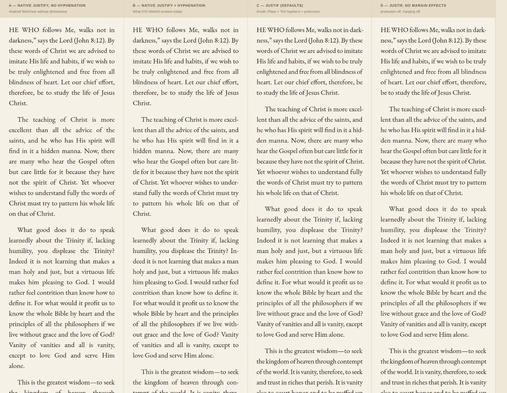
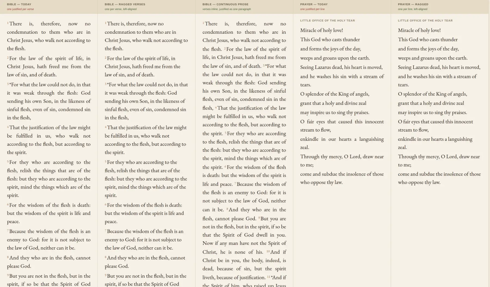
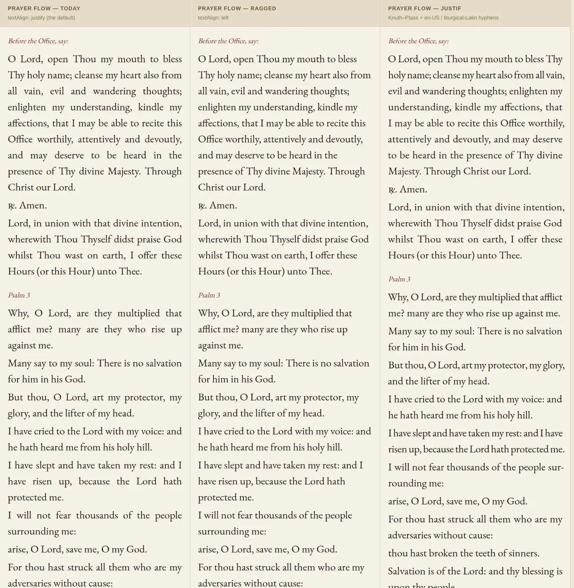
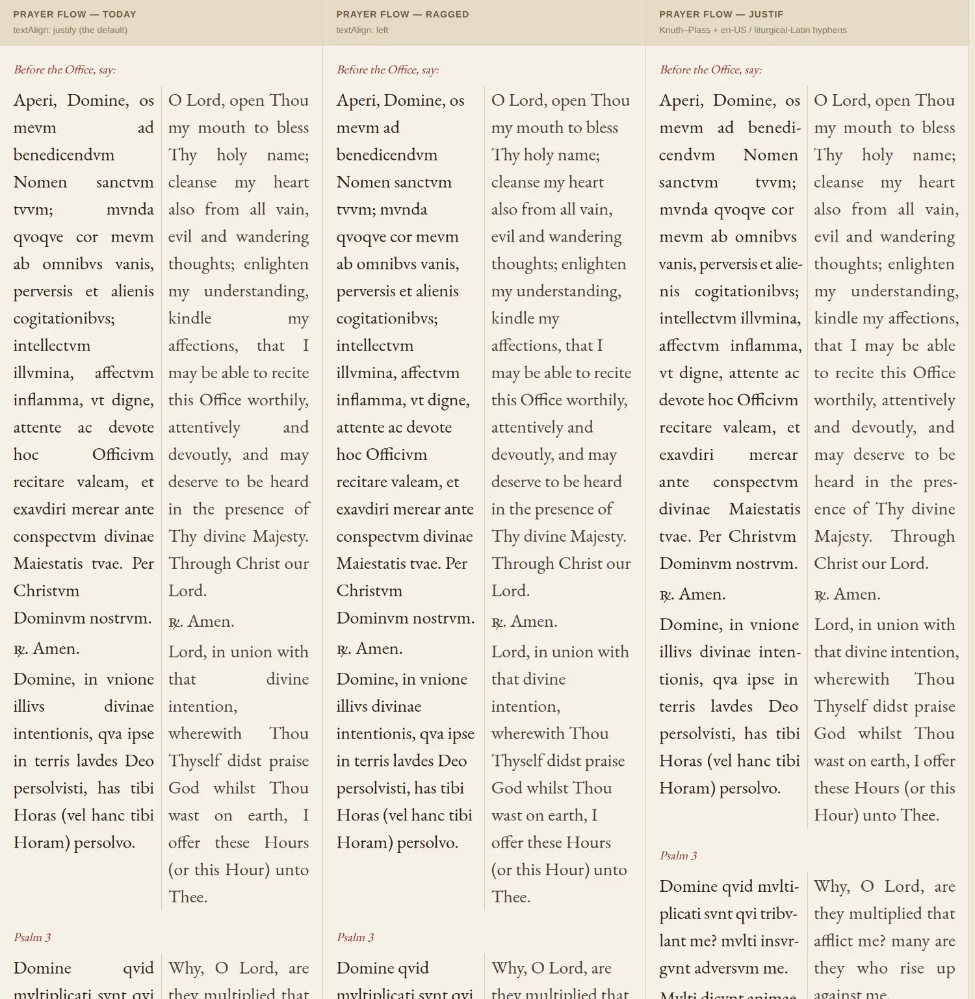
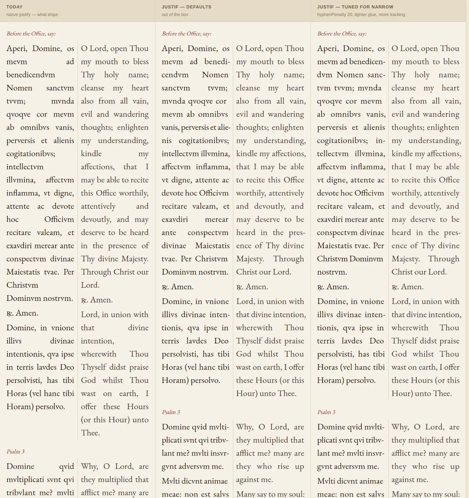
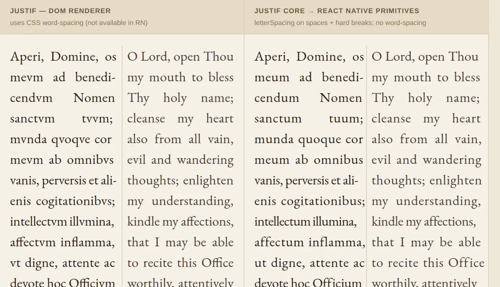

# Justification & Micro-Typography

Research into the justification paper cuts, and what we can actually do about them.

Companion to `docs/design/design-system.md` § Typography (which covers the Ladder of Reverence — the *type* system). This doc covers **line breaking**: how text is fit to the measure, where it currently looks bad, and what our options are.

---

## The verdict, up front

**Ember has two independent text renderers, and they have opposite prospects.**

| Surface | Engine | Prospects |
|---|---|---|
| **Book reader** (`features/books/reader/foliate/`) | Real WebKit/Blink DOM inside a WebView (iframe on web) | Excellent — [Justif](https://github.com/lyallcooper/justif) drops in, verified working |
| **Prayer / practice / Bible** (`PrimitiveBlock`, `PrayerText`, `ChapterContent`) | Native `Text` (UIKit / Android `Layout`) on iOS/Android; `<div>` via `react-native-web` on web | Justif works on **web** (one CSS override). Closed to it on **iOS/Android** — the constraint is availability, not quality |

The good news is that the surface where justification matters most — long-form prose in the Catholic library — is *already* a web renderer. Justif needs no WebView bridge, no "web components on mobile" trick, and no architectural change. It is a script tag in a document we already control.

The bad news is that the native surface can't be fixed the same way, and it has a paper cut that isn't about justification quality at all — it's that **we justify text that should never have been justified**.

---

## Part 1 — What Justif is

[Justif](https://github.com/lyallcooper/justif) (MIT, Lyall Cooper, [demo](https://justif.lyall.co), [Show HN](https://news.ycombinator.com/item?id=48946738)) implements the [Knuth–Plass line-breaking algorithm](https://en.wikipedia.org/wiki/Knuth%E2%80%93Plass_line-breaking_algorithm) — the one TeX has used since 1981 — as a progressive enhancement over existing HTML.

Browsers break lines **greedily**: fill a line, move on. Knuth–Plass optimizes the paragraph *as a whole*, so a slightly worse break early can buy three better lines after it. That is the difference between a page with rivers of whitespace and a page that reads like a printed book.

On top of the breaker it adds the micro-typography layer:

- **Hyphenation** from bundled TeX patterns (24 languages, including `en-us` and `pt` — exactly our two)
- **Optical margin alignment** (protrusion) — periods and commas hang slightly past the measure so the edge *looks* straight
- **Hanging punctuation**
- **Tracking** — sub-1% letter-spacing nudges to save a line
- **Font expansion** — `wdth`-axis adjustment on variable fonts

Zero runtime dependencies. Configurable entirely from CSS custom properties (`--justif-*`), which matters because our reader CSS is already generated from `ReaderConfig`.

---

## Part 2 — Measured findings

I ran Justif 0.7.1 against a mock of our actual reader: `buildStyle()`'s CSS copied verbatim, CSS multi-column pagination like foliate's paginator, 81 paragraphs / 4,565 words of real Kempis text from `content/books/kempis-imitation-of-christ/`.

| Question | Result |
|---|---|
| Works inside foliate's CSS-column pagination? | **Yes** — 81/81 paragraphs enhanced, 0 skipped |
| Does it change the plain-text character stream? | **No** — byte-identical across 25,262 chars, *with 630 hyphenated line breaks active* |
| Do `highlightAnchor.ts` offsets survive? | **Yes** — 40/40 anchors round-tripped to the exact original substring |
| Cost, cold | ~390 ms desktop Chromium for 4,565 words (≈85 µs/word) |
| Cost, re-layout (`refresh()`) | ~110 ms |
| Effect on pagination | 27 pages → 25 (fits ~7% more text) |

### Side by side

Four options, rendered at Ember's actual reader defaults — EB Garamond 400, 22 px / 33 px leading (`fontSizeStep 3`, `lineHeightStep 5`), `margin: normal` on a 390 px phone, light palette:



| | Lines for the same 8 paragraphs |
|---|---|
| A — native justify, no hyphenation | 77 |
| B — native justify + hyphenation *(today on iOS)* | 76 |
| C — Justif, defaults | **71** |
| D — Justif, protrusion + hanging off | **71** |

**A** is the worst case and it is not hypothetical: headless Chromium ships no hyphenation dictionaries, and if the Android WebView on a given device behaves the same, this is what Android users see. Rivers everywhere.

**B** simulates `hyphens: auto` by pre-inserting soft hyphens with the same TeX patterns — this is the honest baseline, and what iOS WebKit renders for us today. Much better than A, but still visibly loose lines (*"to pattern his whole life on that of"*).

**C** is Justif at defaults. Even color, no rivers, and it fits the same text in 8% fewer lines — which is where the page-count drop comes from.

**D** isolates the micro-typography layer: same Knuth–Plass breaks as C, but with optical margin alignment and hanging punctuation switched off. The difference from C is subtle at a glance and shows up at the margin — C's edge *looks* straighter because periods and commas hang slightly past it. Worth having, not worth agonizing over.

### The finding that matters most

`highlightAnchor.ts` anchors highlights and bookmarks as **plain-text character offsets over the live text-node tree**. Justif re-renders each paragraph's inline content as per-line `<span class="justif-seg">` clones — which sounds like it should destroy those offsets.

It doesn't. Justif paints inserted hyphens *outside the text tree* (the segment whose visible text is `blind-` has `textContent === "blind"`), and the inter-line spaces stay as real space characters. So the character stream the walker sees is unchanged, and every existing highlight and bookmark keeps working with **no migration and no code change**.

This is the single fact that turns Justif from "interesting, but risky against our highlight system" into "safe to adopt."

---

## Part 3 — Integrating with the foliate reader

The reader already inlines `bootstrap.raw.js` into the WebView via `bundle.mjs` → `bootstrapScript.ts`. Justif ships as ESM with no dependencies, so it vendors the same way.

**Payload:** `index.js` (136 KB) + `chunk-2WL5JIIM.js` (66 KB) + `hyphenate/en-us.js` (28 KB) + `hyphenate/pt.js` (3 KB) ≈ **233 KB raw / ~65 KB gzipped**. Skip `auto.js` (we call the API directly) and the other 22 hyphenation languages. The 202 KB `chunk-VIZFTCIC.js` is not reachable from `index.js`.

### Where it hooks in

Each chapter is a separate blob-URL document (`blobUrl()` in `bootstrap.raw.js`), so Justif must run **per section load**, inside that document — not once on the host. The `paginator.addEventListener('load', ...)` handler (~line 601) is the hook.

### Four things to get right

1. **Re-measure after justification.** Justif changes paragraph heights, which changes the page count (27 → 25 in the test). It must complete *before* foliate computes the section's extent, or the progress bar, `ChapterScrubber`, and `useReaderCursor` fractions will all be stale. `justify()` lays out synchronously before returning; only `controller.ready` (font loading) is async.

2. **Exclude footnote destinations.** `bootstrap.raw.js:485` reads `target.innerHTML` and posts it to `FootnoteSheet`. If the footnote `<li>` has been justified, the sheet receives `justif-seg` span soup with inline `word-spacing` styles. Either scope the selector to exclude the footnotes container, or `unjustify()` the target before reading. **This is a real bug, not a theoretical one** — Justif's default scan includes `li`.

3. **Config changes need `rescan()`, not re-justify.** The reader's live-restyle path (`paginator.setStyles(buildStyle(cfg))`, per the journal's #266 note) changes font, size, and leading without reopening the book. Justif has to be told: `rescan()` re-reads author CSS and re-lays out only what actually changed.

4. **Tap handlers are already safe.** Justif drops event listeners attached directly to inline descendants and requires delegation — and `wireTapZones` already delegates on `doc` with `ev.target.closest('a')` (line 464). Nothing to change. Lucky, not planned.

### Performance

~390 ms for 4,565 words on desktop Chromium; assume 1.5–3× on device. Our chapters are typically far smaller than that fixture — a 1,500-word chapter lands around 125 ms desktop, so roughly 200–400 ms on device. That is per *section load*, not per page turn, and it can hide inside the existing chapter-load transition. It should be measured on a real device before shipping; if it bites, `content-visibility: auto` + `contain-intrinsic-size` (documented by Justif) defers off-screen paragraphs.

### Suggested config

Defaults are close to right for a devotional book. Worth tuning:

- `hangingPunctuation: "first-line-and-line-ends"` — our drop caps and centered chapter titles sit next to the text edge; full hanging on all edges may read as misalignment.
- `tracking` — leave on; it is what saves a line without visible damage.
- `expansion` — inert for us. All seven reading fonts (`config/readingFonts.ts`) are static instances (`EBGaramond_400Regular` etc.), not variable fonts with a `wdth` axis. Worth revisiting only if we ever ship variable font files.
- Language: pass `hyphenateEnUS` / `hyphenatePt` off the chapter's language rather than the document `lang`, since the corpus is bilingual per chapter.

---

## Part 4 — The native surface

### Answering the "web components on mobile?" question directly

**No — and it isn't needed.** Justif is not a web component; it's a DOM library, and "web components on mobile" in React Native means one thing: a WebView. Routing prayer and Bible text through a WebView to gain Knuth–Plass would cost us native text selection, the `ImageViewer` integration, Tamagui theming, accessibility, and Reanimated-driven layout — to fix a problem that is smaller on that surface than it is in the reader. It's a bad trade.

The reader is the exception precisely because it is *already* a WebView. That's not a workaround we'd be inventing; it's an asset we already have.

### What React Native actually gives us

Verified against RN 0.85 docs (`react-native-website` source):

| Capability | Status |
|---|---|
| `textAlign: 'justify'` | iOS yes; Android API 26+ only, silently falls back to `left` below |
| `letterSpacing` | Yes — tracking is available |
| **word spacing** | **Not exposed.** This is the blocker |
| `fontVariationSettings` / `wdth` axis | Not exposed |
| `android_hyphenationFrequency` | Yes — `'none'` \| `'normal'` \| `'full'`, **default `'none'`** |
| `textBreakStrategy` (Android) | `'simple'` \| `'highQuality'` \| `'balanced'`, **default `'highQuality'`** |
| iOS hyphenation | Not exposed at all (`NSParagraphStyle.hyphenationFactor` is unreachable from RN) |

Two consequences:

The missing `wordSpacing` looks fatal for a native Knuth–Plass renderer. It isn't — see Part 6, where the pipeline is built and verified.

**But there is a free Android win.** `android_hyphenationFrequency` defaults to `'none'`, which means our justified Android text is justified *without hyphenation* — the worst possible combination, and the direct cause of gappy lines. Setting it to `'normal'` on the reading-text components is a one-line change in `useReadingStyle()`. Android also already runs `highQuality` break strategy (a whole-paragraph optimizing breaker), so with hyphenation enabled Android text gets close to good. iOS has no equivalent lever, so iOS remains greedy and un-hyphenated.

### The bigger native paper cut: we justify things that shouldn't be justified

`preferencesStore.ts:121` defaults `textAlign: 'justify'`, and `useReadingStyle()` applies it to *every* reading surface. Two of those surfaces are structurally wrong for it:

- **`PrayerLines`** (`components/PrayerText.tsx`) splits on `\n` and renders **each line as its own `<Text>`**. Prayer text is verse — deliberately line-broken. When a verse line is short enough to fit, justify is a no-op (a single line is a last line). But when it wraps to two, the *first* line gets stretched across the full measure and the second sits ragged. That produces a stretched-then-stubby pair in the middle of a prayer, which is exactly the kind of thing that reads as broken.

- **`ChapterContent.tsx:51`** renders **each Bible verse as its own `<Text>`**, justified. So every verse's final line is ragged and every preceding line is stretched, with no line breaking across verse boundaries at all. In continuous prose books (Romans, Hebrews) this is the main source of the ragged/gappy feel.

Neither is fixed by a better algorithm. Verse-shaped content should be ragged-right — that is the correct typographic answer, and it is the same answer a printed missal gives. This is the highest-value native change available, and it's cheap.



Same fonts and reader settings as above. Romans 8 (Douay-Rheims, from `content/bible/drb/`) and the hymn from `practice/little-office-holy-tear-of-our-lord-jesus-christ`:

- **Bible — today.** All 14 verses wrap, so all 14 show the defect: stretched lines above, a stubby ragged remnant below (*"the flesh."*, *"peace."*, *"in the flesh,"*). Verse 1's first line is stretched hard across the measure.
- **Bible — ragged verses.** Same 51 lines, no stretching. Strictly better, and it is a one-value change.
- **Bible — continuous prose.** Verses flow into one justified paragraph with superscript numbers. This is what a printed Bible does, and it reads best of the three: justification finally has a full paragraph to work with, and there is one ragged last line per chapter instead of one per verse. Bigger change — it touches `ChapterContent`'s structure and anything that anchors to a per-verse node — but it is the right end state, and it is also the version that would benefit from Justif on the web build.
- **Prayer — today vs ragged.** 5 of 13 lines wrap; every one of them stretches (*"O fair eyes that caused this innocent"*, *"come and subdue the insolence of those"*). Ragged is simply correct for verse.

Note that even the continuous-prose column is still *greedily* justified — that's native RN, and no lever changes it. It is better because the paragraph is longer, not because the algorithm improved.

### Prayer flows, and why Justif is the wrong answer here

The reader results made Justif look like the answer everywhere. Tested against prayer flows, it isn't.

Rendered through the real `PracticeFlowView` geometry (`paddingHorizontal: $md` = 16), with the *Aperi Domine* prose prayer and Psalm 3 from `practice/office-preparatory-prayers` and `practice/little-office-benedictine-oblates`:



| | Rendered lines |
|---|---|
| Today (`justify`) | 35 |
| Ragged | 35 |
| Justif | 32 |

Justif wins here, clearly — even color on the prose prayer, three lines saved, and the psalm verses tighter and more even than what ships.

One detail to be aware of rather than alarmed by: Justif hyphenates across verse lines (*"I will not fear thousands of the people **sur-** / **rounding** me:"*). Traditional breviary setting avoids that. The lever is `hyphenPenalty` — raise it to discourage hyphenation without forbidding it. **Turning hyphenation off entirely is not the fix:** measured on the bilingual columns below, dropping the hyphenator costs more than it saves (132 lines and a 63 px worst-case word gap, versus 128 lines and 49 px with hyphenation). At narrow measures hyphenation is load-bearing.

Ragged-right also removes the defect, and for verse it is the traditional setting — but it gives up Justif's evenness everywhere else in the flow, and it is a preference call, not a correctness one.

### Bilingual side-by-side: the worst typography in the app

`BilingualBlock` in `side-by-side` mode is an `XStack` with `gap="$sm"` (8), two `flex={1}` columns and a 1 px divider. On a 390 px phone inside the flow's 16 px padding, that leaves **each column ~170 px wide** — about 17 characters at the default 22 px EB Garamond. This is the default display mode once a secondary language is set.



| | Rendered lines | Units that wrap |
|---|---|---|
| Today (`justify`) | 138 | 25 of 28 |
| Ragged | 138 | 25 of 28 |
| Justif | 128 | 25 of 28 |

The left column is not a subtle paper cut. At 170 px, justify puts two words on a line with a chasm between them — `mevm········ad`, `Nomen····sanctvm`, `hoc·······Officivm`, `that······divine` — and `intellectvm` sits alone on its own line. 25 of 28 units wrap, so nearly every line in the prayer is affected. This is the single worst-looking text in the app, and it is reachable by anyone who turns on a second language.

Justif transforms it. It hyphenates (*benedi-cendvm*, *alie-nis*, *inten-tionis*, *mvlti-plicati*), saves 10 lines, and turns those chasms into ordinary word spaces. Ragged-right also removes the defect and costs nothing.



**Tuning is not needed.** A config pushed hard for narrow measures (`hyphenPenalty: 20`, tighter glue, `tracking` to 4.5%, `lastLineMinWidth: 0`, `tolerance: 400`) landed at 127 lines against 128 for stock defaults, with the worst word gap at 44 px against 49 px. Visually indistinguishable. Ship the defaults.

The catch on this surface is availability, not quality: prayer flows are native `Text` on iOS and Android, so Justif cannot run there at all. See below for the web build, where it can.

### Latin hyphenation is solvable, if we ever need it

Justif bundles 24 languages and **Latin is not one of them** — a real gap for us, since Latin is first-class in the corpus. But it exports the generic Liang hyphenator (`justif/hyphenate/liang`), which takes raw TeX patterns:

```js
import { createHyphenator } from 'justif/hyphenate/liang'
const hyphenateLa = createHyphenator({ patterns, leftmin: 2, rightmin: 2 })
```

Fed [`hyph-la-x-liturgic`](https://github.com/hyphenation/tex-hyphen) (1,955 patterns, 17 KB, **MIT**, by Claudio Beccari and the Monastery of Solesmes — the authority for liturgical Latin), it syllabifies correctly: `be-ne-di-cen-dum`, `co-gi-ta-ti-o-ni-bus`, `mi-se-ri-cor-dia`, `sem-pi-ter-na`, `ex-al-tans`.

Worth wiring in wherever Justif runs — the book reader has Latin prose, and so does every bilingual prayer flow on the web build.

### Justif *does* run on the web build's prayer flows

`react-native-web` renders `<Text>` as a `<div>`, not a `<p>` — which turns out not to matter. What does matter is that it sets `white-space: pre-wrap`, and Justif declines any paragraph with a preserved-whitespace value. Measured directly:

| Element shape | Enhanced | Reason |
|---|---|---|
| `<div>` with `white-space: pre-wrap` *(what RNW emits)* | **0 of 3** | `"white-space: pre-wrap on the paragraph"` |
| `<div>` with `white-space: normal` | **3 of 3** | — |

So a `white-space: normal` override on reading-text components is the whole unlock on web. Worth checking what RNW relies on `pre-wrap` for before flipping it — prayer text with meaningful runs of consecutive spaces would render differently — but for the corpus's prose and verse it should be inert.

---

## Part 6 — Justif on iOS/Android natively: proven feasible

The goal is Justif in the **native builds**, not just web. React Native has no `wordSpacing`, so Justif's DOM output can't be applied directly. But Justif ships `justif/core` — a DOM-free layout engine (~66 KB) whose README explicitly offers it "for custom renderers" — and `buildItems(texts, runs, opts, measure)` takes an **injectable `Measure`**. That's the seam.

Three problems had to be solved. All three are solved, and the pipeline was built end to end.

### 1. Text measurement without a measurement API

RN exposes no synchronous way to measure a string. So measure it ourselves: the reading fonts are already bundled as TTFs, and advance widths come straight out of `head` / `hhea` / `hmtx` / `cmap`. That's ~90 lines of pure JS, no font library.

Validated against a real text engine (Chromium `measureText`, kerning off) over 276 words of the actual Latin and English prayer corpus at 22 px:

| Width model | Mean abs error | Max abs error |
|---|---|---|
| Plain advances | 0.045 px | **2.53 px** (`afflict`) |
| **+ f-ligature substitution** | **0.0002 px** | **0.0004 px** |

The 2.53 px outlier is the `ffl` ligature — EB Garamond substitutes a single narrower glyph. Modelling the five standard f-ligatures (`ffl ffi ff fi fl`, all mapped at U+FB00–FB04) takes the error to effectively zero. **Skipping ligatures is not optional**; 2.5 px is enough to push a line over and cascade a re-wrap.

### 2. Applying per-line word spacing without `wordSpacing`

`Line` from `layoutLines` gives `glueRatio` (per-space px), `trackRatio` (letterfit), `hyphenated`, and `leftHang`/`rightHang`. Every one of those maps onto something RN can express:

| Justif output | React Native |
|---|---|
| per-space width | nested `<Text style={{letterSpacing: extra}}>{' '}</Text>` — a lone space glyph widened by `letterSpacing` |
| `trackRatio` | `letterSpacing` on the word runs |
| line breaks | explicit `\n` (the breaker already decided them) |
| `leftHang` / `rightHang` | negative margins on the line container |
| `hyphenated` | append `-` |

The word-space trick is the key: `letterSpacing` adds space *after each character*, so a `<Text>` containing a single space renders at `spaceAdvance + letterSpacing`. That is per-space control, built out of the one lever RN does expose. Keeping everything nested inside a single parent `<Text>` preserves it as one selectable, copyable run.

### 3. Does it actually reproduce Justif?

Built the whole chain — TTF metrics → `buildItems` → `breakParagraph` → `layoutLines` → RN-primitive rendering — and rendered the output using **only** primitives RN has (no `word-spacing`, no `text-align: justify`), against Justif's own DOM renderer on the same text at the same 170.5 px bilingual column:



| | Result |
|---|---|
| Lines, Justif DOM | 18 (la) / 18 (en) |
| Lines, RN primitives | **18 / 18 — identical** |
| Rendered line width | **exactly 170.5 px on every line**, min = max = target |
| Lines overflowing the column | **0** |

Line for line, pixel for pixel. A first attempt came out at 19 lines because the breaker was allowed 3% letterfit tracking that the renderer never emitted — worth recording, because it shows the failure mode: **any flex the breaker is given must actually be rendered, or lines silently re-wrap.**

### What is still unverified

One link cannot be tested from a Linux container: **whether iOS renders `letterSpacing` on a lone space the way CSS does.** RN maps `letterSpacing` to `NSKernAttributeName` on iOS and `TextPaint.setLetterSpacing` on Android, both of which add space after each character, so it should hold — but it needs a simulator check before committing to the build. That single test decides the whole approach; run it first.

Also to settle on device: that selection and copy still behave across the nested runs, and what happens under Dynamic Type (either `allowFontScaling={false}` or recompute on scale change — the pipeline is pure JS and fast, so recomputing is fine).

### Cost

Real, but bounded: a font-metrics module (~90 lines + a ligature table), a `Measure` adapter, a line renderer, and re-layout on width/font/size change. `justif/core` is 66 KB and does the hard part. Compare against the alternative — moving prayer flows into a WebView, which buys full Justif including protrusion but costs native selection, Tamagui theming, `ImageViewer`, accessibility, and Reanimated layout.

---

## Part 7 — What shipped

Both surfaces now use Justif.

### The reading experience — `features/books/reader/foliate/`

`justif.raw.js` is the vendored bundle: justif 0.7.1 built as a single classic-script IIFE (module scripts fail in the WebView's `about:blank` context — the same constraint that shaped `paginator.raw.js`), carrying the en-US, pt and liturgical-Latin hyphenators on `window.__justif`. `bundle.mjs` splices it into `bootstrapScript.ts`, and `blobUrl()` injects it per chapter, because every chapter is its own document.

Two things the wiring has to get right, both learned the hard way:

- **Timing.** At parse time foliate has not sized the iframe, so the body is zero-width and justif declines every paragraph (`"zero content width"`). Neither `rescan()` nor `refresh()` rescues that — `rescan()` only re-lays out paragraphs whose *styling* changed, and a container-width change is not a style change. So the `justify()` call itself waits for a real measure: driven from the paginator's `load` handler, backed by a ResizeObserver inside the chapter document.
- **Footnotes.** The anchor-click handler posts a footnote's `innerHTML` to `FootnoteSheet`, so `[data-footnotes]` is excluded from the scan.

Verified by booting the real reader headlessly: **81/81 paragraphs managed, zero skips**, footnote markup untouched, and the character stream anchors are expressed in **byte-identical at 25,347 chars**.


### The prayer experience — `lib/typography/` + `components/JustifiedText.tsx`

`justif/core` is DOM-free and takes an injectable `Measure`, so the only real gap was RN's missing measurement API — closed by `scripts/build-font-metrics.mjs`, which reads advance widths out of each reading font's TTF at build time (**12 KB for all seven fonts**). `JustifiedText` renders the line model with nested `<Text>` runs, widening each space via `letterSpacing`.

Three things that were wrong in the first cut and are now handled:

| Trap | Consequence | Fix |
|---|---|---|
| f-ligatures | `afflict` measured 2.53 px wide → line overflows, paragraph re-wraps | substitute U+FB00–FB04 before summing |
| letterfit tracking | tracking is a fraction of the line's *set width*, not per character; the first model over-counted by ~26 px/line | `tracking: false` — word spaces are the only flex, and RN hits those to the pixel. Costs one line in nineteen |
| soft hyphens | `lib/hyphenate.ts` already inserts them; measured as real characters they inflate every hyphenated word | zero-width by codepoint |

Rendered through RN-expressible primitives only, the shipped module puts all 38 bilingual lines inside a 170.5 px column (max 170.58, none over 171), hyphenating *benedi-cendum*, *cogitatio-nibus*, *affec-tions*.


`PrayerLines` routes plain lines through it and leaves markup, Divinum Officium lines and response marks on the existing renderer — justification owns a line's whole spacing, so it can only take lines it renders end to end.

### Still to verify on device

**The one link that cannot be tested off-device:** whether UIKit widens a lone space under `letterSpacing` the way CSS does. RN maps it to `NSKernAttributeName` on iOS and `TextPaint.setLetterSpacing` on Android, both of which add after each character, so it should hold — but check it before trusting the prayer surface. If it does not, `JustifiedText` already falls back to ordinary wrapped text, so the failure mode is "no justification", not broken text.

Also worth confirming on device: selection and copy across the nested runs, and that `allowFontScaling={false}` is the behaviour we want under Dynamic Type (the alternative is recomputing on scale change — the pipeline is pure JS and fast).

---

## Part 5 — What's left

Done: the book reader and the native prayer flows (Part 7).

1. **Verify the `letterSpacing`-on-a-space behaviour on an iOS device.** Everything else in the prayer pipeline is verified; this one link isn't, and it's the one that decides whether the native justification actually renders.
2. **Bible as continuous prose** rather than one `<Text>` per verse. Its own spec — the difference between "a verse list" and "a Bible", and what makes the page worth justifying at all. `ChapterContent` can then use `JustifiedText` directly.
3. **`android_hyphenationFrequency: 'normal'`** in `useReadingStyle()`, for the text that still goes through the plain renderer (markup lines, Divinum Officium lines).
4. **Protrusion and hanging punctuation on native.** `justif/core` reports `leftHang`/`rightHang`; rendering them means negative margins per line. Pure refinement on top of working breaks.
5. **The web build's prayer flows.** `react-native-web` renders `<Text>` as a `<div>` that justif accepts, blocked only by its `white-space: pre-wrap` (measured: 0 of 3 paragraphs enhanced with it, 3 of 3 without). Now lower priority — the native path covers the same surface on the platforms that matter most, and web inherits it only if we route through the DOM renderer instead.

---

## Unrelated bug found while testing

**`lang="la"` silently rewrites Latin orthography in EB Garamond.** The font carries a `locl` substitution for the Latin language system that maps the text to classical epigraphic forms: `meum → mevm`, `quoque → qvoqve`, `tuum → tvvm`. Advance widths are unchanged (684 px either way), so it is purely a glyph substitution — but the corpus says *meum* and the reader sees *mevm*.

This is live wherever Latin gets a language tag, including the book reader, which sets `<html lang="${cfg.lang}">` in `blobUrl()`. For a liturgical Latin app that is almost certainly not wanted. Fix is to suppress the language-specific substitution (`font-variant-alternates`/`font-feature-settings`) or not tag Latin runs with `lang` — but note that the hyphenator selection in the drop-in script keys off `lang`, so if we go the second route the hyphenator has to be passed explicitly.

---

## Notes

- Justif's README carries an AI-usage disclosure. It is a young project (0.7.1) by a single author. Vendoring the `dist/` we test against — rather than tracking a CDN — keeps us insulated from churn, and it's how `foliate-js` is already handled in `reader/foliate/`.
- The DOM-free `justif/core` export is worth remembering if we ever build a server-side or canvas renderer (e.g. a PDF or print export of a book).
