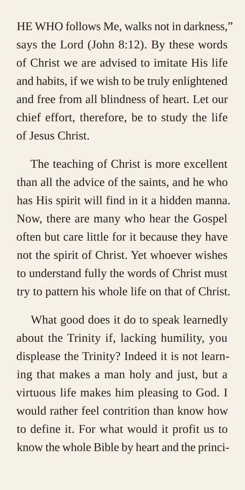
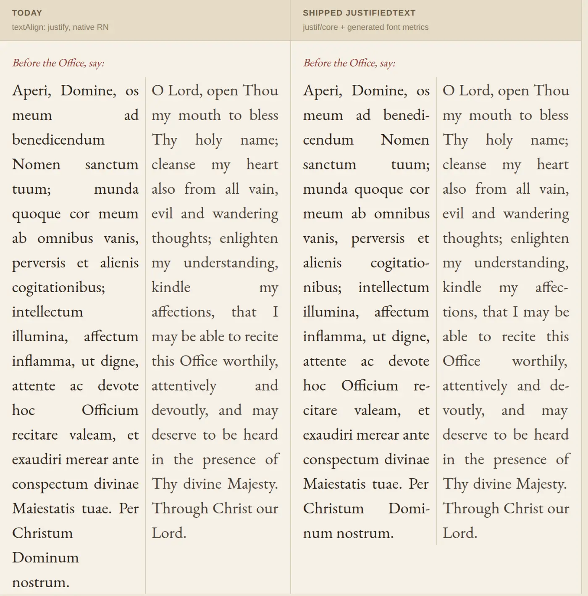

# Justification & Micro-Typography

How Ember sets justified text. Companion to `docs/design/design-system.md` § Typography, which covers the type system; this covers **line breaking**.

Both reading surfaces use [Justif](https://github.com/lyallcooper/justif) (MIT) — the [Knuth–Plass line-breaking algorithm](https://en.wikipedia.org/wiki/Knuth%E2%80%93Plass_line-breaking_algorithm), the one TeX has used since 1981. Browsers and native text engines break lines *greedily*: fill a line, move on. Knuth–Plass optimizes the paragraph as a whole, so a slightly worse break early buys three better lines after it. That is the difference between rivers of whitespace and a page that reads like a printed book.

Ember has two independent text renderers and they integrate with Justif very differently.

| Surface | Engine | Integration |
|---|---|---|
| Book reader | WebKit/Blink DOM in a WebView (iframe on web) | Justif's own DOM renderer |
| Prayer / practice | Native `Text` (UIKit / Android `Layout`) | `justif/core` + a custom renderer |

---

## The reading experience

`features/books/reader/foliate/justif.raw.js` — Justif 0.7.1 vendored as a single classic-script IIFE. Module scripts fail in the WebView's `about:blank` context with a CORS-masked "Script error", the same constraint that shaped `paginator.raw.js`. It exposes `window.__justif` with the en-US, pt and liturgical-Latin hyphenators.

`bundle.mjs` splices it into `bootstrapScript.ts` at a placeholder, and `blobUrl()` injects it **per chapter** — every chapter is its own blob document, so a single host-level injection would not reach them.

Config: stock defaults plus `hangingPunctuation: 'first-line-and-line-ends'`. Tuning was measured and isn't worth it (below).

### Two things the wiring has to get right

**Timing.** At parse time foliate has not sized the iframe, so the body is zero-width and Justif declines every paragraph with `"zero content width"`. Neither `rescan()` nor `refresh()` rescues that — `rescan()` only re-lays out paragraphs whose *styling* changed, and a container-width change is not a style change, so it silently reports zero skips and does nothing. The `justify()` call itself therefore waits for a real measure: driven from the paginator's `load` handler (`settleJustif`), backed by a ResizeObserver inside the chapter document. Height changes afterwards re-render, since foliate has already measured the section.

**Footnotes.** The anchor-click handler posts a footnote's `innerHTML` to `FootnoteSheet`, so `[data-footnotes]` is excluded from the scan — otherwise the sheet receives justified span soup with inline `word-spacing`.

Tap handling needed no change: `wireTapZones` already delegates on `doc`, which is what Justif requires of interactive inline content.

### Why highlights survive

`highlightAnchor.ts` anchors highlights and bookmarks as **plain-text character offsets over the live text-node tree**, and Justif re-renders paragraphs as per-line `` clones — which sounds fatal. It isn't: Justif paints inserted hyphens *outside* the text tree (a segment showing `blind-` has `textContent === "blind"`), and inter-line spaces stay real spaces.

Verified by booting the real reader headlessly: 81/81 paragraphs managed, zero skips, and the anchor character stream byte-identical at 25,347 chars. **No migration needed**, but it is an invariant worth re-checking on any Justif upgrade.

`walkText` in the bootstrap skips `SCRIPT`/`STYLE`, since the injected bundle now lives in the chapter body and would otherwise count toward those offsets.

---

## The prayer experience

React Native exposes no `wordSpacing` (confirmed in Fabric's `TextAttributes.h`), so Justif's DOM renderer can't be used. `justif/core` is DOM-free and takes an injectable `Measure`, which leaves one real gap: RN has no text-measurement API either.

**`scripts/build-font-metrics.mjs`** closes it. The reading fonts ship as TTFs, so advance widths come out of `head`/`hhea`/`hmtx`/`cmap` at build time into `lib/typography/fontMetrics.generated.ts` — 12 KB for all seven fonts. Re-run it when `readingFonts.ts` changes.

**`lib/typography/justifyText.ts`** wires those metrics into `buildItems` → `breakParagraph` → `layoutLines` and returns a per-line recipe. It returns `undefined` rather than guessing whenever anything is unusable — an unmeasured container, a font without a table, a paragraph the breaker declined.

**`components/JustifiedText.tsx`** renders that recipe with the one lever RN does expose: `letterSpacing` adds space *after* each character, so a nested `<Text>` holding a single space renders at `spaceAdvance + letterSpacing`. Everything stays inside one parent `<Text>`, keeping it a single selectable, copyable run. It falls back to ordinary wrapped text whenever the line model is unavailable.

**Inline emphasis is justified, not excluded.** `buildItems` takes an array of runs precisely so a paragraph can mix faces, so `*Mater Dei*` is measured in the real italic face and broken along with everything else. Each style contributes its own metrics and its own word-space width, and the output is *pieces* rather than words — `*Mater Dei*,` puts the comma back in regular, so one word can span two pieces.

This is why the generator emits per-face tables and why it only lists faces the app actually **loads**: metrics have to describe what gets rendered. EB Garamond loads real `400Regular`, `400Regular_Italic`, `700Bold` and `700Bold_Italic`, so all four styles are exact. The other six families load Regular only, and the platform synthesizes emphasis — where synthetic *italic* is an oblique shear that preserves advances (so regular metrics stay exact), but synthetic *bold* is an emboldening smear whose advance growth is platform-specific and can't be predicted, so bold on those families declines rather than guessing.

`PrayerLines` leaves only two things on the existing renderer: Divinum Officium lines (verse numbers, pointing marks, small caps that `DoInlineLine` owns) and response marks. Both are decided per block, so a prayer never mixes the two renderers mid-way.

Bilingual side-by-side is where it pays most; that ~170 px column is the narrowest measure in the app.

### Three traps, all found by measuring

| Trap | Consequence | Handling |
|---|---|---|
| **f-ligatures** | a font draws `ffl` as one narrower glyph, so `afflict` measures 2.53 px wide — enough to overflow a line and cascade a re-wrap | substitute U+FB00–FB04 before summing advances |
| **letterfit tracking** | tracking is a fraction of the line's *set width*, not a per-character amount; modelling it as `trackRatio × 0.03 × fontSize` over-counted by ~26 px/line | `tracking: false` — word spaces are the only flex, and RN hits those to the pixel. Costs one line in nineteen |
| **soft hyphens** | `lib/hyphenate.ts` already inserts them into prayer text; measured as real characters they inflate every hyphenated word | zero-width by codepoint |

The general rule behind the second one: **any flex the breaker is allowed must actually be rendered, or lines silently re-wrap.**

### Kerning is deliberately not modelled

These fonts carry pair adjustments in GPOS with no legacy `kern` table, and extracting them expands the class matrices to ~3,000 pairs per face — about **1 MB** of generated tables across seven families. Measured cost of ignoring it, on 36 real justified lines at a 170 px measure: **0.72 px mean, 2.03 px worst**, almost always in the direction of a line sitting slightly *short* of the right margin rather than overflowing.

That's the wrong trade for a mobile bundle, so the tables stay kern-free and `JustifiedText` reserves 1.5 px of headroom to absorb the drift (plus the platform's own rasterization rounding). If it ever needs revisiting, storing GPOS in its native class form instead of expanded pairs would cost a fraction of the expansion.

### Not verified — gates this surface

Whether **UIKit widens a lone space under `letterSpacing`** the way CSS does. RN maps it to `NSKernAttributeName` on iOS and `TextPaint.setLetterSpacing` on Android, both of which add after each character, so it should hold — but it needs a simulator check. If it fails, `JustifiedText` falls back to plain wrapped text, so the failure mode is "no justification", not broken text.

Also to confirm on device: selection and copy across the nested runs, and whether `allowFontScaling={false}` is right under Dynamic Type (the alternative is recomputing on scale change — the pipeline is pure JS and fast).

---

## Hyphenation

Justif bundles 24 languages. **Latin is not one of them**, which matters here. `lib/typography/hyphenLaLiturgic.generated.ts` carries `hyph-la-x-liturgic` (1,955 patterns, MIT, Claudio Beccari and the Monastery of Solesmes — the authority for liturgical Latin), fed through Justif's generic Liang hyphenator: `be-ne-di-cen-dum`, `co-gi-ta-ti-o-ni-bus`, `mi-se-ri-cor-dia`.

Hyphenation is **not optional** at these measures. A bilingual side-by-side column is ~170 px (a 390 px phone, `PracticeFlowView`'s 16 px padding, `BilingualBlock`'s 8 px gap and 1 px divider, halved) — about 17 characters. Without break opportunities the breaker has to open word spaces enormously to fit anything: measured at 132 lines and a 63 px worst-case gap without a hyphenator, against 128 lines and 49 px with one.

The app also has an older hyphenation layer, `lib/hyphenate.ts` (`hyphen` package, classical Latin patterns), which inserts soft hyphens for the plain renderer. Two sources of Latin hyphenation is one too many — worth collapsing onto the liturgical patterns.

---

## Settled by measurement

- **Don't tune.** A config pushed hard for narrow measures (`hyphenPenalty: 20`, tighter glue, 4.5% tracking, `lastLineMinWidth: 0`, `tolerance: 400`) landed at 127 lines against 128 for stock defaults, worst gap 44 px against 49 px. Indistinguishable. Ship the defaults.
- **Expansion is inert.** All seven reading fonts are static instances with no `wdth` axis. Revisit only if we ship variable font files.
- **Cost, reader:** ~390 ms for 4,565 words on desktop Chromium, ~110 ms to re-lay-out. Per section load, not per page turn.

---

## What's left

1. **The iOS `letterSpacing` device check** above. Everything else in the prayer pipeline is verified; this decides whether it renders.
2. **Bible as continuous prose** rather than one `<Text>` per verse (`ChapterContent.tsx:51`). Its own spec — the difference between "a verse list" and "a Bible", and what makes the page worth justifying at all. It can then use `JustifiedText` directly.
3. **`android_hyphenationFrequency: 'normal'`** in `useReadingStyle()` for text still on the plain renderer. It defaults to `'none'`, so that text is justified *without* hyphenation — the worst combination.
4. **Protrusion and hanging punctuation on native.** `justif/core` reports `leftHang`/`rightHang`; rendering them means negative margins per line. Pure refinement.
5. **Collapse the two Latin hyphenators.**

---

## Known bug: `lang="la"` rewrites Latin orthography

EB Garamond carries a `locl` substitution for the Latin language system that swaps in classical epigraphic forms — `meum → mevm`, `quoque → qvoqve`, `tuum → tvvm` — at **identical advance widths**, so no width check catches it. Live wherever Latin is language-tagged, including the book reader, which sets `<html lang="${cfg.lang}">` in `blobUrl()`. The corpus says *meum*; the reader shows *mevm*.

Fix is to suppress the substitution (`font-variant-alternates` / `font-feature-settings`) or not tag Latin runs with `lang` — but the drop-in script's hyphenator selection keys off `lang`, so the second route means passing the hyphenator explicitly. Not fixed yet.
