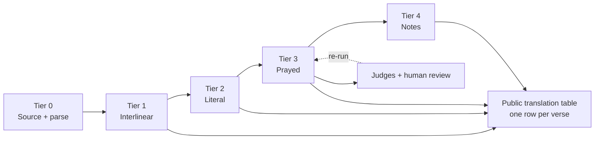

# Saltério Galicano em Português — MVP Design Doc

2026-09-20 · @Someone

## Goal and scope

Produce a Brazilian Portuguese translation of the Gallican Psalter that is meant to be prayed, for inclusion in a translation of the Breviarium Romanum (1961/62 books), built by orchestrating frontier LLMs with human philological sign-off.

- Output: the 150 psalms in the Breviary's Latin form, plus the other Office texts that share the psalter's voice (see Corpus).
- Standard: publication quality, defensible as scholarship through a transparent, auditable method rather than through the translator's credentials.
- Not in scope for the MVP: a critical apparatus, a study edition, chant-notation, or the Mass propers.

## Key decisions

| Decision | Choice | Why |
| --- | --- | --- |
| Base text | Sixto-Clementine Gallican Psalter (Hetzenauer 1914 or Colunga–Turrado text) | It is the text actually printed in the Breviary; public domain |
| Critical editions (Weber–Gryson, Benedictine 1953) | Consult only, to understand hard readings | Copyrighted; their reconstructed readings are not what the reader prays |
| Hexaplaric asterisks/obeli | Dropped | Belong to the critical edition, not to a prayed text |
| Translation philosophy | Translate the Latin as Latin; keep its Septuagintal features | LXX and Hebrew are aids to understand Jerome, never grounds to correct him |
| Register | Liturgical: short cola, stable formulas, memorizable vocabulary | The text is recited daily; the stylist critic has real authority |
| Numbering and division | Breviary layout, LXX numbering; pointing follows the Latin | Both columns must align at flex, mediant and final |
| Models | Frontier LLMs driven through agentic harnesses (Claude Code, Codex); no training | The harness runs the scripts, checks and re-runs; leverage is in context and orchestration |
| License for outputs | Full public domain (CC0), as the Berean Bible did | A prayed text should carry no strings; maximal reuse |
| Human review | At least one Latinist; one reviewer who prays the draft for weeks | This, not the pipeline, is what makes it credible |

## Corpus

One corpus, one glossary, one voice: the psalter plus everything in the Office that frames it.

| Layer | Latin source | Note |
| --- | --- | --- |
| 150 psalms | Clementine Gallican | Core; about 2,500 verses |
| Invitatory Ps 94 (*Venite, exsultemus*) | Roman Psalter | Not the Gallican text; translate as it stands and tag it |
| Gospel canticles (Benedictus, Magnificat, Nunc dimittis) | Vulgate | Daily; same voice as the psalms |
| Old Testament canticles at Lauds, Te Deum | Vulgate / liturgical | Same voice |
| Antiphons, responsories, versicles, psalm incipits | Breviary | Often truncated or pre-Clementine forms; tag mismatches as expected |
| Doublet psalms (13/52, 39/69, 56/107) | Clementine | Must be rendered identically where the Latin is identical |

Out of scope for the MVP: hymns, lessons, Mass propers. Hymns are deferred because they are metrical poetry sung to a fixed tune: every stanza must scan alike, so they need syllable count, stress pattern and, in Portuguese, usually rhyme, the opposite of the psalter's rule. They are closer to writing verse than to translating and will need a human poet; the CNBB Liturgia das Horas hymns are the reference for Brazilian metrical liturgical verse.

## Data model

Every verse is a record; every rendering points back to it. This is the Berean "translation table" idea applied to Latin.

**Per-verse dossier (input to the models)**

- Clementine Latin, split at the Breviary's flex, mediant and final positions
- Weber–Gryson reading where it differs (consultation only)
- Rahlfs LXX and Hebrew MT for the same verse (to explain the Latin, never to correct it)
- Jerome's *iuxta Hebraeos* rendering
- Deterministic parse: lemma, morphology per word (LatinCy or CLTK), checked against PROIEL where available
- Lexicon notes for rare words (Blaise, Souter, Plater & White)
- Portuguese antecedents: Figueiredo, Matos Soares; modern versions as contrast only
- Glossary entries for every controlled term in the verse
- Fixed renderings of any parallel or doublet verse
- Neighboring verses for cola structure
- Layer tag: psalm, Roman Psalter, canticle, antiphon

**Per-verse output (JSON)**

- Interlinear gloss (generated programmatically, not by free LLM prose)
- Literal tier (internal scaffold)
- Prayed tier (the deliverable), already split into cola matching the Latin
- Alternatives considered, confidence, flagged issues, glossary terms used
- Provenance: prompt version, model, critic verdicts, human decision

**Controlled glossary**

One rendering per key term, decided before drafting and enforced by script: *misericordia, iustitia, iudicia, testimonia, salutare, in finem, diapsalma, Dominus/Deus* and the like. Changes to the glossary are versioned and trigger re-runs of affected verses.

## Style guide and poetic standards

The register is simple nobility: reverent but not archaic in the reading, plain and rhythmic, getting out of the way. The style guide is a versioned artifact like the glossary: written before drafting, frozen per pilot, enforced by exemplars, rubric and script. Consistency comes from the same small set of approved verses being in every prompt, not from asking the model to "be consistent".

**What matters, in order**

1. It works in the mouth: recited aloud, alone or in choir, often tired and early. Short sayable cola, stress landing at cadences, one breath per colon.
2. Stability: the text becomes memory over decades. Formulas, refrains, doublets and antiphons identical everywhere; a vocabulary small enough to settle. Elegant variation is a fault.
3. Address and register: one choice of *vós* or *tu* colors every verse and sets the distance to God. Elevated but native; no footnotes, no sense of reading a translation.
4. Concreteness: bones, horns, nets, rock, oil. Keep the image; liturgical translations drift toward abstraction and lose the prayer.
5. Compatibility with the Latin column: verse breaks, pointing, tituli and word order echo the Latin where Portuguese permits, so the eye can cross columns mid-verse and the text can be chanted to the same tone.
6. A voice that does not perform: plain, rhythmic, slightly austere. No poeticisms, no inversion for its own sake, no idiom that will date. LLMs over-polish; polish is what a prayed text must not show.
7. Continuity with tradition: Brazilian ears are trained by the CNBB psalter and the Ave Maria Bible. Break with them only where the Latin demands; keep a familiar phrase when it is also faithful.
8. Sound as theology: where the Latin carries weight by repetition or parallelism, the Portuguese carries it in the same place.

Mesóclise (*dar-te-ei*, *louvar-vos-ei*) is allowed: formal but fully grammatical, and it lands stress where a psalm tone wants it. Use it sparingly, mostly at cadences, never where the plain form reads more naturally.

**Principles (v1, to be tested on the pilot)**

| Area | Standard |
| --- | --- |
| Cola | One Portuguese colon per Latin colon; flex, mediant and final fall where the Latin's do; colon length within about two syllables of the Latin |
| Cadence | The word at mediant and final carries a stressable penultimate or final syllable so the line can be sung to a psalm tone |
| Syntax | Echo Latin word order where Portuguese allows it; keep parallelism, anaphora and repetition verbatim; never merge or split verses |
| Imagery | Keep the concrete image (horn, rock, bones, pinguis, unicornis); no abstraction, no explanatory paraphrase |
| Vocabulary | Elevated but current Brazilian Portuguese; no archaism that needs a footnote; one rendering per controlled term |
| Address to God | Decision needed: *vós* (CNBB liturgical usage) or *tu* (modern Portuguese Bibles); fixed for the whole corpus |
| Formulas | Recurring lines rendered identically everywhere: *Quoniam in saeculum misericordia eius*, *Gloria Patri*, *Confitemini Domino*, and the doublet psalms |
| Sound | No sought rhyme: the psalms' poetry is parallelism and rhythm, and a rhymed psalter reads as hymnody. Portuguese rhymes by accident through inflection (-ão, -ade, -ar, -ei), so unintended rhyme at mediant or final is a defect. Light assonance to bind a verse is fine. Avoid cacophony and clusters of unstressed syllables at cadence |
| Names and titles | *Dominus*, *Deus*, *Altissimus*, *Israhel*, *Sion* rendered per glossary; psalm tituli translated literally |

**Consistency mechanics**

- Exemplar set: 15 to 25 verses approved by the human reviewers, covering lament, praise, wisdom and Ps 118 formula types, included in every drafter and stylist prompt as the only style reference.
- Formula table: every recurring line and its fixed rendering, enforced by script before any critic runs.
- Stylist rubric: the table above turned into yes/no checks the stylist critic answers per verse in JSON, so style verdicts are comparable across psalms and runs.
- Script checks: syllable count per colon against the Latin, cadence stress pattern, repeated-word identity across parallel verses.
- Read-aloud and chant tests in the pilot: recited at Prime and Compline, and sung to one psalm tone; stumbles are logged as style defects against the verse record.
- The exemplar set and rubric are frozen per version; changing them re-runs every verse, so they change rarely and deliberately.

## Pipeline

The pipeline replicates the Berean Bible's method: the translation is built as a chain of tiers, each a published product linked word-by-word to the one below it, so the whole path from the Latin to the prayed text is auditable. Where Berean had a human translation team, this project has LLM roles; where Berean had public comment and a small advisory committee, this project has script checks, model judges, and human reviewers.

**Tiers (each a column in the public translation table)**

| Tier | What it is | Produced by | Gate to next tier |
| --- | --- | --- | --- |
| 0. Source | Clementine Latin, per colon, with parse and lexicon notes | Scripts (LatinCy/CLTK, PROIEL, lexica) | Parse verified against treebank; rare words flagged |
| 1. Interlinear | Word-by-word gloss under each Latin word, with lemma and morphology | Scripts plus glossary; LLM only for sense choice on flagged words | Latinist spot-check; every gloss traceable to a lemma |
| 2. Literal | Grammatical Portuguese that follows the Latin word order and imagery as far as the language allows | LLM drafter from the dossier | Latinist critic: adequacy, nothing added or lost |
| 3. Prayed | The deliverable: cola aligned, cadenced, in the simple-nobility register | LLM drafter at psalm level, refiner at verse level, stylist critic | Script checks, model judges, human review, prayer test |
| 4. Notes | Why a rendering was chosen; alternatives; Roman Psalter and antiphon divergences | Generated from the verse record's provenance | Human edit before publication |

Each tier is a gate: nothing enters tier 3 whose tier 2 failed the Latinist critic, and nothing is published whose tier 3 failed human review. The loop from review re-runs only the verses affected by a glossary, exemplar or prompt change.

**Governance, mapped from Berean**

| Berean layer | This project |
| --- | --- |
| Translation team: drafting, styling, consistency, proofing | LLM roles below, run through Claude Code / Codex harnesses |
| Public comment on translation tables | Translation table published under CC0 for comment once the pilot passes |
| Advisory committee: finalizes decisions, directs use of sources | Latinist reviewer plus the editor; decides glossary, style guide and disputed verses |

**Roles**

| Role | Brief | Model note |
| --- | --- | --- |
| Drafter | Render one psalm into the prayed tier from the dossier, honoring cola and glossary | Long-context model |
| Refiner | Improve fluency and rhythm of one verse; one general prompt, no error taxonomy | Refinement improves style, not fidelity |
| Latinist critic | Check adequacy against the Latin and the parse; flag rare-word risk | Different family from drafter |
| Stylist critic | Check that cola breathe, formulas stay stable, vocabulary is prayable | Has authority over rhythm |
| Glossary auditor | Verify controlled terms and doublet identity | Mostly replaceable by script |
| Judges | MQM-style severity scoring, structured JSON, aggregated over runs | Claude, GPT, Gemini in parallel |

**Deterministic checks (no model calls)**: glossary compliance, verse and cola counts, numbering, doublet identity, layer-tag consistency, back-translation diff triggers.

**Engineering rules**: structured JSON in and out; every prompt and glossary version in git; a change re-runs affected verses and diffs; spend model calls freely, spend human attention carefully.

## Evaluation and human review

Automatic judges rank versions; humans decide verses. LLM judges are reliable at system level and uneven per verse, so no rendering is final without a person.

- **Fidelity first.** Weight the Latinist critic and adequacy scores above fluency; refinement passes will not buy fidelity.
- **Multi-judge scoring.** Each verse scored by three model families, several runs each, severity-weighted MQM, outliers trimmed (GEMBA-V2 pattern). Disagreement between judges is a flag, not noise.
- **Back-translation.** Portuguese to Latin by a separate model; large drift triggers review.
- **Rare-word watch.** Low corpus frequency predicts LLM failure; route every verse containing a flagged rare term to the Latinist regardless of scores.
- **Human review.** A Latinist adjudicates flagged verses and samples the rest. A second reviewer prays the pilot Hours for several weeks before wording is frozen; recitation exposes what reading does not.
- **Traceability.** Every human decision is logged against the verse record and becomes the translator's note if one is published.

## MVP pilot

Pilot on Sunday Prime and Compline: short, prayed most often, and they contain Ps 118 sections and Ps 90, which test both the repetitive-formula problem and the poetic one.

1. Fix the base text and layout: Clementine Latin split at the Breviary's flex, mediant and final; Ps 94 and antiphons tagged by layer.
2. Build the dossier for the pilot verses (Pss 53, 117, 118 in part, 4, 90, 133; Ps 94; Nunc dimittis; the antiphons).
3. Draft the controlled glossary from the pilot vocabulary; freeze v1.
4. Run the pipeline end to end; publish the translation table for the pilot internally.
5. Latinist review; one person prays the pilot Hours for three to four weeks.
6. Revise glossary and prompts; re-run and diff; decide whether the method scales before touching the rest of the psalter.

**Success criteria**

- The Portuguese cola align with the Latin at every pointing mark.
- Doublet and formula verses are identical wherever the Latin is.
- Fidelity issues flagged by the Latinist below an agreed rate, and none of them in the prayed text after revision.
- The reviewer who prays it reports no wording they stumble over by week three.
- Every rendering traceable to its dossier, prompts, critics and human decision.

## Risks and open questions

- Rare and Hebraizing vocabulary is where LLMs fail confidently; mitigated by lexicon lookup and mandatory human routing, not by more passes.
- Over-reliance on refinement can smooth away Septuagintal features the reader should see; the Latinist critic guards this.
- Antiphon and Roman Psalter layers can be silently normalized to the Gallican rendering by the glossary auditor; layer tags exist to stop that.
- No published Portuguese translation of the Gallican Psalter as such exists to benchmark against; Figueiredo and Matos Soares are the nearest antecedents.
- Open: whether to publish the translation table publicly for comment, as the Berean project does; who the Latinist reviewer will be.

## What informed the design

- Berean Bible open-tiered method: interlinear, literal, standard tiers with public translation tables and a small advisory committee.
- unfoldingWord ULT/UST: two-tier open licensing precedent (CC BY-SA 4.0).
- Greek Room and Scripture Forge: consistency checking, word alignment, and the draft-then-review workflow.
- Tan et al. 2026 (ACL): document-level draft, segment-level refinement, simple prompts; refinement improves fluency and terminology more than adequacy.
- TransAgents and LITERA: role-separated multi-agent translation with a shared glossary and style memory.
- GEMBA-V2 (WMT 2025): multi-run, severity-weighted LLM judging with structured output.
- Zainaldin et al. 2026 on Galen: term frequency predicts LLM failure on rare technical vocabulary.
- Akavarapu et al. 2025 (ACL Findings): frontier LLMs handle Latin competently zero-shot; smaller models do not.
- Staps 2024: caution on trusting LLM claims about biblical source languages without verification.
- Weber–Gryson and the Benedictine 1953 edition versus the Clementine: the Breviary psalter is the Clementine Gallican, with Roman Psalter survivals in Ps 94 and the chant layer.
