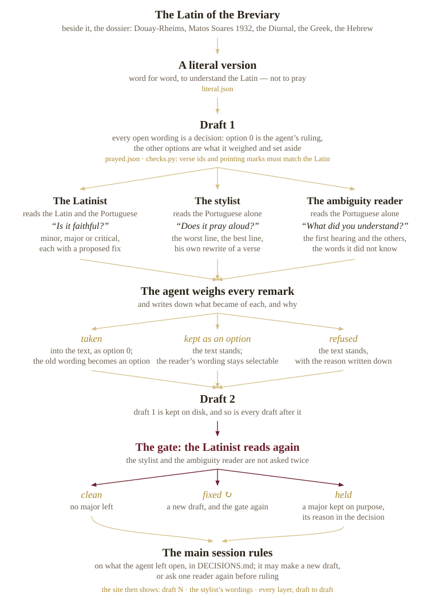

# Method

How this psalter is made, for someone meeting it for the first time. The working files — batch notes, briefs, progress tables — are on the [working notes](README.md) page.

## What this is

A Brazilian Portuguese version of the psalter of the Roman Breviary (the 1961/62 books): the Gallican Psalter, the version St Jerome made from the Greek, which from the ninth century replaced the older Latin psalters through most of the West and is the psalter of the Roman Breviary ([Wikipedia](https://en.wikipedia.org/wiki/Gallican_Psalter)). It is made **to be prayed aloud**, verse by verse, beside the Latin, and it is meant in the end for [Divinum Officium](https://www.divinumofficium.com/), keeping its verse divisions and its marks for chanting (the `*` at the mid-verse pause, the `†` flex).

The translation is drafted by language models working as agents, read by other models that do not know how it was made, and decided in the open. A human reviews every standing decision; nothing here has yet had a philologist's sign-off.

## The one rule

> Keep the Latin's words, images, repetitions and ambiguities. Let the ear lead on grammar and word order.

Everything else follows from this. A psalm that repeats a word in Latin repeats it in Portuguese; an image stays an image and is not explained; where the Latin can be read two ways, so can the Portuguese. But Latin word order and Latin constructions are not kept for their own sake — the sentence must be one a Brazilian can say.

God is addressed as ***vós***, the old form of reverent address, not *tu*.

## What it is translated from

**The Latin** is the Breviary text as Divinum Officium prints it — never retouched. For the first psalms it was collated word by word against the Clementine Vulgate, and no wording differed.

**The Latin's own family decides the sense:** the Douay-Rheims in English and Matos Soares 1932 in Portuguese were both made from this Latin. The Greek Septuagint — Jerome made the Gallican Psalter from its text in Origen's Hexapla — is read where the Latin is unclear.

**The Hebrew family is heard, not followed.** Modern Bibles translated from the Hebrew (CNBB, Ave Maria, RSV-CE, King James) and the *Diurnal Monástico* of 1962 — a prayed Brazilian psalter — show how a psalm sounds in living Portuguese. They lend rhythm and diction, never meaning, because they translate a different text.

## How a psalm is made

An agent takes one psalm. It reads the Latin with everything above laid beside it, writes a **literal version** to be sure of the sense, and then a **first draft for praying**. Wherever there was a real choice — a word, an order, a tense — the draft records it as a *decision*: the chosen wording first, and every alternative it weighed with the reason it was set aside.

Three **readers** then read the draft. They are told nothing of how it was made. Through Ps 36 they were a different model from the one that translated (GPT via Codex, beside a Claude translator); from Ps 37 on, while Codex has no quota, the stylist — and any reader Codex cannot run — is a Claude model in a fresh context that sees only the draft. Each reader's file names the model that answered.

- **The Latinist** reads the Latin and the Portuguese side by side and asks whether the Portuguese is faithful. Each objection is minor, major or critical, and comes with a fix.
- **The stylist** reads the Portuguese alone and asks whether it can be prayed aloud: what is stiff, what is bookish, which is the worst line and which the best.
- **The ambiguity reader** reads the Portuguese alone and says what it understood — its first hearing, any other hearing, any word it did not know. A wrong first hearing counts as a fault, because in choir there is no second hearing.

The agent weighs **every** remark and writes down what became of it: *taken* into the text, *kept as an option* that stays selectable, or *refused*, with the reason. That makes the second draft. The Latinist then reads once more — **the gate**. A major objection still standing must be fixed, or kept on purpose with its reason written in the decision.

**Who wins when the readers disagree.** The Latinist guards the rule's first half — words, images, repetitions — and the stylist its second half — grammar and order. So the Latinist is a gate and the stylist is not: a stylist remark may simply be refused, a Latinist major may not be ignored. The readers are also not infallible: the Latinist has given the same unchanged words a minor on one reading and a major on the next, so a repeated objection is weighed, not obeyed.

## Words that come back

The psalter says the same words hundreds of times — *exaudi*, *confitebor*, *misericordia*, *salutare*. If each psalm chose its own Portuguese, the echoes the Latin sets up across the book would be lost. So the words that recur are decided **once, for the whole psalter**, in the [glossary](glossary.md), and the hardest of them get a [word study](words/exaudire.md): every place the word occurs, the Greek behind it, what it must stay distinct from, what it becomes under *vós*, how it is heard today.

A glossary rendering is not final because a psalm used it. Each row carries its standing — see the next section.

## Who decides

Gustavo, who began the project, decides. Where he has ruled, the ruling is **decided**. Some questions he has delegated: those are ruled provisionally by the coordinating agent, argued in full and logged in [the decisions log](DECISIONS.md) as **for review** — the glossary marks them *settled*. Everything else is **working** (in use, not yet ruled) or **open**.

Nothing is closed by being ruled. Every refused alternative stays in the psalm's page, one touch away; every draft is kept; every reader's reply is stored word for word with what became of it.

## Reading a psalm page

Each psalm has its own page: the Latin and the Portuguese in facing columns, as it would be prayed. A **dotted word** is a decision — touch it to see the alternatives and the reasons, and to choose another; the psalm rewrites itself so it can be prayed as chosen.

- **wording** switches the whole psalm between the current draft, *the stylist's* (his wordings that were kept as options — absent when all of them were taken), and *my choices*.
- **beside it** sets other psalters under each verse: the literal version, the Portuguese ones, the English ones.
- **view → the layers** shows each verse's history: the Latin, the literal version, and every draft, with what changed from one to the next.
- **pointing** shows the marks as the Ember prayer app prints them, or with every flex.
- **Copy my decisions** hands back your choices as text, to send to the project.

Under the psalm, the audit trail lists each reader's remarks and what became of them.
